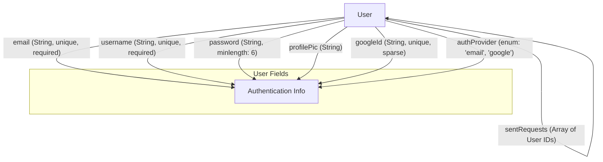
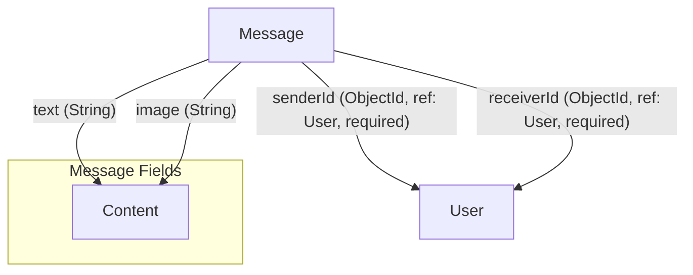

 # Data Models and Schema

This section outlines the core data models used in the Chat-App-MERN application, focusing on how user profiles, messages, and social connections are structured and stored within MongoDB. Understanding these schemas is crucial for comprehending data flow, relationships, and the overall backend logic.

The application leverages Mongoose, an ODM (Object Data Modeling) library for MongoDB and Node.js, to define flexible and intuitive schemas. These schemas enforce data structure, handle validation, and provide an object-oriented API for interacting with the database.

## User Model

The `User` model (`backend/src/models/user.model.js`) represents an individual user in the system. It encompasses essential profile information, authentication details, and critical fields for managing friend relationships and requests.

### User Schema Structure

The `userSchema` defines various fields, each serving a specific purpose:

*   **`email`**: The user's unique email address, used for authentication.
*   **`username`**: A unique display name for the user, with length constraints.
*   **`password`**: Hashed password for email-based authentication (optional if using Google SSO).
*   **`profilePic`**: URL to the user's profile image.
*   **`friends`**: An array of `ObjectId` references to other `User` documents, representing established friendships.
*   **`friendRequests`**: An array of `ObjectId` references to `User` documents who have sent a friend request to this user (incoming requests).
*   **`sentRequests`**: An array of `ObjectId` references to `User` documents to whom this user has sent a friend request (outgoing requests).
*   **`authProvider`**: Indicates the authentication method ('email' or 'google').
*   **`googleId`**: Unique identifier provided by Google for SSO users.

```javascript
// backend/src/models/user.model.js
import mongoose from "mongoose";

const userSchema = new mongoose.Schema(
    {
        email: {
            type: String,
            required: true,
            unique: true
        },
        username: {
            type: String,
            required: [true, "Username is required"],
            unique: true,
            trim: true,
            minlength: [3, "Username must be at least 3 characters long"],
            maxlength: [20, "Username cannot be more than 20 characters long"]
        },
        password: {
            type: String,
            minlength: 6,
        },
        profilePic: {
            type: String,
            default: "",
        },
        friends: [{
            type: mongoose.Schema.Types.ObjectId,
            ref: "User",
            default: []
        }],
        friendRequests: [{ // Incoming friend requests
            type: mongoose.Schema.Types.ObjectId,
            ref: "User",
            default: []
        }],
        sentRequests: [{ // Outgoing friend requests
            type: mongoose.Schema.Types.ObjectId,
            ref: "User",
            default: []
        }],
        authProvider: {
            type: String,
            enum: ['email', 'google'],
            default: 'email'
        },
        googleId: {
            type: String,
            unique: true,
            sparse: true
        },
    },
    {
        timestamps: true
    }
);

export default mongoose.model("User", userSchema);
```
[View on GitHub](https://github.com/shinymack/Chat-App-MERN/blob/main/backend/src/models/user.model.js)

### Friend Relationships

The `friends`, `friendRequests`, and `sentRequests` fields are crucial for managing the social graph. They utilize `mongoose.Schema.Types.ObjectId` with `ref: "User"`, creating self-referencing relationships within the `User` collection. This allows for efficient querying of a user's connections.

```javascript
// Example of friend relationship fields
        friends: [{
            type: mongoose.Schema.Types.ObjectId,
            ref: "User",
            default: []
        }],
        friendRequests: [{ // Incoming friend requests
            type: mongoose.Schema.Types.ObjectId,
            ref: "User",
            default: []
        }],
        sentRequests: [{ // Outgoing friend requests
            type: mongoose.Schema.Types.ObjectId,
            ref: "User",
            default: []
        }],
```
[View on GitHub](https://github.com/shinymack/Chat-App-MERN/blob/main/backend/src/models/user.model.js#L26-L40)

### Pre-Save Hook for Authentication

A `pre('save')` hook is implemented on the `userSchema` to handle authentication-specific logic, particularly for Google SSO. If a user is authenticating via Google and their password hasn't been modified, the `password` field is set to `undefined` to prevent unnecessary storage of empty or placeholder passwords. It also enforces password presence for email signups.

```javascript
// backend/src/models/user.model.js
userSchema.pre('save', async function(next) {
    if (this.authProvider === 'google' && !this.isModified('password')) {
        this.password = undefined;
    }
    if (this.authProvider === 'email' && !this.password && this.isNew) {
        return next(new Error('Password is required for email signup.'));
    }
    next();
});
```
[View on GitHub](https://github.com/shinymack/Chat-App-MERN/blob/main/backend/src/models/user.model.js#L54-L61)

### User Model Diagram





## Message Model

The `Message` model (`backend/src/models/message.model.js`) represents individual chat messages exchanged between users. It stores the content, sender, receiver, and timestamps for each message.

### Message Schema Structure

The `messageSchema` is straightforward, designed to capture essential message details:

*   **`senderId`**: An `ObjectId` reference to the `User` who sent the message.
*   **`receiverId`**: An `ObjectId` reference to the `User` who is the intended recipient of the message.
*   **`text`**: The actual text content of the message.
*   **`image`**: An optional URL to an image attached to the message.
*   **`timestamps`**: Automatically managed `createdAt` and `updatedAt` fields provided by Mongoose.

```javascript
// backend/src/models/message.model.js
import mongoose from "mongoose";

const messageSchema = new mongoose.Schema(
    {
     senderId: {
        type: mongoose.Schema.Types.ObjectId,
        ref: "User",
        required: true,
     },
     receiverId: {
        type: mongoose.Schema.Types.ObjectId,
        ref: "User",
        required: true,
     },
     text: {
        type: String,
     },
     image: {
        type: String,
     },
    },
    {timestamps: true}
);

export default mongoose.model("Message", messageSchema);
```
[View on GitHub](https://github.com/shinymack/Chat-App-MERN/blob/main/backend/src/models/message.model.js)

### Relationship with User Model

Both `senderId` and `receiverId` fields are critical for linking messages to the `User` model. They are defined as `mongoose.Schema.Types.ObjectId` with `ref: "User"`, enabling Mongoose's `populate()` feature to easily retrieve full user details when querying messages.

```javascript
// Example of references to User model in Message schema
     senderId: {
        type: mongoose.Schema.Types.ObjectId,
        ref: "User",
        required: true,
     },
     receiverId: {
        type: mongoose.Schema.Types.ObjectId,
        ref: "User",
        required: true,
     },
```
[View on GitHub](https://github.com/shinymack/Chat-App-MERN/blob/main/backend/src/models/message.model.js#L9-L18)

### Message Model Diagram





## Data Model Relationships Overview

The core of the application's data structure revolves around the `User` and `Message` models and their interconnections. The `User` model stands alone for profiles and friend management, while the `Message` model strictly depends on `User` documents for identifying message participants.


```mermaid
graph TD
    User["User Model"]
    Message["Message Model"]

    User -- "has many" --> Message: "Sender"
    User -- "has many" --> Message: "Receiver"
    User -- "friends (self-referencing)" --> User
    User -- "friendRequests (self-referencing)" --> User
    User -- "sentRequests (self-referencing)" --> User
```


## Key Integration Points

These data models are fundamental to almost every backend operation.

*   **User Authentication and Authorization**: The `User` model is extensively used during user registration, login, and token generation processes. The `email`, `username`, `password`, `authProvider`, and `googleId` fields are critical here.
*   **Friend Management**: APIs for sending, accepting, and rejecting friend requests, as well as listing friends, directly interact with the `friends`, `friendRequests`, and `sentRequests` arrays within the `User` model.
*   **Chat Functionality**: When a user sends a message, a new `Message` document is created, linking the `senderId` and `receiverId` to existing `User` documents. Retrieving chat history involves querying `Message` documents and often `populating` the `senderId` and `receiverId` to display user details.
*   **Profile Management**: Updating a user's `profilePic` or `username` directly modifies the `User` document.

Understanding these model definitions and their relationships is key to extending the application's features and ensuring data integrity.