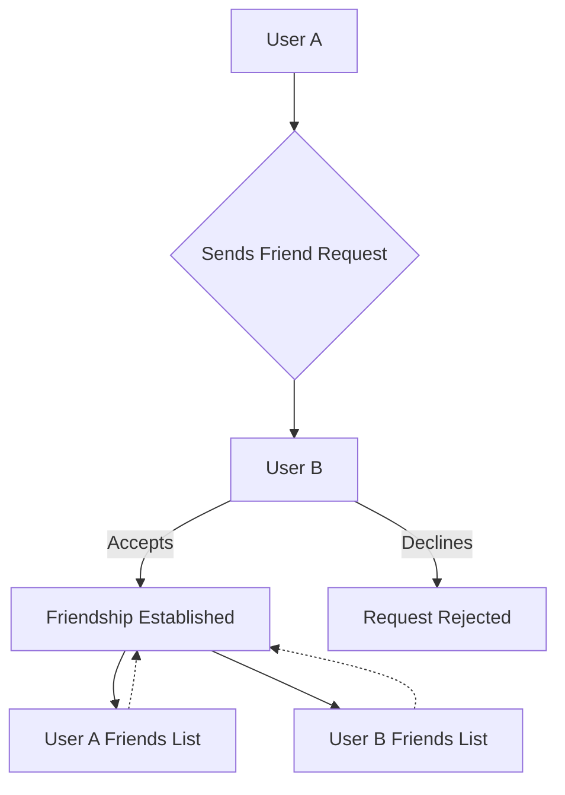
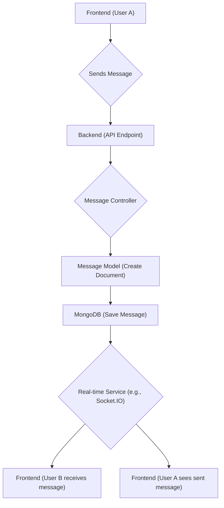

 # Data Models and Schema

This document outlines the core data models used within the application, specifically focusing on the `User` and `Message` schemas. These schemas are built using Mongoose, providing a structured and robust way to manage data storage in MongoDB. Understanding these models is crucial for comprehending how user information, messaging, and relationships are structured and interconnected within the system.

## User Model

The `User` model (`backend/src/models/user.model.js`) represents an individual user in the application. It stores essential details such as authentication credentials, profile information, and social connections like friends and friend requests.

### User Schema Fields

The `userSchema` defines the following primary fields:

| Field Name | Type                                 | Required | Unique | Description                                                               |
| :--------- | :----------------------------------- | :------- | :----- | :------------------------------------------------------------------------ |
| `email`    | `String`                             | Yes      | Yes    | User's email address, used for authentication.                            |
| `username` | `String`                             | Yes      | Yes    | Unique display name for the user, with length constraints.                |
| `password` | `String`                             | No       | No     | Hashed password for email-based authentication (min 6 chars).             |
| `profilePic` | `String`                             | No       | No     | URL to the user's profile picture. Defaults to an empty string.           |
| `friends`  | `Array` of `ObjectId` (ref `User`)   | No       | No     | An array of User IDs representing the user's friends.                     |
| `friendRequests` | `Array` of `ObjectId` (ref `User`) | No       | No     | An array of User IDs from users who have sent a friend request to this user. |
| `sentRequests` | `Array` of `ObjectId` (ref `User`) | No       | No     | An array of User IDs to whom this user has sent friend requests.          |
| `authProvider` | `String` (enum: 'email', 'google') | No       | No     | Indicates the authentication method used (email or Google). Defaults to 'email'. |
| `googleId` | `String`                             | No       | Yes    | Unique ID provided by Google for users authenticated via Google OAuth.     |
| `timestamps` | `Date` (createdAt, updatedAt)        | Yes      | No     | Mongoose timestamps for record creation and last update.                  |

#### User Schema Definition

The core structure of the `User` schema is defined with validation rules and relationships:

```javascript
// backend/src/models/user.model.js
const userSchema = new mongoose.Schema(
    {
        email: {
            type: String,
            required: true,
            unique: true
        },
        username: {
            type: String,
            required: [true, "Username is required"],
            unique: true,
            trim: true,
            minlength: [3, "Username must be at least 3 characters long"],
            maxlength: [20, "Username cannot be more than 20 characters long"]
        },
        password: {
            type: String,
            minlength: 6,
        },
        profilePic: {
            type: String,
            default: "",
        },
        friends: [{
            type: mongoose.Schema.Types.ObjectId,
            ref: "User",
            default: []
        }],
        friendRequests: [{
            type: mongoose.Schema.Types.ObjectId,
            ref: "User",
            default: []
        }],
        sentRequests: [{
            type: mongoose.Schema.Types.ObjectId,
            ref: "User",
            default: []
        }],
        authProvider: {
            type: String,
            enum: ['email', 'google'],
            default: 'email'
        },
        googleId: {
            type: String,
            unique: true,
            sparse: true
        },
    },
    {
        timestamps: true
    }
);
```

[View on GitHub](https://github.com/shinymack/Chat-App-MERN/blob/main/backend/src/models/user.model.js#L3-L61)

#### Pre-Save Hook for Authentication Logic

A `pre('save')` hook is implemented to handle specific logic before a `User` document is saved. This ensures data consistency, especially concerning password requirements for different authentication providers.

```javascript
// backend/src/models/user.model.js
userSchema.pre('save', async function(next) {
    // If using Google auth, password is not needed and should be undefined
    if (this.authProvider === 'google' && !this.isModified('password')) {
        this.password = undefined;
    }
    // If using email auth and it's a new user without a password, throw an error
    if (this.authProvider === 'email' && !this.password && this.isNew) {
        return next(new Error('Password is required for email signup.'));
    }
    next();
});
```

[View on GitHub](https://github.com/shinymack/Chat-App-MERN/blob/main/backend/src/models/user.model.js#L63-L72)

This hook ensures:
*   Users authenticated via Google do not store a password.
*   New users attempting to sign up with email are required to provide a password.

### User Relationships Flow

This diagram illustrates how users might interact to form relationships within the application.





## Message Model

The `Message` model (`backend/src/models/message.model.js`) represents an individual message exchanged between two users. It captures the content of the message and links to the sender and receiver users.

### Message Schema Fields

The `messageSchema` defines the following fields:

| Field Name   | Type                                 | Required | Unique | Description                                        |
| :----------- | :----------------------------------- | :------- | :----- | :------------------------------------------------- |
| `senderId`   | `ObjectId` (ref `User`)              | Yes      | No     | The ID of the user who sent the message.           |
| `receiverId` | `ObjectId` (ref `User`)              | Yes      | No     | The ID of the user who is the recipient of the message. |
| `text`       | `String`                             | No       | No     | The textual content of the message.                |
| `image`      | `String`                             | No       | No     | URL to an image attached to the message.           |
| `timestamps` | `Date` (createdAt, updatedAt)        | Yes      | No     | Mongoose timestamps for record creation and last update. |

#### Message Schema Definition

The `Message` schema focuses on simplicity, tracking sender, receiver, and content:

```javascript
// backend/src/models/message.model.js
const messageSchema = new mongoose.Schema(
    {
     senderId: {
        type: mongoose.Schema.Types.ObjectId,
        ref: "User",
        required: true,
     },
     receiverId: {
        type: mongoose.Schema.Types.ObjectId,
        ref: "User",
        required: true,
     },
     text: {
        type: String,
     },
     image: {
        type: String,
     },
    },
    {timestamps: true}
);
```

[View on GitHub](https://github.com/shinymack/Chat-App-MERN/blob/main/backend/src/models/message.model.js#L5-L24)

This schema allows for either text-based messages, image messages, or both simultaneously, providing flexibility in communication. The `senderId` and `receiverId` fields are critical for establishing the conversational context and are populated with `User` references.

## Key Integration Points

### User-Message Linkage

The `senderId` and `receiverId` fields in the `Message` model directly reference the `User` model via `mongoose.Schema.Types.ObjectId` with a `ref: "User"`. This is a fundamental aspect of the data architecture, enabling efficient querying and population of user details when retrieving messages. For example, when displaying a conversation, the application can populate the `senderId` and `receiverId` fields to show the sender's username or profile picture without additional database lookups for each message.

```javascript
// Example of how message population might be used
// In a controller, you might do something like this:
// const messages = await Message.find({
//     $or: [
//         { senderId: userId, receiverId: otherUserId },
//         { senderId: otherUserId, receiverId: userId }
//     ]
// }).populate("senderId", "username profilePic") // Populate sender details
//   .populate("receiverId", "username profilePic") // Populate receiver details
//   .sort({ createdAt: 1 });
```

This snippet demonstrates how `populate` can be used to fetch related user data directly with messages, optimizing data retrieval.

### Authentication and User Creation

The `userSchema.pre('save')` hook is a critical integration point for handling different authentication providers. It ensures that password requirements are strictly enforced for 'email' authenticated users, while 'google' authenticated users are correctly handled without requiring a password field. This design supports both traditional email/password and modern OAuth flows seamlessly within a single `User` model.

### Social Features

The `friends`, `friendRequests`, and `sentRequests` arrays in the `User` model facilitate the social interaction features of the application. These arrays store references to other `User` documents, allowing the system to manage friend lists and pending requests. When a user sends a friend request, their `sentRequests` array is updated, and the recipient's `friendRequests` array is updated. Upon acceptance, both users' `friends` arrays are updated. This design ensures mutual relationships are correctly maintained and easily queryable.

### Data Flow for Messaging


