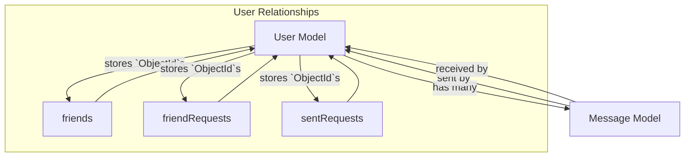
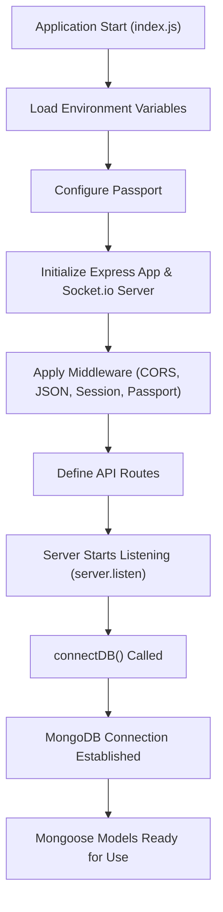

 # Data Models and Schema

This section details the Mongoose data models that define the structure and relationships for user and message data within the application. Understanding these models is crucial for comprehending how data is stored, validated, and interconnected in the backend. The core models are `User` and `Message`, which leverage MongoDB's flexible schema design with Mongoose's powerful object data modeling capabilities.

## Database Connection

The application connects to a MongoDB instance using Mongoose, as defined in `backend/src/lib/db.js`. This module provides a simple, asynchronous function to establish the database connection when the server starts.

```javascript
// backend/src/lib/db.js
import mongoose from "mongoose"

export const connectDB = async () => {
  try {
    const conn = await mongoose.connect(process.env.MONGODB_URI);
    console.log(`MongoDB connected:  ${conn.connection.host}`);
  }
  catch(error){
    console.log("MongoDB connection error: ", error);
  }
}
```
The `connectDB` function attempts to connect to the MongoDB URI specified in the environment variables. Upon successful connection, it logs the host; otherwise, it logs an error. This function is called once during application startup in `backend/src/index.js`.

[View on GitHub](https://github.com/shinymack/Chat-App-MERN/blob/main/backend/src/lib/db.js)

## User Data Model

The `User` model, defined in `backend/src/models/user.model.js`, represents individual users within the system. It encompasses various fields for user identification, authentication, and social features like friends and friend requests.

```javascript
// backend/src/models/user.model.js
import mongoose from "mongoose"

const  userSchema = new mongoose.Schema(
    {
        email: { 
            type: String,
            required: true,
            unique: true
        },
        username: {
            type: String,
            required: [true, "Username is required"],
            unique: true,
            trim: true,
            minlength: [3, "Username must be at least 3 characters long"],
            maxlength: [20, "Username cannot be more than 20 characters long"]
        }
        ,
        password: {
            type: String,
            minlength: 6,
        },
        profilePic: {
            type: String,
            default: "",
        },
        friends: [{
            type: mongoose.Schema.Types.ObjectId,
            ref: "User",
            default: [] 
        }],
        friendRequests: [{ // Incoming friend requests
            type: mongoose.Schema.Types.ObjectId,
            ref: "User",
            default: []
        }],
        sentRequests: [{ // Outgoing friend requests
            type: mongoose.Schema.Types.ObjectId,
            ref: "User",
            default: []
        }],
        authProvider: {
            type: String,
            enum: ['email', 'google'],
            default: 'email'
        },
        googleId: {
            type: String,
            unique: true,
            sparse: true
        },
    },
    { 
        timestamps: true
    } 
);

// Pre-save hook for password handling based on authProvider
userSchema.pre('save', async function(next) {
    if (this.authProvider === 'google' && !this.isModified('password')) {
        this.password = undefined; // Don't save password for Google authenticated users
    }
    if (this.authProvider === 'email' && !this.password && this.isNew) {
        return next(new Error('Password is required for email signup.'));
    }
    next();
});

const User = mongoose.model("User", userSchema);

export default User;
```
[View on GitHub](https://github.com/shinymack/Chat-App-MERN/blob/main/backend/src/models/user.model.js)

### User Schema Fields

| Field Name     | Type                               | Description                                                                 | Constraints                                       |
| :------------- | :--------------------------------- | :-------------------------------------------------------------------------- | :------------------------------------------------ |
| `email`        | `String`                           | User's email address.                                                       | Required, unique                                  |
| `username`     | `String`                           | User's chosen username.                                                     | Required, unique, trimmed, 3-20 chars             |
| `password`     | `String`                           | Hashed password for email authentication.                                   | Minimum 6 characters                              |
| `profilePic`   | `String`                           | URL to the user's profile picture.                                          | Default: `""`                                     |
| `friends`      | `Array` of `ObjectId` (ref: `User`)| List of `_id`s of users who are friends.                                    | Default: `[]`                                     |
| `friendRequests`| `Array` of `ObjectId` (ref: `User`)| List of `_id`s of users who sent friend requests to this user.              | Default: `[]`                                     |
| `sentRequests` | `Array` of `ObjectId` (ref: `User`)| List of `_id`s of users to whom this user sent friend requests.             | Default: `[]`                                     |
| `authProvider` | `String` (enum)                    | Authentication method used (`'email'` or `'google'`).                       | Default: `'email'`                                |
| `googleId`     | `String`                           | Unique Google ID if authenticated via Google.                               | Unique, sparse (allows null for non-Google users) |
| `timestamps`   | `true`                             | Mongoose adds `createdAt` and `updatedAt` fields automatically.             |                                                   |

### Pre-Save Hook

A `pre('save')` hook is implemented to handle password requirements based on the `authProvider`:
- If `authProvider` is `'google'`, the `password` field is explicitly set to `undefined` if it hasn't been modified, ensuring that Google-authenticated users do not store a local password.
- If `authProvider` is `'email'` and it's a new user (`this.isNew`) without a `password`, an error is thrown, enforcing password presence for email signups.

## Message Data Model

The `Message` model, found in `backend/src/models/message.model.js`, defines the structure for individual chat messages exchanged between users.

```javascript
// backend/src/models/message.model.js
import express from "express";
import mongoose from "mongoose";

const messageSchema = new mongoose.Schema(
    {
     senderId: {
        type: mongoose.Schema.Types.ObjectId,
        ref: "User",
        required: true,
     },
     receiverId: {
        type: mongoose.Schema.Types.ObjectId,
        ref: "User",
        required: true,
     },
     text: {
        type: String,
     },
     image: {
        type: String,
     },
    },
    {timestamps: true}
);

export default mongoose.model("Message", messageSchema);
```
[View on GitHub](https://github.com/shinymack/Chat-App-MERN/blob/main/backend/src/models/message.model.js)

### Message Schema Fields

| Field Name   | Type                               | Description                                     | Constraints    |
| :----------- | :--------------------------------- | :---------------------------------------------- | :------------- |
| `senderId`   | `ObjectId` (ref: `User`)           | The `_id` of the user who sent the message.     | Required       |
| `receiverId` | `ObjectId` (ref: `User`)           | The `_id` of the user who is to receive the message.| Required       |
| `text`       | `String`                           | The textual content of the message.             | Optional       |
| `image`      | `String`                           | URL to an image attached to the message.        | Optional       |
| `timestamps` | `true`                             | Mongoose adds `createdAt` and `updatedAt` fields automatically. |                |

## Relationships Between Models

The `User` and `Message` models are interconnected through `ObjectId` references, enabling efficient querying and population of related data.





- **User-Message**:
    - A `Message` always has a `senderId` and a `receiverId`, both referencing the `User` model. This allows for querying messages sent to or from a specific user.
- **User-User (Social)**:
    - The `User` model includes `friends`, `friendRequests`, and `sentRequests` arrays. Each element in these arrays is an `ObjectId` referencing another `User` document, establishing a many-to-many relationship for social connections.

## Application Initialization and Database Connection

The main `backend/src/index.js` file handles the express server setup, middleware, route registration, and initiates the database connection.

```javascript
// backend/src/index.js - snippet
// ... (imports) ...
import { connectDB } from "./lib/db.js";
import { app, server } from "./lib/socket.js";
// ... (middleware setup) ...

const PORT = process.env.PORT;
// ... (production static file serving) ...

server.listen(PORT, () => {
    console.log("server is running on PORT: " + String(PORT));
    connectDB(); // Database connection is established here
});
```
[View on GitHub](https://github.com/shinymack/Chat-App-MERN/blob/main/backend/src/index.js#L54-L57)

The `connectDB()` function is called right after the server starts listening for incoming requests, ensuring that the database is ready before any API calls are made.





## Key Integration Points

- **`ObjectId` References for Relationships**: Both `User` and `Message` models heavily rely on `mongoose.Schema.Types.ObjectId` with `ref` properties to establish clear relationships. This allows Mongoose's `.populate()` method to fetch linked documents, such as retrieving a message's sender and receiver details, or a user's friends' profiles.
- **Timestamping**: By setting `timestamps: true` in both schemas, Mongoose automatically manages `createdAt` and `updatedAt` fields. This is crucial for auditing, sorting, and displaying creation/last-update times for users and messages.
- **Authentication Provider Logic**: The `userSchema.pre('save')` hook demonstrates how Mongoose hooks can be used to implement custom logic based on data model state (e.g., `authProvider`), enhancing data integrity and security.
- **Scalability of Social Features**: The `friends`, `friendRequests`, and `sentRequests` arrays in the `User` model provide a foundation for building a robust social network within the application, allowing for direct querying of user relationships.

Next: [Authentication and Authorization](./2.3_authentication-and-authorization.mdx)