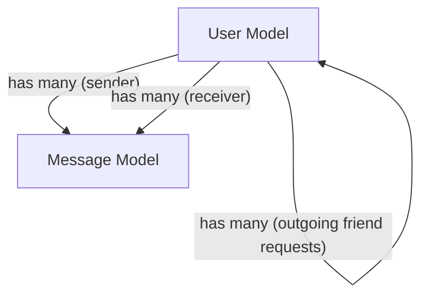

 # Data Models and Schema

This document details the database schemas for the core entities within the application: `User` and `Message`. These Mongoose schemas define the structure, validation rules, and relationships for the application's data, ensuring consistency and integrity. Understanding these models is crucial for comprehending how user accounts, friendships, and message exchanges are managed within the system.

## User Schema

The `User` schema (`backend/src/models/user.model.js`) represents an individual user of the application. It stores authentication credentials, profile information, and manages relationships with other users, such as friends and friend requests.

### User Fields

Here's a breakdown of the key fields within the `User` schema:

*   **`email`**:
    *   `Type`: `String`
    *   `Required`: `true`
    *   `Unique`: `true`
    *   `Description`: User's email address, used for login and identification.
*   **`username`**:
    *   `Type`: `String`
    *   `Required`: `true`
    *   `Unique`: `true`
    *   `Trim`: `true`
    *   `Minlength`: `3`
    *   `Maxlength`: `20`
    *   `Description`: A unique display name for the user.
*   **`password`**:
    *   `Type`: `String`
    *   `Minlength`: `6`
    *   `Description`: Hashed password for email-based authentication. Not required for Google-authenticated users.
*   **`profilePic`**:
    *   `Type`: `String`
    *   `Default`: `""`
    *   `Description`: URL or path to the user's profile picture.
*   **`friends`**:
    *   `Type`: `Array` of `mongoose.Schema.Types.ObjectId`
    *   `Ref`: `"User"`
    *   `Default`: `[]`
    *   `Description`: An array of `ObjectId`s referencing other `User` documents that this user is friends with.
*   **`friendRequests`**:
    *   `Type`: `Array` of `mongoose.Schema.Types.ObjectId`
    *   `Ref`: `"User"`
    *   `Default`: `[]`
    *   `Description`: An array of `ObjectId`s referencing `User` documents who have sent this user a friend request (incoming requests).
*   **`sentRequests`**:
    *   `Type`: `Array` of `mongoose.Schema.Types.ObjectId`
    *   `Ref`: `"User"`
    *   `Default`: `[]`
    *   `Description`: An array of `ObjectId`s referencing `User` documents to whom this user has sent a friend request (outgoing requests).
*   **`authProvider`**:
    *   `Type`: `String`
    *   `Enum`: `['email', 'google']`
    *   `Default`: `'email'`
    *   `Description`: Indicates the authentication method used by the user.
*   **`googleId`**:
    *   `Type`: `String`
    *   `Unique`: `true`
    *   `Sparse`: `true`
    *   `Description`: Unique identifier provided by Google for users authenticated via Google OAuth.
*   **`timestamps`**: `true`
    *   `Description`: Mongoose automatically adds `createdAt` and `updatedAt` fields.

### User Schema Definition Example

```javascript
// backend/src/models/user.model.js
import mongoose from "mongoose"

const userSchema = new mongoose.Schema(
    {
        email: {
            type: String,
            required: true,
            unique: true
        },
        username: {
            type: String,
            required: [true, "Username is required"],
            unique: true,
            trim: true,
            minlength: [3, "Username must be at least 3 characters long"],
            maxlength: [20, "Username cannot be more than 20 characters long"]
        },
        password: {
            type: String,
            minlength: 6,
        },
        profilePic: {
            type: String,
            default: "",
        },
        friends: [{
            type: mongoose.Schema.Types.ObjectId,
            ref: "User",
            default: []
        }],
        friendRequests: [{
            type: mongoose.Schema.Types.ObjectId,
            ref: "User",
            default: []
        }],
        sentRequests: [{
            type: mongoose.Schema.Types.ObjectId,
            ref: "User",
            default: []
        }],
        authProvider: {
            type: String,
            enum: ['email', 'google'],
            default: 'email'
        },
        googleId: {
            type: String,
            unique: true,
            sparse: true
        },
    },
    {
        timestamps: true
    }
);

export default mongoose.model("User", userSchema);
```
[View on GitHub](https://github.com/shinymack/Chat-App-MERN/blob/main/backend/src/models/user.model.js)

### Pre-save Hook for Password Management

The `userSchema` includes a `pre('save')` hook that handles password requirements based on the `authProvider`.

```javascript
// backend/src/models/user.model.js (pre-save hook)
userSchema.pre('save', async function(next) {
    if (this.authProvider === 'google' && !this.isModified('password')) {
        // If user is authenticated via Google, password is not required
        this.password = undefined;
    }
    if (this.authProvider === 'email' && !this.password && this.isNew) {
        // For new email-authenticated users, password is mandatory
        return next(new Error('Password is required for email signup.'));
    }
    next();
});
```
[View on GitHub](https://github.com/shinymack/Chat-App-MERN/blob/main/backend/src/models/user.model.js#L68-L77)

This ensures that:
*   Users authenticated via Google do not necessarily require a password to be stored.
*   New users signing up with `email` as their `authProvider` must provide a password.

## Message Schema

The `Message` schema (`backend/src/models/message.model.js`) represents an individual message exchanged between two users. It links to the `User` schema for both the sender and receiver.

### Message Fields

Here's a breakdown of the key fields within the `Message` schema:

*   **`senderId`**:
    *   `Type`: `mongoose.Schema.Types.ObjectId`
    *   `Ref`: `"User"`
    *   `Required`: `true`
    *   `Description`: The `ObjectId` of the user who sent the message.
*   **`receiverId`**:
    *   `Type`: `mongoose.Schema.Types.ObjectId`
    *   `Ref`: `"User"`
    *   `Required`: `true`
    *   `Description`: The `ObjectId` of the user who is the intended recipient of the message.
*   **`text`**:
    *   `Type`: `String`
    *   `Description`: The textual content of the message. This field can be empty if the message is an image.
*   **`image`**:
    *   `Type`: `String`
    *   `Description`: URL or path to an image sent as part of the message. This field can be empty if the message is text-only.
*   **`timestamps`**: `true`
    *   `Description`: Mongoose automatically adds `createdAt` and `updatedAt` fields.

### Message Schema Definition Example

```javascript
// backend/src/models/message.model.js
import mongoose from "mongoose";

const messageSchema = new mongoose.Schema(
    {
     senderId: {
        type: mongoose.Schema.Types.ObjectId,
        ref: "User",
        required: true,
     },
     receiverId: {
        type: mongoose.Schema.Types.ObjectId,
        ref: "User",
        required: true,
     },
     text: {
        type: String,
     },
     image: {
        type: String,
     },
    },
    {timestamps: true}
);

export default mongoose.model("Message", messageSchema);
```
[View on GitHub](https://github.com/shinymack/Chat-App-MERN/blob/main/backend/src/models/message.model.js)

## Data Model Relationships

The following diagram illustrates the relationships between the `User` and `Message` data models.





## Key Integration Points

The defined schemas form the backbone of the application's data management, enabling several key functionalities:

1.  **User Authentication and Profiles**: The `User` schema centrally manages user accounts, supporting both email/password and Google OAuth authentication. The `username` and `profilePic` fields allow for personalized user profiles.
2.  **Friendship Management**: The `friends`, `friendRequests`, and `sentRequests` arrays within the `User` schema facilitate the complex logic of initiating, accepting, and managing social connections between users. This relies heavily on `ObjectId` references to other `User` documents.
3.  **Real-time Messaging**: The `Message` schema provides the structure for individual messages, linking them directly to their `senderId` and `receiverId`. This allows for direct, private conversations between users.
4.  **Content Flexibility**: Messages can contain either `text`, an `image`, or both, offering flexibility in communication types without requiring separate message models.
5.  **Data Integrity**: Using Mongoose's `ObjectId` references (`ref: "User"`) enforces relational integrity, ensuring that `senderId` and `receiverId` in messages, and friend-related IDs in users, always point to valid user documents. `required: true` and `unique: true` constraints further ensure data quality.
6.  **Temporal Tracking**: The `timestamps: true` option on both schemas is critical for auditing, displaying message times, and implementing features like "last online" or message history filtering.

These robust data models lay the foundation for a scalable and feature-rich chat application.