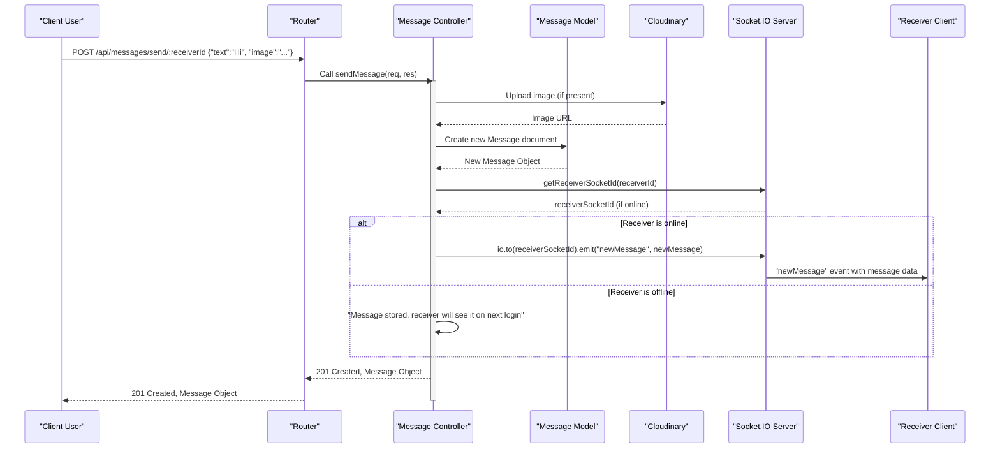
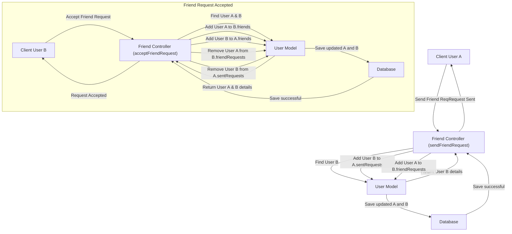

 # Messaging and Friend Management

This document outlines the backend implementation for managing user friendships and handling real-time messaging within the application. These core features enable users to connect, send and receive friend requests, maintain friend lists, and exchange messages seamlessly.

The logic primarily resides in the `friend.controller.js` and `message.controller.js` files, interacting with the `User` and `Message` Mongoose models to persist data. Real-time communication for messages is facilitated using WebSockets.

## Friend Management Backend Logic

The [friend.controller.js](https://github.com/shinymack/Chat-App-MERN/blob/main/backend/src/controllers/friend.controller.js) handles all operations related to managing user friendships, including sending, accepting, rejecting requests, and managing friend lists. Each user's `User` model document stores references to their friends, sent requests, and received requests.

### Sending a Friend Request

The `sendFriendRequest` function allows a user to send a friend request to another user identified by their username or email.

```javascript
// backend/src/controllers/friend.controller.js
export const sendFriendRequest = async (req, res) => {
    try {
        const { identifier } = req.body;
        const senderId = req.user._id;

        // ... (find receiver, checks for self-request, existing friendship, etc.)

        sender.sentRequests.push(receiverId);
        receiver.friendRequests.push(senderId);

        await sender.save();
        await receiver.save();

        res.status(200).json({ message: "Friend request sent successfully." });

    } catch (error) {
        console.error("Error in sendFriendRequest: ", error.message);
        res.status(500).json({ message: "Internal server error", error: error.message });
    }
};
```
[View on GitHub](https://github.com/shinymack/Chat-App-MERN/blob/main/backend/src/controllers/friend.controller.js#L11-L57)

**Workflow for Sending a Friend Request:**
1.  **Identification:** The sender provides an identifier (username or email) for the intended receiver.
2.  **User Lookup:** The system searches for the receiver using the provided identifier.
3.  **Validation Checks:**
    *   Prevents sending requests to oneself.
    *   Checks if users are already friends.
    *   Checks if a request has already been sent.
    *   Checks if the receiver has already sent a request to the sender.
4.  **Update User Models:**
    *   The `senderId` is added to the receiver's `friendRequests` array.
    *   The `receiverId` is added to the sender's `sentRequests` array.
5.  **Persistence:** Both user documents are saved to the database.

### Accepting a Friend Request

The `acceptFriendRequest` function processes a friend request, converting it into an established friendship.

```javascript
// backend/src/controllers/friend.controller.js
export const acceptFriendRequest = async (req, res) => {
    try {
        const { senderId } = req.params;
        const receiverId = req.user._id;

        // ... (find sender and receiver, check if request exists)

        receiver.friends.push(senderId);
        sender.friends.push(receiverId);

        receiver.friendRequests = receiver.friendRequests.filter(id => id.toString() !== senderId.toString());
        sender.sentRequests = sender.sentRequests.filter(id => id.toString() !== receiverId.toString());

        await receiver.save();
        await sender.save();

        res.status(200).json({ message: "Friend request accepted." });

    } catch (error) {
        console.error("Error in acceptFriendRequest: ", error.message);
        res.status(500).json({ message: "Internal server error", error: error.message });
    }
};
```
[View on GitHub](https://github.com/shinymack/Chat-App-MERN/blob/main/backend/src/controllers/friend.controller.js#L60-L97)

**Workflow for Accepting a Friend Request:**
1.  **Request Identification:** The current user (receiver) accepts a request from a specific `senderId`.
2.  **User Lookup:** Both sender and receiver documents are retrieved.
3.  **Validation:** Confirms that the request actually exists in the receiver's `friendRequests`.
4.  **Update Friend Lists:**
    *   `senderId` is added to the receiver's `friends` array.
    *   `receiverId` is added to the sender's `friends` array.
5.  **Clean Up Request Arrays:**
    *   The `senderId` is removed from the receiver's `friendRequests`.
    *   The `receiverId` is removed from the sender's `sentRequests`.
6.  **Persistence:** Both user documents are saved.

### Rejecting or Removing Friends

Functions like `rejectFriendRequest` and `removeFriend` follow a similar pattern: they locate the relevant user documents, remove the corresponding entries from `friendRequests`, `sentRequests`, or `friends` arrays, and then persist the changes.

```javascript
// backend/src/controllers/friend.controller.js
export const rejectFriendRequest = async (req, res) => {
    try {
        const { senderId } = req.params;
        const receiverId = req.user._id;

        // ... (find sender and receiver)

        receiver.friendRequests = receiver.friendRequests.filter(id => id.toString() !== senderId.toString());
        sender.sentRequests = sender.sentRequests.filter(id => id.toString() !== receiverId.toString());

        // ... (check if changes occurred)

        await receiver.save();
        await sender.save();

        res.status(200).json({ message: "Friend request rejected." });

    } catch (error) {
        console.error("Error in rejectFriendRequest: ", error.message);
        res.status(500).json({ message: "Internal server error", error: error.message });
    }
};
```
[View on GitHub](https://github.com/shinymack/Chat-App-MERN/blob/main/backend/src/controllers/friend.controller.js#L100-L135)

### Retrieving Friend Information

The `getFriends`, `getPendingRequests`, and `getSentRequests` functions allow users to view their current friends, received friend requests, and sent friend requests respectively. These functions use Mongoose's `populate` method to retrieve detailed user information (username, email, profile picture) for the referenced user IDs.

```javascript
// backend/src/controllers/friend.controller.js
export const getFriends = async (req, res) => {
    try {
        const userId = req.user._id;
        const user = await User.findById(userId).populate({
            path: "friends",
            select: "username email profilePic _id"
        });

        if (!user) {
            return res.status(404).json({ message: "User not found." });
        }

        res.status(200).json(user.friends);

    } catch (error) {
        console.error("Error in getFriends: ", error.message);
        res.status(500).json({ message: "Internal server error", error: error.message });
    }
};
```
[View on GitHub](https://github.com/shinymack/Chat-App-MERN/blob/main/backend/src/controllers/friend.controller.js#L173-L191)

## Messaging Backend Logic

The messaging functionality is managed by the [message.controller.js](https://github.com/shinymack/Chat-App-MERN/blob/main/backend/src/controllers/message.controller.js) and uses the [message.model.js](https://github.com/shinymack/Chat-App-MERN/blob/main/backend/src/models/message.model.js) for data structure. Real-time message delivery is handled via Socket.IO.

### Message Model

The `Message` Mongoose model defines the structure for individual messages.

```javascript
// backend/src/models/message.model.js
import mongoose from "mongoose";

const messageSchema = new mongoose.Schema(
    {
     senderId: {
        type: mongoose.Schema.Types.ObjectId,
        ref: "User",
        required: true,
     },
     receiverId: {
        type: mongoose.Schema.Types.ObjectId,
        ref: "User",
        required: true,
     },
     text: {
        type: String,
     },
     image: {
        type: String,
     },
    },
    {timestamps: true}
);

export default mongoose.model("Message", messageSchema);
```
[View on GitHub](https://github.com/shinymack/Chat-App-MERN/blob/main/backend/src/models/message.model.js#L3-L25)

**Schema Details:**
*   `senderId`: Reference to the `User` who sent the message.
*   `receiverId`: Reference to the `User` who is intended to receive the message.
*   `text`: The textual content of the message.
*   `image`: URL to an image attachment, if any (uploaded via Cloudinary).
*   `timestamps`: Automatically adds `createdAt` and `updatedAt` fields.

### Retrieving Messages

The `getMessages` function fetches all messages exchanged between two specific users.

```javascript
// backend/src/controllers/message.controller.js
export const getMessages = async (req, res) => {
    try {
        const {id : userToChatId } = req.params;
        const myId = req.user._id;

        const messages = await Message.find({
            $or: [
                {senderId: myId, receiverId:userToChatId},
                {senderId: userToChatId, receiverId: myId}
            ]
        });
        res.status(200).json(messages);
    } catch (error) {
        console.log("Error in getMessages controller:  ", error);
        res.status(500).json({ error: "Internal Server Error" });
    }
};
```
[View on GitHub](https://github.com/shinymack/Chat-App-MERN/blob/main/backend/src/controllers/message.controller.js#L26-L41)

**Logic:** It queries the `Message` collection for documents where either the current user is the sender and the other user is the receiver, OR the other user is the sender and the current user is the receiver.

### Sending Messages

The `sendMessage` function handles the creation and real-time delivery of new messages.

```javascript
// backend/src/controllers/message.controller.js
export const sendMessage = async (req, res) => {
    try {
        const { text, image } = req.body;
        const { id: receiverId } = req.params;
        const senderId = req.user._id;

        let imageUrl;
        if (image) {
            const uploadResponse = await cloudinary.uploader.upload(image);
            imageUrl = uploadResponse.secure_url;
        }
        const newMessage = new Message({
            senderId,
            receiverId,
            text,
            image: imageUrl,
        });

        await newMessage.save();

        const receiverSocketId = getReceiverSocketId(receiverId);

        if(receiverSocketId) {
            io.to(receiverSocketId).emit("newMessage", newMessage);
        }

        res.status(201).json(newMessage);   
        
    } catch (error) {
        console.log("Error in sendMessage controller:  ", error);
        res.status(500).json({ error: "Internal Server Error" });
    }
};
```
[View on GitHub](https://github.com/shinymack/Chat-App-MERN/blob/main/backend/src/controllers/message.controller.js#L43-L78)

**Workflow for Sending a Message:**
1.  **Content Extraction:** Extracts message `text` and optional `image` from the request body.
2.  **Image Upload (if applicable):** If an image is provided, it's uploaded to Cloudinary, and the `secure_url` is stored.
3.  **Message Creation:** A new `Message` document is instantiated with `senderId`, `receiverId`, `text`, and `imageUrl`.
4.  **Persistence:** The new message is saved to the database.
5.  **Real-time Delivery:**
    *   The `getReceiverSocketId` helper function (from `socket.js`) retrieves the WebSocket ID for the receiver, if they are currently online.
    *   If the receiver is online, Socket.IO emits a `newMessage` event to their specific socket, containing the new message data. This ensures instant delivery.
6.  **Response:** The newly created message is sent back as a response.

## API Endpoints for Messaging and Friend Management

The [message.route.js](https://github.com/shinymack/Chat-App-MERN/blob/main/backend/src/routes/message.route.js) defines the API endpoints for message-related operations. All routes are protected by `auth.middleware.js`.

```javascript
// backend/src/routes/message.route.js
import express from "express"
import { protectRoute } from "../middleware/auth.middleware.js";
import { getUsersForSidebar, getMessages, sendMessage } from "../controllers/message.controller.js";
const router = express.Router();

router.get("/users", protectRoute, getUsersForSidebar);
router.get("/:id", protectRoute, getMessages);
router.post("/send/:id", protectRoute, sendMessage);

export default router;
```
[View on GitHub](https://github.com/shinymack/Chat-App-MERN/blob/main/backend/src/routes/message.route.js#L1-L12)

**Message Routes:**
*   `GET /api/messages/users`: Fetches a list of all users excluding the currently logged-in user, typically for displaying a sidebar of potential chat partners.
*   `GET /api/messages/:id`: Retrieves all messages between the current user and the user specified by `id`.
*   `POST /api/messages/send/:id`: Sends a message to the user specified by `id`.

## Integration Flow: Sending a Message

This diagram illustrates the sequence of actions when a user sends a message, including real-time notification.





## Integration Flow: Friend Request Management

This diagram shows the high-level flow for handling friend requests from initiation to acceptance.





## Key Integration Points

*   **Authentication Middleware:** All friend and message routes are protected using `protectRoute`, ensuring that only authenticated users can perform these actions. This middleware attaches the `req.user` object containing the logged-in user's ID, which is crucial for identifying `senderId` and `userId` throughout the controllers.
*   **Mongoose `populate`:** For `getFriends`, `getPendingRequests`, and `getSentRequests` in `friend.controller.js`, `populate` is used to efficiently retrieve necessary user details (username, email, profilePic) for friend and request lists without making multiple database queries.
*   **Real-time Communication (Socket.IO):** The `sendMessage` function in `message.controller.js` directly integrates with the `socket.js` module. It leverages `getReceiverSocketId` to determine if the recipient is currently connected and, if so, uses `io.to(receiverSocketId).emit("newMessage", newMessage)` to send the new message in real-time. This is essential for a responsive chat application experience.
*   **Cloudinary Integration:** For image messages, `message.controller.js` uses `cloudinary.uploader.upload` to handle secure storage and retrieval of image assets, offloading media management from the primary server.
*   **Database Structure:** The `User` model includes arrays (`friends`, `sentRequests`, `friendRequests`) that store `ObjectId` references to other users, forming a graph-like structure for friend relationships. The `Message` model links `senderId` and `receiverId` to `User` documents, ensuring referential integrity and enabling easy lookup of participants.