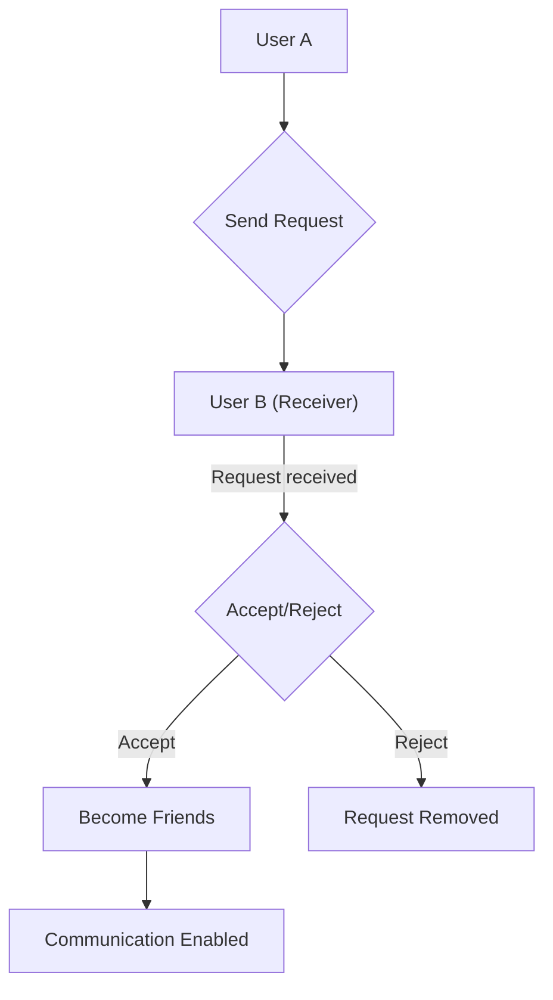
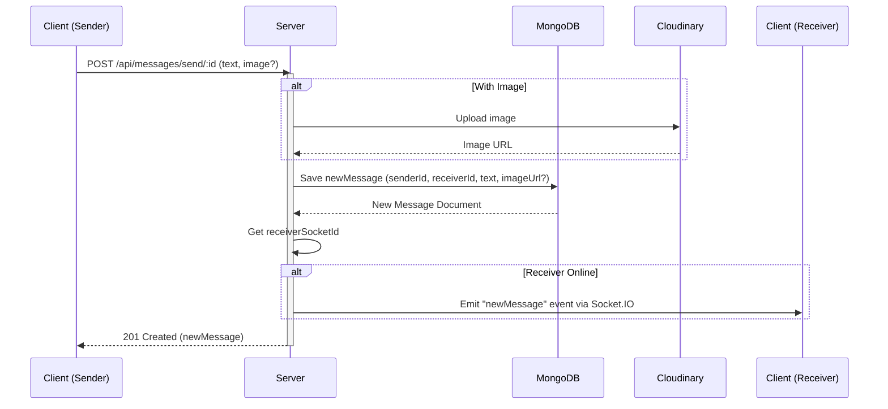

 # Messaging and Friend Management

This document provides a comprehensive overview of the real-time messaging and friend management functionalities within the application. It details how users can send and manage friend requests, maintain their social connections, and engage in direct messaging. The core components involved are the `friend.controller.js` for managing relationships, `message.controller.js` for handling message operations, and `message.model.js` for defining the message data structure, all exposed via `message.route.js`.

## Friend Management

The `backend/src/controllers/friend.controller.js` module orchestrates all friend-related actions, allowing users to build and manage their social network. This includes sending, accepting, and rejecting friend requests, as well as viewing and removing existing friends.

### Sending Friend Requests

Users can send friend requests to other users identified by their username or email. The system prevents sending requests to oneself, to existing friends, or if a request is already pending.

```javascript
// backend/src/controllers/friend.controller.js
export const sendFriendRequest = async (req, res) => {
    try {
        const { identifier } = req.body;
        const senderId = req.user._id;

        if (!identifier) {
            return res.status(400).json({ message: "Username or email is required." });
        }

        const receiver = await User.findOne({
            $or: [{ username: identifier }, { email: identifier }]
        });

        if (!receiver) {
            return res.status(404).json({ message: "User not found." });
        }
        
        const receiverId = receiver._id;

        if (senderId.toString() === receiverId.toString()) {
            return res.status(400).json({ message: "You cannot send a friend request to yourself." });
        }

        const sender = await User.findById(senderId);

        if (sender.friends.includes(receiverId)) {
            return res.status(400).json({ message: "You are already friends with this user." });
        }
        if (sender.sentRequests.includes(receiverId)) {
            return res.status(400).json({ message: "Friend request already sent." });
        }
        if (sender.friendRequests.includes(receiverId)) {
            return res.status(400).json({ message: "This user has already sent you a friend request." });
        }

        sender.sentRequests.push(receiverId);
        receiver.friendRequests.push(senderId);

        await sender.save();
        await receiver.save();

        res.status(200).json({ message: "Friend request sent successfully." });

    } catch (error) {
        console.error("Error in sendFriendRequest: ", error.message);
        res.status(500).json({ message: "Internal server error", error: error.message });
    }
};
```
[View on GitHub](https://github.com/shinymack/Chat-App-MERN/blob/main/backend/src/controllers/friend.controller.js#L7-L61)

### Accepting Friend Requests

When a user accepts a friend request, both the sender's and receiver's `friends` lists are updated, and the request is removed from their respective `sentRequests` and `friendRequests` arrays.

```javascript
// backend/src/controllers/friend.controller.js
export const acceptFriendRequest = async (req, res) => {
    try {
        const { senderId } = req.params;
        const receiverId = req.user._id;

        const sender = await User.findById(senderId);
        const receiver = await User.findById(receiverId);

        if (!sender || !receiver) {
            return res.status(404).json({ message: "User not found." });
        }

        if (!receiver.friendRequests.includes(senderId)) {
            return res.status(400).json({ message: "Friend request not found or already handled." });
        }

        receiver.friends.push(senderId);
        sender.friends.push(receiverId);

        receiver.friendRequests = receiver.friendRequests.filter(id => id.toString() !== senderId.toString());
        sender.sentRequests = sender.sentRequests.filter(id => id.toString() !== receiverId.toString());

        await receiver.save();
        await sender.save();

        res.status(200).json({ message: "Friend request accepted." });

    } catch (error) {
        console.error("Error in acceptFriendRequest: ", error.message);
        res.status(500).json({ message: "Internal server error", error: error.message });
    }
};
```
[View on GitHub](https://github.com/shinymack/Chat-App-MERN/blob/main/backend/src/controllers/friend.controller.js#L64-L106)

### Rejecting and Removing Friends

Similar logic is applied for rejecting a friend request, where the request is simply removed from both users' pending lists without establishing a friendship. Removing an existing friend involves filtering them out of both users' `friends` arrays.

```javascript
// backend/src/controllers/friend.controller.js
export const removeFriend = async (req, res) => {
    try {
        const { friendId } = req.params;
        const userId = req.user._id;

        const user = await User.findById(userId);
        const friendToRemove = await User.findById(friendId);

        if (!user || !friendToRemove) {
            return res.status(404).json({ message: "User not found." });
        }

        if (!user.friends.includes(friendId)) {
            return res.status(400).json({ message: "This user is not in your friends list." });
        }

        user.friends = user.friends.filter(id => id.toString() !== friendId.toString());
        friendToRemove.friends = friendToRemove.friends.filter(id => id.toString() !== userId.toString());

        await user.save();
        await friendToRemove.save();

        res.status(200).json({ message: "Friend removed successfully." });

    } catch (error) {
        console.error("Error in removeFriend: ", error.message);
        res.status(500).json({ message: "Internal server error", error: error.message });
    }
};
```
[View on GitHub](https://github.com/shinymack/Chat-App-MERN/blob/main/backend/src/controllers/friend.controller.js#L148-L180)

### Friend Request Workflow
The lifecycle of a friend request follows a clear path:





### Retrieving Friend Lists and Requests
Endpoints are available for users to view their current friends, as well as pending incoming and outgoing friend requests. These endpoints populate user data to provide meaningful information like username and profile picture.

```javascript
// backend/src/controllers/friend.controller.js
export const getFriends = async (req, res) => {
    try {
        const userId = req.user._id;
        const user = await User.findById(userId).populate({
            path: "friends",
            select: "username email profilePic _id" 
        });

        if (!user) {
            return res.status(404).json({ message: "User not found." });
        }

        res.status(200).json(user.friends);

    } catch (error) {
        console.error("Error in getFriends: ", error.message);
        res.status(500).json({ message: "Internal server error", error: error.message });
    }
};
```
[View on GitHub](https://github.com/shinymack/Chat-App-MERN/blob/main/backend/src/controllers/friend.controller.js#L183-L206)

## Messaging Capabilities

The `backend/src/controllers/message.controller.js` manages all real-time messaging functionalities, enabling users to exchange direct messages. This includes fetching message history, sending new messages (with optional image attachments), and real-time notification via WebSockets.

### Message Data Model

The `backend/src/models/message.model.js` defines the structure for individual message documents in the MongoDB database. Each message links a sender and receiver, contains text content, and optionally an image URL.

```javascript
// backend/src/models/message.model.js
import express from "express";
import mongoose from "mongoose";

const messageSchema = new mongoose.Schema(
    {
     senderId: {
        type: mongoose.Schema.Types.ObjectId,
        ref: "User",
        required: true,
     },
     receiverId: {
        type: mongoose.Schema.Types.ObjectId,
        ref: "User",
        required: true,
     },
     text: {
        type: String,
     },
     image: {
        type: String,
     },
    },
    {timestamps: true}
);

export default mongoose.model("Message", messageSchema);
```
[View on GitHub](https://github.com/shinymack/Chat-App-MERN/blob/main/backend/src/models/message.model.js#L1-L26)

### Retrieving Messages

Messages between two users are fetched by querying the `Message` collection for documents where the `senderId` and `receiverId` match the current user and the conversation partner in either direction.

```javascript
// backend/src/controllers/message.controller.js
export const getMessages = async (req, res) => {
    try {
        const {id : userToChatId } = req.params;
        const myId = req.user._id;

        const messages = await Message.find({
            $or: [
                {senderId: myId, receiverId:userToChatId},
                {senderId: userToChatId, receiverId: myId}
            ]
        });
        res.status(200).json(messages);
    } catch (error) {
        console.log("Error in getMessages controller:  ", error);
        res.status(500).json({ error: "Internal Server Error" });
    }
};
```
[View on GitHub](https://github.com/shinymack/Chat-App-MERN/blob/main/backend/src/controllers/message.controller.js#L26-L43)

### Sending Messages

When a message is sent, it's saved to the database. If an image is included, it's first uploaded to Cloudinary. Subsequently, if the receiver is online and connected via WebSockets, a real-time `newMessage` event is emitted to them.

```javascript
// backend/src/controllers/message.controller.js
export const sendMessage = async (req, res) => {
    try {
        const { text, image } = req.body;
        const { id: receiverId } = req.params;
        const senderId = req.user._id;

        let imageUrl;
        if (image) {
            const uploadResponse = await cloudinary.uploader.upload(image);

            imageUrl = uploadResponse.secure_url;
        }
        const newMessage = new Message({
            senderId,
            receiverId,
            text,
            image: imageUrl,
        });

        await newMessage.save();

        const receiverSocketId = getReceiverSocketId(receiverId);

        if(receiverSocketId) {
            io.to(receiverSocketId).emit("newMessage", newMessage);
        }

        res.status(201).json(newMessage);   
        
    } catch (error) {
        console.log("Error in sendMessage controller:  ", error);
        res.status(500).json({ error: "Internal Server Error" });
    }
};
```
[View on GitHub](https://github.com/shinymack/Chat-App-MERN/blob/main/backend/src/controllers/message.controller.js#L45-L79)

### Message Sending Workflow
The process for sending a message, especially one with an image, involves multiple steps including database persistence and real-time notification:





### User Sidebar
The `getUsersForSidebar` function provides a list of all other registered users (excluding the current user) for display in a chat sidebar, facilitating the initiation of new conversations.

```javascript
// backend/src/controllers/message.controller.js
export const getUsersForSidebar = async (req, res) => {
    try {
        const loggedInUserId = req.user._id;
        const filteredUsers = await User.find({
            _id: { $ne: loggedInUserId }}).select("-password");  
        res.status(200).json(filteredUsers);
    }
    catch (error) {
        console.log("Error in getUsersForSidebar: ", error);
        res.status(500).json({ error: "Internal Server Error" });
    }
};
```
[View on GitHub](https://github.com/shinymack/Chat-App-MERN/blob/main/backend/src/controllers/message.controller.js#L16-L24)

## Routing

The `backend/src/routes/message.route.js` module defines the API endpoints for messaging functionalities, ensuring that all interactions are authenticated using the `protectRoute` middleware.

```javascript
// backend/src/routes/message.route.js
import express from "express"
import { protectRoute } from "../middleware/auth.middleware.js";
import { getUsersForSidebar, getMessages, sendMessage } from "../controllers/message.controller.js";
const router = express.Router();

router.get("/users", protectRoute, getUsersForSidebar);

router.get("/:id", protectRoute, getMessages);

router.post("/send/:id", protectRoute, sendMessage);

export default router;
```
[View on GitHub](https://github.com/shinymack/Chat-App-MERN/blob/main/backend/src/routes/message.route.js#L1-L12)

This setup ensures a clear separation of concerns, with routing handling endpoint definitions, controllers managing business logic, and models defining data structures.

## Key Integration Points

The messaging and friend management features are tightly integrated to create a cohesive social experience:

*   **User Model as Central Hub**: The `User` model (`backend/src/models/user.model.js`, not included in snippets but inferred from usage) is central to both features, storing `friends`, `sentRequests`, and `friendRequests` arrays. This allows the friend management system to operate directly on user profiles.
*   **Authentication**: Both friend management and messaging routes are protected by the `protectRoute` middleware, ensuring that only authenticated users can perform these actions. The `req.user._id` is consistently used to identify the current user, preventing unauthorized access.
*   **Real-time Communication**: The messaging system leverages WebSockets (`socket.io`) for real-time delivery of new messages. This is crucial for a responsive chat application, providing instant feedback to users. Friend request notifications could similarly be implemented via WebSockets to alert users of new requests or accepted friendships.
*   **Populated Data**: Endpoints like `getFriends`, `getPendingRequests`, and `getSentRequests` utilize Mongoose's `populate` method to fetch detailed user information (username, email, profile picture) rather than just ObjectIDs, making the data directly usable by the frontend without extra requests. This optimizes API calls and improves performance.
*   **Error Handling**: Each controller function includes robust `try-catch` blocks to gracefully handle errors, returning appropriate HTTP status codes and messages to the client, which is essential for a stable user experience.
*   **Scalability for Media**: The integration with Cloudinary for image uploads in `sendMessage` demonstrates a scalable approach to handling media content, offloading storage and serving from the main application server.