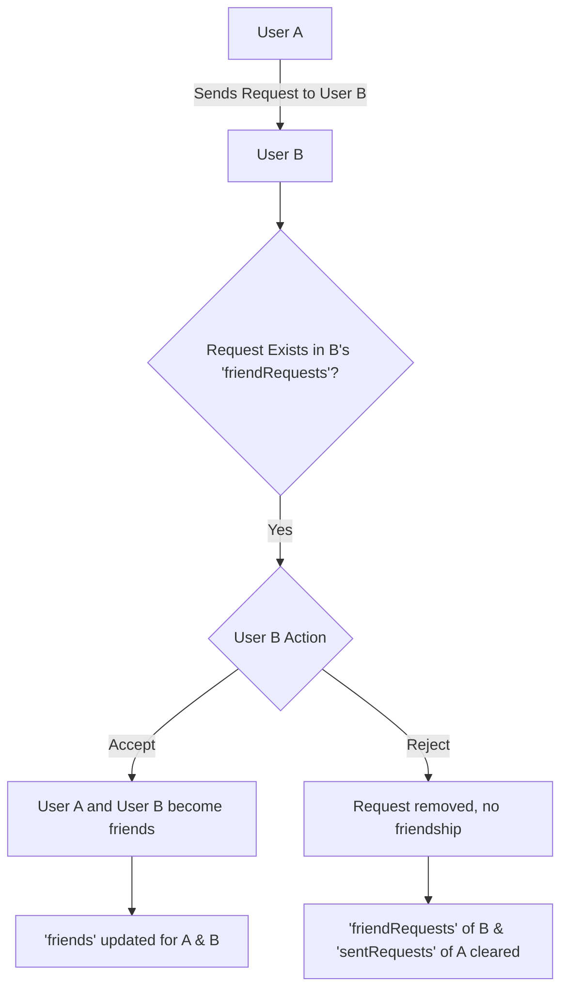
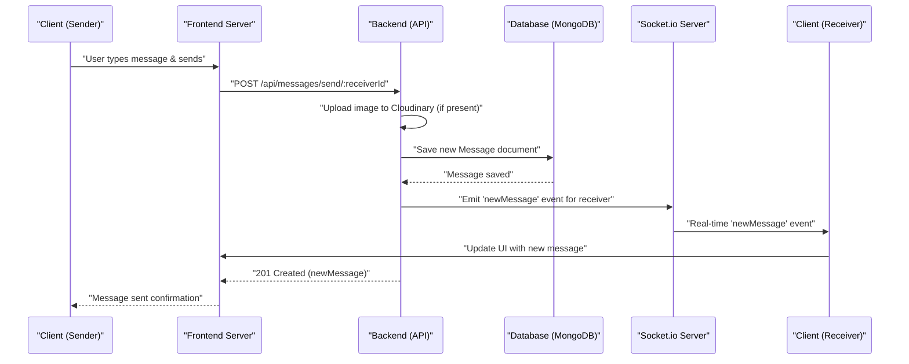

 # Messaging and Friend Management

This document delves into the backend services responsible for handling user interactions, specifically focusing on friend management (sending, accepting, rejecting, and removing friend requests) and real-time messaging. These services are crucial for fostering a connected user experience, enabling users to build their social network within the application and communicate effectively.

The core of these functionalities lies within two main modules: `friend.controller.js` and `message.controller.js`, complemented by their respective route definitions in `friend.route.js` and `message.route.js`. Authentication middleware (`protectRoute`) ensures that all these interactions are secure and performed by authenticated users.

## Friend Management Service

The friend management service allows users to establish and manage their social connections. It provides endpoints for the full lifecycle of a friend request and friendship.

### Sending a Friend Request

Users can send friend requests to others by providing a username or email. The system verifies the existence of the target user and checks for existing friendships or pending requests to prevent duplicates.

```javascript
// backend/src/controllers/friend.controller.js
export const sendFriendRequest = async (req, res) => {
    try {
        const { identifier } = req.body; // Expecting { identifier: "some_username_or_email" }
        const senderId = req.user._id;

        // ... (truncated for brevity) ...

        // Find receiver by username OR email
        const receiver = await User.findOne({
            $or: [{ username: identifier }, { email: identifier }]
        });

        // ... (truncated for brevity) ...

        sender.sentRequests.push(receiverId);
        receiver.friendRequests.push(senderId);

        await sender.save();
        await receiver.save();

        res.status(200).json({ message: "Friend request sent successfully." });

    } catch (error) {
        console.error("Error in sendFriendRequest: ", error.message);
        res.status(500).json({ message: "Internal server error", error: error.message });
    }
};
```

This snippet from `friend.controller.js` illustrates the `sendFriendRequest` function. It takes an `identifier` (username or email) to locate the recipient and updates the `sentRequests` array for the sender and `friendRequests` array for the receiver. The corresponding route is defined as:

```javascript
// backend/src/routes/friend.route.js
router.post("/request/send/", sendFriendRequest);
```

[View `sendFriendRequest` on GitHub](https://github.com/shinymack/Chat-App-MERN/blob/main/backend/src/controllers/friend.controller.js#L9-L63)
[View `POST /request/send/` on GitHub](https://github.com/shinymack/Chat-App-MERN/blob/main/backend/src/routes/friend.route.js#L14)

### Accepting or Rejecting Friend Requests

Upon receiving a friend request, users can choose to accept or reject it. Accepting a request adds both users to each other's friend lists and removes the request from pending lists. Rejecting a request simply removes it from the pending lists.

```javascript
// backend/src/controllers/friend.controller.js
export const acceptFriendRequest = async (req, res) => {
    try {
        const { senderId } = req.params; // ID of the user who sent the request
        const receiverId = req.user._id; // Current user accepting the request

        // ... (truncated for brevity) ...

        // Add to friends list for both users
        receiver.friends.push(senderId);
        sender.friends.push(receiverId);

        // Remove from requests lists
        receiver.friendRequests = receiver.friendRequests.filter(id => id.toString() !== senderId.toString());
        sender.sentRequests = sender.sentRequests.filter(id => id.toString() !== receiverId.toString());

        await receiver.save();
        await sender.save();

        res.status(200).json({ message: "Friend request accepted." });

    } catch (error) {
        console.error("Error in acceptFriendRequest: ", error.message);
        res.status(500).json({ message: "Internal server error", error: error.message });
    }
};
```

The `acceptFriendRequest` function shown above handles the logic for acceptance. A similar `rejectFriendRequest` function is also implemented. These operations ensure data consistency across both user profiles.

```javascript
// backend/src/routes/friend.route.js
router.post("/request/accept/:senderId", acceptFriendRequest);
router.post("/request/reject/:senderId", rejectFriendRequest);
```

[View `acceptFriendRequest` on GitHub](https://github.com/shinymack/Chat-App-MERN/blob/main/backend/src/controllers/friend.controller.js#L66-L109)
[View `rejectFriendRequest` on GitHub](https://github.com/shinymack/Chat-App-MERN/blob/main/backend/src/controllers/friend.controller.js#L112-L149)
[View `POST /request/accept/:senderId` on GitHub](https://github.com/shinymack/Chat-App-MERN/blob/main/backend/src/routes/friend.route.js#L17)
[View `POST /request/reject/:senderId` on GitHub](https://github.com/shinymack/Chat-App-MERN/blob/main/backend/src/routes/friend.route.js#L20)

### Friend Request Flow
The lifecycle of a friend request involves several states, managed by updates to the `User` model's `sentRequests`, `friendRequests`, and `friends` arrays.





### Listing Friends and Requests

Users can view their current friends list, as well as outstanding sent and received friend requests. These endpoints leverage Mongoose's `populate` method to fetch detailed user information for the associated IDs.

```javascript
// backend/src/controllers/friend.controller.js
export const getFriends = async (req, res) => {
    try {
        const userId = req.user._id;
        const user = await User.findById(userId).populate({
            path: "friends",
            select: "username email profilePic _id" 
        });

        if (!user) {
            return res.status(404).json({ message: "User not found." });
        }

        res.status(200).json(user.friends);

    } catch (error) {
        console.error("Error in getFriends: ", error.message);
        res.status(500).json({ message: "Internal server error", error: error.message });
    }
};
```

This `getFriends` snippet demonstrates fetching a user's friends with selected fields. Similar functions (`getPendingRequests` and `getSentRequests`) exist to retrieve respective request lists.

```javascript
// backend/src/routes/friend.route.js
router.get("/list", getFriends);
router.get("/requests/pending", getPendingRequests);
router.get("/requests/sent", getSentRequests);
```

[View `getFriends` on GitHub](https://github.com/shinymack/Chat-App-MERN/blob/main/backend/src/controllers/friend.controller.js#L152-L175)
[View `getPendingRequests` on GitHub](https://github.com/shinymack/Chat-App-MERN/blob/main/backend/src/controllers/friend.controller.js#L178-L201)
[View `getSentRequests` on GitHub](https://github.com/shinymack/Chat-App-MERN/blob/main/backend/src/controllers/friend.controller.js#L204-L227)
[View `GET /list` on GitHub](https://github.com/shinymack/Chat-App-MERN/blob/main/backend/src/routes/friend.route.js#L23)
[View `GET /requests/pending` on GitHub](https://github.com/shinymack/Chat-App-MERN/blob/main/backend/src/routes/friend.route.js#L26)
[View `GET /requests/sent` on GitHub](https://github.com/shinymack/Chat-App-MERN/blob/main/backend/src/routes/friend.route.js#L29)

## Messaging Service

The messaging service provides capabilities for users to send and receive private messages, including text and images, with real-time updates.

### Sending Messages

Messages can be sent between two users. The service supports both text and image attachments, utilizing Cloudinary for image storage. Real-time updates are handled via Socket.io to notify the receiver instantly.

```javascript
// backend/src/controllers/message.controller.js
export const sendMessage = async (req, res) => {
    try {
        const { text, image } = req.body;
        const { id: receiverId } = req.params;
        const senderId = req.user._id;

        let imageUrl;
        if (image) {
            const uploadResponse = await cloudinary.uploader.upload(image);
            imageUrl = uploadResponse.secure_url;
        }
        const newMessage = new Message({
            senderId,
            receiverId,
            text,
            image: imageUrl,
        });

        await newMessage.save();

        const receiverSocketId = getReceiverSocketId(receiverId);
        if(receiverSocketId) {
            io.to(receiverSocketId).emit("newMessage", newMessage);
        }

        res.status(201).json(newMessage);   
        
    } catch (error) {
        console.log("Error in sendMessage controller:  ", error);
        res.status(500).json({ error: "Internal Server Error" });
    }
};
```

This `sendMessage` function demonstrates the logic for creating and saving a new message, handling image uploads, and emitting real-time notifications to the receiver using Socket.io. The corresponding route is `/send/:id`.

```javascript
// backend/src/routes/message.route.js
router.post("/send/:id", protectRoute, sendMessage);
```

[View `sendMessage` on GitHub](https://github.com/shinymack/Chat-App-MERN/blob/main/backend/src/controllers/message.controller.js#L42-L73)
[View `POST /send/:id` on GitHub](https://github.com/shinymack/Chat-App-MERN/blob/main/backend/src/routes/message.route.js#L10)

### Retrieving Messages

Users can fetch their message history with a specific chat partner. The system queries the database for messages exchanged between the two users, regardless of who was the sender or receiver.

```javascript
// backend/src/controllers/message.controller.js
export const getMessages = async (req, res) => {
    try {
        const {id : userToChatId } = req.params;
        const myId = req.user._id;

        const messages = await Message.find({
            $or: [
                {senderId: myId, receiverId:userToChatId},
                {senderId: userToChatId, receiverId: myId}
            ]
        });
        res.status(200).json(messages);
    } catch (error) {
        console.log("Error in getMessages controller:  ", error);
        res.status(500).json({ error: "Internal Server Error" });
    }
};
```

The `getMessages` function uses an `$or` operator to retrieve all messages where the current user and the specified `userToChatId` are involved, either as sender or receiver.

```javascript
// backend/src/routes/message.route.js
router.get("/:id", protectRoute, getMessages);
```

[View `getMessages` on GitHub](https://github.com/shinymack/Chat-App-MERN/blob/main/backend/src/controllers/message.controller.js#L27-L40)
[View `GET /:id` on GitHub](https://github.com/shinymack/Chat-App-MERN/blob/main/backend/src/routes/message.route.js#L8)

### Messaging Flow with Real-time Updates





## Key Integration Points

### Authentication and Authorization (`protectRoute`)
Both friend management and messaging routes are protected using the `protectRoute` middleware. This ensures that only authenticated users can access and interact with these sensitive endpoints, preventing unauthorized friend requests or message sending. This is a fundamental security practice.

```javascript
// backend/src/routes/friend.route.js
router.use(protectRoute);
// ... all routes below are protected
```
[View `protectRoute` usage in friend.route.js on GitHub](https://github.com/shinymack/Chat-App-MERN/blob/main/backend/src/routes/friend.route.js#L11)
[View `protectRoute` usage in message.route.js on GitHub](https://github.com/shinymack/Chat-App-MERN/blob/main/backend/src/routes/message.route.js#L7)

### Data Modeling and Relationships
The `User` model (`backend/src/models/user.model.js`) plays a central role, storing arrays of `friends`, `sentRequests`, and `friendRequests`. These arrays hold `ObjectId` references to other `User` documents. Mongoose's `populate` method is extensively used to fetch detailed user information when retrieving lists of friends or requests, optimizing data retrieval and reducing redundant queries.

### Real-time Communication (Socket.io)
The messaging service deeply integrates with Socket.io (`backend/src/lib/socket.js`) to provide real-time updates. When a new message is sent, the `sendMessage` controller identifies the receiver's active socket ID and uses `io.to(receiverSocketId).emit("newMessage", newMessage)` to push the new message directly to the receiver's connected client. This mechanism is vital for a responsive chat application.

### Error Handling
Each controller function includes `try-catch` blocks to gracefully handle potential errors during database operations or other processing. This ensures that the server responds with appropriate HTTP status codes (e.g., 400, 404, 500) and informative error messages, improving API robustness.

### Scalability Considerations
For large-scale applications, managing `friends`, `sentRequests`, and `friendRequests` as arrays directly within the `User` document could become a performance bottleneck if these arrays grow excessively large. In such scenarios, consider dedicated "Friendship" or "Request" models to manage these relationships, allowing for more efficient indexing and querying, though the current implementation is suitable for many applications. Similarly, for extremely high message volumes, message aggregation or partitioning strategies might be explored.