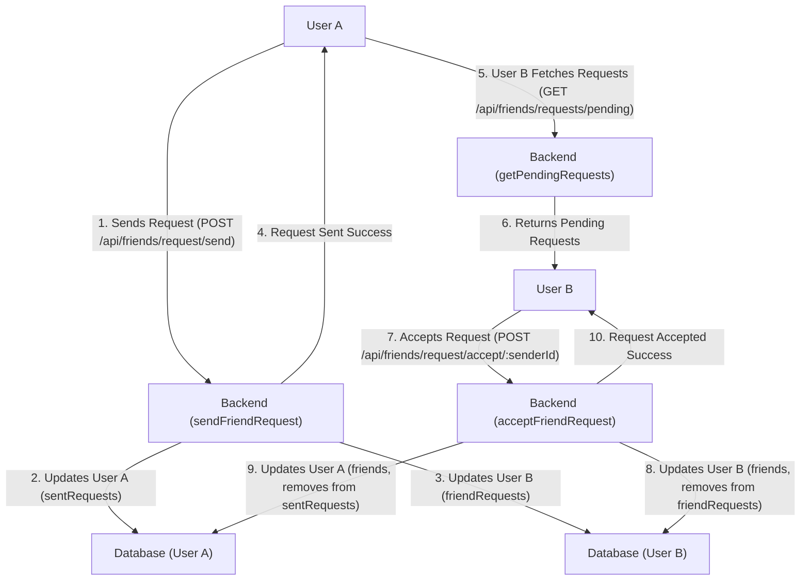
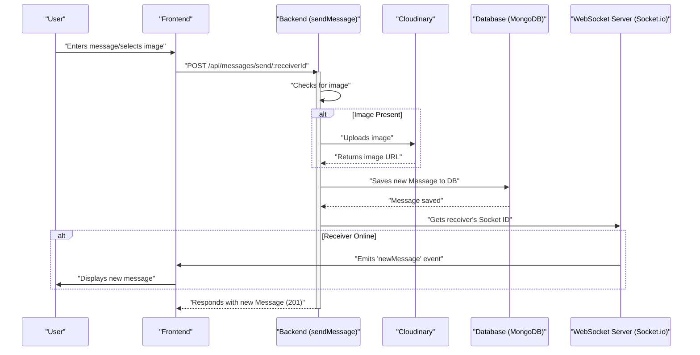

 # Messaging and Friend Management

This document outlines the core logic and functionalities related to real-time messaging, friend requests, and user interactions within the application's backend. It covers how users can send and manage friend requests, maintain their friends list, and exchange messages.

## Friend Management

The `friend.controller.js` file handles all operations related to friend management, including sending, accepting, and rejecting friend requests, as well as managing the friends list. These functionalities are exposed via dedicated API endpoints defined in `friend.route.js`.

### Sending Friend Requests

Users can send friend requests to others by providing a username or email. The system validates the request to prevent sending requests to oneself, already friends, or duplicate requests.

```javascript
// backend/src/controllers/friend.controller.js (lines 14-53)
export const sendFriendRequest = async (req, res) => {
    try {
        const { identifier } = req.body; // Expecting { identifier: "some_username_or_email" }
        const senderId = req.user._id;

        if (!identifier) {
            return res.status(400).json({ message: "Username or email is required." });
        }

        // Find receiver by username OR email
        const receiver = await User.findOne({
            $or: [{ username: identifier }, { email: identifier }]
        });

        if (!receiver) {
            return res.status(404).json({ message: "User not found." });
        }
        
        const receiverId = receiver._id;

        if (senderId.toString() === receiverId.toString()) {
            return res.status(400).json({ message: "You cannot send a friend request to yourself." });
        }

        const sender = await User.findById(senderId);

        if (sender.friends.includes(receiverId)) {
            return res.status(400).json({ message: "You are already friends with this user." });
        }
        if (sender.sentRequests.includes(receiverId)) {
            return res.status(400).json({ message: "Friend request already sent." });
        }
        if (sender.friendRequests.includes(receiverId)) {
            return res.status(400).json({ message: "This user has already sent you a friend request." });
        }

        sender.sentRequests.push(receiverId);
        receiver.friendRequests.push(senderId);

        await sender.save();
        await receiver.save();

        res.status(200).json({ message: "Friend request sent successfully." });

    } catch (error) {
        console.error("Error in sendFriendRequest: ", error.message);
        res.status(500).json({ message: "Internal server error", error: error.message });
    }
};
```
[View on GitHub](https://github.com/shinymack/Chat-App-MERN/blob/main/backend/src/controllers/friend.controller.js#L14-L53)

### Accepting and Rejecting Friend Requests

Once a friend request is received, the recipient can choose to either accept or reject it.
- **Acceptance**: Both users are added to each other's `friends` list, and the request is removed from `friendRequests` and `sentRequests` respectively.
- **Rejection**: The request is simply removed from both users' request arrays without adding them as friends.

```javascript
// backend/src/controllers/friend.controller.js (lines 56-91)
export const acceptFriendRequest = async (req, res) => {
    try {
        const { senderId } = req.params; // ID of the user who sent the request
        const receiverId = req.user._id; // Current user accepting the request

        const sender = await User.findById(senderId);
        const receiver = await User.findById(receiverId);

        if (!sender || !receiver) {
            return res.status(404).json({ message: "User not found." });
        }

        if (!receiver.friendRequests.includes(senderId)) {
            return res.status(400).json({ message: "Friend request not found or already handled." });
        }

        receiver.friends.push(senderId);
        sender.friends.push(receiverId);

        receiver.friendRequests = receiver.friendRequests.filter(id => id.toString() !== senderId.toString());
        sender.sentRequests = sender.sentRequests.filter(id => id.toString() !== receiverId.toString());

        await receiver.save();
        await sender.save();

        res.status(200).json({ message: "Friend request accepted." });

    } catch (error) {
        console.error("Error in acceptFriendRequest: ", error.message);
        res.status(500).json({ message: "Internal server error", error: error.message });
    }
};
```
[View on GitHub](https://github.com/shinymack/Chat-App-MERN/blob/main/backend/src/controllers/friend.controller.js#L56-L91)

```javascript
// backend/src/controllers/friend.controller.js (lines 94-129)
export const rejectFriendRequest = async (req, res) => {
    try {
        const { senderId } = req.params; // ID of the user whose request is being rejected
        const receiverId = req.user._id; // Current user rejecting the request

        const sender = await User.findById(senderId);
        const receiver = await User.findById(receiverId);

        if (!sender || !receiver) {
            return res.status(404).json({ message: "User not found." });
        }

        const initialReceiverRequestsCount = receiver.friendRequests.length;
        receiver.friendRequests = receiver.friendRequests.filter(id => id.toString() !== senderId.toString());

        const initialSenderSentCount = sender.sentRequests.length;
        sender.sentRequests = sender.sentRequests.filter(id => id.toString() !== receiverId.toString());

        if (receiver.friendRequests.length === initialReceiverRequestsCount && sender.sentRequests.length === initialSenderSentCount) {
             return res.status(400).json({ message: "Friend request not found or already handled." });
        }

        await receiver.save();
        await sender.save();

        res.status(200).json({ message: "Friend request rejected." });

    } catch (error) {
        console.error("Error in rejectFriendRequest: ", error.message);
        res.status(500).json({ message: "Internal server error", error: error.message });
    }
};
```
[View on GitHub](https://github.com/shinymack/Chat-App-MERN/blob/main/backend/src/controllers/friend.controller.js#L94-L129)

### Friend Management Routes

The `friend.route.js` defines the API endpoints for friend-related operations. All routes are protected by the `protectRoute` middleware to ensure only authenticated users can access them.

```javascript
// backend/src/routes/friend.route.js (lines 10-29)
router.use(protectRoute);

// Send a friend request to a user
router.post("/request/send/", sendFriendRequest);

// Accept a friend request from a user
router.post("/request/accept/:senderId", acceptFriendRequest);

// Reject a friend request from a user
router.post("/request/reject/:senderId", rejectFriendRequest);

// Remove a friend
router.delete("/remove/:friendId", removeFriend);

// Get the current user's friends list
router.get("/list", getFriends);

// Get pending friend requests for the current user
router.get("/requests/pending", getPendingRequests);

// Get sent friend requests by the current user
router.get("/requests/sent", getSentRequests);
```
[View on GitHub](https://github.com/shinymack/Chat-App-MERN/blob/main/backend/src/routes/friend.route.js#L10-L29)

### Friend Request Workflow

The following diagram illustrates the typical workflow for sending and accepting a friend request.





## Messaging System

The messaging system, managed by `message.controller.js`, facilitates direct communication between users. It includes functionalities for fetching chat participants, retrieving message history, and sending new messages, supporting both text and image content. Real-time message delivery is handled via WebSockets.

### Getting Chat Participants

The `getUsersForSidebar` function retrieves a list of all users excluding the currently logged-in user. This list is typically used to populate a sidebar, allowing the current user to select a chat recipient.

```javascript
// backend/src/controllers/message.controller.js (lines 7-16)
export const getUsersForSidebar = async (req, res) => {
    try {
        const loggedInUserId = req.user._id;
        const filteredUsers = await User.find({
            _id: { $ne: loggedInUserId }}).select("-password");  
        res.status(200).json(filteredUsers);
    }
    catch (error) {
        console.log("Error in getUsersForSidebar: ", error);
        res.status(500).json({ error: "Internal Server Error" });
    }
};
```
[View on GitHub](https://github.com/shinymack/Chat-App-MERN/blob/main/backend/src/controllers/message.controller.js#L7-L16)

### Retrieving Messages

The `getMessages` function fetches all messages exchanged between two specific users (the current user and a selected chat partner). Messages are retrieved from the `Message` model, querying for messages where either user is the sender or receiver.

```javascript
// backend/src/controllers/message.controller.js (lines 18-31)
export const getMessages = async (req, res) => {
    try {
        const {id : userToChatId } = req.params;
        const myId = req.user._id;

        const messages = await Message.find({
            $or: [
                {senderId: myId, receiverId:userToChatId},
                {senderId: userToChatId, receiverId: myId}
            ]
        });
        res.status(200).json(messages);
    } catch (error) {
        console.log("Error in getMessages controller:  ", error);
        res.status(500).json({ error: "Internal Server Error" });
    }
};
```
[View on GitHub](https://github.com/shinymack/Chat-App-MERN/blob/main/backend/src/controllers/message.controller.js#L18-L31)

### Sending Messages

The `sendMessage` function handles the submission of new messages. It supports both text and image messages. Images are first uploaded to Cloudinary, and the secure URL is stored along with the message. After saving the message, it attempts to send the message in real-time to the receiver if they are online via WebSockets.

```javascript
// backend/src/controllers/message.controller.js (lines 33-60)
export const sendMessage = async (req, res) => {
    try {
        const { text, image } = req.body;
        const { id: receiverId } = req.params;
        const senderId = req.user._id;

        let imageUrl;
        if (image) {
            const uploadResponse = await cloudinary.uploader.upload(image);

            imageUrl = uploadResponse.secure_url;
        }
        const newMessage = new Message({
            senderId,
            receiverId,
            text,
            image: imageUrl,
        });

        await newMessage.save();

        const receiverSocketId = getReceiverSocketId(receiverId);

        if(receiverSocketId) {
            io.to(receiverSocketId).emit("newMessage", newMessage);
        }

        res.status(201).json(newMessage);   
        
    } catch (error) {
        console.log("Error in sendMessage controller:  ", error);
        res.status(500).json({ error: "Internal Server Error" });
    }
};
```
[View on GitHub](https://github.com/shinymack/Chat-App-MERN/blob/main/backend/src/controllers/message.controller.js#L33-L60)

### Messaging System Routes

The `message.route.js` defines the API endpoints for message-related operations. All routes are protected by the `protectRoute` middleware.

```javascript
// backend/src/routes/message.route.js (lines 5-11)
router.get("/users", protectRoute, getUsersForSidebar);

router.get("/:id", protectRoute, getMessages);

router.post("/send/:id", protectRoute, sendMessage);
```
[View on GitHub](https://github.com/shinymack/Chat-App-MERN/blob/main/backend/src/routes/message.route.js#L5-L11)

### Message Sending Flow

This diagram illustrates the flow for sending a message, including image upload and real-time delivery.





## Key Integration Points

-   **User Model**: Both friend management and messaging heavily rely on the `User` Mongoose model, which stores `friends`, `sentRequests`, and `friendRequests` arrays, along with user details like `username`, `email`, and `profilePic`. These arrays store `ObjectId` references to other `User` documents, enabling efficient population of related user data.
-   **Authentication Middleware**: The `protectRoute` middleware is crucial for securing all friend and message API endpoints, ensuring that only authenticated users can perform these actions. This middleware typically attaches the authenticated user's ID to the `req.user` object.
-   **Cloudinary**: For media-rich messaging, Cloudinary is integrated to handle image uploads, providing secure storage and delivery of image assets.
-   **Socket.io**: Real-time messaging is powered by Socket.io, which allows instant delivery of new messages to online recipients without requiring them to refresh their chat interface. The `getReceiverSocketId` helper function and `io` instance are central to this functionality.
-   **Mongoose Populate**: To fetch detailed information about friends or users involved in requests, the `.populate()` method is extensively used with specific `select` fields (`username`, `email`, `profilePic`, `_id`) to avoid retrieving sensitive information like passwords and optimize data transfer. This ensures that only relevant user data is exposed in the API responses.