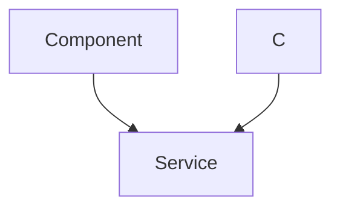

 # Messaging and Friend Management

This documentation details the backend architecture and logic for handling real-time messaging and managing user friendships within the application. It covers how friend requests are sent, accepted, rejected, and how friends are managed, alongside the mechanics of sending and retrieving messages.

## Friend Management System

The friend management system allows users to connect with each other, maintaining lists of friends, pending requests, and sent requests. This module focuses on the core CRUD operations for user relationships.

### Friend Request Lifecycle

Users can send friend requests to others, which can then be accepted or rejected. The system ensures that duplicate requests or requests to oneself are prevented.

```javascript
// File: backend/src/controllers/friend.controller.js
// Sending a friend request
export const sendFriendRequest = async (req, res) => {
    try {
        const { identifier } = req.body;
        const senderId = req.user._id;

        // Find receiver by username or email
        const receiver = await User.findOne({
            $or: [{ username: identifier }, { email: identifier }]
        });

        if (!receiver) {
            return res.status(404).json({ message: "User not found." });
        }
        
        const receiverId = receiver._id;

        // Prevent self-request, existing friendship, or duplicate requests
        if (senderId.toString() === receiverId.toString()) { /* ... */ }
        if (sender.friends.includes(receiverId)) { /* ... */ }
        if (sender.sentRequests.includes(receiverId)) { /* ... */ }
        if (sender.friendRequests.includes(receiverId)) { /* ... */ }

        sender.sentRequests.push(receiverId);
        receiver.friendRequests.push(senderId);

        await sender.save();
        await receiver.save();

        res.status(200).json({ message: "Friend request sent successfully." });

    } catch (error) {
        console.error("Error in sendFriendRequest: ", error.message);
        res.status(500).json({ message: "Internal server error", error: error.message });
    }
};
```
[View on GitHub](https://github.com/shinymack/Chat-App-MERN/blob/main/backend/src/controllers/friend.controller.js#L11-L67)

This snippet demonstrates the `sendFriendRequest` controller function. It first identifies the receiver by username or email. Crucially, it includes checks to prevent invalid requests such as sending a request to oneself, to an already existing friend, or re-sending an already sent/received request. If all checks pass, it updates the `sentRequests` array for the sender and `friendRequests` for the receiver.

### Request Handling and Friendship Maintenance

Once a request is sent, the receiver can accept or reject it. Users can also remove existing friends.

```javascript
// File: backend/src/controllers/friend.controller.js
// Accepting a friend request
export const acceptFriendRequest = async (req, res) => {
    try {
        const { senderId } = req.params;
        const receiverId = req.user._id;

        const sender = await User.findById(senderId);
        const receiver = await User.findById(receiverId);

        // Check if the request exists
        if (!receiver.friendRequests.includes(senderId)) {
            return res.status(400).json({ message: "Friend request not found or already handled." });
        }

        // Add to friends list for both
        receiver.friends.push(senderId);
        sender.friends.push(receiverId);

        // Remove from pending/sent requests
        receiver.friendRequests = receiver.friendRequests.filter(id => id.toString() !== senderId.toString());
        sender.sentRequests = sender.sentRequests.filter(id => id.toString() !== receiverId.toString());

        await receiver.save();
        await sender.save();

        res.status(200).json({ message: "Friend request accepted." });

    } catch (error) {
        console.error("Error in acceptFriendRequest: ", error.message);
        res.status(500).json({ message: "Internal server error", error: error.message });
    }
};
```
[View on GitHub](https://github.com/shinymack/Chat-App-MERN/blob/main/backend/src/controllers/friend.controller.js#L70-L108)

The `acceptFriendRequest` function ensures that the request exists before proceeding. It then adds both users to each other's `friends` list and removes the request from their respective `friendRequests` and `sentRequests` arrays. A similar logic is applied for `rejectFriendRequest`, which only removes the request from the arrays without establishing a friendship.

### Friend Management Flow

The following diagram illustrates the typical lifecycle of a friend request:


```mermaid
graph TD
    A["User A"] -->|"Sends Request to B"|B["User B"]
    B -->|"Receives Request"|C{"Request Exists?"}
    C -- No -->|"Invalid Request"|D["Error/No-op"]
    C -- Yes -->|"Accept Request"|E["User B Accepts"]
    C -- Yes -->|"Reject Request"|F["User B Rejects"]
    E -->|"Add A to B's Friends"|G["Database Update"]
    E -->|"Add B to A's Friends"|G
    E -->|"Remove Request from A's Sent"|G
    E -->|"Remove Request from B's Pending"|G
    F -->|"Remove Request from A's Sent"|G
    F -->|"Remove Request from B's Pending"|G
    G -->|"Request Accepted/Rejected"|H["Friendship Status Updated"]
```


### Retrieving Friend Information

The system provides endpoints to fetch a user's friends list, pending requests (incoming), and sent requests (outgoing).

```javascript
// File: backend/src/controllers/friend.controller.js
// Get user's friends
export const getFriends = async (req, res) => {
    try {
        const userId = req.user._id;
        const user = await User.findById(userId).populate({
            path: "friends",
            select: "username email profilePic _id" 
        });

        if (!user) {
            return res.status(404).json({ message: "User not found." });
        }

        res.status(200).json(user.friends);

    } catch (error) {
        console.error("Error in getFriends: ", error.message);
        res.status(500).json({ message: "Internal server error", error: error.message });
    }
};
```
[View on GitHub](https://github.com/shinymack/Chat-App-MERN/blob/main/backend/src/controllers/friend.controller.js#L196-L215)

The `getFriends` function utilizes Mongoose's `populate` method to efficiently fetch the details of the friends directly associated with the current user's `friends` array. This avoids multiple database queries and returns a list of friend objects with selected fields like `username`, `email`, and `profilePic`. Similar `populate` operations are used for `getPendingRequests` and `getSentRequests`.

## Messaging System

The messaging system enables real-time communication between users, including text messages and image sharing. It integrates with Cloudinary for image uploads and Socket.io for real-time message delivery.

### Retrieving Users for Chat

Before initiating a chat, users need to see available contacts. The system provides an endpoint to fetch all users except the currently logged-in one.

```javascript
// File: backend/src/controllers/message.controller.js
export const getUsersForSidebar = async (req, res) => {
    try {
        const loggedInUserId = req.user._id;
        // Fetch all users excluding the current one, without their passwords
        const filteredUsers = await User.find({
            _id: { $ne: loggedInUserId }}).select("-password");  
        res.status(200).json(filteredUsers);
    }
    catch (error) {
        console.log("Error in getUsersForSidebar: ", error);
        res.status(500).json({ error: "Internal Server Error" });
    }
};
```
[View on GitHub](https://github.com/shinymack/Chat-App-MERN/blob/main/backend/src/controllers/message.controller.js#L9-L19)

This function fetches users for displaying in a chat sidebar. It uses `$ne` (not equal) to exclude the `loggedInUserId` and `select("-password")` to ensure sensitive information is not exposed.

### Message Exchange and Real-time Delivery

Messages can be text-based or include images. Image uploads are handled by Cloudinary, and new messages are emitted in real-time using Socket.io.

```javascript
// File: backend/src/controllers/message.controller.js
export const sendMessage = async (req, res) => {
    try {
        const { text, image } = req.body;
        const { id: receiverId } = req.params;
        const senderId = req.user._id;

        let imageUrl;
        if (image) {
            // Upload image to Cloudinary
            const uploadResponse = await cloudinary.uploader.upload(image);
            imageUrl = uploadResponse.secure_url;
        }

        const newMessage = new Message({
            senderId,
            receiverId,
            text,
            image: imageUrl,
        });

        await newMessage.save();

        const receiverSocketId = getReceiverSocketId(receiverId);

        if(receiverSocketId) {
            // Emit real-time message to receiver if online
            io.to(receiverSocketId).emit("newMessage", newMessage);
        }

        res.status(201).json(newMessage);   
        
    } catch (error) {
        console.log("Error in sendMessage controller:  ", error);
        res.status(500).json({ error: "Internal Server Error" });
    }
};
```
[View on GitHub](https://github.com/shinymack/Chat-App-MERN/blob/main/backend/src/controllers/message.controller.js#L44-L77)

The `sendMessage` function handles both text and image messages. If an image is provided, it's uploaded to Cloudinary, and its `secure_url` is stored. After saving the message to the database, it attempts to get the receiver's Socket.io ID. If found (meaning the receiver is online), the new message is emitted in real-time using `io.to(receiverSocketId).emit("newMessage", newMessage)`.

### Message Retrieval

To display chat history, messages between two specific users are fetched.

```javascript
// File: backend/src/controllers/message.controller.js
export const getMessages = async (req, res) => {
    try {
        const {id : userToChatId } = req.params;
        const myId = req.user._id;

        // Find messages where sender is current user and receiver is chat user, OR vice versa
        const messages = await Message.find({
            $or: [
                {senderId: myId, receiverId:userToChatId},
                {senderId: userToChatId, receiverId: myId}
            ]
        });
        res.status(200).json(messages);
    } catch (error) {
        console.log("Error in getMessages controller:  ", error);
        res.status(500).json({ error: "Internal Server Error" });
    }
};
```
[View on GitHub](https://github.com/shinymack/Chat-App-MERN/blob/main/backend/src/controllers/message.controller.js#L22-L41)

The `getMessages` function queries the `Message` model using an `$or` operator to retrieve all messages where the current user is either the `senderId` and the other user is the `receiverId`, or vice-versa. This ensures that the full conversation history between the two users is fetched.

### Messaging System Flow





## Key Integration Points

-   **Authentication Middleware**: Both friend management and messaging routes are protected by `protectRoute` middleware (see `backend/src/middleware/auth.middleware.js`). This ensures that only authenticated users can access these functionalities.
    ```javascript
    // File: backend/src/routes/friend.route.js
    import { protectRoute } from "../middleware/auth.middleware.js";

    const router = express.Router();
    router.use(protectRoute); // Apply protection to all friend routes
    // ... friend routes
    ```
    [View on GitHub](https://github.com/shinymack/Chat-App-MERN/blob/main/backend/src/routes/friend.route.js#L14-L17)
-   **Database Schema**: The `User` model (presumably `user.model.js`) is central to friend management, containing arrays for `friends`, `sentRequests`, and `friendRequests`. The `Message` model (`message.model.js`) stores chat conversations, linking `senderId` and `receiverId` to users.
-   **Cloudinary for Media**: Image messages are directly uploaded to Cloudinary, offloading storage and scaling concerns from the backend server. Only the URL to the hosted image is stored in the `Message` document.
-   **Socket.io for Real-time**: For instantaneous delivery of messages, Socket.io is used. The `sendMessage` controller gets the `receiverSocketId` and emits the `newMessage` event, allowing the frontend to update chat views without polling. This significantly enhances the user experience for real-time communication.
-   **Mongoose Populate**: Efficient retrieval of associated user data (like friend details or pending request senders) is achieved using Mongoose's `populate` feature. This minimizes database queries and provides rich data objects directly.