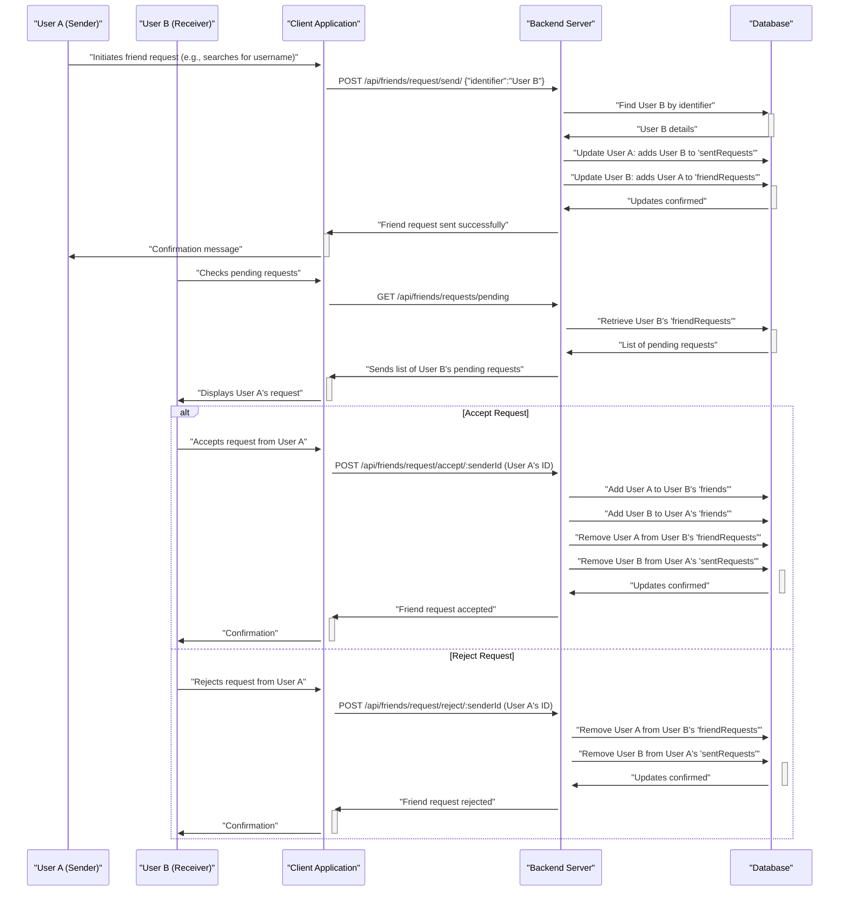

 # Messaging and Friend Management

This document details the implementation of real-time messaging, friend request management, and user interaction functionalities within the application. These features are crucial for establishing a connected user experience, allowing users to communicate directly and build their social network within the platform.

The core logic for friend management and messaging resides in dedicated controller files, which are exposed via specific API routes. This separation ensures maintainability and adherence to the Model-View-Controller (MVC) architectural pattern.

## Friend Management System

The friend management system enables users to send, accept, reject, and remove friend connections. It also provides endpoints to view a user's current friends, as well as incoming and outgoing friend requests.

### Friend Request Flow

The process of managing friend requests involves several stages, from initiation to acceptance or rejection.





### Sending Friend Requests

The `sendFriendRequest` controller handles the logic for initiating a friend request. It identifies the target user by username or email and updates the `sentRequests` array for the sender and `friendRequests` array for the receiver.

```javascript
// backend/src/controllers/friend.controller.js
export const sendFriendRequest = async (req, res) => {
    try {
        const { identifier } = req.body;
        const senderId = req.user._id;

        // ... (validation and user finding logic) ...

        sender.sentRequests.push(receiverId);
        receiver.friendRequests.push(senderId);

        await sender.save();
        await receiver.save();

        res.status(200).json({ message: "Friend request sent successfully." });

    } catch (error) {
        console.error("Error in sendFriendRequest: ", error.message);
        res.status(500).json({ message: "Internal server error", error: error.message });
    }
};
```
This function is exposed via a protected POST route:
`POST /api/friends/request/send/`

[View on GitHub](https://github.com/shinymack/Chat-App-MERN/blob/main/backend/src/controllers/friend.controller.js#L11-L67)
[View on GitHub](https://github.com/shinymack/Chat-App-MERN/blob/main/backend/src/routes/friend.route.js#L14)

### Accepting Friend Requests

When a user accepts a friend request, both users' `friends` lists are updated, and the respective request entries are removed from `friendRequests` and `sentRequests`.

```javascript
// backend/src/controllers/friend.controller.js
export const acceptFriendRequest = async (req, res) => {
    try {
        const { senderId } = req.params;
        const receiverId = req.user._id;

        // ... (user finding and validation logic) ...

        receiver.friends.push(senderId);
        sender.friends.push(receiverId);

        receiver.friendRequests = receiver.friendRequests.filter(id => id.toString() !== senderId.toString());
        sender.sentRequests = sender.sentRequests.filter(id => id.toString() !== receiverId.toString());

        await receiver.save();
        await sender.save();

        res.status(200).json({ message: "Friend request accepted." });

    } catch (error) {
        console.error("Error in acceptFriendRequest: ", error.message);
        res.status(500).json({ message: "Internal server error", error: error.message });
    }
};
```
This action is handled by a protected POST route with a dynamic `senderId` parameter:
`POST /api/friends/request/accept/:senderId`

[View on GitHub](https://github.com/shinymack/Chat-App-MERN/blob/main/backend/src/controllers/friend.controller.js#L70-L108)
[View on GitHub](https://github.com/shinymack/Chat-App-MERN/blob/main/backend/src/routes/friend.route.js#L17)

### Rejecting Friend Requests

Rejecting a request simply removes the relevant entries from the `friendRequests` and `sentRequests` arrays without establishing a friendship.

```javascript
// backend/src/controllers/friend.controller.js
export const rejectFriendRequest = async (req, res) => {
    try {
        const { senderId } = req.params;
        const receiverId = req.user._id;

        // ... (user finding and validation logic) ...

        receiver.friendRequests = receiver.friendRequests.filter(id => id.toString() !== senderId.toString());
        sender.sentRequests = sender.sentRequests.filter(id => id.toString() !== receiverId.toString());

        // ... (check if request was actually removed) ...

        await receiver.save();
        await sender.save();

        res.status(200).json({ message: "Friend request rejected." });

    } catch (error) {
        console.error("Error in rejectFriendRequest: ", error.message);
        res.status(500).json({ message: "Internal server error", error: error.message });
    }
};
```
This is mapped to a protected POST route:
`POST /api/friends/request/reject/:senderId`

[View on GitHub](https://github.com/shinymack/Chat-App-MERN/blob/main/backend/src/controllers/friend.controller.js#L111-L149)
[View on GitHub](https://github.com/shinymack/Chat-App-MERN/blob/main/backend/src/routes/friend.route.js#L20)

### Removing Friends

Users can remove existing friends, which reciprocally removes them from both users' `friends` lists.

```javascript
// backend/src/controllers/friend.controller.js
export const removeFriend = async (req, res) => {
    try {
        const { friendId } = req.params;
        const userId = req.user._id;

        // ... (user finding and validation logic) ...

        user.friends = user.friends.filter(id => id.toString() !== friendId.toString());
        friendToRemove.friends = friendToRemove.friends.filter(id => id.toString() !== userId.toString());

        await user.save();
        await friendToRemove.save();

        res.status(200).json({ message: "Friend removed successfully." });

    } catch (error) {
        console.error("Error in removeFriend: ", error.message);
        res.status(500).json({ message: "Internal server error", error: error.message });
    }
};
```
This functionality is available through a protected DELETE route:
`DELETE /api/friends/remove/:friendId`

[View on GitHub](https://github.com/shinymack/Chat-App-MERN/blob/main/backend/src/controllers/friend.controller.js#L152-L191)
[View on GitHub](https://github.com/shinymack/Chat-App-MERN/blob/main/backend/src/routes/friend.route.js#L23)

### Retrieving Friend Lists and Requests

Several endpoints allow users to view their social connections:

- **Get Friends**: Retrieves a list of users who are friends with the current user.
  `GET /api/friends/list`
- **Get Pending Requests**: Retrieves a list of users who have sent friend requests to the current user.
  `GET /api/friends/requests/pending`
- **Get Sent Requests**: Retrieves a list of users to whom the current user has sent friend requests.
  `GET /api/friends/requests/sent`

These endpoints utilize Mongoose's `populate` method to fetch relevant user details (username, email, profilePic) for associated IDs, ensuring that the client receives comprehensive information without additional queries.

```javascript
// backend/src/controllers/friend.controller.js
export const getFriends = async (req, res) => {
    try {
        const userId = req.user._id;
        const user = await User.findById(userId).populate({
            path: "friends",
            select: "username email profilePic _id"
        });

        if (!user) {
            return res.status(404).json({ message: "User not found." });
        }

        res.status(200).json(user.friends);

    } catch (error) {
        console.error("Error in getFriends: ", error.message);
        res.status(500).json({ message: "Internal server error", error: error.message });
    }
};
```
[View on GitHub](https://github.com/shinymack/Chat-App-MERN/blob/main/backend/src/controllers/friend.controller.js#L194-L218)
[View on GitHub](https://github.com/shinymack/Chat-App-MERN/blob/main/backend/src/routes/friend.route.js#L26-L32)

## Messaging System

The messaging system facilitates real-time communication between users, including sending text and image messages, and retrieving message history. It integrates with a WebSocket server for instant message delivery.

### Messaging Workflow


```mermaid
graph TD
    A["Client (Sender)"] --> B{"Backend API /message/send/:id"};
    B --> C["Upload Image (Cloudinary)"];
    C --> D["Save Message (MongoDB)"];
    D --> E{"Get Receiver Socket ID"};
    E --> F{ "Socket.io Emit 'newMessage'" };
    F --> G["Client (Receiver)"];
    G --> H["Display Message"];

    B -.-> D;
    B -.-> E;

    subgraph "Message Retrieval"
        I["Client (User A)"] --> J{"Backend API /message/:id"};
        J --> K["Query Messages (MongoDB)"];
        K --> L["Return Messages"];
        L --> I;
    end
```


### Sending Messages

Messages can contain text and optionally an image. If an image is provided, it's uploaded to Cloudinary before the message is saved to the database. Upon successful saving, the message is emitted to the receiver in real-time using Socket.io if the receiver is online.

```javascript
// backend/src/controllers/message.controller.js
export const sendMessage = async (req, res) => {
    try {
        const { text, image } = req.body;
        const { id: receiverId } = req.params;
        const senderId = req.user._id;

        let imageUrl;
        if (image) {
            const uploadResponse = await cloudinary.uploader.upload(image);
            imageUrl = uploadResponse.secure_url;
        }

        const newMessage = new Message({
            senderId,
            receiverId,
            text,
            image: imageUrl,
        });

        await newMessage.save();

        const receiverSocketId = getReceiverSocketId(receiverId);
        if(receiverSocketId) {
            io.to(receiverSocketId).emit("newMessage", newMessage);
        }

        res.status(201).json(newMessage);

    } catch (error) {
        console.log("Error in sendMessage controller:  ", error);
        res.status(500).json({ error: "Internal Server Error" });
    }
};
```
This is accessed via a protected POST route:
`POST /api/messages/send/:id`

[View on GitHub](https://github.com/shinymack/Chat-App-MERN/blob/main/backend/src/controllers/message.controller.js#L42-L78)
[View on GitHub](https://github.com/shinymack/Chat-App-MERN/blob/main/backend/src/routes/message.route.js#L11)

### Retrieving Messages

To display message history, an endpoint fetches all messages exchanged between the current user and a specified chat partner.

```javascript
// backend/src/controllers/message.controller.js
export const getMessages = async (req, res) => {
    try {
        const {id : userToChatId } = req.params;
        const myId = req.user._id;

        const messages = await Message.find({
            $or: [
                {senderId: myId, receiverId:userToChatId},
                {senderId: userToChatId, receiverId: myId}
            ]
        });
        res.status(200).json(messages);
    } catch (error) {
        console.log("Error in getMessages controller:  ", error);
        res.status(500).json({ error: "Internal Server Error" });
    }
};
```
This functionality is exposed through a protected GET route:
`GET /api/messages/:id`

[View on GitHub](https://github.com/shinymack/Chat-App-MERN/blob/main/backend/src/controllers/message.controller.js#L25-L40)
[View on GitHub](https://github.com/shinymack/Chat-App-MERN/blob/main/backend/src/routes/message.route.js#L9)

### User List for Sidebar

The application also provides an endpoint to fetch a list of all users, excluding the currently logged-in user, typically used for populating a chat sidebar.

```javascript
// backend/src/controllers/message.controller.js
export const getUsersForSidebar = async (req, res) => {
    try {
        const loggedInUserId = req.user._id;
        const filteredUsers = await User.find({
            _id: { $ne: loggedInUserId }}).select("-password");
        res.status(200).json(filteredUsers);
    }
    catch (error) {
        console.log("Error in getUsersForSidebar: ", error);
        res.status(500).json({ error: "Internal Server Error" });
    }
};
```
This is a protected GET route:
`GET /api/messages/users`

[View on GitHub](https://github.com/shinymack/Chat-App-MERN/blob/main/backend/src/controllers/message.controller.js#L8-L23)
[View on GitHub](https://github.com/shinymack/Chat-App-MERN/blob/main/backend/src/routes/message.route.js#L7)

## Key Integration Points

### Authentication Middleware

All routes related to messaging and friend management are protected by the `protectRoute` middleware. This ensures that only authenticated users can access these functionalities, maintaining security and data integrity. The `req.user._id` is consistently used to identify the current user performing an action.

```javascript
// backend/src/routes/friend.route.js
import { protectRoute } from "../middleware/auth.middleware.js";

const router = express.Router();

// All routes here should be protected
router.use(protectRoute);
```
[View on GitHub](https://github.com/shinymack/Chat-App-MERN/blob/main/backend/src/routes/friend.route.js#L10)

### Real-time Communication

The messaging system heavily relies on Socket.io for real-time updates. When a new message is sent, the backend immediately emits it to the receiver's connected client, providing an instantaneous chat experience. This is facilitated by the `getReceiverSocketId` helper function and the `io` instance from the socket configuration.

### Data Modeling and Population

The `User` model is central to both systems, storing arrays of `friends`, `friendRequests`, and `sentRequests` (all containing `ObjectId` references to other `User` documents). Mongoose's `populate` method is extensively used in controller functions (e.g., `getFriends`, `getPendingRequests`) to automatically retrieve detailed user information for these references, minimizing database queries and simplifying data retrieval for the client.

### Error Handling

Each controller function includes a `try-catch` block to gracefully handle errors that may occur during database operations or other processing, returning a `500 Internal Server Error` with a descriptive message to the client. Specific validation checks (e.g., user not found, already friends, request already sent) return appropriate `400` or `404` status codes.