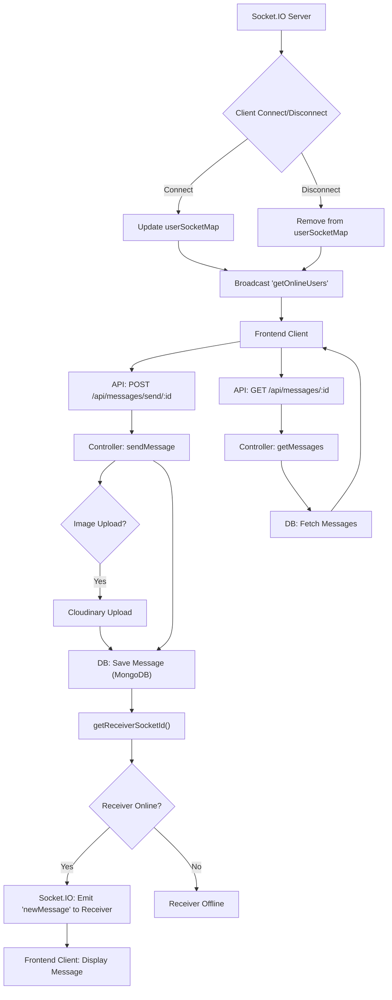

 ```
---
title: "Messaging and Friends Features"
description: "Explains the implementation of direct messaging, friend requests, and real-time communication."
---

# Messaging and Friends Features

This section details the core components and functionalities for direct messaging and real-time communication within the application. It covers how users can send and receive messages, manage their online status, and view active chat participants. The implementation leverages Socket.IO for real-time updates and integrates with Cloudinary for image uploads.

## Core Messaging Functionality

The messaging system is built around a robust backend that handles message persistence, user identification, and real-time delivery.

### Message Model and Schema

The `Message` model defines the structure for storing individual messages in the database. Each message is linked to a sender and receiver, ensuring clear communication context.

```javascript
// backend/src/models/message.model.js
import mongoose from "mongoose";

const messageSchema = new mongoose.Schema(
    {
     senderId: {
        type: mongoose.Schema.Types.ObjectId,
        ref: "User",
        required: true,
     },
     receiverId: {
        type: mongoose.Schema.Types.ObjectId,
        ref: "User",
        required: true,
     },
     text: {
        type: String,
     },
     image: {
        type: String,
     },
    },
    {timestamps: true}
);

export default mongoose.model("Message", messageSchema);
```
**Explanation:**
- `senderId` and `receiverId`: Both are `ObjectId` references to the `User` model, linking messages to specific users. These are required fields.
- `text`: Stores the message content as a string.
- `image`: Stores the URL of an uploaded image, if the message includes one.
- `timestamps: true`: Automatically adds `createdAt` and `updatedAt` fields for tracking message creation and modification times.

[View on GitHub](https://github.com/shinymack/Chat-App-MERN/blob/main/backend/src/models/message.model.js)

### Message Controllers

The `message.controller.js` file contains the logic for handling various message-related API requests, including fetching user lists, retrieving chat messages, and sending new messages.

#### Retrieving Users for Sidebar

The `getUsersForSidebar` controller fetches all users in the system except the currently logged-in user, which is essential for displaying a list of potential chat partners.

```javascript
// backend/src/controllers/message.controller.js
export const getUsersForSidebar = async (req, res) => {
    try {
        const loggedInUserId = req.user._id;
        const filteredUsers = await User.find({
            _id: { $ne: loggedInUserId }}).select("-password");  
        res.status(200).json(filteredUsers);
    }
    catch (error) {
        console.log("Error in getUsersForSidebar: ", error);
        res.status(500).json({ error: "Internal Server Error" });
    }
};
```
**Explanation:**
- It retrieves the `_id` of the authenticated user from `req.user`.
- `User.find({ _id: { $ne: loggedInUserId } })` queries the database for all users whose `_id` is *not equal to* the logged-in user's ID.
- `.select("-password")` ensures that user passwords are not sent in the response.

[View on GitHub](https://github.com/shinymack/Chat-App-MERN/blob/main/backend/src/controllers/message.controller.js#L11-L21)

#### Getting Messages for a Chat

The `getMessages` controller retrieves all messages exchanged between two specific users.

```javascript
// backend/src/controllers/message.controller.js
export const getMessages = async (req, res) => {
    try {
        const {id : userToChatId } = req.params;
        const myId = req.user._id;

        const messages = await Message.find({
            $or: [
                {senderId: myId, receiverId:userToChatId},
                {senderId: userToChatId, receiverId: myId}
            ]
        });
        res.status(200).json(messages);
    } catch (error) {
        console.log("Error in getMessages controller:  ", error);
        res.status(500).json({ error: "Internal Server Error" });
    }
};
```
**Explanation:**
- It extracts `userToChatId` from the request parameters and `myId` from the authenticated user.
- It uses an `$or` operator in the Mongoose query to find messages where:
    - `senderId` is `myId` and `receiverId` is `userToChatId`, OR
    - `senderId` is `userToChatId` and `receiverId` is `myId`.
This ensures all messages in a conversation are retrieved, regardless of who sent them.

[View on GitHub](https://github.com/shinymack/Chat-App-MERN/blob/main/backend/src/controllers/message.controller.js#L23-L39)

#### Sending Messages

The `sendMessage` controller handles the creation of new messages, including image uploads and real-time delivery via Socket.IO.

```javascript
// backend/src/controllers/message.controller.js
export const sendMessage = async (req, res) => {
    try {
        const { text, image } = req.body;
        const { id: receiverId } = req.params;
        const senderId = req.user._id;

        let imageUrl;
        if (image) {
            const uploadResponse = await cloudinary.uploader.upload(image);
            imageUrl = uploadResponse.secure_url;
        }
        const newMessage = new Message({
            senderId,
            receiverId,
            text,
            image: imageUrl,
        });

        await newMessage.save();

        const receiverSocketId = getReceiverSocketId(receiverId);

        if(receiverSocketId) {
            io.to(receiverSocketId).emit("newMessage", newMessage);
        }

        res.status(201).json(newMessage);   
        
    } catch (error) {
        console.log("Error in sendMessage controller:  ", error);
        res.status(500).json({ error: "Internal Server Error" });
    }
};
```
**Explanation:**
- It extracts `text` and `image` from `req.body`, `receiverId` from `req.params`, and `senderId` from `req.user`.
- If an `image` is provided, it's uploaded to Cloudinary, and the `secure_url` is stored.
- A new `Message` instance is created and saved to the database.
- The `getReceiverSocketId` function from `socket.js` is used to find the `socketId` of the receiver.
- If the receiver is online (i.e., `receiverSocketId` exists), the `io.to(receiverSocketId).emit("newMessage", newMessage)` line sends the new message in real-time to the receiver's client via Socket.IO.

[View on GitHub](https://github.com/shinymack/Chat-App-MERN/blob/main/backend/src/controllers/message.controller.js#L41-L74)

### Message Routes

The `message.route.js` file defines the API endpoints for the messaging features, ensuring that all routes are protected by authentication middleware.

```javascript
// backend/src/routes/message.route.js
import express from "express"
import { protectRoute } from "../middleware/auth.middleware.js";
import { getUsersForSidebar, getMessages, sendMessage } from "../controllers/message.controller.js";
const router = express.Router();

router.get("/users", protectRoute, getUsersForSidebar);

router.get("/:id", protectRoute, getMessages);

router.post("/send/:id", protectRoute, sendMessage);

export default router;
```
**Explanation:**
- `/users`: A GET request to this endpoint, protected by `protectRoute`, fetches the list of users for the sidebar via `getUsersForSidebar`.
- `/:id`: A GET request to this endpoint (where `:id` is the `userToChatId`), protected, retrieves messages between the authenticated user and the specified user via `getMessages`.
- `/send/:id`: A POST request to this endpoint (where `:id` is the `receiverId`), protected, sends a new message via `sendMessage`.

[View on GitHub](https://github.com/shinymack/Chat-App-MERN/blob/main/backend/src/routes/message.route.js)

## Real-time Communication with Socket.IO

The application uses Socket.IO to enable real-time messaging and user online status tracking. The `socket.js` file is central to this functionality.

### Socket.IO Setup and Online User Management

The `socket.js` file initializes the Socket.IO server, manages client connections, and maintains a map of online users.

```javascript
// backend/src/lib/socket.js
import { Server } from "socket.io";
import http from "http";
import express from "express";

const app = express();
const server = http.createServer(app);

const io = new Server(server, {
    cors: {
        origin: ["http://localhost:5173"]
    }
})

export function getReceiverSocketId(userId) {
    return userSocketMap[userId];
}

const userSocketMap = {}; //{userId : socketId}

io.on("connection", (socket) => {
    console.log("A user connected", socket.id);

    const userId = socket.handshake.query.userId;
    if(userId) userSocketMap[userId] = socket.id;

    io.emit("getOnlineUsers", Object.keys(userSocketMap));

    socket.on("disconnect", ()=>{
        console.log("A user disconnected", socket.id);
        delete userSocketMap[userId]; 
        io.emit("getOnlineUsers", Object.keys(userSocketMap));
    })
})

export { io, app, server };
```
**Explanation:**
- `const io = new Server(server, { cors: { origin: ["http://localhost:5173"] } })`: Initializes the Socket.IO server and configures CORS to allow connections from the frontend development server.
- `userSocketMap`: An object that stores a mapping from `userId` to `socketId` for all currently online users. This is crucial for sending messages to specific users.
- `io.on("connection", (socket) => { ... })`:
    - When a user connects, their `userId` is extracted from the handshake query and stored in `userSocketMap`.
    - `io.emit("getOnlineUsers", Object.keys(userSocketMap))`: Broadcasts the updated list of online user IDs to all connected clients.
- `socket.on("disconnect", () => { ... })`:
    - When a user disconnects, their entry is removed from `userSocketMap`.
    - The updated list of online users is again broadcasted to all clients.
- `getReceiverSocketId(userId)`: A utility function that returns the `socketId` for a given `userId`, allowing targeted real-time message delivery.

[View on GitHub](https://github.com/shinymack/Chat-App-MERN/blob/main/backend/src/lib/socket.js)

## Key Integration Points

The messaging and real-time features demonstrate a cohesive integration of various technologies and patterns.





**Explanation:**
This flowchart illustrates the complete lifecycle of sending a message, from the frontend client's request to its real-time delivery and storage. It also shows the Socket.IO flow for managing online users. The controller acts as the orchestrator, integrating database operations, external services (Cloudinary), and real-time communication.


```mermaid
flowchart LR
    subgraph Frontend (React Application)
        FE1["User Interface"] --> FE2("Message Input");
        FE2 --> FE3("Send Button");
    end

    subgraph Backend (Node.js/Express)
        B1("Authentication Middleware") --> B2("Message Routes");
        B2 --> B3("Message Controllers");
        B3 --> B4["Message Model (MongoDB)"];
        B3 --> B5("Cloudinary (Image Upload)");
        B3 --> B6("Socket.IO Utility");
    end

    subgraph Realtime (Socket.IO Server)
        R1("Socket.IO Instance") --> R2("userSocketMap");
        R1 --> R3("Connection Handlers");
        R3 --> R2;
    end

    FE3 --> B1 -- "Protected" --> B2 -- "Route Match" --> B3;
    B3 --> B4 -- "Save Message" --> B3;
    B3 --> B5 -- "Image URL" --> B3;
    B3 --> R1 -- "Emit 'newMessage'" --> FE1;
    R3 --> FE1 -- "Event: 'getOnlineUsers'" --> FE1;
    R3 --> FE1 -- "Event: 'newMessage'" --> FE1;

    click B3 "https://github.com/shinymack/Chat-App-MERN/blob/main/backend/src/controllers/message.controller.js" "View Message Controllers"
    click B4 "https://github.com/shinymack/Chat-App-MERN/blob/main/backend/src/models/message.model.js" "View Message Model"
    click R1 "https://github.com/shinymack/Chat-App-MERN/blob/main/backend/src/lib/socket.js" "View Socket.IO Setup"
```


**Explanation:**
This diagram highlights the architectural components involved in the messaging system and how they interact. The Frontend initiates actions, which are processed by the Backend's protected routes and controllers. The backend then orchestrates data persistence, external integrations, and real-time updates through the Socket.IO server, ensuring a responsive user experience.

- **Authentication:** All message-related routes are protected by `protectRoute` middleware, ensuring that only authenticated users can access messaging features. This is crucial for security and data integrity.
- **Modularity:** The separation of concerns between models, controllers, and routes promotes a clean and maintainable codebase. The `socket.js` module is specifically designed to manage real-time communication, keeping it decoupled from the core API logic.
- **Real-time Feedback:** The integration of Socket.IO allows for instant message delivery and live updates on user online status, significantly enhancing the user experience. The `io.emit` and `io.to().emit` functions are key to broadcasting and targeting real-time events.
- **Scalability for Online Users:** The `userSocketMap` in `socket.js` is an effective, albeit in-memory, way to track online users. For larger-scale applications, this map might need to be stored in a distributed system like Redis.
- **Image Handling:** Utilizing Cloudinary for image uploads offloads media storage and serving from the main application server, improving performance and reliability.
```