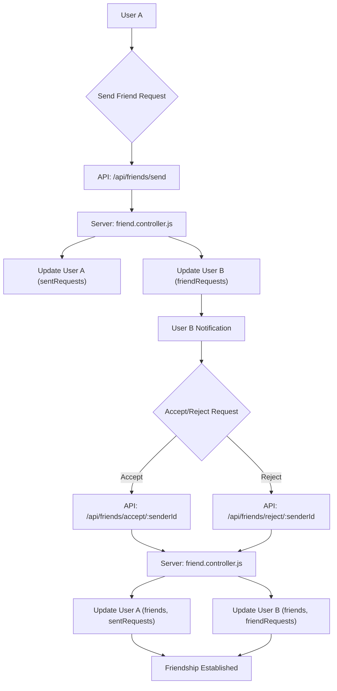
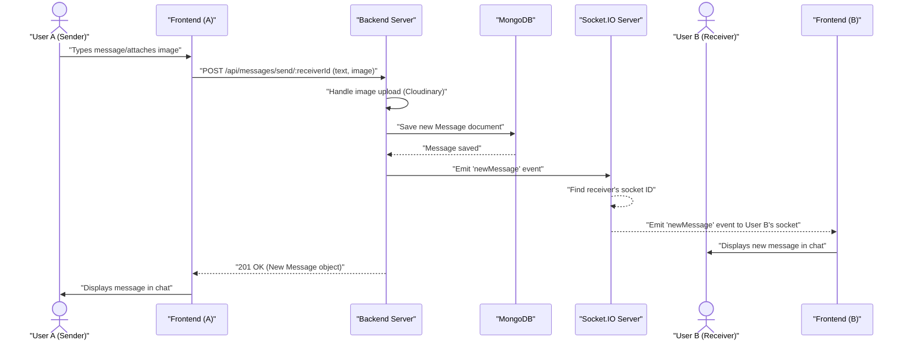

 # Messaging and Friend Management

This section details the backend implementation for user messaging and friend management features, including sending/accepting/rejecting friend requests, removing friends, and real-time message exchange. It leverages MongoDB for data storage, Mongoose for ORM, and integrates with Socket.IO for real-time capabilities.

## Friend Management

The `friend.controller.js` module handles all friend-related operations. It defines functions for sending friend requests, accepting or rejecting them, removing existing friends, and retrieving lists of friends, pending requests, and sent requests. User data, including `friends`, `friendRequests`, and `sentRequests` arrays, is managed within the `User` model.

### Sending Friend Requests

Users can send friend requests to others using their username or email. The system validates that the target user exists, is not the sender, is not already a friend, and doesn't have an existing or pending request.

```javascript
// backend/src/controllers/friend.controller.js
export const sendFriendRequest = async (req, res) => {
    try {
        const { identifier } = req.body;
        const senderId = req.user._id;

        const receiver = await User.findOne({
            $or: [{ username: identifier }, { email: identifier }]
        });

        if (!receiver) {
            return res.status(404).json({ message: "User not found." });
        }
        
        const receiverId = receiver._id;

        // ... validation logic ...

        sender.sentRequests.push(receiverId);
        receiver.friendRequests.push(senderId);

        await sender.save();
        await receiver.save();

        res.status(200).json({ message: "Friend request sent successfully." });

    } catch (error) {
        console.error("Error in sendFriendRequest: ", error.message);
        res.status(500).json({ message: "Internal server error", error: error.message });
    }
};
```
[View on GitHub](https://github.com/shinymack/Chat-App-MERN/blob/main/backend/src/controllers/friend.controller.js#L14-L63)

### Accepting and Rejecting Friend Requests

Once a request is received, the target user can accept or reject it. Accepting a request adds both users to each other's `friends` list and removes the request from `friendRequests` and `sentRequests`. Rejecting a request simply removes it from both lists.

```javascript
// backend/src/controllers/friend.controller.js
export const acceptFriendRequest = async (req, res) => {
    try {
        const { senderId } = req.params;
        const receiverId = req.user._id;

        const sender = await User.findById(senderId);
        const receiver = await User.findById(receiverId);

        // ... validation and existence checks ...

        // Add to friends list for both users
        receiver.friends.push(senderId);
        sender.friends.push(receiverId);

        // Remove from requests lists
        receiver.friendRequests = receiver.friendRequests.filter(id => id.toString() !== senderId.toString());
        sender.sentRequests = sender.sentRequests.filter(id => id.toString() !== receiverId.toString());

        await receiver.save();
        await sender.save();

        res.status(200).json({ message: "Friend request accepted." });

    } catch (error) {
        console.error("Error in acceptFriendRequest: ", error.message);
        res.status(500).json({ message: "Internal server error", error: error.message });
    }
};
```
[View on GitHub](https://github.com/shinymack/Chat-App-MERN/blob/main/backend/src/controllers/friend.controller.js#L66-L106)

### Retrieving Friend Lists and Requests

Dedicated endpoints allow users to fetch their current friends, incoming (pending) friend requests, and outgoing (sent) friend requests. These endpoints use Mongoose's `populate` method to retrieve relevant user details for each friend or request.

```javascript
// backend/src/controllers/friend.controller.js
export const getFriends = async (req, res) => {
    try {
        const userId = req.user._id;
        const user = await User.findById(userId).populate({
            path: "friends",
            select: "username email profilePic _id" 
        });

        if (!user) {
            return res.status(404).json({ message: "User not found." });
        }

        res.status(200).json(user.friends);

    } catch (error) {
        console.error("Error in getFriends: ", error.message);
        res.status(500).json({ message: "Internal server error", error: error.message });
    }
};
```
[View on GitHub](https://github.com/shinymack/Chat-App-MERN/blob/main/backend/src/controllers/friend.controller.js#L182-L200)

### Friend Management Flow

The following diagram illustrates the typical flow for sending and accepting a friend request.





## Messaging System

The core messaging functionality is handled by `message.controller.js` and `message.model.js`. It supports one-on-one private messaging and includes real-time updates via WebSockets.

### Message Model

The `Message` Mongoose model defines the schema for chat messages, storing `senderId`, `receiverId`, `text` content, and an optional `image` URL. Timestamps are automatically managed.

```javascript
// backend/src/models/message.model.js
import mongoose from "mongoose";

const messageSchema = new mongoose.Schema(
    {
     senderId: {
        type: mongoose.Schema.Types.ObjectId,
        ref: "User",
        required: true,
     },
     receiverId: {
        type: mongoose.Schema.Types.ObjectId,
        ref: "User",
        required: true,
     },
     text: {
        type: String,
     },
     image: {
        type: String,
     },
    },
    {timestamps: true}
);

export default mongoose.model("Message", messageSchema);
```
[View on GitHub](https://github.com/shinymack/Chat-App-MERN/blob/main/backend/src/models/message.model.js#L4-L26)

### Sending Messages

Messages are sent via a POST request to `/api/messages/send/:id`. The controller handles saving the message to the database and integrates with Cloudinary for image uploads. Crucially, it uses Socket.IO to emit the new message in real-time to the recipient if they are online.

```javascript
// backend/src/controllers/message.controller.js
export const sendMessage = async (req, res) => {
    try {
        const { text, image } = req.body;
        const { id: receiverId } = req.params;
        const senderId = req.user._id;

        let imageUrl;
        if (image) {
            const uploadResponse = await cloudinary.uploader.upload(image);
            imageUrl = uploadResponse.secure_url;
        }
        const newMessage = new Message({
            senderId,
            receiverId,
            text,
            image: imageUrl,
        });

        await newMessage.save();

        const receiverSocketId = getReceiverSocketId(receiverId);

        if(receiverSocketId) {
            io.to(receiverSocketId).emit("newMessage", newMessage);
        }

        res.status(201).json(newMessage);   
        
    } catch (error) {
        console.log("Error in sendMessage controller:  ", error);
        res.status(500).json({ error: "Internal Server Error" });
    }
};
```
[View on GitHub](https://github.com/shinymack/Chat-App-MERN/blob/main/backend/src/controllers/message.controller.js#L47-L80)

### Retrieving Messages

Messages between two users are fetched by querying the `Message` collection, looking for documents where either the current user is the sender and the other user is the receiver, or vice versa.

```javascript
// backend/src/controllers/message.controller.js
export const getMessages = async (req, res) => {
    try {
        const {id : userToChatId } = req.params;
        const myId = req.user._id;

        const messages = await Message.find({
            $or: [
                {senderId: myId, receiverId:userToChatId},
                {senderId: userToChatId, receiverId: myId}
            ]
        });
        res.status(200).json(messages);
    } catch (error) {
        console.log("Error in getMessages controller:  ", error);
        res.status(500).json({ error: "Internal Server Error" });
    }
};
```
[View on GitHub](https://github.com/shinymack/Chat-App-MERN/blob/main/backend/src/controllers/message.controller.js#L29-L44)

### Real-time Messaging Flow

The message sending process involves both database persistence and real-time communication:





## Key Integration Points

*   **Authentication Middleware**: Both messaging and friend management routes are protected using `protectRoute`, ensuring only authenticated users can access them. This middleware attaches the `_id` of the authenticated user to the `req.user` object, which is crucial for identifying the sender/receiver.
*   **User Model Relationships**: The `User` model is central, storing references to `friends`, `friendRequests`, and `sentRequests`. This allows for efficient querying and population of related user data.
*   **Real-time Communication**: Socket.IO is tightly integrated into the `sendMessage` controller. After a message is persisted to the database, `io.to(receiverSocketId).emit("newMessage", newMessage)` ensures that the recipient immediately receives the message without needing to poll the server.
*   **Cloudinary Integration**: For image messages, the `sendMessage` controller directly uses the `cloudinary` library to upload images, receiving a `secure_url` which is then stored in the `Message` model. This offloads media storage and serving to a specialized service.
*   **MongoDB `$or` Operator**: The `User.findOne({ $or: [{ username: identifier }, { email: identifier }] })` in `sendFriendRequest` and `Message.find({ $or: [...] })` in `getMessages` are key examples of using MongoDB's `$or` operator to query documents based on multiple possible field values, enhancing flexibility in user identification and message retrieval.
*   **`populate` Method for User Data**: Mongoose's `populate` method is heavily used in `getFriends`, `getPendingRequests`, and `getSentRequests` to fetch detailed information (username, email, profilePic) about related users (friends, requesters, requestees) without multiple database queries.