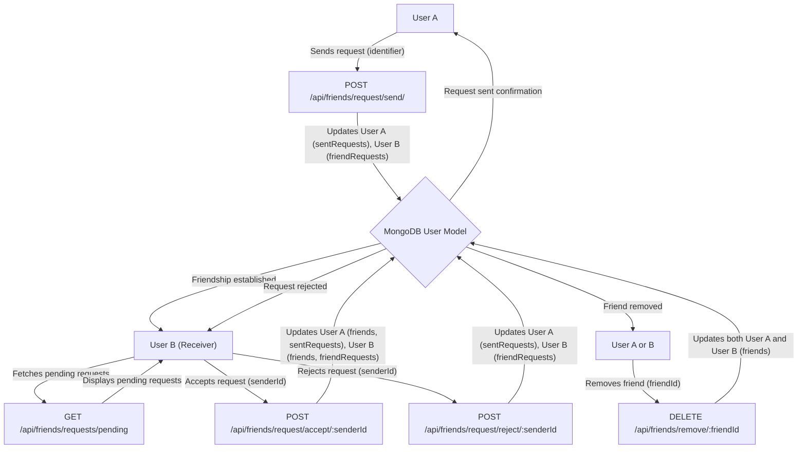
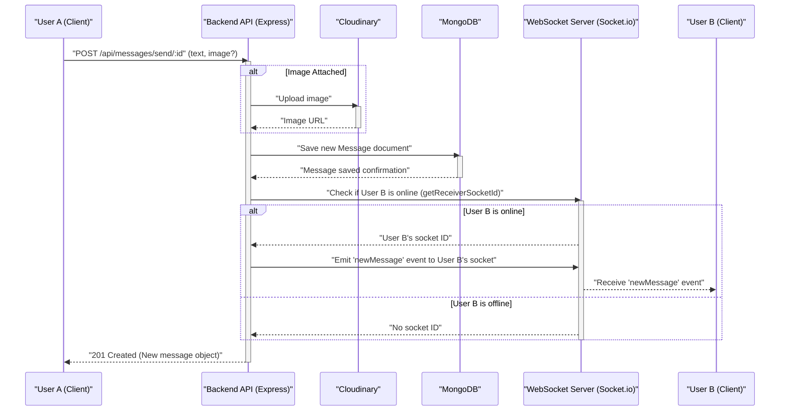

 # Messaging and Friend Management

This section details the robust implementation of real-time messaging and comprehensive friend management features within the application's backend. It covers the logic for sending, accepting, and rejecting friend requests, managing friend lists, and facilitating secure real-time message exchanges between users.

The core components involved are:
*   `backend/src/controllers/friend.controller.js`: Handles all friend-related business logic.
*   `backend/src/routes/friend.route.js`: Defines the API endpoints for friend management.
*   `backend/src/controllers/message.controller.js`: Manages message sending, retrieval, and sidebar user fetching.
*   `backend/src/routes/message.route.js`: Defines the API endpoints for messaging.

## Friend Management Module

The friend management system allows users to connect with each other through a request-based mechanism. It handles the full lifecycle of a friend request, from initiation to acceptance or rejection, and also enables users to remove friends from their list. User relationships are stored and managed within the `User` model, specifically using `friends`, `friendRequests` (received), and `sentRequests` (sent) arrays.

### Sending a Friend Request

Users can send friend requests to others by providing a username or email. The system performs several checks to prevent duplicate requests or requests to oneself, ensuring data integrity.

```javascript
// backend/src/controllers/friend.controller.js
export const sendFriendRequest = async (req, res) => {
    try {
        const { identifier } = req.body;
        const senderId = req.user._id;

        // ... validation and user finding logic ...

        if (senderId.toString() === receiverId.toString()) {
            return res.status(400).json({ message: "You cannot send a friend request to yourself." });
        }

        const sender = await User.findById(senderId);

        if (sender.friends.includes(receiverId)) {
            return res.status(400).json({ message: "You are already friends with this user." });
        }
        if (sender.sentRequests.includes(receiverId)) {
            return res.status(400).json({ message: "Friend request already sent." });
        }
        if (sender.friendRequests.includes(receiverId)) {
            return res.status(400).json({ message: "This user has already sent you a friend request." });
        }

        sender.sentRequests.push(receiverId);
        receiver.friendRequests.push(senderId);

        await sender.save();
        await receiver.save();

        res.status(200).json({ message: "Friend request sent successfully." });

    } catch (error) {
        console.error("Error in sendFriendRequest: ", error.message);
        res.status(500).json({ message: "Internal server error", error: error.message });
    }
};
```
[View on GitHub](https://github.com/shinymack/Chat-App-MERN/blob/main/backend/src/controllers/friend.controller.js#L11-L67)

This function ensures that a request is valid before updating the `sentRequests` array of the sender and the `friendRequests` array of the receiver.

### Handling Friend Requests

Users can either accept or reject incoming friend requests. Both actions require updating the relationship status in the database for both the sender and receiver.

#### Accepting a Friend Request

When a request is accepted, both users are added to each other's `friends` list, and the corresponding entries are removed from their `friendRequests` and `sentRequests` arrays, respectively.

```javascript
// backend/src/controllers/friend.controller.js
export const acceptFriendRequest = async (req, res) => {
    try {
        const { senderId } = req.params;
        const receiverId = req.user._id;

        const sender = await User.findById(senderId);
        const receiver = await User.findById(receiverId);

        if (!sender || !receiver) {
            return res.status(404).json({ message: "User not found." });
        }

        if (!receiver.friendRequests.includes(senderId)) {
            return res.status(400).json({ message: "Friend request not found or already handled." });
        }

        // Add to friends list for both users
        receiver.friends.push(senderId);
        sender.friends.push(receiverId);

        // Remove from requests lists
        receiver.friendRequests = receiver.friendRequests.filter(id => id.toString() !== senderId.toString());
        sender.sentRequests = sender.sentRequests.filter(id => id.toString() !== receiverId.toString());

        await receiver.save();
        await sender.save();

        res.status(200).json({ message: "Friend request accepted." });

    } catch (error) {
        console.error("Error in acceptFriendRequest: ", error.message);
        res.status(500).json({ message: "Internal server error", error: error.message });
    }
};
```
[View on GitHub](https://github.com/shinymack/Chat-App-MERN/blob/main/backend/src/controllers/friend.controller.js#L70-L113)

#### Rejecting a Friend Request

Rejecting a request simply removes the entries from the `friendRequests` and `sentRequests` arrays without establishing a friendship.

```javascript
// backend/src/controllers/friend.controller.js
export const rejectFriendRequest = async (req, res) => {
    try {
        const { senderId } = req.params;
        const receiverId = req.user._id;

        const sender = await User.findById(senderId);
        const receiver = await User.findById(receiverId);

        if (!sender || !receiver) {
            return res.status(404).json({ message: "User not found." });
        }

        // Remove from receiver's friendRequests
        const initialReceiverRequestsCount = receiver.friendRequests.length;
        receiver.friendRequests = receiver.friendRequests.filter(id => id.toString() !== senderId.toString());

        // Remove from sender's sentRequests
        const initialSenderSentCount = sender.sentRequests.length;
        sender.sentRequests = sender.sentRequests.filter(id => id.toString() !== receiverId.toString());

        if (receiver.friendRequests.length === initialReceiverRequestsCount && sender.sentRequests.length === initialSenderSentCount) {
             return res.status(400).json({ message: "Friend request not found or already handled." });
        }

        await receiver.save();
        await sender.save();

        res.status(200).json({ message: "Friend request rejected." });

    } catch (error) {
        console.error("Error in rejectFriendRequest: ", error.message);
        res.status(500).json({ message: "Internal server error", error: error.message });
    }
};
```
[View on GitHub](https://github.com/shinymack/Chat-App-MERN/blob/main/backend/src/controllers/friend.controller.js#L116-L157)

### Removing a Friend

Users can also remove existing friends, which involves removing each user from the other's `friends` list.

```javascript
// backend/src/controllers/friend.controller.js
export const removeFriend = async (req, res) => {
    try {
        const { friendId } = req.params;
        const userId = req.user._id;

        const user = await User.findById(userId);
        const friendToRemove = await User.findById(friendId);

        if (!user || !friendToRemove) {
            return res.status(404).json({ message: "User not found." });
        }

        if (!user.friends.includes(friendId)) {
            return res.status(400).json({ message: "This user is not in your friends list." });
        }

        // Remove friend from both users' friends lists
        user.friends = user.friends.filter(id => id.toString() !== friendId.toString());
        friendToRemove.friends = friendToRemove.friends.filter(id => id.toString() !== userId.toString());

        await user.save();
        await friendToRemove.save();

        res.status(200).json({ message: "Friend removed successfully." });

    } catch (error) {
        console.error("Error in removeFriend: ", error.message);
        res.status(500).json({ message: "Internal server error", error: error.message });
    }
};
```
[View on GitHub](https://github.com/shinymack/Chat-App-MERN/blob/main/backend/src/controllers/friend.controller.js#L160-L198)

### Retrieving Friend Lists and Requests

The module also provides endpoints for users to view their current friends, pending incoming requests (`friendRequests`), and outgoing requests (`sentRequests`). These endpoints use Mongoose's `populate` method to fetch relevant user details instead of just IDs.

```javascript
// backend/src/controllers/friend.controller.js
export const getFriends = async (req, res) => {
    try {
        const userId = req.user._id;
        const user = await User.findById(userId).populate({
            path: "friends",
            select: "username email profilePic _id"
        });

        if (!user) {
            return res.status(404).json({ message: "User not found." });
        }

        res.status(200).json(user.friends);

    } catch (error) {
        console.error("Error in getFriends: ", error.message);
        res.status(500).json({ message: "Internal server error", error: error.message });
    }
};
```
[View on GitHub](https://github.com/shinymack/Chat-App-MERN/blob/main/backend/src/controllers/friend.controller.js#L201-L220)

### Friend Management Workflow

The diagram below illustrates the typical flow for friend request management.





## Real-time Messaging Module

The messaging module facilitates real-time communication between users, allowing them to send text and image messages. It integrates with WebSockets for instant message delivery and uses Cloudinary for image storage.

### Sending Messages

Messages are sent via an API endpoint, which then publishes the message to the database. If the receiver is online, the message is also dispatched in real-time using WebSockets.

```javascript
// backend/src/controllers/message.controller.js
import User from "../models/user.model.js";
import Message from "../models/message.model.js";
import cloudinary from "../lib/cloudinary.js";
import { getReceiverSocketId, io } from "../lib/socket.js";


export const sendMessage = async (req, res) => {
    try {
        const { text, image } = req.body;
        const { id: receiverId } = req.params;
        const senderId = req.user._id;

        let imageUrl;
        if (image) {
            const uploadResponse = await cloudinary.uploader.upload(image);
            imageUrl = uploadResponse.secure_url;
        }
        const newMessage = new Message({
            senderId,
            receiverId,
            text,
            image: imageUrl,
        });

        await newMessage.save();

        const receiverSocketId = getReceiverSocketId(receiverId);

        if(receiverSocketId) {
            io.to(receiverSocketId).emit("newMessage", newMessage);
        }

        res.status(201).json(newMessage);   
        
    } catch (error) {
        console.log("Error in sendMessage controller:  ", error);
        res.status(500).json({ error: "Internal Server Error" });
    }
};
```
[View on GitHub](https://github.com/shinymack/Chat-App-MERN/blob/main/backend/src/controllers/message.controller.js#L35-L69)

This snippet demonstrates the robust message handling, including optional image upload via Cloudinary and real-time delivery via `socket.io`.

### Retrieving Messages

Users can fetch their message history with a specific chat partner. The system queries messages where either the current user is the sender and the other user is the receiver, or vice-versa.

```javascript
// backend/src/controllers/message.controller.js
export const getMessages = async (req, res) => {
    try {
        const {id : userToChatId } = req.params;
        const myId = req.user._id;

        const messages = await Message.find({
            $or: [
                {senderId: myId, receiverId:userToChatId},
                {senderId: userToChatId, receiverId: myId}
            ]
        });
        res.status(200).json(messages);
    } catch (error) {
        console.log("Error in getMessages controller:  ", error);
        res.status(500).json({ error: "Internal Server Error" });
    }
};
```
[View on GitHub](https://github.com/shinymack/Chat-App-MERN/blob/main/backend/src/controllers/message.controller.js#L20-L32)

### Fetching Users for Sidebar

The application provides a feature to display all other users in a sidebar, excluding the currently logged-in user. This allows easy initiation of new chats.

```javascript
// backend/src/controllers/message.controller.js
export const getUsersForSidebar = async (req, res) => {
    try {
        const loggedInUserId = req.user._id;
        const filteredUsers = await User.find({
            _id: { $ne: loggedInUserId }}).select("-password");  
        res.status(200).json(filteredUsers);
    }
    catch (error) {
        console.log("Error in getUsersForSidebar: ", error);
        res.status(500).json({ error: "Internal Server Error" });
    }
};
```
[View on GitHub](https://github.com/shinymack/Chat-App-MERN/blob/main/backend/src/controllers/message.controller.js#L7-L17)

### Real-time Messaging Flow

The diagram below illustrates the process of sending a message, highlighting the interaction between the client, backend API, database, Cloudinary, and WebSocket server.





## Key Integration Points

*   **Authentication Middleware**: Both `friend.route.js` and `message.route.js` extensively use the `protectRoute` middleware to ensure that all friend management and messaging actions are performed by authenticated users. This is critical for security and user privacy.
*   **User Model Centrality**: The `User` model is central to both modules, storing friend relationships (`friends`, `friendRequests`, `sentRequests`) and being referenced for message senders and receivers. Efficient population strategies are used to retrieve necessary user details without exposing sensitive information like passwords.
*   **Real-time Communication**: The messaging module's integration with `socket.io` demonstrates a key aspect of modern chat applications. Messages are not only persisted but also delivered instantly to online users, enhancing the user experience. The `getReceiverSocketId` function from `socket.js` is crucial for targeted real-time delivery.
*   **External Service Integration**: The use of Cloudinary for image storage in the messaging module showcases how external services can be seamlessly integrated to offload resource-intensive tasks and improve scalability.
*   **Error Handling**: Robust error handling is implemented in all controller functions, providing meaningful responses to the client and logging server-side errors for debugging and monitoring. This includes specific status codes for various error conditions, such as "User not found" or "Friend request already sent."
*   **Data Consistency**: The friend management logic carefully updates multiple arrays (`friends`, `friendRequests`, `sentRequests`) across two `User` documents (sender and receiver) to maintain data consistency for relational status. This requires careful transaction management, or atomic updates in a real-world production environment to prevent inconsistencies.