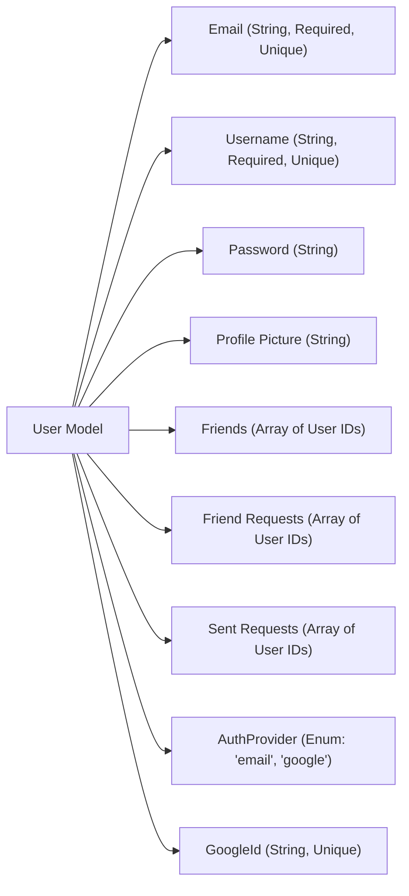
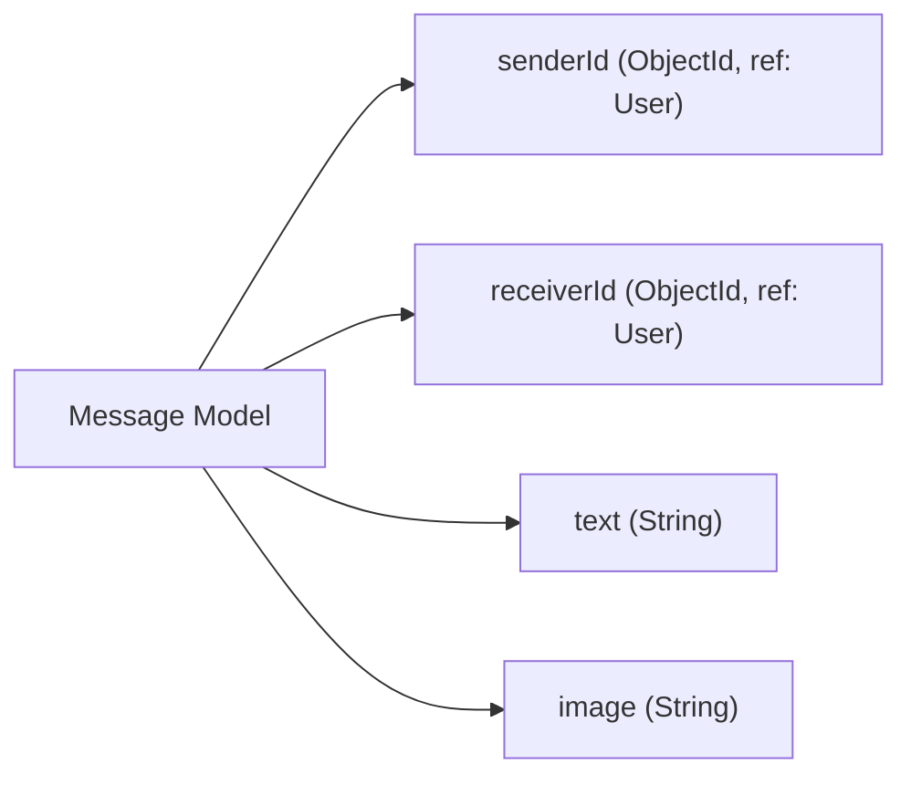
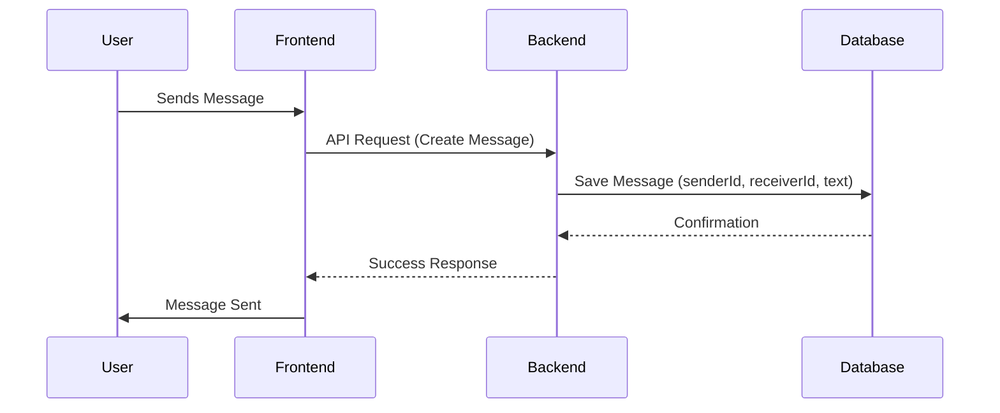

# Models

This section describes the data models used in the backend of the Chat-App-MERN application. These models are defined using Mongoose, a MongoDB object modeling tool designed to work in an asynchronous environment. The two primary models are `User` and `Message`, which represent users and their messages, respectively.

## User Model

The `User` model stores information about each user, including their email, username, password, profile picture, friends list, friend requests, authentication provider (email or Google), and Google ID (if applicable).

```javascript title="backend/src/models/user.model.js"
import mongoose from "mongoose"

const  userSchema = new mongoose.Schema(
    {
        email: { 
            type: String,
            required: true,
            unique: true
        },
        username: {
            type: String,
            required: [true, "Username is required"],
            unique: true,
            trim: true,
            minlength: [3, "Username must be at least 3 characters long"],
            maxlength: [20, "Username cannot be more than 20 characters long"]
        }
        ,
        password: {
            type: String,
            minlength: 6,
        },
        profilePic: {
            type: String,
            default: "",
        },
        friends: [{
            type: mongoose.Schema.Types.ObjectId,
            ref: "User",
            default: [] 
        }],
        friendRequests: [{ // Incoming friend requests
            type: mongoose.Schema.Types.ObjectId,
            ref: "User",
            default: []
        }],
        sentRequests: [{ // Outgoing friend requests
            type: mongoose.Schema.Types.ObjectId,
            ref: "User",
            default: []
        }],
        authProvider: {
            type: String,
            enum: ['email', 'google'],
            default: 'email'
        },
        googleId: {
            type: String,
            unique: true,
            sparse: true
        },
    },
    { 
        timestamps: true
    } 
);

userSchema.pre('save', async function(next) {
    if (this.authProvider === 'google' && !this.isModified('password')) {
        this.password = undefined;
    }
    if (this.authProvider === 'email' && !this.password && this.isNew) {
        return next(new Error('Password is required for email signup.'));
    }
    next();
});

const User = mongoose.model("User", userSchema);

export default User;
```

[View on GitHub](https://github.com/shinymack/Chat-App-MERN/blob/main/backend/src/models/user.model.js)

The `userSchema` defines the structure of the user documents in the MongoDB database. It includes fields such as `email`, `username`, `password`, and `profilePic`, each with specific validation rules and data types.  The schema also includes fields for managing friends lists and authentication methods.

Key features:

-   **Email**: Must be unique and is required.
-   **Username**: Must be unique, required, and between 3 and 20 characters long.
-   **Password**: Minimum length of 6 characters.
-   **Friends, friendRequests, sentRequests**:  Arrays of user IDs referencing the `User` model itself, facilitating the friend request and management system.
-   **authProvider**: Indicates whether the user authenticated with email/password or Google OAuth.
-   **googleId**: Stores the Google ID for users who signed up using Google OAuth.
-   **Timestamps**: Automatically adds `createdAt` and `updatedAt` fields to each document.

The `pre('save', ...)` middleware function is used to handle password requirements based on the authentication provider.  If a user is signing up with email, a password is required; otherwise, if signing up with Google, the password field is set to undefined.





This diagram illustrates the main attributes of the `User` model and their respective data types and constraints.

## Message Model

The `Message` model stores information about individual messages exchanged between users, including the sender ID, receiver ID, text content, and optional image.

```javascript title="backend/src/models/message.model.js"
import express from "express";
import mongoose from "mongoose";

const messageSchema = new mongoose.Schema(
    {
     senderId: {
        type: mongoose.Schema.Types.ObjectId,
        ref: "User",
        required: true,
     },
     receiverId: {
        type: mongoose.Schema.Types.ObjectId,
        ref: "User",
        required: true,
     },
     text: {
        type: String,
     },
     image: {
        type: String,
     },
    },
    {timestamps: true}
);

export default mongoose.model("Message", messageSchema);
```

[View on GitHub](https://github.com/shinymack/Chat-App-MERN/blob/main/backend/src/models/message.model.js)

The `messageSchema` defines the structure for message documents. It includes:

-   **senderId**:  The ID of the user sending the message, referencing the `User` model.
-   **receiverId**: The ID of the user receiving the message, also referencing the `User` model.
-   **text**: The text content of the message.
-   **image**:  A URL or path to an image associated with the message (optional).
-   **timestamps**: Automatically adds `createdAt` and `updatedAt` fields.

```javascript title="Example: Creating a new Message"
const Message = mongoose.model("Message", messageSchema);

const newMessage = new Message({
    senderId: "senderUserId",
    receiverId: "receiverUserId",
    text: "Hello!",
});

newMessage.save()
    .then(savedMessage => console.log("Message saved:", savedMessage))
    .catch(err => console.error("Error saving message:", err));
```

[View on GitHub](https://github.com/shinymack/Chat-App-MERN/blob/main/backend/src/models/message.model.js)

This code snippet demonstrates how to create a new `Message` instance using the `Message` model and save it to the database.





This diagram represents the structure of the `Message` model and its fields.

## Model Relationships

The `User` and `Message` models have a relationship through the `senderId` and `receiverId` fields in the `Message` model, which reference the `User` model. This relationship allows for efficient querying of messages between specific users.

```javascript title="Example: Querying Messages by Sender and Receiver"
Message.find({
    senderId: "user1Id",
    receiverId: "user2Id"
})
.then(messages => console.log("Messages:", messages))
.catch(err => console.error("Error fetching messages:", err));
```

[View on GitHub](https://github.com/shinymack/Chat-App-MERN/blob/main/backend/src/models/message.model.js)

This code snippet illustrates how to query the `Message` model to retrieve all messages between two specific users, using their respective IDs.

## Key Integration Points

The models are crucial for managing user data and message exchange within the application.  The `User` model supports authentication, friend management, and user profile information. The `Message` model facilitates the core chat functionality, storing and retrieving messages between users.

Best practices include:

-   **Data Validation**: Implementing thorough validation in the models to ensure data integrity.  This is achieved through Mongoose's built-in validation features.
-   **Referencing**: Utilizing Mongoose's `ref` option to create relationships between models, enabling efficient data retrieval and ensuring data consistency.
-   **Middleware**: Using Mongoose middleware functions (e.g., `pre('save', ...)` ) to perform actions before or after certain events, such as saving a document.
```javascript title="Example: Using timestamps"
const messageSchema = new mongoose.Schema(
    {
     senderId: {
        type: mongoose.Schema.Types.ObjectId,
        ref: "User",
        required: true,
     },
     receiverId: {
        type: mongoose.Schema.Types.ObjectId,
        ref: "User",
        required: true,
     },
     text: {
        type: String,
     },
     image: {
        type: String,
     },
    },
    {timestamps: true}
);
```

[View on GitHub](https://github.com/shinymack/Chat-App-MERN/blob/main/backend/src/models/message.model.js)
Enabling timestamps automatically adds `createdAt` and `updatedAt` fields to each document, which are useful for tracking when documents were created and last modified.





This diagram illustrates the flow of creating a message, from the user sending the message through the frontend, to the backend saving the message in the database, and back to the user.
```