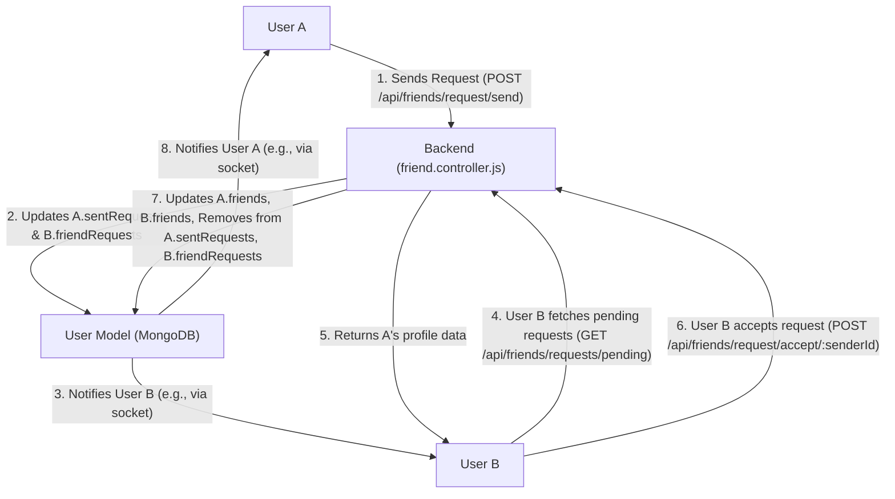

 # User and Friend Management

This section details the API endpoints and underlying logic for managing user profiles and facilitating friend relationships within the application. It covers sending, accepting, and rejecting friend requests, as well as managing a user's friend list.

## Core Concepts

The friend management system revolves around several key concepts integrated into the `User` model:

*   **Friends List (`friends` array):** Stores `_id` references to users who are mutually friends.
*   **Incoming Friend Requests (`friendRequests` array):** Stores `_id` references to users who have sent a friend request to the current user.
*   **Outgoing Friend Requests (`sentRequests` array):** Stores `_id` references to users to whom the current user has sent a friend request.

These arrays, populated with `mongoose.Schema.Types.ObjectId` references, allow for efficient lookup and population of related user data.

## API Endpoints

The `backend/src/routes/friend.route.js` file defines the API routes for friend management. All routes are protected by the `protectRoute` middleware, ensuring that only authenticated users can access them.

### `friend.route.js` Overview

The friend routes are handled by the `friend.route.js` file:
[View on GitHub](https://github.com/shinymack/Chat-App-MERN/blob/main/backend/src/routes/friend.route.js)

```javascript
import express from "express";
import {
    sendFriendRequest,
    acceptFriendRequest,
    rejectFriendRequest,
    removeFriend,
    getFriends,
    getPendingRequests,
    getSentRequests
} from "../controllers/friend.controller.js";
import { protectRoute } from "../middleware/auth.middleware.js"; // Assuming you have this

const router = express.Router();

// All routes here should be protected
router.use(protectRoute);

router.post("/request/send/", sendFriendRequest);
router.post("/request/accept/:senderId", acceptFriendRequest);
router.post("/request/reject/:senderId", rejectFriendRequest);
router.delete("/remove/:friendId", removeFriend);
router.get("/list", getFriends);
router.get("/requests/pending", getPendingRequests);
router.get("/requests/sent", getSentRequests);

export default router;
```

### Friend Management Endpoints

| Method | Endpoint                    | Description                                       | Controller Function          |
| :----- | :-------------------------- | :------------------------------------------------ | :--------------------------- |
| `POST` | `/api/friends/request/send` | Sends a friend request to another user.           | `sendFriendRequest`          |
| `POST` | `/api/friends/request/accept/:senderId` | Accepts an incoming friend request.               | `acceptFriendRequest`        |
| `POST` | `/api/friends/request/reject/:senderId` | Rejects an incoming friend request.               | `rejectFriendRequest`        |
| `DELETE` | `/api/friends/remove/:friendId` | Removes an existing friend.                       | `removeFriend`               |
| `GET`  | `/api/friends/list`         | Retrieves the current user's friends list.        | `getFriends`                 |
| `GET`  | `/api/friends/requests/pending` | Retrieves incoming friend requests for the user.  | `getPendingRequests`         |
| `GET`  | `/api/friends/requests/sent`  | Retrieves outgoing friend requests sent by the user.| `getSentRequests`            |

## Controller Logic

The core logic for managing friend relationships resides in `backend/src/controllers/friend.controller.js`. This file implements the functions corresponding to each API endpoint.

### Sending a Friend Request

The `sendFriendRequest` function allows a user to send a friend request by providing the recipient's username or email.

[View on GitHub](https://github.com/shinymack/Chat-App-MERN/blob/main/backend/src/controllers/friend.controller.js#L11-L57)

```javascript
export const sendFriendRequest = async (req, res) => {
    try {
        const { identifier } = req.body; // Expecting { identifier: "some_username_or_email" }
        const senderId = req.user._id;

        // ... (input validation) ...

        // Find receiver by username OR email
        const receiver = await User.findOne({
            $or: [{ username: identifier }, { email: identifier }]
        });

        // ... (various checks: self-request, already friends, request already sent/received) ...

        sender.sentRequests.push(receiverId);
        receiver.friendRequests.push(senderId);

        await sender.save();
        await receiver.save();

        res.status(200).json({ message: "Friend request sent successfully." });

    } catch (error) {
        console.error("Error in sendFriendRequest: ", error.message);
        res.status(500).json({ message: "Internal server error", error: error.message });
    }
};
```

This function performs several crucial checks:
*   **Identifier Validation:** Ensures a username or email is provided.
*   **User Existence:** Verifies that both sender and receiver exist.
*   **Self-Request Prevention:** A user cannot send a request to themselves.
*   **Relationship Status Checks:**
    *   Prevents sending a request if already friends.
    *   Prevents duplicate requests if one has already been sent.
    *   Suggests accepting an existing request if the target user has already sent one to the sender.
If all checks pass, the `receiverId` is added to the sender's `sentRequests` array, and the `senderId` is added to the receiver's `friendRequests` array. Both user documents are then saved.

### Accepting a Friend Request

The `acceptFriendRequest` function handles the logic for a user to accept an incoming friend request.

[View on GitHub](https://github.com/shinymack/Chat-App-MERN/blob/main/backend/src/controllers/friend.controller.js#L60-L98)

```javascript
export const acceptFriendRequest = async (req, res) => {
    try {
        const { senderId } = req.params; // ID of the user who sent the request
        const receiverId = req.user._id; // Current user accepting the request

        const sender = await User.findById(senderId);
        const receiver = await User.findById(receiverId);

        // ... (user existence check) ...

        // Check if the request exists in receiver's friendRequests
        if (!receiver.friendRequests.includes(senderId)) {
            return res.status(400).json({ message: "Friend request not found or already handled." });
        }

        // Add to friends list for both users
        receiver.friends.push(senderId);
        sender.friends.push(receiverId);

        // Remove from requests lists
        receiver.friendRequests = receiver.friendRequests.filter(id => id.toString() !== senderId.toString());
        sender.sentRequests = sender.sentRequests.filter(id => id.toString() !== receiverId.toString());

        await receiver.save();
        await sender.save();

        res.status(200).json({ message: "Friend request accepted." });

    } catch (error) {
        console.error("Error in acceptFriendRequest: ", error.message);
        res.status(500).json({ message: "Internal server error", error: error.message });
    }
};
```

Upon successful acceptance:
1.  Both users' `friends` arrays are updated to include each other.
2.  The `senderId` is removed from the receiver's `friendRequests` array.
3.  The `receiverId` (current user) is removed from the sender's `sentRequests` array.
This maintains data consistency across both user profiles.

### Rejecting a Friend Request

The `rejectFriendRequest` function removes an incoming friend request without establishing a friendship.

[View on GitHub](https://github.com/shinymack/Chat-App-MERN/blob/main/backend/src/controllers/friend.controller.js#L101-L135)

```javascript
export const rejectFriendRequest = async (req, res) => {
    try {
        const { senderId } = req.params; // ID of the user whose request is being rejected
        const receiverId = req.user._id; // Current user rejecting the request

        const sender = await User.findById(senderId);
        const receiver = await User.findById(receiverId);

        // ... (user existence check) ...

        // Remove from receiver's friendRequests
        const initialReceiverRequestsCount = receiver.friendRequests.length;
        receiver.friendRequests = receiver.friendRequests.filter(id => id.toString() !== senderId.toString());

        // Remove from sender's sentRequests
        const initialSenderSentCount = sender.sentRequests.length;
        sender.sentRequests = sender.sentRequests.filter(id => id.toString() !== receiverId.toString());

        if (receiver.friendRequests.length === initialReceiverRequestsCount && sender.sentRequests.length === initialSenderSentCount) {
             return res.status(400).json({ message: "Friend request not found or already handled." });
        }

        await receiver.save();
        await sender.save();

        res.status(200).json({ message: "Friend request rejected." });

    } catch (error) {
        console.error("Error in rejectFriendRequest: ", error.message);
        res.status(500).json({ message: "Internal server error", error: error.message });
    }
};
```
Rejecting a request involves removing the `senderId` from the receiver's `friendRequests` and removing the `receiverId` from the sender's `sentRequests`. A check is included to ensure that a request actually existed before attempting to remove it.

### Removing a Friend

The `removeFriend` function allows a user to unfriend an existing friend.

[View on GitHub](https://github.com/shinymack/Chat-App-MERN/blob/main/backend/src/controllers/friend.controller.js#L138-L168)

```javascript
export const removeFriend = async (req, res) => {
    try {
        const { friendId } = req.params;
        const userId = req.user._id;

        const user = await User.findById(userId);
        const friendToRemove = await User.findById(friendId);

        // ... (user existence check) ...

        // Check if they are actually friends
        if (!user.friends.includes(friendId)) {
            return res.status(400).json({ message: "This user is not in your friends list." });
        }

        // Remove friend from both users' friends lists
        user.friends = user.friends.filter(id => id.toString() !== friendId.toString());
        friendToRemove.friends = friendToRemove.friends.filter(id => id.toString() !== userId.toString());

        await user.save();
        await friendToRemove.save();

        res.status(200).json({ message: "Friend removed successfully." });

    } catch (error) {
        console.error("Error in removeFriend: ", error.message);
        res.status(500).json({ message: "Internal server error", error: error.message });
    }
};
```
This function removes the `friendId` from the current user's `friends` array and removes the `userId` from the `friendToRemove`'s `friends` array, ensuring a mutual removal.

### Retrieving Friend-Related Lists

The `getFriends`, `getPendingRequests`, and `getSentRequests` functions retrieve lists of friends, incoming requests, and outgoing requests, respectively. They all utilize Mongoose's `populate` method to fetch relevant user details (username, email, profile picture) instead of just IDs.

**Example: `getFriends` function**
[View on GitHub](https://github.com/shinymack/Chat-App-MERN/blob/main/backend/src/controllers/friend.controller.js#L171-L191)

```javascript
export const getFriends = async (req, res) => {
    try {
        const userId = req.user._id;
        const user = await User.findById(userId).populate({
            path: "friends",
            select: "username email profilePic _id"
        });

        if (!user) {
            return res.status(404).json({ message: "User not found." });
        }

        res.status(200).json(user.friends);

    } catch (error) {
        console.error("Error in getFriends: ", error.message);
        res.status(500).json({ message: "Internal server error", error: error.message });
    }
};
```
The `populate` method dynamically replaces the `ObjectId` references in the `friends` array with the actual `User` documents, but only including the `username`, `email`, `profilePic`, and `_id` fields for security and efficiency. The `getPendingRequests` and `getSentRequests` functions operate similarly, populating their respective arrays.

## User Model Enhancements

The `backend/src/models/user.model.js` schema includes the necessary fields for friend management:

[View on GitHub](https://github.com/shinymack/Chat-App-MERN/blob/main/backend/src/models/user.model.js#L26-L40)

```javascript
import mongoose from "mongoose"

const  userSchema = new mongoose.Schema(
    {
        // ... other user fields ...
        profilePic: {
            type: String,
            default: "",
        },
        friends: [{
            type: mongoose.Schema.Types.ObjectId,
            ref: "User",
            default: []
        }],
        friendRequests: [{ // Incoming friend requests
            type: mongoose.Schema.Types.ObjectId,
            ref: "User",
            default: []
        }],
        sentRequests: [{ // Outgoing friend requests
            type: mongoose.Schema.Types.ObjectId,
            ref: "User",
            default: []
        }],
        // ... other user fields ...
    },
    {
        timestamps: true
    }
);
```
These fields are arrays of `mongoose.Schema.Types.ObjectId` referencing the `User` model itself, enabling relational data storage.

## Friend Request Flow

The following diagram illustrates the typical flow for sending and accepting a friend request.





## Key Integration Points

*   **Authentication Middleware:** All friend management routes are protected by `protectRoute` from `auth.middleware.js`, ensuring that only authenticated users can perform these actions.
*   **User Model:** The `User` model (`user.model.js`) is central, storing all friend-related arrays (`friends`, `friendRequests`, `sentRequests`). These arrays use `ObjectId` references, allowing Mongoose's `populate` method to fetch related user details efficiently.
*   **Error Handling:** Each controller function includes `try-catch` blocks to gracefully handle potential errors (e.g., database issues, invalid user IDs, network problems) and return appropriate HTTP status codes and messages.
*   **Profile Pictures:** The `profilePic` field in the `User` model, potentially managed by `cloudinary.js`, allows friend lists and requests to display user avatars, enhancing the user experience.
*   **Real-time Updates (Future/External):** While not explicitly covered in these files, in a real-time application, changes to friend status (requests sent/received, accepted, rejected, removed) would ideally trigger WebSocket events to update relevant users' UIs instantly, rather than requiring a page refresh. This would integrate with a separate Socket.IO or similar service.