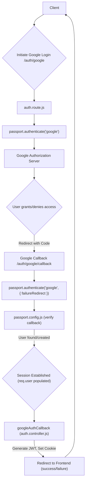
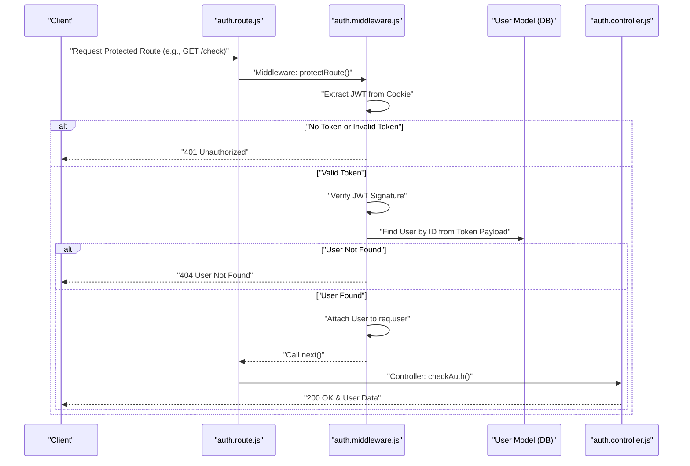

 
---
title: "Authentication and Authorization"
description: "Explains the authentication mechanisms, including passport.js, and middleware for securing routes."
---

# Authentication and Authorization

This section details the robust authentication and authorization mechanisms implemented within the backend, ensuring secure user access and data protection. It covers local email/password authentication, Google OAuth integration via Passport.js, JWT-based session management, and middleware for route protection.

The system employs a layered approach to security, utilizing industry-standard practices to manage user identities and permissions effectively.

## Core Components

The authentication and authorization system is built upon several key components:

*   **`backend/src/controllers/auth.controller.js`**: Handles all authentication logic, including user registration, login, logout, profile updates, and Google OAuth callbacks.
*   **`backend/src/lib/passport.config.js`**: Configures Passport.js for Google OAuth 2.0 strategy, managing user serialization and deserialization.
*   **`backend/src/middleware/auth.middleware.js`**: Contains middleware functions, notably `protectRoute`, to secure endpoints by validating JWTs.
*   **`backend/src/routes/auth.route.js`**: Defines API routes for all authentication-related operations.

## Authentication Flow

### Local Authentication (Email/Password)

Users can register and log in using their email and password. The system utilizes `bcrypt.js` for secure password hashing. Upon successful login or signup, a JSON Web Token (JWT) is generated and stored as an HTTP-only cookie.

**Signup Process:**

1.  **Validation:** Input fields (username, email, password) are validated for presence and length constraints.
2.  **Uniqueness Check:** Ensures email and username are not already registered.
3.  **Password Hashing:** `bcrypt.js` is used to hash the user's password with a randomly generated salt.
4.  **User Creation:** A new `User` document is created and saved to the database.
5.  **Token Generation:** A JWT is generated and set as an HTTP-only cookie.
6.  **Response:** User details (excluding password) are returned.

<details>
<summary>Signup Controller Snippet</summary>

```javascript
// backend/src/controllers/auth.controller.js
export const signup = async (req, res) => {
    const {username, email, password} = req.body;
    try {
        if(!username || !email || !password) {
            return res.status(400).json({message: "Please fill in all fields."});
        }
        // ... (length validations)
        const user = await User.findOne({email});
        if (user) return res.status(400).json({message: "Email already exists."});
        
        const existingUserByUsername = await User.findOne({ username });
        if (existingUserByUsername) {
            return res.status(400).json({ message: "Username already exists. Please choose another." });
        }

        const salt = await bcrypt.genSalt(10);
        const hashedPassword = await bcrypt.hash(password, salt);

        const newUser = new User({
            username,
            email,
            password: hashedPassword,
            authProvider: 'email'
        });
        if(newUser){
            generateToken(newUser._id, res); // Sets JWT cookie
            await newUser.save();

            res.status(201).json({
                _id: newUser._id,
                username: newUser.username,
                email: newUser.email,   
                profilePic: newUser.profilePic,
                authProvider: newUser.authProvider
            });
        } // ... (error handling)
    } catch (error) {
        console.log("Error in signup controller", error.message)
        res.status(500).json({message: "Something went wrong."});
    }
};
```
[View on GitHub](https://github.com/shinymack/Chat-App-MERN/blob/main/backend/src/controllers/auth.controller.js#L7-L58)

</details>

**Login Process:**

1.  **User Lookup:** The system attempts to find a user by the provided email.
2.  **Credential Check:** If found, the provided password is compared against the stored hashed password using `bcrypt.compare`.
3.  **Provider Check:** Ensures a user registered via Google doesn't attempt to log in with an email/password combination if no password exists for them.
4.  **Token Generation:** A JWT is generated and set as an HTTP-only cookie.
5.  **Response:** User details are returned.

<details>
<summary>Login Controller Snippet</summary>

```javascript
// backend/src/controllers/auth.controller.js
export const login = async (req, res) => {
    const {email, password} = req.body;
    try {
        const user = await User.findOne({email});

        if(!user) {
            return res.status(400).json({message: "Invalid credentials."});
        }

        if(user.authProvider === 'google' && !user.password){
            return res.status(400).json({ message: "Please sign in with Google." });
        }

        const isPasswordCorrect = await bcrypt.compare(password, user.password);
        if(!isPasswordCorrect) {
            return res.status(400).json({message: "Invalid credentials."});
        }

        generateToken(user._id, res);
        res.status(200).json({
            _id: user._id,
            username: user.username,
            email: user.email,
            profilePic: user.profilePic,
            authProvider: user.authProvider,
        });
    } catch (error) {
        console.log("Error in login controller", error.message);
        res.status(500).json({message: "Something went wrong."});
    }
};
```
[View on GitHub](https://github.com/shinymack/Chat-App-MERN/blob/main/backend/src/controllers/auth.controller.js#L60-L90)

</details>

### Google OAuth Integration (Passport.js)

The application supports seamless integration with Google for authentication using `passport.js` and `passport-google-oauth20`.

**Flow Overview:**





**Passport.js Configuration (`passport.config.js`):**

This file sets up the Google Strategy for Passport.js.

*   `clientID` and `clientSecret`: Retrieved from environment variables.
*   `callbackURL`: The endpoint Google redirects to after authentication.
*   `scope`: Specifies the user data requested from Google (profile, email).
*   **Verify Callback:** This asynchronous function is executed after Google authenticates the user.
    *   It checks if a user with the `googleId` already exists. If so, it logs them in.
    *   If not, it attempts to create a new user, ensuring email and username uniqueness. It handles cases where an email already exists but is not linked to a Google account.
    *   `passport.serializeUser`: Stores the user ID in the session.
    *   `passport.deserializeUser`: Retrieves the full user object from the database using the stored ID, attaching it to `req.user`.

<details>
<summary>Passport Configuration Snippet</summary>

```javascript
// backend/src/lib/passport.config.js
import passport from 'passport';
import { Strategy as GoogleStrategy } from 'passport-google-oauth20';
import User from '../models/user.model.js'; 
import dotenv from 'dotenv';

dotenv.config(); 

export const configurePassport = () => {
    passport.use(new GoogleStrategy({
        clientID: process.env.GOOGLE_CLIENT_ID,
        clientSecret: process.env.GOOGLE_CLIENT_SECRET,
        callbackURL: process.env.GOOGLE_CALLBACK_URL,
        scope: ['profile', 'email'] 
    },
    async (accessToken, refreshToken, profile, done) => {
        try {
            let user = await User.findOne({ googleId: profile.id });

            if (user) {
                return done(null, user);
            } else {
                let username = profile.displayName.replace(/\s+/g, '').toLowerCase() || `user${Date.now()}`;
                const existingUserByUsername = await User.findOne({ username });
                if (existingUserByUsername) {
                    username = `${username}${Date.now().toString().slice(-4)}`;
                }
                if (username.length > 20) username = username.substring(0,20);

                const newUser = new User({
                    googleId: profile.id,
                    email: profile.emails && profile.emails[0] ? profile.emails[0].value : null,
                    username: username,
                    authProvider: 'google',
                });

                if (!newUser.email) {
                    return done(new Error("Email not provided by Google. Cannot create account."), null);
                }

                const existingUserByEmail = await User.findOne({ email: newUser.email });
                if (existingUserByEmail && existingUserByEmail.authProvider !== 'google') {
                    return done(null, false, { message: `An account with email ${newUser.email} already exists. Please sign in using your original method.` });
                }

                await newUser.save();
                return done(null, newUser);
            }
        } catch (error) {
            return done(error, null);
        }
    }));

    passport.serializeUser((user, done) => {
        done(null, user.id);
    });

    passport.deserializeUser(async (id, done) => {
        try {
            const user = await User.findById(id);
            done(null, user);
        } catch (error) {
            done(error, null);
        }
    });
};
```
[View on GitHub](https://github.com/shinymack/Chat-App-MERN/blob/main/backend/src/lib/passport.config.js#L7-L77)

</details>

**Google Auth Callback (`auth.controller.js`):**

After Passport.js successfully authenticates or registers a user via Google, the `googleAuthCallback` controller function is invoked.

*   It checks `req.user` (populated by Passport.js).
*   If `req.user` exists, it generates a JWT and sets it as an HTTP-only cookie.
*   The user is then redirected to the frontend application's main page or a login error page if authentication failed.

<details>
<summary>Google Auth Callback Snippet</summary>

```javascript
// backend/src/controllers/auth.controller.js
export const googleAuthCallback = async (req, res) => {
 const frontendUrl = process.env.FRONTEND_URL || 'http://localhost:5173';

    try {
        if (!req.user) {
            return res.redirect(`${frontendUrl}/login?error=google_auth_failed`);
        }

        generateToken(req.user._id, res); // Sets JWT cookie

        res.redirect(frontendUrl);

    } catch (error) {
        console.error("Error in googleAuthCallback: ", error.message);
        res.redirect(`${frontendUrl}/login?error=google_auth_processing_error`);
    }
};
```
[View on GitHub](https://github.com/shinymack/Chat-App-MERN/blob/main/backend/src/controllers/auth.controller.js#L125-L141)

</details>

## Authorization and Route Protection

### JWT-based Authorization

Authorization is handled by verifying the JWT sent with requests. The JWT, stored as an HTTP-only cookie, contains the user's ID.





### `protectRoute` Middleware

The `protectRoute` middleware is crucial for securing endpoints. It performs the following steps:

1.  **Token Extraction:** Retrieves the JWT from the `req.cookies`.
2.  **Token Presence Check:** If no token is found, it sends a `401 Unauthorized` response.
3.  **Token Verification:** Uses `jwt.verify` to validate the token's signature against `process.env.JWT_SECRET`.
4.  **Token Validity Check:** If the token is invalid or expired, it sends a `401 Unauthorized` response.
5.  **User Lookup:** Extracts the `userId` from the decoded token and queries the database to find the corresponding user, excluding the password.
6.  **User Existence Check:** If the user is not found, it sends a `404 Not Found` response.
7.  **Attach User:** Attaches the `user` object to `req.user`, making it available to subsequent middleware and route handlers.
8.  **Continue:** Calls `next()` to pass control to the next middleware or route handler.

<details>
<summary>protectRoute Middleware Snippet</summary>

```javascript
// backend/src/middleware/auth.middleware.js
import jwt from "jsonwebtoken"
import User from "../models/user.model.js"

export const protectRoute = async (req, res, next) => {
    try {
        const token = req.cookies.jwt;
        if(!token){
            return res.status(401).json({message: "Unauthorized - No Token Provided"});
        }

        const decoded = jwt.verify(token, process.env.JWT_SECRET)

        if(!decoded) {
            return res.status(401).json({message: "Unauthorized - Invalid Token"});
        }
        const user = await User.findById(decoded.userId).select("-password");

        if(!user) {
            return res.status(404).json({message: "User not found"});
        }
        req.user = user; // Attach user to request object

        next(); // Proceed to the next middleware/route handler
    } catch (error) {
        console.log("Error in protectRoute middleware", error.message);
        res.status(500).json({message: "Internal Server Error"});
    }
};
```
[View on GitHub](https://github.com/shinymack/Chat-App-MERN/blob/main/backend/src/middleware/auth.middleware.js#L5-L31)

</details>

### Securing Routes (`auth.route.js`)

The `protectRoute` middleware is applied to specific routes in `backend/src/routes/auth.route.js` to ensure only authenticated users can access them.

*   `/update-profile`: Requires authentication to modify user profile details.
*   `/username/check/:username`: Requires authentication to check username availability, allowing personalized checks.
*   `/check`: Allows authenticated users to retrieve their profile information.

<details>
<summary>Protected Routes Snippet</summary>

```javascript
// backend/src/routes/auth.route.js
import express from "express"
import passport from 'passport';
import { login, logout, signup, updateProfile, checkAuth, googleAuthCallback, checkUsernameAvailability} from  "../controllers/auth.controller.js"
import { protectRoute } from "../middleware/auth.middleware.js"
const router = express.Router();

// Public routes
router.post("/signup", signup);
router.post("/login", login);
router.post("/logout", logout); // Logout typically doesn't need protection, just clears cookie

// Protected routes (require JWT)
router.put("/update-profile", protectRoute ,updateProfile);
router.get("/username/check/:username", protectRoute, checkUsernameAvailability);
router.get("/check", protectRoute, checkAuth);

// Google OAuth routes
router.get(
    '/google',
    passport.authenticate('google', { scope: ['profile', 'email'] })
);
router.get(
    '/google/callback',
    passport.authenticate('google', {
        failureRedirect: 'http://localhost:5173/login', 
        failureMessage: true 
    }),
    googleAuthCallback 
);
export default router;
```
[View on GitHub](https://github.com/shinymack/Chat-App-MERN/blob/main/backend/src/routes/auth.route.js#L5-L36)

</details>

## Profile Management

Users can update their profile information, such as their username and profile picture. This functionality is exposed via the `/update-profile` endpoint, which is protected by the `protectRoute` middleware.

The `updateProfile` controller handles:

1.  **Field Extraction:** Retrieves `profilePic` (if provided as a base64 string for Cloudinary upload) and `username` from the request body.
2.  **User Lookup:** Finds the user by `req.user._id` (set by `protectRoute`).
3.  **Username Update Logic:**
    *   Validates new username length.
    *   Checks if the new username is different from the current one.
    *   Verifies uniqueness by checking if another user already has the desired username (excluding the current user).
    *   Updates the `username` field.
4.  **Profile Picture Update Logic:**
    *   If a `profilePic` is provided, it uploads it to Cloudinary.
    *   Updates the `profilePic` URL field.
5.  **Database Update:** Persists changes using `User.findByIdAndUpdate`.
6.  **Token Refresh:** A new JWT is generated and set to refresh the cookie, ensuring any updated user information (like username) is reflected if the token payload contains such data.
7.  **Response:** Returns the updated user object.

<details>
<summary>Profile Update Controller Snippet</summary>

```javascript
// backend/src/controllers/auth.controller.js
export const updateProfile = async (req, res) => {
    try {
        const { profilePic, username } = req.body; 
        const userId = req.user._id;
        let userToUpdate = await User.findById(userId);

        if (!userToUpdate) {
            return res.status(404).json({ message: "User not found." });
        }

        const fieldsToUpdate = {};
        let newUsername = username ? username.trim() : null;
        
        if (newUsername && newUsername !== userToUpdate.username) {
            if (newUsername.length < 3 || newUsername.length > 20) {
                return res.status(400).json({ message: "Username must be between 3 and 20 characters." });
            }
            const existingUserWithNewUsername = await User.findOne({ username: newUsername, _id: { $ne: userId } });
            if (existingUserWithNewUsername) {
                return res.status(400).json({ message: "This username is already taken by someone else." });
            }
            fieldsToUpdate.username = newUsername;
        }

        if (profilePic) {
            const uploadResponse = await cloudinary.uploader.upload(profilePic);
            fieldsToUpdate.profilePic = uploadResponse.secure_url;
        }

        if (Object.keys(fieldsToUpdate).length === 0) {
            return res.status(400).json({ message: "No changes provided to update." });
        }

        const updatedUser = await User.findByIdAndUpdate(userId, { $set: fieldsToUpdate }, { new: true });
        if (!updatedUser) {
            return res.status(404).json({ message: "Failed to update user."});
        }
        generateToken(updatedUser._id, res); // Refresh JWT cookie
        res.status(200).json(updatedUser);

    } catch (error) {
        console.error("Error in updateProfile controller", error.message);
        if (error.code === 11000 && error.keyValue && error.keyValue.username) {
            return res.status(400).json({ message: "This username is already taken." });
        }
        res.status(500).json({ message: "Internal Server Error while updating profile." });
    }
};
```
[View on GitHub](https://github.com/shinymack/Chat-App-MERN/blob/main/backend/src/controllers/auth.controller.js#L182-L248)

</details>

## Key Integration Points

*   **`generateToken` Utility:** This function (from `backend/src/lib/utils.js`, not detailed here but used extensively) is responsible for creating JWTs and setting them as HTTP-only cookies in the response. This ensures that the JWT is not accessible via client-side JavaScript, mitigating XSS risks.
*   **Error Handling:** All controllers and middleware include `try...catch` blocks to gracefully handle errors, logging them and returning appropriate HTTP status codes and messages to the client.
*   **Environment Variables:** Sensitive information like `JWT_SECRET`, `GOOGLE_CLIENT_ID`, and `GOOGLE_CLIENT_SECRET` are loaded from environment variables using `dotenv` for security and configurability.
*   **User Model:** The `User` Mongoose model (`backend/src/models/user.model.js`, not detailed here) defines the schema for user data, including fields for `username`, `email`, `password`, `googleId`, and `authProvider`.

Next: [Utility Services and Libraries](./2.4_utility-services-and-libraries.mdx)
```