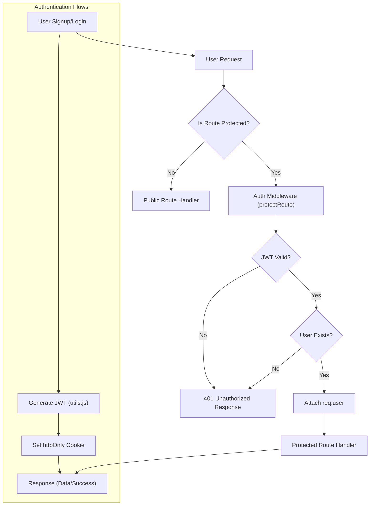

 # Authentication and Middleware

Effective authentication and robust middleware are fundamental to securing and managing user access in any web application. This section details the authentication mechanisms, including local email/password authentication and Google OAuth via Passport.js, along with custom middleware designed to protect routes and ensure security within the application's backend.

## Authentication Mechanisms

The application employs a dual-pronged approach to user authentication: traditional email and password login, and a seamless integration with Google OAuth for third-party sign-in. JSON Web Tokens (JWTs) are utilized for maintaining session state, issued as `httpOnly` cookies for enhanced security.

### Local Email and Password Authentication

User registration and login are handled through standard email and password flows. Passwords are securely hashed using `bcrypt` before storage, and JWTs are issued upon successful authentication.

#### User Registration (`signup`)

The `signup` controller manages the registration process. It validates user input (username, email, password length), checks for existing users, hashes the password, creates a new user record, and then generates a JWT for the new session.

```javascript
// backend/src/controllers/auth.controller.js
// Lines 13-48
export const signup = async (req, res) => {
    const {username, email, password} = req.body;
    try {
        if(!username || !email || !password) {
            return res.status(400).json({message: "Please fill in all fields."});
        }
        // ... (input validation) ...

        const user = await User.findOne({email});
        if (user) return res.status(400).json({message: "Email already exists."});
        
        const existingUserByUsername = await User.findOne({ username });
        if (existingUserByUsername) {
            return res.status(400).json({ message: "Username already exists. Please choose another." });
        }

        const salt = await bcrypt.genSalt(10);
        const hashedPassword = await bcrypt.hash(password, salt); // Password hashing

        const newUser = new User({
            username,
            email,
            password: hashedPassword,
            authProvider: 'email'
        });
        if(newUser){
            generateToken(newUser._id, res); // Token generation
            await newUser.save();

            res.status(201).json({
                _id: newUser._id,
                username: newUser.username,
                email: newUser.email,   
                profilePic: newUser.profilePic,
                authProvider: newUser.authProvider
            });
        } else {
            res.status(400).json({message: "Invalid user data."});
        }
    } catch (error) {
        console.log("Error in signup controller", error.message)
        res.status(500).json({message: "Something went wrong."});
    }
};
```
[View on GitHub](https://github.com/shinymack/Chat-App-MERN/blob/main/backend/src/controllers/auth.controller.js#L13-L48)

#### User Login (`login`)

The `login` controller verifies credentials by finding the user by email and comparing the provided password with the stored hashed password using `bcrypt.compare()`. Upon successful verification, a new JWT is issued.

```javascript
// backend/src/controllers/auth.controller.js
// Lines 53-81
export const login = async (req, res) => {
    const {email, password} = req.body;
    try {
        const user = await User.findOne({email});

        if(!user) {
            return res.status(400).json({message: "Invalid credentials."});
        }

        if(user.authProvider === 'google' && !user.password){
            return res.status(400).json({ message: "Please sign in with Google." });
        }

        const isPasswordCorrect = await bcrypt.compare(password, user.password); // Password comparison
        if(!isPasswordCorrect) {
            return res.status(400).json({message: "Invalid credentials."});
        }

        generateToken(user._id, res); // Token generation
        res.status(200).json({
            _id: user._id,
            username: user.username,
            email: user.email,
            profilePic: user.profilePic,
            authProvider: user.authProvider,
        });
    } catch (error) {
        console.log("Error in login controller", error.message);
        res.status(500).json({message: "Something went wrong."});
    }
};
```
[View on GitHub](https://github.com/shinymack/Chat-App-MERN/blob/main/backend/src/controllers/auth.controller.js#L53-L81)

#### User Logout (`logout`)

Logging out simply clears the `jwt` cookie by setting its `maxAge` to 0, effectively ending the session.

```javascript
// backend/src/controllers/auth.controller.js
// Lines 84-91
export const logout = (req, res) => {
    try {
        res.cookie("jwt", "", {maxAge: 0}); // Clear JWT cookie
        res.status(200).json({message: "Logged out successfully."})
    } catch(error) {
        console.log("Error in logout controller", error.message);
        res.status(500).json({message:"Internal Server Error"}); 
    }
};
```
[View on GitHub](https://github.com/shinymack/Chat-App-MERN/blob/main/backend/src/controllers/auth.controller.js#L84-L91)

### Google OAuth with Passport.js

The application integrates with Google for third-party authentication using the `passport-google-oauth20` strategy. This allows users to sign in using their Google accounts without needing to create a new password.

#### Passport Configuration

The `passport.config.js` file sets up the Google strategy. It defines `clientID`, `clientSecret`, and `callbackURL`, and specifies the requested `scope` (profile and email). The strategy callback handles finding or creating a user based on their Google profile. If a user with the Google ID exists, they are logged in. Otherwise, a new user account is created. It also handles potential conflicts where an email from Google might already exist with a different authentication provider.

```javascript
// backend/src/lib/passport.config.js
// Lines 12-58
export const configurePassport = () => {
    passport.use(new GoogleStrategy({
        clientID: process.env.GOOGLE_CLIENT_ID,
        clientSecret: process.env.GOOGLE_CLIENT_SECRET,
        callbackURL: process.env.GOOGLE_CALLBACK_URL,
        scope: ['profile', 'email'] 
    },
    async (accessToken, refreshToken, profile, done) => {
        try {
            let user = await User.findOne({ googleId: profile.id });

            if (user) {
                return done(null, user);
            } else {
                let username = profile.displayName.replace(/\s+/g, '').toLowerCase() || `user${Date.now()}`;
                // ... (username uniqueness handling) ...

                const newUser = new User({
                    googleId: profile.id,
                    email: profile.emails && profile.emails[0] ? profile.emails[0].value : null,
                    username: username,
                    authProvider: 'google',
                });

                if (!newUser.email) {
                    return done(new Error("Email not provided by Google. Cannot create account."), null);
                }

                const existingUserByEmail = await User.findOne({ email: newUser.email });
                if (existingUserByEmail && existingUserByEmail.authProvider !== 'google') {
                    return done(null, false, { message: `An account with email ${newUser.email} already exists. Please sign in using your original method.` });
                }

                await newUser.save();
                return done(null, newUser);
            }
        } catch (error) {
            return done(error, null);
        }
    }));
    // ... (serializeUser, deserializeUser) ...
};
```
[View on GitHub](https://github.com/shinymack/Chat-App-MERN/blob/main/backend/src/lib/passport.config.js#L12-L58)

Passport also handles `serializeUser` and `deserializeUser` to store minimal user information (the user ID) in the session and retrieve the full user object on subsequent requests, attaching it to `req.user`.

#### Google OAuth Callback (`googleAuthCallback`)

After Google authenticates the user, it redirects to the `callbackURL`. The `googleAuthCallback` controller then issues a JWT to the user and redirects them to the frontend application, completing the OAuth flow.

```javascript
// backend/src/controllers/auth.controller.js
// Lines 116-132
export const googleAuthCallback = async (req, res) => {
 const frontendUrl = process.env.FRONTEND_URL || 'http://localhost:5173';

    try {
        if (!req.user) {
            return res.redirect(`${frontendUrl}/login?error=google_auth_failed`);
        }

        generateToken(req.user._id, res); // Generate JWT for Google-authenticated user

        res.redirect(frontendUrl); // Redirect to frontend

    } catch (error) {
        console.error("Error in googleAuthCallback: ", error.message);
        res.redirect(`${frontendUrl}/login?error=google_auth_processing_error`);
    }
};
```
[View on GitHub](https://github.com/shinymack/Chat-App-MERN/blob/main/backend/src/controllers/auth.controller.js#L116-L132)

#### Google OAuth Flow

This sequence diagram illustrates the steps involved in a user authenticating via Google OAuth:


```mermaid
sequenceDiagram
    participant C as "Client Browser"
    participant S as "Server (Passport)"
    participant G as "Google Auth Server"
    participant D as "Database"

    C->>+S: "1. Request Google Login"
    S ->> G: "2. Redirect to Google for Authorization"
    G ->> C: "3. Google Login Page Display"
    C ->> G: "4. User Authenticates with Google"
    G->>+S: "5. OAuth Callback (Authorization Code)"
    S ->> G: "6. Exchange Code for Access Token"
    G ->>- S: "7. Returns Access Token & Profile"
    S->>+D: "8. Find/Create User by Google ID"
    D ->>- S: "9. User Data"
    S ->> C: "10. Set JWT Cookie & Redirect to Frontend"
```


### Token Management (`generateToken`)

The `generateToken` utility function is responsible for creating and signing a JWT. It takes the `userId` and the `response` object, signs the token with a secret, sets an expiration, and then attaches it as an `httpOnly`, `secure`, and `sameSite: "strict"` cookie to the response. These cookie settings are crucial for security, preventing client-side JavaScript access to the token and mitigating CSRF attacks.

```javascript
// backend/src/lib/utils.js
// Lines 4-13
import jwt from 'jsonwebtoken';

export const generateToken = (userId, res) => {
    const token = jwt.sign({userId}, process.env.JWT_SECRET, 
        {expiresIn: "7d"});

    res.cookie("jwt", token, {
        maxAge: 7 * 24 * 60 * 60 * 1000, 
        httpOnly: true, // Prevents client-side JS access
        sameSite: "strict", // Protects against CSRF
        secure: process.env.NODE_ENV !== "development", // Use HTTPS in production
    });
    return token;
};
```
[View on GitHub](https://github.com/shinymack/Chat-App-MERN/blob/main/backend/src/lib/utils.js#L4-L13)

## Middleware for Security

Middleware functions are critical for intercepting requests, performing security checks, and processing data before it reaches the final route handler.

### `protectRoute` Middleware

The `protectRoute` middleware is a custom function designed to secure routes that require user authentication. It checks for the presence of a JWT in the request cookies, verifies its validity using the `JWT_SECRET`, and if valid, retrieves the corresponding user from the database. The authenticated user object (excluding the password) is then attached to the `req.user` property, making user information readily available to subsequent middleware and route handlers.

```javascript
// backend/src/middleware/auth.middleware.js
// Lines 4-29
import jwt from "jsonwebtoken"
import User from "../models/user.model.js"

export const protectRoute = async (req, res, next) => {
    try {
        const token = req.cookies.jwt; // Get token from cookie
        if(!token){
            return res.status(401).json({message: "Unauthorized - No Token Provided"});
        }

        const decoded = jwt.verify(token, process.env.JWT_SECRET) // Verify token

        if(!decoded) {
            return res.status(401).json({message: "Unauthorized - Invalid Token"});
        }
        const user = await User.findById(decoded.userId).select("-password"); // Find user

        if(!user) {
            return res.status(404).json({message: "User not found"});
        }
        req.user = user; // Attach user to request

        next(); // Proceed to next middleware/route handler
    } catch (error) {
        console.log("Error in protectRoute middleware", error.message);
        res.status(500).json({message: "Internal Server Error"});

    }

};
```
[View on GitHub](https://github.com/shinymack/Chat-App-MERN/blob/main/backend/src/middleware/auth.middleware.js#L4-L29)

### User Management and Validation Controllers

Beyond core authentication, several controllers handle specific user-related functionalities:

*   **`checkAuth`**: Used to verify if a user is currently authenticated by retrieving their details from `req.user` (populated by `protectRoute`).
*   **`checkUsernameAvailability`**: Allows the frontend to check if a desired username is available before a user commits to changing it. It performs validation on length and checks against existing usernames.

    ```javascript
    // backend/src/controllers/auth.controller.js
    // Lines 135-168
    export const checkUsernameAvailability = async (req, res) => {
        try {
            const { username } = req.params;
            const currentUserId = req.user._id; 

            if (!username || username.trim().length < 3) {
                return res.status(400).json({ available: false, message: "Username must be at least 3 characters." });
            }
            if (username.trim().length > 20) {
                return res.status(400).json({ available: false, message: "Username cannot be more than 20 characters." });
            }
            
            // Check if the username is the current user's existing username
            if (req.user.username === username) {
                return res.status(200).json({ available: true, message: "This is your current username." });
            }

            const existingUser = await User.findOne({ username: username });

            if (existingUser) {
                return res.status(200).json({ available: false, message: "Username is already taken." });
            }

            res.status(200).json({ available: true, message: "Username is available." });

        } catch (error) {
            console.error("Error in checkUsernameAvailability:", error.message);
            res.status(500).json({ available: false, message: "Error checking username availability." });
        }
    };
    ```
    [View on GitHub](https://github.com/shinymack/Chat-App-MERN/blob/main/backend/src/controllers/auth.controller.js#L135-L168)

*   **`updateProfile`**: Enables authenticated users to update their profile picture (via Cloudinary integration) and username. It includes validation for the new username and checks for uniqueness. A new JWT is issued upon successful updates to ensure the cookie reflects any changed user data.

    ```javascript
    // backend/src/controllers/auth.controller.js
    // Lines 182-234
    export const updateProfile = async (req, res) => {
        try {
            const { profilePic, username } = req.body;
            const userId = req.user._id;
            let userToUpdate = await User.findById(userId);

            if (!userToUpdate) {
                return res.status(404).json({ message: "User not found." });
            }

            const fieldsToUpdate = {};
            let newUsername = username ? username.trim() : null;

            // Handle username update logic (validation, uniqueness check)
            if (newUsername && newUsername !== userToUpdate.username) {
                // ... (username validation logic) ...
                const existingUserWithNewUsername = await User.findOne({ username: newUsername, _id: { $ne: userId } });
                if (existingUserWithNewUsername) {
                    return res.status(400).json({ message: "This username is already taken by someone else." });
                }
                fieldsToUpdate.username = newUsername;
            }

            // Handle profile picture update logic (Cloudinary upload)
            if (profilePic) {
                const uploadResponse = await cloudinary.uploader.upload(profilePic);
                fieldsToUpdate.profilePic = uploadResponse.secure_url;
            }

            if (Object.keys(fieldsToUpdate).length === 0) {
                return res.status(400).json({ message: "No changes provided to update." });
            }

            const updatedUser = await User.findByIdAndUpdate(userId, { $set: fieldsToUpdate }, { new: true });

            if (!updatedUser) {
                return res.status(404).json({ message: "Failed to update user."});
            }

            generateToken(updatedUser._id, res); // Refresh JWT
            res.status(200).json(updatedUser);

        } catch (error) {
            console.error("Error in updateProfile controller", error.message);
            if (error.code === 11000 && error.keyValue && error.keyValue.username) {
                return res.status(400).json({ message: "This username is already taken." });
            }
            res.status(500).json({ message: "Internal Server Error while updating profile." });
        }
    };
    ```
    [View on GitHub](https://github.com/shinymack/Chat-App-MERN/blob/main/backend/src/controllers/auth.controller.js#L182-L234)

## Key Integration Points

The authentication and middleware systems are designed to work cohesively to provide secure and efficient user management.

*   **Unified User Model**: Both local and Google OAuth users are stored in the same `User` model, differentiated by the `authProvider` field and the presence of `googleId`. This simplifies user management and allows for consistent data handling.
*   **JWT as Session Token**: JWTs are central to maintaining session state across both authentication methods. The `generateToken` utility ensures consistent token creation and secure cookie handling.
*   **`protectRoute` Ubiquity**: The `protectRoute` middleware is applied to all API endpoints that require an authenticated user. This enforces a consistent security policy across the application, preventing unauthorized access to protected resources.
*   **Environmental Configuration**: Sensitive information like `JWT_SECRET`, `GOOGLE_CLIENT_ID`, and `GOOGLE_CLIENT_SECRET` are managed via environment variables, ensuring that credentials are not hardcoded and can be easily changed for different deployment environments.
*   **Robust Error Handling**: Each controller and middleware includes `try-catch` blocks for robust error handling, returning appropriate HTTP status codes and messages to the client, and logging errors for debugging.

Overall, this architecture provides a flexible and secure foundation for managing user authentication and authorization within the application, combining standard practices with third-party integration for a comprehensive solution.


