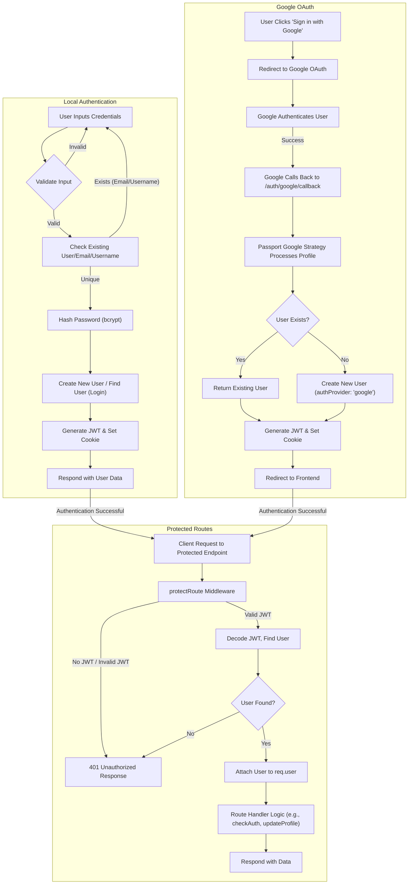

 # Authentication and Middleware

This section details the authentication and authorization mechanisms implemented within the application. It covers user registration, login, logout, Google OAuth integration, token generation, and the middleware responsible for protecting routes. The system relies on JWTs for session management and `passport.js` for OAuth strategies.

## Key Components

The authentication system is built around several interconnected components:

*   **`auth.controller.js`**: Handles core user authentication flows like signup, login, logout, and profile updates.
*   **`passport.config.js`**: Configures `passport.js` for Google OAuth 2.0 strategy, including user serialization and deserialization.
*   **`auth.middleware.js`**: Provides middleware (`protectRoute`) to secure endpoints by verifying JWTs.
*   **`utils.js`**: Contains utility functions, primarily `generateToken` for creating and setting JWTs.

## User Authentication Flows

### Local Authentication (Email/Password)

Users can register and log in using their email and a password. Passwords are securely hashed using `bcryptjs`.

#### User Registration (`signup`)

The `signup` controller handles new user registrations. It performs input validation, checks for existing users by email or username, hashes the password, creates a new user, generates a JWT, and sets it as an `httpOnly` cookie.

```javascript
// backend/src/controllers/auth.controller.js
export const signup = async (req, res) => {
    const {username, email, password} = req.body;
    try {
        if(!username || !email || !password) {
            return res.status(400).json({message: "Please fill in all fields."});
        }
        // ... (validation for username and password length)

        const user = await User.findOne({email});
        if (user) return res.status(400).json({message: "Email already exists."});
        
        const existingUserByUsername = await User.findOne({ username });
        if (existingUserByUsername) {
            return res.status(400).json({ message: "Username already exists. Please choose another." });
        }

        const salt = await bcrypt.genSalt(10);
        const hashedPassword = await bcrypt.hash(password, salt);

        const newUser = new User({
            username,
            email,
            password: hashedPassword,
            authProvider: 'email'
        });
        if(newUser){
            generateToken(newUser._id, res); // Generate and set JWT
            await newUser.save();

            res.status(201).json({
                _id: newUser._id,
                username: newUser.username,
                email: newUser.email,   
                profilePic: newUser.profilePic,
                authProvider: newUser.authProvider
            });
        } else {
            res.status(400).json({message: "Invalid user data."});
        }
    } catch (error) {
        console.log("Error in signup controller", error.message)
        res.status(500).json({message: "Something went wrong."});
    }
};
```
[View on GitHub](https://github.com/shinymack/Chat-App-MERN/blob/main/backend/src/controllers/auth.controller.js#L7-L58)

#### User Login (`login`)

The `login` controller verifies user credentials against stored data. It checks for email existence, compares the provided password with the hashed password, and then issues a new JWT upon successful authentication. It also handles cases where a user attempts to log in with email/password for an account originally created via Google OAuth.

```javascript
// backend/src/controllers/auth.controller.js
export const login = async (req, res) => {
    const {email, password} = req.body;
    try {
        const user = await User.findOne({email});

        if(!user) {
            return res.status(400).json({message: "Invalid credentials."});
        }

        if(user.authProvider === 'google' && !user.password){
            return res.status(400).json({ message: "Please sign in with Google." });
        }

        const isPasswordCorrect = await bcrypt.compare(password, user.password);
        if(!isPasswordCorrect) {
            return res.status(400).json({message: "Invalid credentials."});
        }

        generateToken(user._id, res); // Generate and set JWT
        res.status(200).json({
            _id: user._id,
            username: user.username,
            email: user.email,
            profilePic: user.profilePic,
            authProvider: user.authProvider,
        });
    } catch (error) {
        console.log("Error in login controller", error.message);
        res.status(500).json({message: "Something went wrong."});
    }
};
```
[View on GitHub](https://github.com/shinymack/Chat-App-MERN/blob/main/backend/src/controllers/auth.controller.js#L60-L93)

#### User Logout (`logout`)

Logout is achieved by clearing the `jwt` cookie.

```javascript
// backend/src/controllers/auth.controller.js
export const logout = (req, res) => {
    try {
        res.cookie("jwt", "", {maxAge: 0});
        res.status(200).json({message: "Logged out successfully."})
    } catch(error) {
        console.log("Error in logout controller", error.message);
        res.status(500).json({message:"Internal Server Error"}); 
    }
};
```
[View on GitHub](https://github.com/shinymack/Chat-App-MERN/blob/main/backend/src/controllers/auth.controller.js#L96-L104)

### Google OAuth 2.0 Integration

The application integrates with Google for authentication using `passport.js` and `passport-google-oauth20`.

#### Passport Configuration

The `configurePassport` function initializes the Google Strategy. It defines how to find or create a user based on their Google profile and how to serialize/deserialize user information for session management.

```javascript
// backend/src/lib/passport.config.js
import passport from 'passport';
import { Strategy as GoogleStrategy } from 'passport-google-oauth20';
import User from '../models/user.model.js'; 
import dotenv from 'dotenv';

dotenv.config(); 

export const configurePassport = () => {
    passport.use(new GoogleStrategy({
        clientID: process.env.GOOGLE_CLIENT_ID,
        clientSecret: process.env.GOOGLE_CLIENT_SECRET,
        callbackURL: process.env.GOOGLE_CALLBACK_URL,
        scope: ['profile', 'email'] 
    },
    async (accessToken, refreshToken, profile, done) => {
        try {
            let user = await User.findOne({ googleId: profile.id });

            if (user) {
                return done(null, user); // User found, log in
            } else {
                // Handle new Google user creation or existing email conflict
                // ... (username generation logic)
                const newUser = new User({
                    googleId: profile.id,
                    email: profile.emails && profile.emails[0] ? profile.emails[0].value : null,
                    username: username,
                    authProvider: 'google',
                });
                // ... (email validation and existing email check)
                await newUser.save();
                return done(null, newUser);
            }
        } catch (error) {
            return done(error, null);
        }
    }));

    passport.serializeUser((user, done) => {
        done(null, user.id); 
    });

    passport.deserializeUser(async (id, done) => {
        try {
            const user = await User.findById(id);
            done(null, user); 
        } catch (error) {
            done(error, null);
        }
    });
};
```
[View on GitHub](https://github.com/shinymack/Chat-App-MERN/blob/main/backend/src/lib/passport.config.js#L7-L70)

#### Google Authentication Callback

After Google authenticates the user, the `googleAuthCallback` controller is invoked. It checks for a valid user in `req.user` (set by Passport), generates a JWT, and redirects the user to the frontend.

```javascript
// backend/src/controllers/auth.controller.js
export const googleAuthCallback = async (req, res) => {
 const frontendUrl = process.env.FRONTEND_URL || 'http://localhost:5173';

    try {
        if (!req.user) {
            return res.redirect(`${frontendUrl}/login?error=google_auth_failed`);
        }

        generateToken(req.user._id, res); // Generate and set JWT for Google-authenticated user

        res.redirect(frontendUrl);

    } catch (error) {
        console.error("Error in googleAuthCallback: ", error.message);
        res.redirect(`${frontendUrl}/login?error=google_auth_processing_error`);
    }
};
```
[View on GitHub](https://github.com/shinymack/Chat-App-MERN/blob/main/backend/src/controllers/auth.controller.js#L137-L155)

### JWT Generation

The `generateToken` utility function creates a JSON Web Token using `jsonwebtoken` and sets it as an `httpOnly` cookie. This token is crucial for maintaining user sessions and authenticating subsequent requests.

```javascript
// backend/src/lib/utils.js
import jwt from 'jsonwebtoken';

export const generateToken = (userId, res) => {
    const token = jwt.sign({userId}, process.env.JWT_SECRET, 
        {expiresIn: "7d"});

    res.cookie("jwt", token, {
        maxAge: 7 * 24 * 60 * 60 * 1000, 
        httpOnly: true, // Prevent client-side JS from accessing
        sameSite: "strict", // CSRF protection
        secure: process.env.NODE_ENV !== "development", // Use secure cookies in production
    });
    return token;
};
```
[View on GitHub](https://github.com/shinymack/Chat-App-MERN/blob/main/backend/src/lib/utils.js#L4-L16)

## Authorization Middleware

The `protectRoute` middleware is responsible for securing API endpoints by verifying the presence and validity of a JWT.

### `protectRoute` Middleware

This middleware extracts the JWT from the request cookies, verifies it using the `JWT_SECRET`, and then fetches the corresponding user from the database. If the token is valid, the user object is attached to `req.user`, allowing subsequent route handlers to access authenticated user data.

```javascript
// backend/src/middleware/auth.middleware.js
import jwt from "jsonwebtoken"
import User from "../models/user.model.js"

export const protectRoute = async (req, res, next) => {
    try {
        const token = req.cookies.jwt;
        if(!token){
            return res.status(401).json({message: "Unauthorized - No Token Provided"});
        }

        const decoded = jwt.verify(token, process.env.JWT_SECRET)

        if(!decoded) {
            return res.status(401).json({message: "Unauthorized - Invalid Token"});
        }
        const user = await User.findById(decoded.userId).select("-password");

        if(!user) {
            return res.status(404).json({message: "User not found"});
        }
        req.user = user; // Attach user to request object

        next(); // Proceed to the next middleware/route handler
    } catch (error) {
        console.log("Error in protectRoute middleware", error.message);
        res.status(500).json({message: "Internal Server Error"});

    }

};
```
[View on GitHub](https://github.com/shinymack/Chat-App-MERN/blob/main/backend/src/middleware/auth.middleware.js#L5-L31)

This middleware is used on routes like `checkAuth` and `updateProfile` to ensure only authenticated users can access them.

```javascript
// backend/src/controllers/auth.controller.js
export const checkAuth = (req, res) => {
    try {
        // req.user is populated by protectRoute middleware
        res.status(200).json({
            _id: req.user._id,
            username: req.user.username,
            email: req.user.email,
            profilePic: req.user.profilePic,
            authProvider: req.user.authProvider,
            createdAt: req.user.createdAt
        });
    } catch (error) {
        console.log("Error in checkAuth controller", error.message);
        res.status(500).json({message: "Internal Server Error"});
    }
};
```
[View on GitHub](https://github.com/shinymack/Chat-App-MERN/blob/main/backend/src/controllers/auth.controller.js#L107-L122)

## Authentication Flow Diagram

The following diagram illustrates the high-level authentication flow for both local email/password and Google OAuth.





## Profile Management

Authenticated users can update their profile information, such as their username and profile picture. The `updateProfile` controller handles these changes, including integration with Cloudinary for image uploads and ensuring username uniqueness.

```javascript
// backend/src/controllers/auth.controller.js
export const updateProfile = async (req, res) => {
    try {
        const { profilePic, username } = req.body;
        const userId = req.user._id;
        let userToUpdate = await User.findById(userId);

        if (!userToUpdate) {
            return res.status(404).json({ message: "User not found." });
        }

        const fieldsToUpdate = {};
        let newUsername = username ? username.trim() : null;

        if (newUsername && newUsername !== userToUpdate.username) {
            // ... (username validation and uniqueness check)
            const existingUserWithNewUsername = await User.findOne({ username: newUsername, _id: { $ne: userId } });
            if (existingUserWithNewUsername) {
                return res.status(400).json({ message: "This username is already taken by someone else." });
            }
            fieldsToUpdate.username = newUsername;
        }

        if (profilePic) {
            const uploadResponse = await cloudinary.uploader.upload(profilePic);
            fieldsToUpdate.profilePic = uploadResponse.secure_url;
        }

        if (Object.keys(fieldsToUpdate).length === 0) {
            return res.status(400).json({ message: "No changes provided to update." });
        }

        const updatedUser = await User.findByIdAndUpdate(userId, { $set: fieldsToUpdate }, { new: true });
        
        generateToken(updatedUser._id, res); // Refresh JWT if user data changed
        res.status(200).json(updatedUser);

    } catch (error) {
        console.error("Error in updateProfile controller", error.message);
        if (error.code === 11000 && error.keyValue && error.keyValue.username) {
            return res.status(400).json({ message: "This username is already taken." });
        }
        res.status(500).json({ message: "Internal Server Error while updating profile." });
    }
};
```
[View on GitHub](https://github.com/shinymack/Chat-App-MERN/blob/main/backend/src/controllers/auth.controller.js#L201-L265)

## Key Integration Points

*   **JWT for Session Management**: Instead of traditional server-side sessions, a JWT is generated upon successful login (local or Google) and stored as an `httpOnly` cookie. This makes the backend stateless regarding user sessions and easily scalable.
*   **`protectRoute` Placement**: The `protectRoute` middleware is strategically placed on routes that require user authentication, ensuring that only authenticated requests can proceed to the corresponding controller logic.
*   **Passport.js for OAuth**: `passport.js` simplifies the integration of third-party authentication providers like Google, abstracting away the complexities of OAuth 2.0 flows.
*   **User Data Attachment**: Upon successful JWT verification or Passport deserialization, the authenticated user object is consistently attached to `req.user`. This provides a unified way for subsequent route handlers to access the current user's details without additional database lookups.
*   **Security Best Practices**:
    *   `httpOnly` cookies prevent client-side JavaScript access to the JWT, mitigating XSS risks.
    *   `sameSite: "strict"` helps protect against CSRF attacks.
    *   `secure` cookie attribute ensures cookies are only sent over HTTPS in production.
    *   Password hashing with `bcryptjs` secures stored user credentials.
    *   Input validation is performed on signup and profile updates to maintain data integrity and security.