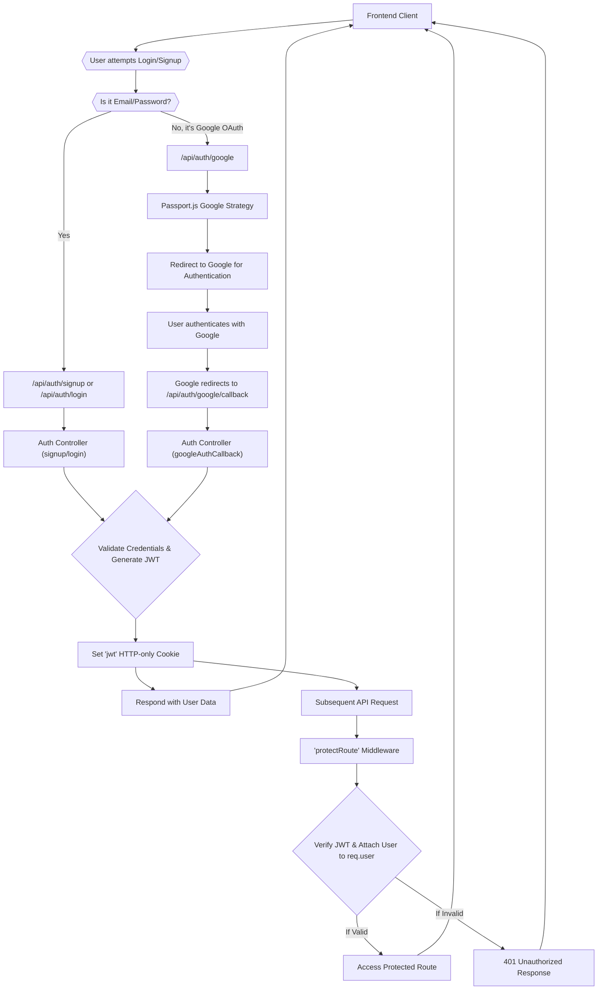

 # Backend Authentication and Authorization

This document provides a comprehensive overview of the backend authentication and authorization mechanisms implemented in the application. It covers both traditional email/password authentication and Google OAuth integration, detailing how user credentials are processed, sessions are managed using JWTs, and routes are protected. Key components include Passport.js for OAuth, custom middleware for JWT verification, and dedicated controllers for authentication flows.

The application uses JSON Web Tokens (JWT) for session management and `bcryptjs` for secure password hashing. Google OAuth is integrated via Passport.js, offering a seamless third-party login experience.

## Core Concepts

### JWT-Based Authentication
JSON Web Tokens (JWTs) are used to securely transmit information between parties. Upon successful login or signup, a JWT is issued to the client as an HTTP-only cookie. This token is then sent with subsequent requests to authenticate the user.

The `generateToken` utility function is responsible for creating and setting this JWT:

```javascript
// backend/src/lib/utils.js (conceptual, as it's imported)
import jwt from "jsonwebtoken";

export const generateToken = (userId, res) => {
    const token = jwt.sign({ userId }, process.env.JWT_SECRET, {
        expiresIn: "15d",
    });

    res.cookie("jwt", token, {
        maxAge: 15 * 24 * 60 * 60 * 1000, // 15 days
        httpOnly: true, // prevent XSS attacks cross-site scripting attacks
        sameSite: "strict", // CSRF attacks cross-site request forgery attacks
        secure: process.env.NODE_ENV !== "development",
    });
};
```
This utility ensures the token is signed with a secret, expires after 15 days, and is stored as a secure, HTTP-only cookie, mitigating common web vulnerabilities like XSS and CSRF.

### Password Hashing with `bcryptjs`
All user passwords are securely hashed using `bcryptjs` before being stored in the database. This one-way hashing process makes it impossible to retrieve the original password, even if the database is compromised.

During user registration (`signup`), a salt is generated, and the password is hashed:
```javascript
// backend/src/controllers/auth.controller.js
import bcrypt from "bcryptjs";
// ...
export const signup = async (req, res) => {
    const {username, email, password} = req.body;
    try {
        // ... validation checks ...

        const salt = await bcrypt.genSalt(10);
        const hashedPassword = await bcrypt.hash(password, salt);

        const newUser = new User({
            username,
            email,
            password: hashedPassword,
            authProvider: 'email'
        });
        if(newUser){
            generateToken(newUser._id, res);
            await newUser.save();
            // ... response ...
        } // ... error handling ...
    } catch (error) {
        console.log("Error in signup controller", error.message)
        res.status(500).json({message: "Something went wrong."});
    }
};
```
[View signup on GitHub](https://github.com/shinymack/Chat-App-MERN/blob/main/backend/src/controllers/auth.controller.js#L5-L48)

For user login, the provided password is compared against the stored hash using `bcrypt.compare`:
```javascript
// backend/src/controllers/auth.controller.js
export const login = async (req, res) => {
    const {email, password} = req.body;
    try {
        const user = await User.findOne({email});

        if(!user) {
            return res.status(400).json({message: "Invalid credentials."});
        }
        // ... Google Auth check ...

        const isPasswordCorrect = await bcrypt.compare(password, user.password);
        if(!isPasswordCorrect) {
            return res.status(400).json({message: "Invalid credentials."});
        }
        // ... token generation & response ...
    } catch (error) {
        console.log("Error in login controller", error.message);
        res.status(500).json({message: "Something went wrong."});
    }
};
```
[View login on GitHub](https://github.com/shinymack/Chat-App-MERN/blob/main/backend/src/controllers/auth.controller.js#L50-L77)

## Authentication Controllers (`auth.controller.js`)

The `auth.controller.js` file handles all authentication-related API endpoints, including user registration, login, logout, and status checks.

### User Registration (`signup`)
This endpoint registers a new user. It performs validation checks for username, email, and password length, ensures uniqueness of email and username, hashes the password, creates a new user record, generates a JWT, and sends it as an HTTP-only cookie.

### User Login (`login`)
This endpoint authenticates existing users. It validates the provided email and password. If credentials are correct, it generates and sets a new JWT cookie. It also includes logic to prevent email-based login for users who originally signed up via Google.

### User Logout (`logout`)
To log out a user, this endpoint clears the JWT cookie by setting its `maxAge` to 0, effectively invalidating the session.
```javascript
// backend/src/controllers/auth.controller.js
export const logout = (req, res) => {
    try {
        res.cookie("jwt", "", {maxAge: 0});
        res.status(200).json({message: "Logged out successfully."})
    } catch(error) {
        console.log("Error in logout controller", error.message);
        res.status(500).json({message:"Internal Server Error"}); 
    }
};
```
[View logout on GitHub](https://github.com/shinymack/Chat-App-MERN/blob/main/backend/src/controllers/auth.controller.js#L79-L86)

### Check Authentication Status (`checkAuth`)
This endpoint allows the client to verify if a user is currently authenticated. It relies on the `protectRoute` middleware to populate `req.user`, then returns the authenticated user's details (excluding the password).
```javascript
// backend/src/controllers/auth.controller.js
export const checkAuth = (req, res) => {
    try {
        res.status(200).json({
            _id: req.user._id,
            username: req.user.username,
            email: req.user.email,
            profilePic: req.user.profilePic,
            authProvider: req.user.authProvider,
            createdAt: req.user.createdAt
        });
    } catch (error) {
        console.log("Error in checkAuth controller", error.message);
        res.status(500).json({message: "Internal Server Error"});
    }
};
```
[View checkAuth on GitHub](https://github.com/shinymack/Chat-App-MERN/blob/main/backend/src/controllers/auth.controller.js#L89-L103)

### Google OAuth Callback (`googleAuthCallback`)
This is the callback endpoint for Google OAuth. After Google authenticates the user, it redirects to this URL. Passport.js processes the Google profile, and if successful, a JWT is generated, and the user is redirected to the frontend.
```javascript
// backend/src/controllers/auth.controller.js
export const googleAuthCallback = async (req, res) => {
 const frontendUrl = process.env.FRONTEND_URL || 'http://localhost:5173';

    try {
        if (!req.user) {
            return res.redirect(`${frontendUrl}/login?error=google_auth_failed`);
        }

        generateToken(req.user._id, res);

        res.redirect(frontendUrl);

    } catch (error) {
        console.error("Error in googleAuthCallback: ", error.message);
        res.redirect(`${frontendUrl}/login?error=google_auth_processing_error`);
    }
};
```
[View googleAuthCallback on GitHub](https://github.com/shinymack/Chat-App-MERN/blob/main/backend/src/controllers/auth.controller.js#L106-L121)

### Username Availability Check (`checkUsernameAvailability`)
This endpoint allows clients to check if a username is already taken, assisting with user registration and profile updates. It also handles edge cases where the requested username is the user's current one.
[View checkUsernameAvailability on GitHub](https://github.com/shinymack/Chat-App-MERN/blob/main/backend/src/controllers/auth.controller.js#L124-L157)

### User Profile Update (`updateProfile`)
This endpoint enables authenticated users to update their profile information, such as `profilePic` and `username`. It includes robust validation for username uniqueness and length. If a profile picture is provided, it's uploaded to Cloudinary, and the URL is saved. A new JWT is issued to ensure the client's cookie reflects any changes that might be embedded in the token (or simply to refresh its validity).
[View updateProfile on GitHub](https://github.com/shinymack/Chat-App-MERN/blob/main/backend/src/controllers/auth.controller.js#L160-L224)

## Passport.js Configuration (`passport.config.js`)

Passport.js is an authentication middleware for Node.js, specifically used here to integrate Google OAuth.

The `configurePassport` function sets up the `GoogleStrategy` and defines how users are serialized to and deserialized from the session.

### Google Strategy
The `GoogleStrategy` is configured with `clientID`, `clientSecret`, and `callbackURL` from environment variables. The `scope` is set to `profile` and `email` to request basic user information from Google.

```javascript
// backend/src/lib/passport.config.js
import passport from 'passport';
import { Strategy as GoogleStrategy } from 'passport-google-oauth20';
import User from '../models/user.model.js'; 
import dotenv from 'dotenv';

dotenv.config(); 

export const configurePassport = () => {
    passport.use(new GoogleStrategy({
        clientID: process.env.GOOGLE_CLIENT_ID,
        clientSecret: process.env.GOOGLE_CLIENT_SECRET,
        callbackURL: process.env.GOOGLE_CALLBACK_URL,
        scope: ['profile', 'email'] 
    },
    async (accessToken, refreshToken, profile, done) => {
        try {
            let user = await User.findOne({ googleId: profile.id });

            if (user) {
                return done(null, user); // User found, log them in
            } else {
                // New user via Google OAuth
                let username = profile.displayName.replace(/\s+/g, '').toLowerCase() || `user${Date.now()}`;
                // ... username uniqueness logic ...

                const newUser = new User({
                    googleId: profile.id,
                    email: profile.emails && profile.emails[0] ? profile.emails[0].value : null,
                    username: username,
                    authProvider: 'google',
                });
                // ... email validation & conflict resolution ...

                await newUser.save();
                return done(null, newUser); // New user created
            }
        } catch (error) {
            return done(error, null);
        }
    }));
    // ... serializeUser and deserializeUser ...
};
```
[View Passport config on GitHub](https://github.com/shinymack/Chat-App-MERN/blob/main/backend/src/lib/passport.config.js#L9-L65)

When a user signs in with Google for the first time:
1. It checks if a user with that `googleId` already exists.
2. If not, it attempts to create a new user.
3. It generates a unique username based on the Google display name, handling potential duplicates.
4. It ensures an email is provided by Google and checks for conflicts with existing email-based accounts.

### Serialization and Deserialization
Passport requires `serializeUser` and `deserializeUser` functions to manage user sessions.
- `serializeUser`: Determines which user data should be stored in the session. Here, only the MongoDB `_id` of the user is stored.
- `deserializeUser`: Retrieves the full user object from the database using the stored `_id` from the session. The fetched user object is then attached to `req.user`, making it accessible throughout the request lifecycle.

```javascript
// backend/src/lib/passport.config.js
// ...
    // Serialize user to store in session (just the user ID)
    passport.serializeUser((user, done) => {
        done(null, user.id); // user.id is the _id from MongoDB
    });

    // Deserialize user from session (fetch user from DB using the ID)
    passport.deserializeUser(async (id, done) => {
        try {
            const user = await User.findById(id);
            done(null, user); // This user object is attached to req.user
        } catch (error) {
            done(error, null);
        }
    });
};
```
[View serialize/deserialize on GitHub](https://github.com/shinymack/Chat-App-MERN/blob/main/backend/src/lib/passport.config.js#L68-L79)

## Authentication Middleware (`auth.middleware.js`)

The `protectRoute` middleware is crucial for authorization, ensuring that only authenticated users can access specific routes.

### `protectRoute` Middleware
This middleware intercepts incoming requests to protected routes.
1. It extracts the JWT from the `jwt` HTTP-only cookie.
2. It verifies the token's validity using `jwt.verify` and the `JWT_SECRET`.
3. If valid, it decodes the `userId` from the token.
4. It then fetches the corresponding user from the database (excluding the password field for security).
5. If the user is found, it attaches the user object to `req.user` and calls `next()` to proceed to the next middleware or route handler.
6. If the token is missing, invalid, or the user is not found, it sends an appropriate unauthorized error response.

```javascript
// backend/src/middleware/auth.middleware.js
import jwt from "jsonwebtoken"
import User from "../models/user.model.js"

export const protectRoute = async (req, res, next) => {
    try {
        const token = req.cookies.jwt;
        if(!token){
            return res.status(401).json({message: "Unauthorized - No Token Provided"});
        }

        const decoded = jwt.verify(token, process.env.JWT_SECRET)

        if(!decoded) {
            return res.status(401).json({message: "Unauthorized - Invalid Token"});
        }
        const user = await User.findById(decoded.userId).select("-password");

        if(!user) {
            return res.status(404).json({message: "User not found"});
        }
        req.user = user;

        next(); // Proceed to the next handler
    } catch (error) {
        console.log("Error in protectRoute middleware", error.message);
        res.status(500).json({message: "Internal Server Error"});
    }
};
```
[View protectRoute on GitHub](https://github.com/shinymack/Chat-App-MERN/blob/main/backend/src/middleware/auth.middleware.js#L4-L29)

## Key Integration Points

### Authentication Flow Diagram
The following diagram illustrates the typical authentication flow for both email/password and Google OAuth logins.





### Authorization Check on Protected Routes
Any route that requires an authenticated user will utilize the `protectRoute` middleware before its main handler. For instance:

```javascript
// Example in backend/src/routes/user.routes.js (conceptual)
import express from 'express';
import { protectRoute } from '../middleware/auth.middleware.js';
import { checkAuth, updateProfile } from '../controllers/auth.controller.js';

const router = express.Router();

router.get('/check', protectRoute, checkAuth);
router.put('/updateProfile', protectRoute, updateProfile);

export default router;
```
This ensures that `checkAuth` and `updateProfile` are only executed if `protectRoute` successfully verifies an active user session.

This robust authentication and authorization system provides secure access control for the backend services, supporting both traditional and third-party login methods.