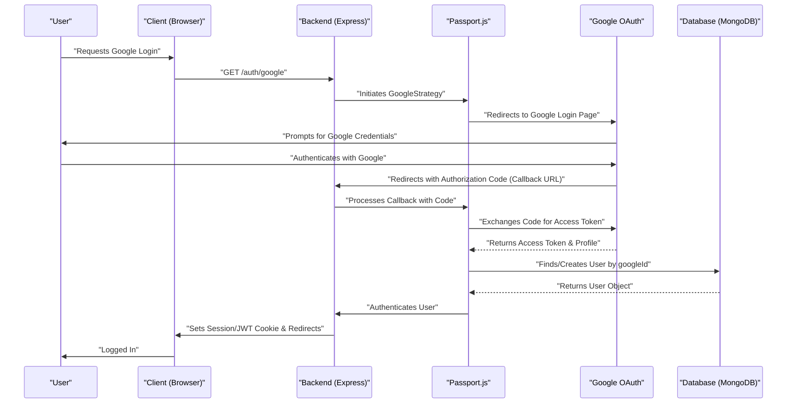
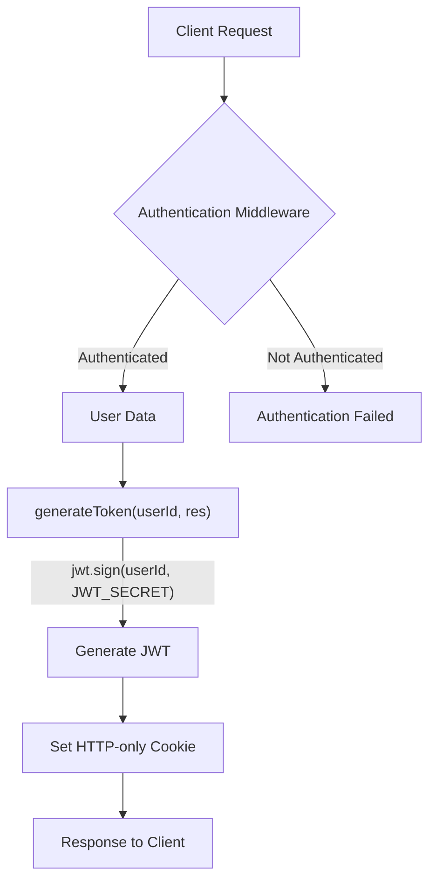

 # Backend Utilities and Integrations

This section provides comprehensive documentation for the shared utility functions, Passport.js configuration for authentication, and third-party service integrations within the backend of the application. These components are crucial for user management, secure data handling, and external media storage.

## Core Backend Dependencies

The `package-lock.json` file outlines all the direct and transitive dependencies required for the backend. Key dependencies for utilities and integrations include:

-   `bcryptjs`: For secure password hashing.
-   `cloudinary`: For cloud-based image and video management.
-   `dotenv`: To load environment variables from a `.env` file.
-   `jsonwebtoken`: For creating and verifying JSON Web Tokens for authentication.
-   `mongoose`: ODM for MongoDB, used for database interactions.
-   `passport`, `passport-google-oauth20`: For pluggable authentication, specifically Google OAuth 2.0.

These dependencies ensure robust functionality across authentication, data persistence, and external service communication.
For a complete list of dependencies and their versions, refer to the [package-lock.json file](https://github.com/shinymack/Chat-App-MERN/blob/main/backend/package-lock.json).

## Cloudinary Integration

The `cloudinary.js` file handles the configuration and initialization of the Cloudinary service, a cloud-based image and video management solution. This integration allows the application to upload, manage, and deliver media assets efficiently.

### Configuration

The configuration uses environment variables for `CLOUDINARY_CLOUD_NAME`, `CLOUDINARY_API_KEY`, and `CLOUDINARY_API_SECRET` to securely connect to the Cloudinary service. These variables are loaded using `dotenv`.

```javascript
// backend/src/lib/cloudinary.js
import {v2 as cloudinary} from "cloudinary"
import { config } from 'dotenv'

config(); // Load environment variables

cloudinary.config(
    {cloud_name: process.env.CLOUDINARY_CLOUD_NAME,
    api_key: process.env.CLOUDINARY_API_KEY,
    api_secret: process.env.CLOUDINARY_API_SECRET,}
);

export default cloudinary;
```
[View on GitHub](https://github.com/shinymack/Chat-App-MERN/blob/main/backend/src/lib/cloudinary.js#L1-L9)

This setup ensures that all media uploads and manipulations through the `cloudinary` object are authenticated and directed to the correct Cloudinary account.

## Passport.js Authentication Configuration

The `passport.config.js` file contains the core logic for setting up Passport.js, specifically for Google OAuth 2.0 authentication. This module enables users to sign in using their Google accounts, streamlining the registration and login process.

### Google Strategy Setup

The `GoogleStrategy` is configured with `clientID`, `clientSecret`, and `callbackURL` obtained from environment variables. It defines the process for handling user authentication via Google.

```javascript
// backend/src/lib/passport.config.js
import passport from 'passport';
import { Strategy as GoogleStrategy } from 'passport-google-oauth20';
import User from '../models/user.model.js'; 
import dotenv from 'dotenv';

dotenv.config(); 

export const configurePassport = () => {
    passport.use(new GoogleStrategy({
        clientID: process.env.GOOGLE_CLIENT_ID,
        clientSecret: process.env.GOOGLE_CLIENT_SECRET,
        callbackURL: process.env.GOOGLE_CALLBACK_URL,
        scope: ['profile', 'email'] 
    },
    async (accessToken, refreshToken, profile, done) => {
        try {
            let user = await User.findOne({ googleId: profile.id });

            if (user) {
                return done(null, user);
            } else {
                let username = profile.displayName.replace(/\s+/g, '').toLowerCase() || `user${Date.now()}`;

                const existingUserByUsername = await User.findOne({ username });
                if (existingUserByUsername) {
                    username = `${username}${Date.now().toString().slice(-4)}`;
                }
                if (username.length > 20) username = username.substring(0,20);

                const newUser = new User({
                    googleId: profile.id,
                    email: profile.emails && profile.emails[0] ? profile.emails[0].value : null,
                    username: username,
                    authProvider: 'google',
                });

                if (!newUser.email) {
                    return done(new Error("Email not provided by Google. Cannot create account."), null);
                }

                const existingUserByEmail = await User.findOne({ email: newUser.email });
                if (existingUserByEmail && existingUserByEmail.authProvider !== 'google') {
                    return done(null, false, { message: `An account with email ${newUser.email} already exists. Please sign in using your original method.` });
                }

                await newUser.save();
                return done(null, newUser);
            }
        } catch (error) {
            return done(error, null);
        }
    }));
    // ... serialization and deserialization ...
};
```
[View on GitHub](https://github.com/shinymack/Chat-App-MERN/blob/main/backend/src/lib/passport.config.js#L1-L54)

This strategy first attempts to find an existing user by their `googleId`. If found, the user is authenticated. If not, a new user account is created with details provided by Google, ensuring a unique username and handling potential email conflicts with existing accounts from other providers.

### User Serialization and Deserialization

Passport.js requires `serializeUser` and `deserializeUser` functions to manage user sessions.

-   **`serializeUser`**: Stores a minimal amount of user information (typically the user ID) in the session.
-   **`deserializeUser`**: Retrieves the full user object from the database using the stored ID from the session, making it available as `req.user` in subsequent requests.

```javascript
// backend/src/lib/passport.config.js
    // Serialize user to store in session (just the user ID)
    passport.serializeUser((user, done) => {
        done(null, user.id); // user.id is the _id from MongoDB
    });

    // Deserialize user from session (fetch user from DB using the ID)
    passport.deserializeUser(async (id, done) => {
        try {
            const user = await User.findById(id);
            done(null, user); // This user object is attached to req.user
        } catch (error) {
            done(error, null);
        }
    });
};
```
[View on GitHub](https://github.com/shinymack/Chat-App-MERN/blob/main/backend/src/lib/passport.config.js#L57-L67)

This approach minimizes session storage while providing full user data when needed for authenticated requests.

## JWT Utility Functions

The `utils.js` file contains helper functions, primarily for generating JSON Web Tokens (JWTs) and setting them as HTTP-only cookies. This is a common pattern for stateless authentication in web applications.

### `generateToken` Function

The `generateToken` function creates a JWT for a given user ID and sets it as a secure HTTP-only cookie in the response.

```javascript
// backend/src/lib/utils.js
import jwt from 'jsonwebtoken';

export const generateToken = (userId, res) => {
    const token = jwt.sign({userId}, process.env.JWT_SECRET, 
        {expiresIn: "7d"});

    res.cookie("jwt", token, {
        maxAge: 7 * 24 * 60 * 60 * 1000, 
        httpOnly: true,
        sameSite: "strict",
        secure: process.env.NODE_ENV !== "development",
    });
    return token;
};
```
[View on GitHub](https://github.com/shinymack/Chat-App-MERN/blob/main/backend/src/lib/utils.js#L1-L15)

-   **`jwt.sign`**: Creates the token, embedding the `userId` and signing it with `JWT_SECRET`. It expires in 7 days.
-   **`res.cookie`**: Sets an HTTP-only cookie named "jwt".
    -   `maxAge`: Sets the cookie expiration to 7 days.
    -   `httpOnly`: Prevents client-side JavaScript from accessing the cookie, mitigating XSS attacks.
    -   `sameSite: "strict"`: Provides protection against CSRF attacks.
    -   `secure`: Ensures the cookie is only sent over HTTPS in production environments.

## Integration Flow Diagrams

### Google OAuth2.0 Authentication Flow

This diagram illustrates the sequence of operations for user authentication using Google OAuth 2.0 through Passport.js.





### Authentication Token Generation and Cookie Handling

This diagram shows how JWTs are generated and managed as secure cookies for authenticated users.





## Key Integration Points

-   **Environment Variables**: All sensitive API keys and client secrets (for Cloudinary, JWT, Google OAuth) are stored as environment variables. This practice is vital for security and maintainability, preventing sensitive data from being hardcoded.
-   **Middleware Approach**: Passport.js is integrated as middleware within the Express application, allowing authentication checks to be applied easily to protected routes.
-   **Modular Design**: Separating configurations for Cloudinary, Passport, and JWT utilities into distinct files (`cloudinary.js`, `passport.config.js`, `utils.js`) promotes a modular and organized codebase, making it easier to manage, test, and scale.
-   **Session Management**: Passport's `serializeUser` and `deserializeUser` methods, combined with JWTs, provide robust session management. For Google OAuth, the user's Google ID is used to link to the internal user model, while JWTs handle ongoing authentication efficiently.
-   **Error Handling**: The `passport.config.js` file includes error handling within the Google Strategy to gracefully manage scenarios like email not being provided by Google or email conflicts with existing users.
-   **Security Best Practices**: The `generateToken` utility incorporates several security measures (HTTP-only, `sameSite: "strict"`, `secure` flag) to protect against common web vulnerabilities such as XSS and CSRF.