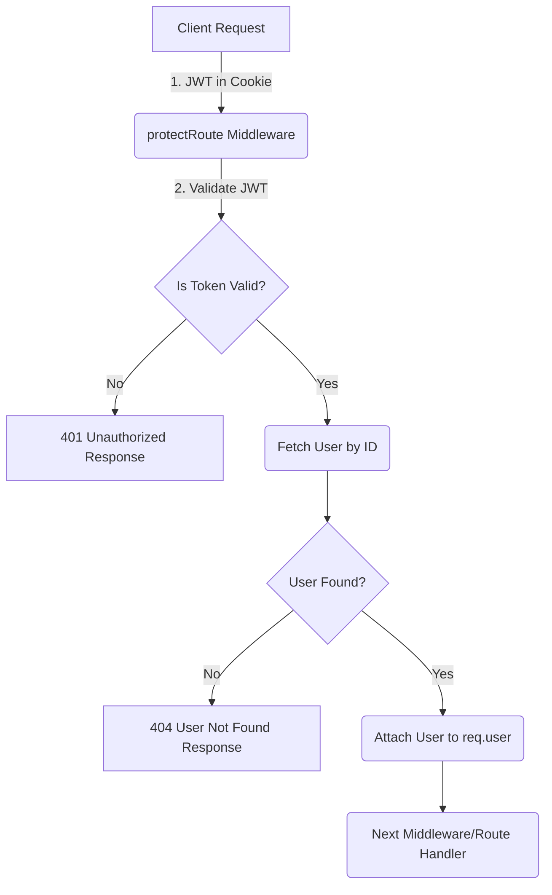

 # Backend Utilities and Middleware

This section delves into the core backend utilities and middleware that power the application's functionality. It covers critical areas such as user authentication using Passport.js with Google OAuth, secure token generation, route protection, and external service integration for file management. These components are foundational for ensuring a secure, robust, and scalable backend.

## Authentication System

The application employs a dual-pronged authentication strategy, integrating Google OAuth for social logins and JSON Web Tokens (JWT) for session management and API protection.

### Google OAuth Integration with Passport.js

The `passport.config.js` file is central to setting up Google OAuth. It defines a `GoogleStrategy` for Passport.js, enabling users to sign in using their Google accounts. This strategy handles the redirection to Google, validation of the returned profile, and either finds an existing user or creates a new one in the database.

Upon successful authentication, Passport.js's `serializeUser` and `deserializeUser` functions manage user sessions. `serializeUser` stores a minimal user identifier (typically the user's database ID) in the session, while `deserializeUser` retrieves the full user object from the database using this ID, making it available as `req.user` for subsequent requests. This setup ensures that user data is securely handled throughout the session.

```javascript
// backend/src/lib/passport.config.js
import passport from 'passport';
import { Strategy as GoogleStrategy } from 'passport-google-oauth20';
import User from '../models/user.model.js'; 
import dotenv from 'dotenv';

dotenv.config(); 

export const configurePassport = () => {
    passport.use(new GoogleStrategy({
        clientID: process.env.GOOGLE_CLIENT_ID,
        clientSecret: process.env.GOOGLE_CLIENT_SECRET,
        callbackURL: process.env.GOOGLE_CALLBACK_URL,
        scope: ['profile', 'email'] 
    },
    async (accessToken, refreshToken, profile, done) => {
        try {
            let user = await User.findOne({ googleId: profile.id });

            if (user) {
                return done(null, user);
            } else {
                let username = profile.displayName.replace(/\s+/g, '').toLowerCase() || `user${Date.now()}`;

                const existingUserByUsername = await User.findOne({ username });
                if (existingUserByUsername) {
                    username = `${username}${Date.now().toString().slice(-4)}`;
                }
                if (username.length > 20) username = username.substring(0,20);

                const newUser = new User({
                    googleId: profile.id,
                    email: profile.emails && profile.emails[0] ? profile.emails[0].value : null,
                    username: username,
                    authProvider: 'google',
                });

                if (!newUser.email) {
                    return done(new Error("Email not provided by Google. Cannot create account."), null);
                }

                const existingUserByEmail = await User.findOne({ email: newUser.email });
                if (existingUserByEmail && existingUserByEmail.authProvider !== 'google') {
                    return done(null, false, { message: `An account with email ${newUser.email} already exists. Please sign in using your original method.` });
                }

                await newUser.save();
                return done(null, newUser);
            }
        } catch (error) {
            return done(error, null);
        }
    }));

    passport.serializeUser((user, done) => {
        done(null, user.id); 
    });

    passport.deserializeUser(async (id, done) => {
        try {
            const user = await User.findById(id);
            done(null, user); 
        } catch (error) {
            done(error, null);
        }
    });
};
```
[View on GitHub](https://github.com/shinymack/Chat-App-MERN/blob/main/backend/src/lib/passport.config.js)

### JWT Token Generation

The `generateToken` utility in `backend/src/lib/utils.js` is responsible for creating a JSON Web Token (JWT) after a user successfully authenticates. This token securely encodes the `userId` and is signed with a secret key (`process.env.JWT_SECRET`). It is then set as an `httpOnly` cookie in the response, ensuring that it cannot be accessed by client-side JavaScript, which significantly mitigates Cross-Site Scripting (XSS) attacks. The token is configured to expire after 7 days, providing a balance between security and user convenience.

```javascript
// backend/src/lib/utils.js
import jwt from 'jsonwebtoken';

export const generateToken = (userId, res) => {
    const token = jwt.sign({userId}, process.env.JWT_SECRET, 
        {expiresIn: "7d"});

    res.cookie("jwt", token, {
        maxAge: 7 * 24 * 60 * 60 * 1000, 
        httpOnly: true,
        sameSite: "strict",
        secure: process.env.NODE_ENV !== "development",
    });
    return token;
};
```
[View on GitHub](https://github.com/shinymack/Chat-App-MERN/blob/main/backend/src/lib/utils.js#L3-L15)

### Route Protection Middleware

The `protectRoute` middleware, defined in `backend/src/middleware/auth.middleware.js`, ensures that specific API routes are only accessible to authenticated users. It works by checking for the presence of the `jwt` cookie in the incoming request. If a token is found, it verifies its authenticity and expiration using the `JWT_SECRET`. Upon successful verification, the middleware extracts the `userId` from the token, fetches the corresponding user from the database (excluding their password for security), and attaches the user object to `req.user`. This allows subsequent route handlers to access authenticated user information easily. If the token is missing or invalid, the middleware responds with an unauthorized status.

```javascript
// backend/src/middleware/auth.middleware.js
import jwt from "jsonwebtoken"
import User from "../models/user.model.js"

export const protectRoute = async (req, res, next) => {
    try {
        const token = req.cookies.jwt;
        if(!token){
            return res.status(401).json({message: "Unauthorized - No Token Provided"});
        }

        const decoded = jwt.verify(token, process.env.JWT_SECRET)

        if(!decoded) {
            return res.status(401).json({message: "Unauthorized - Invalid Token"});
        }
        const user = await User.findById(decoded.userId).select("-password");

        if(!user) {
            return res.status(404).json({message: "User not found"});
        }
        req.user = user;

        next();
    } catch (error) {
        console.log("Error in protectRoute middleware", error.message);
        res.status(500).json({message: "Internal Server Error"});

    }

};
```
[View on GitHub](https://github.com/shinymack/Chat-App-MERN/blob/main/backend/src/middleware/auth.middleware.js)

<br/>

Here's a simplified flow for JWT-based route protection:





## File Uploads with Cloudinary

The `backend/src/lib/cloudinary.js` file handles the configuration for integrating with Cloudinary, a cloud-based image and video management service. This setup is crucial for applications requiring media storage and manipulation capabilities, such as user profile pictures or shared images in a chat application.

The file initializes the Cloudinary SDK with credentials loaded from environment variables (`CLOUDINARY_CLOUD_NAME`, `CLOUDINARY_API_KEY`, `CLOUDINARY_API_SECRET`), ensuring that sensitive information is not hardcoded and can be easily managed across different deployment environments. Once configured, the exported `cloudinary` object can be used throughout the backend to programmatically upload, retrieve, update, and delete media files.

```javascript
// backend/src/lib/cloudinary.js
import {v2 as cloudinary} from "cloudinary"

import { config } from 'dotenv'

config();

cloudinary.config(
    {cloud_name: process.env.CLOUDINARY_CLOUD_NAME,
    api_key: process.env.CLOUDINARY_API_KEY,
    api_secret: process.env.CLOUDINARY_API_SECRET,}
);

export default cloudinary;
```
[View on GitHub](https://github.com/shinymack/Chat-App-MERN/blob/main/backend/src/lib/cloudinary.js)

<br/>

This is a conceptual flow for media upload process using Cloudinary:


```mermaid
graph TD
    A["Client (Browser/App)"] -->|1. Upload Request (e.g., Image)| B("Backend Server")
    B -->|2. Invoke Cloudinary SDK| C("Cloudinary Service")
    C -->|3. Store & Process File| D("Cloudinary Storage")
    D -->|4. Return CDN URL| C
    C -->|5. Return CDN URL & Metadata| B
    B -->|6. Save URL in DB & Respond| E("Database")
    E --> F["Client (Display Image)"]
    B --> F
```


## Key Integration Points

The utilities and middleware described above are critical for the application's functionality and security:

*   **Seamless Authentication Flow:** The `passport.config.js` sets up Google OAuth, creating a user-friendly sign-in experience. After a successful Google login, the backend implicitly manages the session, often by generating a JWT.
*   **Secure Session Management:** The `generateToken` utility ensures that authenticated user sessions are maintained securely via `httpOnly` JWT cookies, protecting against common web vulnerabilities.
*   **API Security:** The `protectRoute` middleware acts as a gatekeeper, verifying the validity of JWTs before allowing access to sensitive API endpoints. This is essential for protecting user data and ensuring that only authorized requests are processed.
*   **Media Handling:** `cloudinary.js` provides a robust solution for managing user-generated content, offloading storage and transformation tasks to a specialized service, which improves application performance and scalability.
*   **Environment Configuration:** All sensitive keys and configurations (e.g., Cloudinary API keys, JWT secret, Google OAuth credentials) are loaded from `.env` files using `dotenv`. This is a best practice for security and makes it easy to manage configurations across development, staging, and production environments without code changes.

Together, these components form a secure and efficient backend infrastructure, handling authentication, authorization, and external service integrations seamlessly.