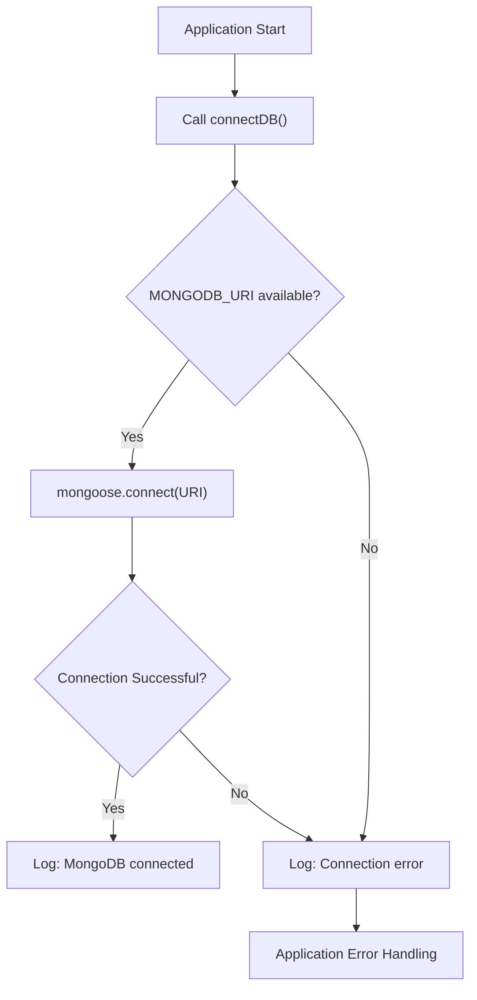
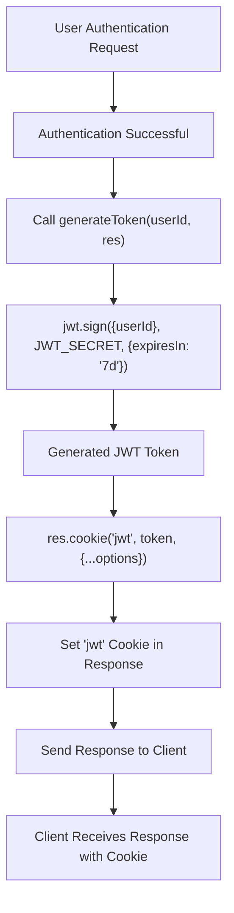

 
---
title: "Backend Utilities and Services"
description: "Describes helper functions, database connection, and third-party integrations like Cloudinary."
---

# Backend Utilities and Services

The `backend/src/lib` directory houses a collection of essential utilities and services that form the backbone of the application's server-side operations. These services abstract complex functionalities such as database management, external API integrations, and core authentication processes, ensuring a clean and modular codebase. This document delves into the purpose and implementation of these critical components, including database connection, secure token generation, and third-party media handling with Cloudinary.

## Core Dependencies

The `package.json` file in the `backend` directory lists all the necessary packages and their versions that the application relies on. This file is crucial for managing project dependencies, allowing developers to easily set up the development environment and ensure consistent builds. It categorizes dependencies into runtime dependencies and development-only dependencies, which are vital for local development tasks like hot-reloading.

Here's a look at the key runtime dependencies that power the backend services:

```json
// backend/package.json
{
  "name": "backend",
  "version": "1.0.0",
  "main": "src/index.js",
  // ... other fields
  "dependencies": {
    "bcryptjs": "^2.4.3",
    "cloudinary": "^2.5.1",
    "cookie-parser": "^1.4.7",
    "dotenv": "^16.4.7",
    "express": "^4.21.2",
    "express-session": "^1.18.1",
    "jsonwebtoken": "^9.0.2",
    "mongoose": "^8.9.5",
    "passport": "^0.7.0",
    "passport-google-oauth20": "^2.0.0",
    "socket.io": "^4.8.1"
  },
  "devDependencies": {
    "nodemon": "^3.1.9"
  }
}
```

**Explanation:** This snippet from `package.json` highlights the core dependencies. `mongoose` is for MongoDB interaction, `cloudinary` for cloud media storage, `jsonwebtoken` and `bcryptjs` for authentication, `express` for the web server, and `socket.io` for real-time communication. `dotenv` handles environment variables, while `nodemon` is a development dependency for automatic server restarts.
[View on GitHub](https://github.com/shinymack/Chat-App-MERN/blob/main/backend/package.json)

## Database Connection Management

The `backend/src/lib/db.js` file is responsible for establishing and managing the connection to the MongoDB database. It uses Mongoose, an object data modeling (ODM) library for MongoDB, which provides a straightforward, schema-based solution to model your application data. The `connectDB` function ensures that the application can interact with the database, retrieving and storing information securely.

The connection string for MongoDB is typically stored as an environment variable (`process.env.MONGODB_URI`) to keep sensitive information out of the codebase and allow for easy configuration across different deployment environments (development, staging, production).

```javascript
// backend/src/lib/db.js
import mongoose from "mongoose"

export const connectDB = async () => {
  try {
    const conn = await mongoose.connect(process.env.MONGODB_URI);
    console.log(`MongoDB connected:  ${conn.connection.host}`);
  }
  catch(error){
    console.log("MongoDB connection error: ", error);
  }
}
```

**Explanation:** The `connectDB` function asynchronously attempts to connect to the MongoDB database using the URI provided in environment variables. Upon successful connection, it logs the host; otherwise, it catches and logs any connection errors, which is crucial for debugging database-related issues.
[View on GitHub](https://github.com/shinymack/Chat-App-MERN/blob/main/backend/src/lib/db.js)

### Database Connection Flow





**Explanation:** This diagram illustrates the flow of connecting to the MongoDB database. The application initiates the `connectDB` function, which then uses the `MONGODB_URI` environment variable to establish a connection. The process includes error handling for both missing URI and failed connection attempts, ensuring robust database access.

## Cloudinary Integration

The `backend/src/lib/cloudinary.js` file handles the integration with Cloudinary, a cloud-based media management service. This service allows the application to upload, store, manage, and deliver images and videos efficiently. By offloading media handling to Cloudinary, the application reduces its server load and benefits from Cloudinary's robust media processing capabilities.

Similar to the database connection, Cloudinary's configuration—including `cloud_name`, `api_key`, and `api_secret`—are loaded from environment variables using `dotenv`. This practice maintains security by preventing sensitive credentials from being hardcoded into the application.

```javascript
// backend/src/lib/cloudinary.js
import {v2 as cloudinary} from "cloudinary"
import { config } from 'dotenv'

config(); // Load environment variables

cloudinary.config(
    {
        cloud_name: process.env.CLOUDINARY_CLOUD_NAME,
        api_key: process.env.CLOUDINARY_API_KEY,
        api_secret: process.env.CLOUDINARY_API_SECRET,
    }
);

export default cloudinary;
```

**Explanation:** This snippet initializes the Cloudinary SDK with credentials fetched from environment variables. The `cloudinary.config` method sets up the necessary authentication details for the application to interact with the Cloudinary service for media uploads and management.
[View on GitHub](https://github.com/shinymack/Chat-App-MERN/blob/main/backend/src/lib/cloudinary.js)

## Authentication Utilities

The `backend/src/lib/utils.js` file contains helper functions primarily focused on authentication and security. Specifically, it includes the `generateToken` function, which is responsible for creating and setting JSON Web Tokens (JWTs) for user authentication. JWTs are a compact, URL-safe means of representing claims between two parties, often used for authorization.

The `generateToken` function signs a JWT with a user ID and sets it as an `httpOnly` cookie. `httpOnly` cookies cannot be accessed by client-side JavaScript, which significantly mitigates the risk of cross-site scripting (XSS) attacks. Additionally, the `secure` flag ensures the cookie is only sent over HTTPS in production environments, and `sameSite: "strict"` helps prevent cross-site request forgery (CSRF) attacks.

```javascript
// backend/src/lib/utils.js
import jwt from 'jsonwebtoken';

export const generateToken = (userId, res) => {
    const token = jwt.sign({userId}, process.env.JWT_SECRET,
        {expiresIn: "7d"});

    res.cookie("jwt", token, {
        maxAge: 7 * 24 * 60 * 60 * 1000,
        httpOnly: true,
        sameSite: "strict",
        secure: process.env.NODE_ENV !== "development",
    });
    return token;
};
```

**Explanation:** This `generateToken` function creates a JWT containing the user's ID, signed with a secret key from environment variables, and sets an expiration of 7 days. It then sets this token as an `httpOnly`, `sameSite: "strict"`, and conditionally `secure` cookie on the response object, enhancing the security of user sessions.
[View on GitHub](https://github.com/shinymack/Chat-App-MERN/blob/main/backend/src/lib/utils.js)

### JWT Generation and Cookie Setting Flow





**Explanation:** This diagram outlines the process of generating a JSON Web Token and setting it as a secure cookie after successful user authentication. The `generateToken` function orchestrates signing the token with user information and then attaching it to the HTTP response as an `httpOnly` cookie, which is then sent back to the client.

## Key Integration Points

The utility and service files within `backend/src/lib` are foundational for the application's overall functionality, enabling various backend processes to operate seamlessly.

*   **Centralized Configuration:** The use of `dotenv` and environment variables across `db.js`, `cloudinary.js`, and `utils.js` ensures that sensitive data (database URIs, API keys, JWT secrets) is kept out of the source code. This practice is crucial for security and allows for easy configuration management across different environments without code changes.

*   **Modular Design:** By separating concerns into distinct files (e.g., database logic in `db.js`, media handling in `cloudinary.js`, authentication helpers in `utils.js`), the codebase remains modular and maintainable. This design promotes reusability, makes testing easier, and allows different developers to work on separate features without significant conflicts.

*   **Robust Error Handling:** Each utility, particularly `db.js`, includes basic error handling mechanisms. Catching and logging errors during critical operations like database connection is vital for diagnosing issues promptly and ensuring application stability. Extending this pattern across all integrations enhances the application's resilience.

*   **Security Best Practices:** The `generateToken` function in `utils.js` exemplifies security best practices for token management. By using `httpOnly` and `sameSite: "strict"` cookies, along with conditional `secure` flag based on the `NODE_ENV`, the application significantly reduces common web vulnerabilities such as XSS and CSRF. This layered approach to security is paramount for protecting user data and maintaining trust.

*   **Scalability and Performance:** Leveraging third-party services like Cloudinary for media management not only offloads server resources but also capitalizes on specialized infrastructure designed for performance and scalability. This allows the backend to focus on core application logic rather than intricate media processing, contributing to a faster and more efficient user experience. Similarly, Mongoose's efficient query handling and connection pooling optimize database interactions.

These utilities and services are not just independent components; they are interconnected pieces that form a cohesive and robust backend architecture, crucial for the reliable operation and future extensibility of the application.
```