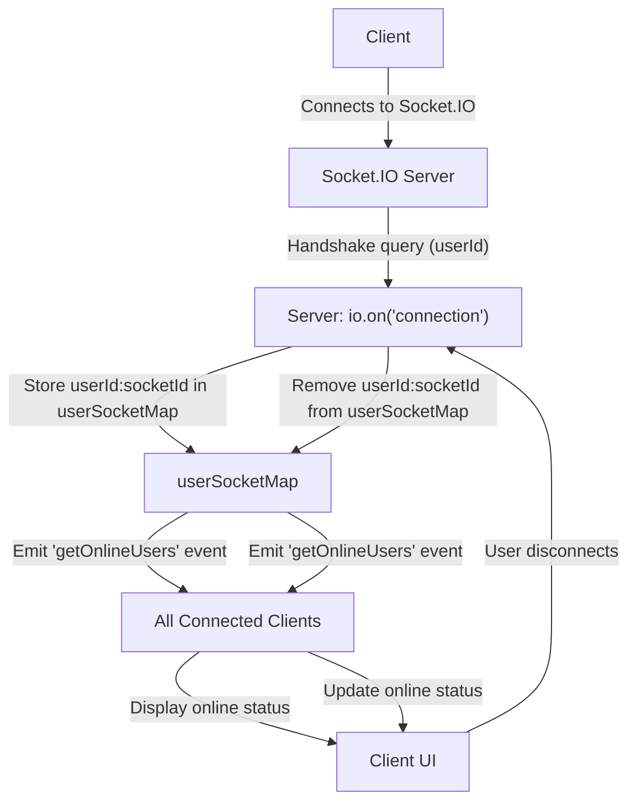
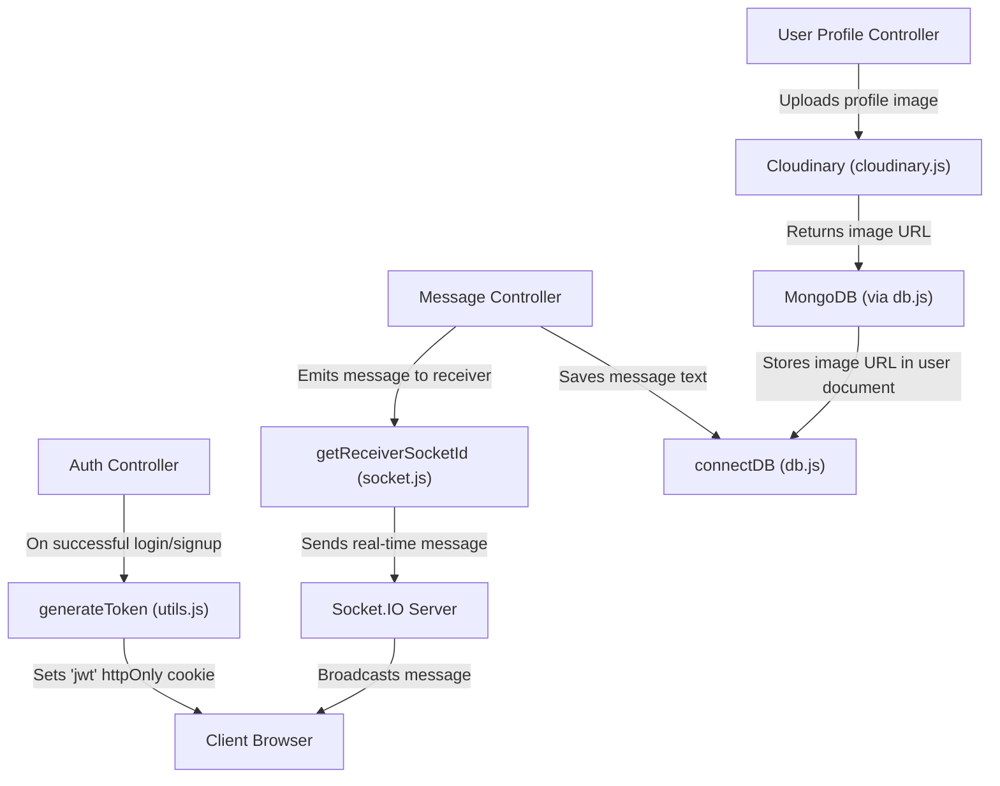

 # Backend Utilities and Services

This section provides comprehensive documentation for the essential utility services that power the backend. These services abstract away complex integrations, offering streamlined access to core functionalities such as database management, cloud-based file storage, real-time communication, and authentication token generation. Understanding these utilities is crucial for anyone looking to extend or maintain the backend, as they form the foundational layers for data persistence, media handling, and interactive user experiences.

## Database Connection Management

The application leverages MongoDB for its primary data storage, facilitated through the Mongoose ODM (Object-Document Mapper). The database connection is centralized within `backend/src/lib/db.js` to ensure a single, robust point of connection and error handling. This approach promotes consistency and simplifies the management of database interactions across the application.

The `connectDB` function is an asynchronous operation designed to establish a connection to the MongoDB instance using the URI provided in the environment variables. Upon successful connection, it logs the host to the console, while any connection errors are caught and reported, preventing application crashes due to database unavailability.

```javascript
// File: backend/src/lib/db.js
import mongoose from "mongoose"

export const connectDB = async () => {
  try {
    const conn = await mongoose.connect(process.env.MONGODB_URI);
    console.log(`MongoDB connected:  ${conn.connection.host}`);
  }
  catch(error){
    console.log("MongoDB connection error: ", error);
  }
}
```
[View on GitHub](https://github.com/shinymack/Chat-App-MERN/blob/main/backend/src/lib/db.js)

This utility ensures that all data models can interact seamlessly with the database, maintaining data integrity and efficient retrieval. The use of `process.env.MONGODB_URI` adheres to best practices for configuration management, keeping sensitive database credentials out of the codebase.

## Cloud Storage Integration with Cloudinary

For handling media uploads and storage, the application integrates with Cloudinary, a robust cloud-based media management platform. The configuration for Cloudinary is encapsulated in `backend/src/lib/cloudinary.js`, providing a centralized interface for all media-related operations. This service is vital for storing user avatars, shared images, or any other media assets without burdening the application's local file system.

The `cloudinary.config` object is initialized with credentials loaded from environment variables, ensuring secure access to the Cloudinary API. This setup allows the backend to programmatically upload, manage, and retrieve media assets efficiently.

```javascript
// File: backend/src/lib/cloudinary.js
import {v2 as cloudinary} from "cloudinary"
import { config } from 'dotenv'

config(); // Load environment variables

cloudinary.config(
    {
        cloud_name: process.env.CLOUDINARY_CLOUD_NAME,
        api_key: process.env.CLOUDINARY_API_KEY,
        api_secret: process.env.CLOUDINARY_API_SECRET,
    }
);

export default cloudinary;
```
[View on GitHub](https://github.com/shinymack/Chat-App-MERN/blob/main/backend/src/lib/cloudinary.js)

Integrating Cloudinary streamlines media handling, offloading storage and optimization concerns to a specialized service, thereby improving application performance and scalability. Any part of the backend requiring file uploads can import and utilize this configured `cloudinary` instance.

## Real-time Communication with Socket.IO

Real-time interactivity is a cornerstone of modern applications, and this project achieves it through Socket.IO. The `backend/src/lib/socket.js` file sets up the Socket.IO server, enabling bi-directional, event-based communication between clients and the server. This is particularly useful for features like live chat, online user presence indicators, and instant notifications.

The module initializes an Express app, an HTTP server, and the Socket.IO server itself. It includes mechanisms to track online users using a `userSocketMap` and provides a function `getReceiverSocketId` to retrieve the socket ID of a specific user.

```javascript
// File: backend/src/lib/socket.js (excerpt for initialization)
import { Server } from "socket.io";
import http from "http";
import express from "express";

const app = express();
const server = http.createServer(app);
const io = new Server(server, {
    cors: {
        origin: ["http://localhost:5173"] // Configured for frontend origin
    }
})

// Used to store online users: {userId : socketId}
const userSocketMap = {};

export function getReceiverSocketId(userId) {
    return userSocketMap["userId"];
}
```
[View on GitHub](https://github.com/shinymack/Chat-App-MERN/blob/main/backend/src/lib/socket.js#L1-L20)

The core logic for handling new connections and disconnections is implemented in the `io.on("connection")` block. When a user connects, their `userId` is extracted from the handshake query, and their socket ID is mapped. The server then emits an updated list of online users to all connected clients. Upon disconnection, the user is removed from the `userSocketMap`, and the online user list is broadcast again.

```javascript
// File: backend/src/lib/socket.js (excerpt for connection/disconnection)
io.on("connection", (socket) => {
    console.log("A user connected", socket.id);

    const userId = socket.handshake.query.userId;
    if(userId) userSocketMap["userId"] = socket.id;

    io.emit("getOnlineUsers", Object.keys(userSocketMap));

    socket.on("disconnect", ()=>{
        console.log("A user disconnected", socket.id);
        delete userSocketMap["userId"];
        io.emit("getOnlineUsers", Object.keys(userSocketMap));
    })
})

export { io, app, server };
```
[View on GitHub](https://github.com/shinymack/Chat-App-MERN/blob/main/backend/src/lib/socket.js#L23-L37)

This setup ensures that the frontend can subscribe to real-time updates, making the application dynamic and highly responsive to user actions and system changes.

### Real-time Communication Flow

Here's a basic flow for how users connect and their online status is managed via Socket.IO:





## JWT Utility for Authentication

Authentication is a critical component of any secure application. The `backend/src/lib/utils.js` file provides a utility for generating JSON Web Tokens (JWTs), which are used to authenticate users and maintain their session. This utility abstracts the details of token creation and cookie management, ensuring a consistent and secure approach to authentication across the backend.

The `generateToken` function takes a `userId` and the `response` object. It signs the `userId` with a secret key (`process.env.JWT_SECRET`) and sets an expiration time. Crucially, it attaches this token as an `httpOnly` cookie to the response, which enhances security by making the cookie inaccessible to client-side JavaScript, mitigating XSS (Cross-Site Scripting) attacks.

```javascript
// File: backend/src/lib/utils.js
import jwt from 'jsonwebtoken';

export const generateToken = (userId, res) => {
    const token = jwt.sign({userId}, process.env.JWT_SECRET,
        {expiresIn: "7d"}); // Token expires in 7 days

    res.cookie("jwt", token, {
        maxAge: 7 * 24 * 60 * 60 * 1000, // 7 days in milliseconds
        httpOnly: true, // Prevents client-side JS access
        sameSite: "strict", // CSRF protection
        secure: process.env.NODE_ENV !== "development", // Only secure in production
    });
    return token;
};
```
[View on GitHub](https://github.com/shinymack/Chat-App-MERN/blob/main/backend/src/lib/utils.js)

This utility is invoked whenever a user successfully logs in or registers, ensuring that they receive a valid authentication token for subsequent authenticated requests.

## Key Integration Points

The utility services detailed above are fundamental to the overall architecture of the backend. They integrate at various stages of the request lifecycle, ensuring that data is persisted, media is handled, and users can communicate in real-time, all while being securely authenticated.

*   **Application Startup:** The `connectDB` function is typically called once when the backend application starts, ensuring that the database connection is established before any routes or services attempt to interact with MongoDB. This is a critical initialization step.
*   **User Authentication:** The `generateToken` utility is used immediately after a user's credentials are validated during login or registration processes. The generated JWT is then sent back to the client via an `httpOnly` cookie.
*   **Media Uploads:** When users upload profile pictures, share images in chat, or any other media-related action, the `cloudinary` instance is utilized to store these assets in the cloud, returning a URL that can be saved in the database.
*   **Real-time Interactions:** The `socket.io` server is central to any feature requiring instantaneous updates. This includes chat messages, online user lists, typing indicators, and notifications. The `getReceiverSocketId` function allows targeted communication to specific users.

These utilities are designed to be modular and reusable, promoting a clean architecture where core functionalities are abstracted and easily accessible across different parts of the backend services.

### Backend Utilities Interaction Diagram

This diagram illustrates how various backend components might interact with the utility services:





This comprehensive set of utilities forms the backbone of the application's non-business-logic operations, providing robust, scalable, and secure services.