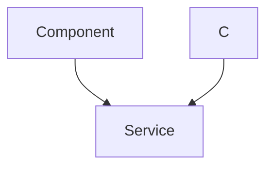
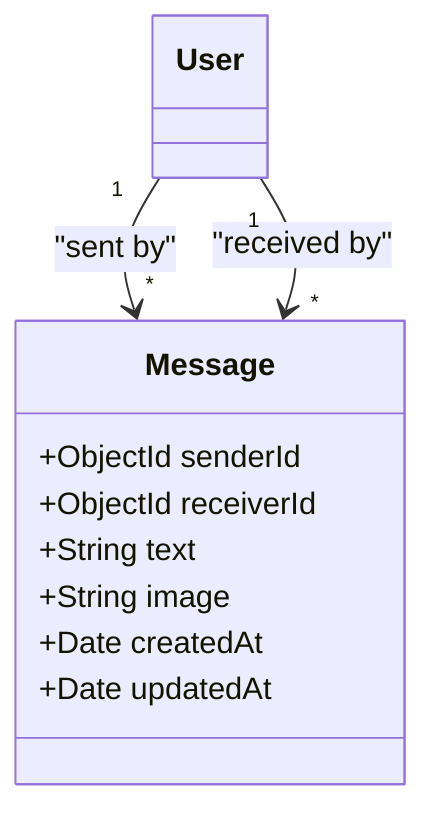
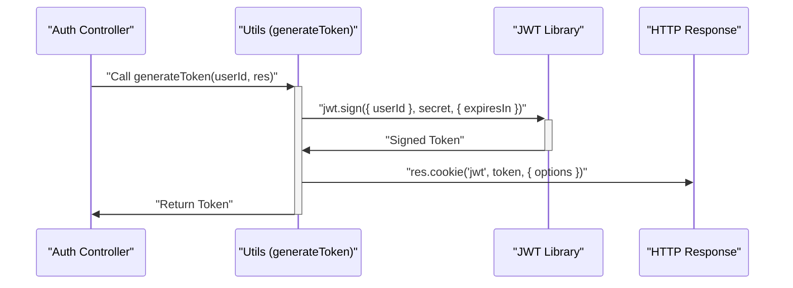

 # Data Models and Utilities

This section provides an in-depth look at the core data models used within the application, specifically for `User` and `Message` entities, along with essential utility functions for security (JWT generation) and media management (Cloudinary integration). These components form the backbone of the application's data persistence and operational capabilities.

## User Data Model

The `User` model defines the structure and behavior of user accounts within the application. It leverages Mongoose schemas for flexible and robust data validation, including unique constraints, minimum lengths, and support for various authentication providers.





### Key Fields and Characteristics

*   **`email`**: Unique string, required for authentication.
*   **`username`**: Unique string, required, trimmed, with length constraints (3-20 characters).
*   **`password`**: String, minimum length of 6 characters. This field can be `undefined` if `authProvider` is `google` and the user isn't modifying their password.
*   **`profilePic`**: URL string for the user's profile picture, defaults to an empty string.
*   **`friends`**: An array of `ObjectId`s referencing other `User` documents, representing established friendships.
*   **`friendRequests`**: An array of `ObjectId`s referencing `User` documents who have sent friend requests to this user.
*   **`sentRequests`**: An array of `ObjectId`s referencing `User` documents to whom this user has sent friend requests.
*   **`authProvider`**: Enum (`'email'`, `'google'`) indicating the authentication method. Defaults to `'email'`.
*   **`googleId`**: Unique string, used if `authProvider` is `'google'`. It's `sparse` to allow `null` values for non-Google users.
*   **`timestamps`**: Mongoose automatically manages `createdAt` and `updatedAt` fields.

### Pre-save Hook for Google Auth

The `userSchema` includes a `pre('save')` hook to handle specific logic for Google authenticated users. If a user is authenticating via Google (`authProvider === 'google'`) and their password is not being modified, the `password` field is set to `undefined`. This prevents unnecessary password hashing for Google-signed-up users who don't have a local password.

```javascript
// File: backend/src/models/user.model.js
import mongoose from "mongoose";

const  userSchema = new mongoose.Schema(
    {
        // ... (schema fields) ...
    },
    {
        timestamps: true
    }
);

userSchema.pre('save', async function(next) {
    if (this.authProvider === 'google' && !this.isModified('password')) {
        this.password = undefined;
    }
    if (this.authProvider === 'email' && !this.password && this.isNew) {
        return next(new Error('Password is required for email signup.'));
    }
    next();
});

const User = mongoose.model("User", userSchema);

export default User;
```

This snippet highlights the `pre('save')` middleware, ensuring data integrity and correct handling of authentication provider differences.
[View on GitHub](https://github.com/shinymack/Chat-App-MERN/blob/main/backend/src/models/user.model.js#L54-L63)

## Message Data Model

The `Message` model defines the schema for chat messages exchanged between users. It establishes clear relationships between sender, receiver, and content, supporting both text and image-based messages.





### Key Fields and Relationships

*   **`senderId`**: `ObjectId` referencing the `User` who sent the message. It is required.
*   **`receiverId`**: `ObjectId` referencing the `User` who is the recipient of the message. It is required.
*   **`text`**: String field for the message content. Can be empty if only an image is sent.
*   **`image`**: String field for the URL of an image associated with the message. Can be empty if only text is sent.
*   **`timestamps`**: Mongoose automatically manages `createdAt` and `updatedAt` fields.

```javascript
// File: backend/src/models/message.model.js
import express from "express";
import mongoose from "mongoose";

const messageSchema = new mongoose.Schema(
    {
     senderId: {
        type: mongoose.Schema.Types.ObjectId,
        ref: "User",
        required: true,
     },
     receiverId: {
        type: mongoose.Schema.Types.ObjectId,
        ref: "User",
        required: true,
     },
     text: {
        type: String,
     },
     image: {
        type: String,
     },
    },
    {timestamps: true}
);

export default mongoose.model("Message", messageSchema);
```

This snippet showcases the straightforward `messageSchema` definition, linking messages directly to `User` entities through `senderId` and `receiverId`.
[View on GitHub](https://github.com/shinymack/Chat-App-MERN/blob/main/backend/src/models/message.model.js#L4-L26)

## Shared Utility Functions

Beyond data models, the application utilizes several utility functions to handle common tasks like token generation and media storage configuration.

### JWT Token Generation

The `generateToken` utility creates a JSON Web Token (JWT) for a given `userId` and attaches it as an HTTP-only cookie to the response. This is crucial for maintaining user session and authentication.





The sequence diagram illustrates the flow of JWT generation, involving the `Auth Controller`, the `generateToken` utility, the `jsonwebtoken` library, and the `HTTP Response`.

```javascript
// File: backend/src/lib/utils.js
import jwt from 'jsonwebtoken';

export const generateToken = (userId, res) => {
    const token = jwt.sign({userId}, process.env.JWT_SECRET,
        {expiresIn: "7d"});

    res.cookie("jwt", token, {
        maxAge: 7 * 24 * 60 * 60 * 1000,
        httpOnly: true,
        sameSite: "strict",
        secure: process.env.NODE_ENV !== "development",
    });
    return token;
};
```

This snippet details the `generateToken` function, showing how a JWT is signed and set as a secure, HTTP-only cookie.
[View on GitHub](https://github.com/shinymack/Chat-App-MERN/blob/main/backend/src/lib/utils.js#L4-L18)

### Cloudinary Configuration

The `cloudinary.js` file configures the Cloudinary SDK using environment variables. Cloudinary is used for efficient cloud-based image storage and management, which is essential for handling user profile pictures and image messages.

```javascript
// File: backend/src/lib/cloudinary.js
import {v2 as cloudinary} from "cloudinary"
import { config } from 'dotenv'

config(); // Load environment variables

cloudinary.config(
    {cloud_name: process.env.CLOUDINARY_CLOUD_NAME,
    api_key: process.env.CLOUDINARY_API_KEY,
    api_secret: process.env.CLOUDINARY_API_SECRET,}
);

export default cloudinary;
```

This configuration ensures that the Cloudinary service is ready to be used throughout the application for image upload and retrieval operations.
[View on GitHub](https://github.com/shinymack/Chat-App-MERN/blob/main/backend/src/lib/cloudinary.js#L1-L14)

## Key Integration Points

The data models and utility functions seamlessly integrate across the application's backend.

*   **Authentication Flow**: The `generateToken` utility is invoked after successful user login or registration to issue a secure JWT, which is then used by subsequent requests for authentication. This token facilitates access control to protected routes and resources.
*   **User Interactions**: The `User` model's `friends`, `friendRequests`, and `sentRequests` fields are central to managing social connections, enabling features like sending, accepting, and declining friend requests.
*   **Messaging System**: The `Message` model, with its `senderId` and `receiverId` references to the `User` model, forms the core of the chat functionality. It ensures that messages are correctly attributed and delivered between users.
*   **Media Handling**: The Cloudinary configuration enables easy integration of image upload functionalities. When users update their `profilePic` or send `image` messages, the Cloudinary service handles the storage, optimization, and delivery of these assets, storing only the public URL in the respective Mongoose models.

These components together provide a robust and scalable foundation for the application's data management, security, and core features.