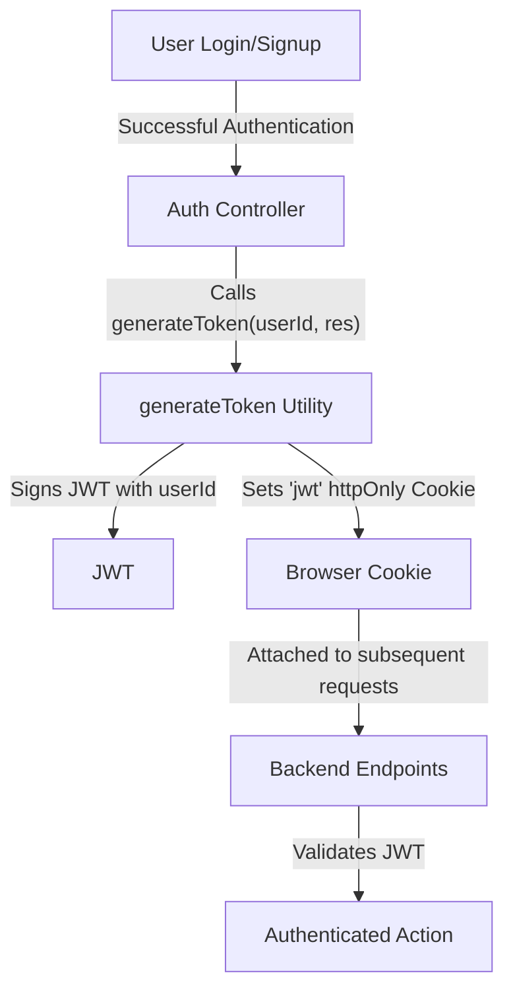
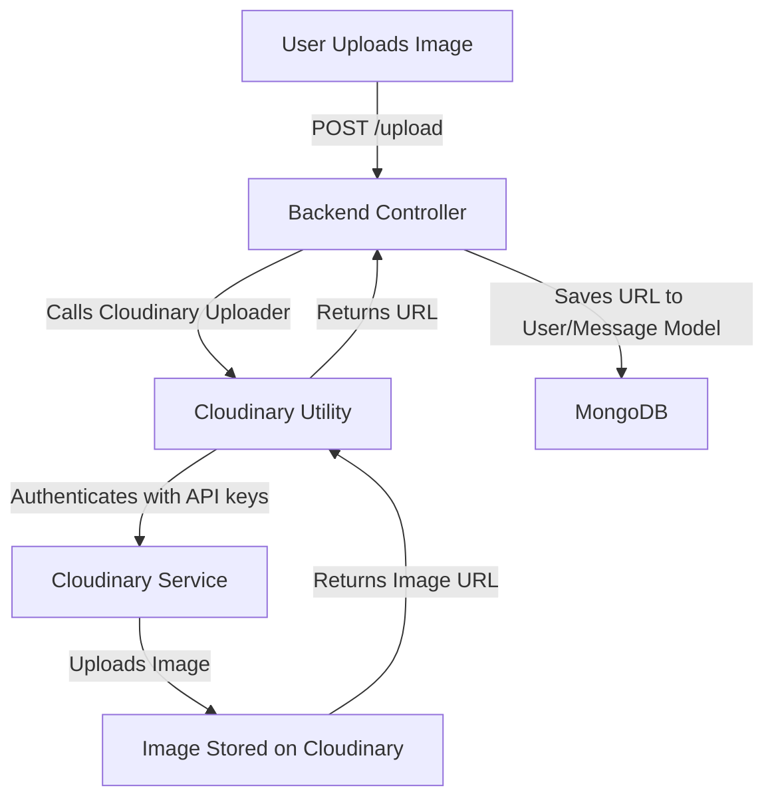

 # Data Models and Utilities

This document outlines the core data structures and utility functions that power the application's backend. It details how user and message information is modeled in the database, alongside essential utility functions for security (JWT generation) and external service integration (Cloudinary for media management). Understanding these components is crucial for comprehending data flow, authentication mechanisms, and external resource handling within the application.

## Core Data Models

The application relies on two primary Mongoose schemas: `User` and `Message`. These schemas define the structure and validation rules for storing user profiles and chat messages in MongoDB.

### User Data Model

The `User` model (`backend/src/models/user.model.js`) represents an individual user within the system. It encompasses various personal details, authentication credentials, and relationship management fields.

#### Schema Details:

*   **`email`**: User's unique email address, required for identification and authentication.
*   **`username`**: Unique display name for the user, with specific length constraints.
*   **`password`**: Hashed password for email-based authentication. Not required for Google authenticated users.
*   **`profilePic`**: URL to the user's profile picture, defaulting to an empty string if not set.
*   **`friends`**: An array of `ObjectId`s referencing other `User` documents, representing established friendships.
*   **`friendRequests`**: An array of `ObjectId`s referencing `User` documents who have sent a friend request to this user.
*   **`sentRequests`**: An array of `ObjectId`s referencing `User` documents to whom this user has sent a friend request.
*   **`authProvider`**: Indicates the authentication method used (e.g., `'email'`, `'google'`).
*   **`googleId`**: Unique identifier provided by Google for users authenticated via Google OAuth.

#### User Schema Definition Snippet:

The core structure of the `User` schema.

```javascript
// backend/src/models/user.model.js
import mongoose from "mongoose"

const  userSchema = new mongoose.Schema(
    {
        email: { 
            type: String,
            required: true,
            unique: true
        },
        username: {
            type: String,
            required: [true, "Username is required"],
            unique: true,
            trim: true,
            minlength: [3, "Username must be at least 3 characters long"],
            maxlength: [20, "Username cannot be more than 20 characters long"]
        }
        ,
        password: {
            type: String,
            minlength: 6,
        },
        profilePic: {
            type: String,
            default: "",
        },
        friends: [{
            type: mongoose.Schema.Types.ObjectId,
            ref: "User",
            default: [] 
        }],
        friendRequests: [{ // Incoming friend requests
            type: mongoose.Schema.Types.ObjectId,
            ref: "User",
            default: []
        }],
        sentRequests: [{ // Outgoing friend requests
            type: mongoose.Schema.Types.ObjectId,
            ref: "User",
            default: []
        }],
        authProvider: {
            type: String,
            enum: ['email', 'google'],
            default: 'email'
        },
        googleId: {
            type: String,
            unique: true,
            sparse: true
        },
    },
    { 
        timestamps: true
    } 
);
```

[View on GitHub](https://github.com/shinymack/Chat-App-MERN/blob/main/backend/src/models/user.model.js)

#### Pre-Save Hook for Authentication:

A `pre('save')` middleware is implemented to handle password requirements based on the authentication provider. If a user is authenticated via Google, their password field is explicitly undefined before saving if it hasn't been modified. For new email sign-ups, a password is required.

```javascript
// backend/src/models/user.model.js - Lines 60-69
userSchema.pre('save', async function(next) {
    if (this.authProvider === 'google' && !this.isModified('password')) {
        this.password = undefined;
    }
    if (this.authProvider === 'email' && !this.password && this.isNew) {
        return next(new Error('Password is required for email signup.'));
    }
    next();
});
```

[View on GitHub](https://github.com/shinymack/Chat-App-MERN/blob/main/backend/src/models/user.model.js#L60-L69)

### Message Data Model

The `Message` model (`backend/src/models/message.model.js`) stores individual chat messages exchanged between users. Each message records its sender, receiver, content, and any associated media.

#### Schema Details:

*   **`senderId`**: `ObjectId` referencing the `User` who sent the message.
*   **`receiverId`**: `ObjectId` referencing the `User` who is the recipient of the message.
*   **`text`**: The textual content of the message. This field can be empty if an `image` is present.
*   **`image`**: URL to an image attached to the message, if any. This field can be empty if `text` is present.

#### Message Schema Definition Snippet:

The basic schema for a message within a chat conversation.

```javascript
// backend/src/models/message.model.js
import express from "express";
import mongoose from "mongoose";

const messageSchema = new mongoose.Schema(
    {
     senderId: {
        type: mongoose.Schema.Types.ObjectId,
        ref: "User",
        required: true,
     },
     receiverId: {
        type: mongoose.Schema.Types.ObjectId,
        ref: "User",
        required: true,
     },
     text: {
        type: String,
     },
     image: {
        type: String,
     },
    },
    {timestamps: true}
);

export default mongoose.model("Message", messageSchema);
```

[View on GitHub](https://github.com/shinymack/Chat-App-MERN/blob/main/backend/src/models/message.model.js)

## Shared Utility Functions

Utility functions are critical for encapsulating common logic and promoting code reusability. The application includes utilities for generating JSON Web Tokens (JWTs) for authentication and configuring Cloudinary for media uploads.

### JWT Generation Utility

The `generateToken` utility function (`backend/src/lib/utils.js`) is responsible for creating and setting a JWT as an `httpOnly` cookie. This token is used to maintain user sessions and authenticate subsequent requests securely.

#### `generateToken` Function Details:

*   Takes `userId` and `res` (Express response object) as arguments.
*   Signs a JWT with the `userId` payload and a secret from environment variables.
*   Sets an `httpOnly` cookie named `jwt` with the generated token.
*   Cookie properties:
    *   `maxAge`: 7 days, ensuring a persistent session.
    *   `httpOnly`: Prevents client-side JavaScript from accessing the cookie, mitigating XSS attacks.
    *   `sameSite`: `'strict'`, preventing the cookie from being sent with cross-site requests, enhancing CSRF protection.
    *   `secure`: Set to `true` in production environments, ensuring the cookie is only sent over HTTPS.

#### `generateToken` Snippet:

```javascript
// backend/src/lib/utils.js
import jwt from 'jsonwebtoken';

export const generateToken = (userId, res) => {
    const token = jwt.sign({userId}, process.env.JWT_SECRET, 
        {expiresIn: "7d"});

    res.cookie("jwt", token, {
        maxAge: 7 * 24 * 60 * 60 * 1000, 
        httpOnly: true,
        sameSite: "strict",
        secure: process.env.NODE_ENV !== "development",
    });
    return token;
};
```

[View on GitHub](https://github.com/shinymack/Chat-App-MERN/blob/main/backend/src/lib/utils.js)

### Cloudinary Integration Utility

The `cloudinary.js` utility (`backend/src/lib/cloudinary.js`) initializes and configures the Cloudinary SDK, enabling seamless image and video upload capabilities.

#### Cloudinary Configuration Details:

*   Uses environment variables (`CLOUDINARY_CLOUD_NAME`, `CLOUDINARY_API_KEY`, `CLOUDINARY_API_SECRET`) for secure authentication with the Cloudinary service.
*   The `config()` call is invoked once at startup to set up the necessary credentials.

#### Cloudinary Configuration Snippet:

```javascript
// backend/src/lib/cloudinary.js
import {v2 as cloudinary} from "cloudinary"

import { config } from 'dotenv'

config();

cloudinary.config(
    {cloud_name: process.env.CLOUDINARY_CLOUD_NAME,
    api_key: process.env.CLOUDINARY_API_KEY,
    api_secret: process.env.CLOUDINARY_API_SECRET,}
);

export default cloudinary;
```

[View on GitHub](https://github.com/shinymack/Chat-App-MERN/blob/main/backend/src/lib/cloudinary.js)

## Key Integration Points

Understanding how these models and utilities interact is crucial for a complete picture of the application's backend logic.

### User Authentication Flow

The `generateToken` utility plays a central role in the user authentication process. After a user successfully logs in or registers, a JWT is generated and set as a cookie, which then authenticates subsequent requests.





### Media Upload Flow

Messages and user profiles can include images, which are handled via Cloudinary. The `cloudinary` configuration enables image uploads from the server to the Cloudinary service.





### Data Model Relationships

The `User` and `Message` models are interconnected through `ObjectId` references, enabling complex relationships necessary for a chat application.

*   **`Message` to `User`**: Each message directly references its `senderId` and `receiverId`, both of which point to `User` documents. This allows for easy retrieval of message participants.
*   **`User` to `User`**: The `friends`, `friendRequests`, and `sentRequests` fields within the `User` model establish social relationships between different `User` documents, enabling features like friend lists and request management.

These explicit relationships ensure data integrity and facilitate efficient querying of related information across the application.