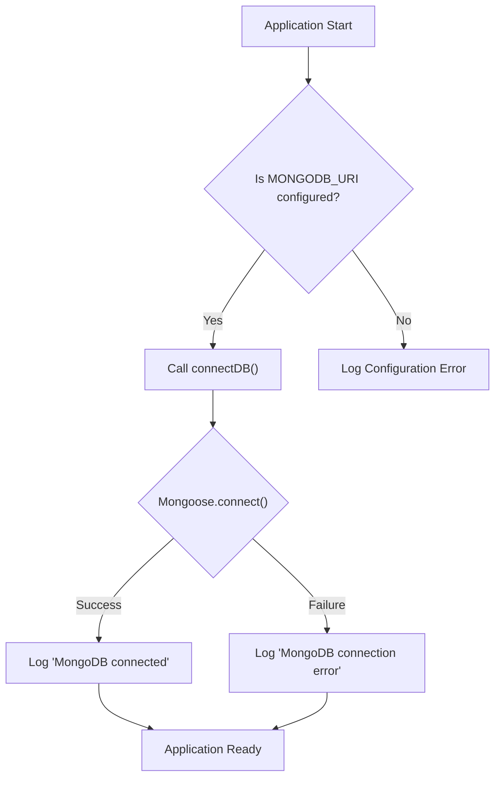
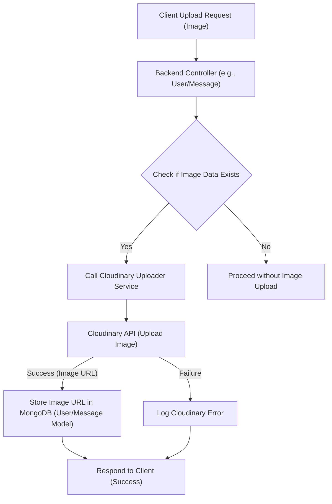

 # Database and External Services

This section provides comprehensive documentation on how the application manages its data, including database connection, schema definitions for core entities, and integration with external services crucial for media handling. Understanding these components is vital for anyone looking to extend, debug, or maintain the application's backend.

## Database Connection and Configuration

The application utilizes MongoDB as its primary database, orchestrated through Mongoose for schema-based data modeling. The connection logic is encapsulated to ensure robust and consistent database access.

### Connecting to MongoDB

The `connectDB` function in `backend/src/lib/db.js` is responsible for establishing and managing the connection to MongoDB. It leverages environment variables to securely retrieve the database URI, promoting flexibility and security across different deployment environments.

```javascript
// backend/src/lib/db.js
import mongoose from "mongoose"

export const connectDB = async () => {
  try {
    const conn = await mongoose.connect(process.env.MONGODB_URI);
    console.log(`MongoDB connected:  ${conn.connection.host}`);
  }
  catch(error){
    console.log("MongoDB connection error: ", error);
  }
}
```

This asynchronous function attempts to connect to the MongoDB instance specified by `process.env.MONGODB_URI`. Upon successful connection, it logs the host; otherwise, it logs a detailed error message, aiding in troubleshooting.

[View on GitHub](https://github.com/shinymack/Chat-App-MERN/blob/main/backend/src/lib/db.js)

### Database Connection Flow

The database connection process is straightforward:





This diagram illustrates how the application initializes its database connection, highlighting the dependency on the `MONGODB_URI` environment variable and the outcome of the connection attempt.

## Schema Definitions

Mongoose schemas define the structure and behavior of documents within MongoDB collections. The application features two primary models: `User` and `Message`.

### User Model (`User.js`)

The `User` model (`backend/src/models/user.model.js`) represents users within the system, including their authentication details, profile information, and social connections.

```javascript
// backend/src/models/user.model.js
import mongoose from "mongoose"

const  userSchema = new mongoose.Schema(
    {
        email: { 
            type: String,
            required: true,
            unique: true
        },
        username: {
            type: String,
            required: [true, "Username is required"],
            unique: true,
            trim: true,
            minlength: [3, "Username must be at least 3 characters long"],
            maxlength: [20, "Username cannot be more than 20 characters long"]
        },
        password: {
            type: String,
            minlength: 6,
        },
        profilePic: {
            type: String,
            default: "",
        },
        friends: [{
            type: mongoose.Schema.Types.ObjectId,
            ref: "User",
            default: [] 
        }],
        friendRequests: [{ // Incoming friend requests
            type: mongoose.Schema.Types.ObjectId,
            ref: "User",
            default: []
        }],
        sentRequests: [{ // Outgoing friend requests
            type: mongoose.Schema.Types.ObjectId,
            ref: "User",
            default: []
        }],
        authProvider: {
            type: String,
            enum: ['email', 'google'],
            default: 'email'
        },
        googleId: {
            type: String,
            unique: true,
            sparse: true
        },
    },
    { 
        timestamps: true
    } 
);
// ... pre-save hook for password handling ...
```

Key fields and their purposes:
*   `email`: User's email, required and unique for authentication.
*   `username`: Unique identifier for display, with length constraints.
*   `password`: Hashed password for 'email' authenticated users.
*   `profilePic`: URL to the user's profile picture, often hosted on Cloudinary.
*   `friends`, `friendRequests`, `sentRequests`: Arrays of `ObjectId` references to other `User` documents, managing social connections.
*   `authProvider`: Denotes the authentication method (`email` or `google`).
*   `googleId`: Stores the Google ID for users authenticated via Google, unique and sparse.

The `timestamps: true` option automatically adds `createdAt` and `updatedAt` fields to documents.

#### Pre-Save Hook for Authentication Providers

A `pre('save')` hook is implemented to manage password requirements based on the `authProvider`.

```javascript
// backend/src/models/user.model.js
// ... schema definition ...
userSchema.pre('save', async function(next) {
    if (this.authProvider === 'google' && !this.isModified('password')) {
        this.password = undefined;
    }
    if (this.authProvider === 'email' && !this.password && this.isNew) {
        return next(new Error('Password is required for email signup.'));
    }
    next();
});

const User = mongoose.model("User", userSchema);

export default User;
```

This hook ensures:
1.  For Google-authenticated users, if the password field hasn't been modified, it's set to `undefined` to avoid storing unnecessary password data.
2.  For new email-authenticated users, a password is strictly required.

[View on GitHub](https://github.com/shinymack/Chat-App-MERN/blob/main/backend/src/models/user.model.js)

### Message Model (`Message.js`)

The `Message` model (`backend/src/models/message.model.js`) defines the structure of chat messages exchanged between users.

```javascript
// backend/src/models/message.model.js
import express from "express"; // This import seems unused in this file
import mongoose from "mongoose";

const messageSchema = new mongoose.Schema(
    {
     senderId: {
        type: mongoose.Schema.Types.ObjectId,
        ref: "User",
        required: true,
     },
     receiverId: {
        type: mongoose.Schema.Types.ObjectId,
        ref: "User",
        required: true,
     },
     text: {
        type: String,
     },
     image: {
        type: String,
     },
    },
    {timestamps: true}
);

export default mongoose.model("Message", messageSchema);
```

Key fields and their purposes:
*   `senderId`: `ObjectId` reference to the `User` who sent the message.
*   `receiverId`: `ObjectId` reference to the `User` who is the recipient of the message.
*   `text`: The textual content of the message.
*   `image`: URL to an image attached to the message, typically hosted on Cloudinary.

The use of `ref: "User"` allows for population, meaning Mongoose can automatically retrieve the full `User` document for `senderId` and `receiverId` when queried. Similar to `User` schema, `timestamps: true` automatically records creation and update times.

[View on GitHub](https://github.com/shinymack/Chat-App-MERN/blob/main/backend/src/models/message.model.js)

## External Services Integration: Cloudinary

Cloudinary is integrated for efficient storage, manipulation, and delivery of media assets, specifically user profile pictures and images attached to messages.

### Cloudinary Configuration

The `backend/src/lib/cloudinary.js` file handles the configuration of the Cloudinary SDK, using environment variables for sensitive API credentials.

```javascript
// backend/src/lib/cloudinary.js
import {v2 as cloudinary} from "cloudinary"
import { config } from 'dotenv'

config(); // Load environment variables from .env file

cloudinary.config(
    {cloud_name: process.env.CLOUDINARY_CLOUD_NAME,
    api_key: process.env.CLOUDINARY_API_KEY,
    api_secret: process.env.CLOUDINARY_API_SECRET,}
);

export default cloudinary;
```

This setup initializes the Cloudinary SDK with the necessary `cloud_name`, `api_key`, and `api_secret`, all sourced from the application's environment variables (`.env` file). This ensures that credentials are not hardcoded and can be managed securely. The configured `cloudinary` instance is then exported for use throughout the application.

[View on GitHub](https://github.com/shinymack/Chat-App-MERN/blob/main/backend/src/lib/cloudinary.js)

### Media Upload Flow

When an image (e.g., a profile picture or message attachment) is to be uploaded, the application interacts with Cloudinary:





This diagram outlines the typical flow for image uploads: the client sends an image, the backend processes it, uploads it to Cloudinary, stores the returned URL in the relevant MongoDB document (User or Message), and then responds to the client.

## Key Integration Points

The integration of MongoDB with Mongoose and Cloudinary forms the backbone of the application's data management strategy.

*   **Data Persistence**: Mongoose schemas for `User` and `Message` ensure structured and validated data storage, critical for managing user profiles, friendships, and chat history. The `ref` property in schemas enables efficient population of related documents, simplifying data retrieval.
*   **Media Management**: Cloudinary offloads media storage and processing from the application server, improving performance and scalability. URLs to hosted images are stored in MongoDB, maintaining a lightweight database while providing access to rich media.
*   **Secure Configuration**: The reliance on environment variables for sensitive data like `MONGODB_URI` and Cloudinary API keys is a best practice for security and ease of deployment across different environments (development, staging, production).
*   **Extensibility**: The modular design of `db.js` and `cloudinary.js` allows for easy swapping or extension of these services if future requirements demand a different database or media provider.