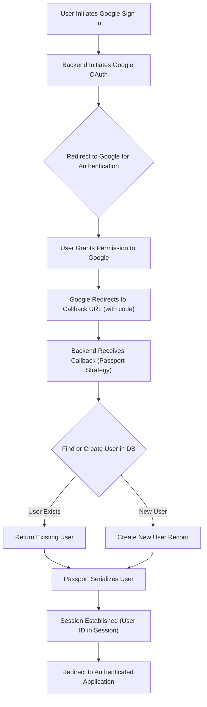

 
---
title: "External Integrations and Utilities"
description: "Documents integrations with third-party services like Cloudinary and common utility functions."
---

# External Integrations and Utilities

This document outlines the external integrations and core utility functions used within the backend of the application. It focuses on how the system interacts with third-party services like Cloudinary for media management and Google for authentication, as well as essential internal utilities for tasks such as JSON Web Token (JWT) generation. Understanding these components is crucial for comprehending the application's overall architecture and security mechanisms.

The primary files covered are:
*   `backend/src/lib/cloudinary.js`: Configures and exposes the Cloudinary API client.
*   `backend/src/lib/passport.config.js`: Sets up Google OAuth 2.0 strategy for user authentication using Passport.js.
*   `backend/src/lib/utils.js`: Provides utility functions, notably for JWT generation and cookie management.

## Cloudinary Integration

Cloudinary is a cloud-based service used for managing images and videos. In this application, it's integrated to handle media uploads, storage, and delivery. The `cloudinary.js` file is responsible for initializing the Cloudinary SDK with credentials loaded from environment variables.

### Configuration

The Cloudinary configuration is straightforward, pulling `CLOUD_NAME`, `API_KEY`, and `API_SECRET` directly from the application's environment variables. This ensures that sensitive credentials are not hardcoded and can be managed securely.

```javascript
// backend/src/lib/cloudinary.js
import {v2 as cloudinary} from "cloudinary"
import { config } from 'dotenv'

config(); // Load environment variables

cloudinary.config(
    {cloud_name: process.env.CLOUDINARY_CLOUD_NAME,
    api_key: process.env.CLOUDINARY_API_KEY,
    api_secret: process.env.CLOUDINARY_API_SECRET,}
);

export default cloudinary;
```
[View on GitHub](https://github.com/shinymack/Chat-App-MERN/blob/main/backend/src/lib/cloudinary.js)

This module exports a pre-configured `cloudinary` object, making it ready for use across the application for tasks such as uploading profile pictures, shared media in chats, or any other media-related operations. Any part of the backend that needs to interact with Cloudinary simply imports this configured instance.

## Passport.js for Google OAuth 2.0

Passport.js is a modular authentication middleware for Node.js. This application leverages it for seamless user authentication via Google OAuth 2.0. The `passport.config.js` file defines the strategy and handling logic for Google sign-ins, including user creation and serialization/deserialization.

### Authentication Flow Overview

The diagram below illustrates the high-level flow when a user attempts to sign in using Google.





### Google Strategy Configuration

The `configurePassport` function sets up the Google Strategy with client ID, client secret, and callback URL, all sourced from environment variables. This ensures the application can securely communicate with Google's OAuth servers.

```javascript
// backend/src/lib/passport.config.js
import passport from 'passport';
import { Strategy as GoogleStrategy } from 'passport-google-oauth20';
import User from '../models/user.model.js'; 
import dotenv from 'dotenv';

dotenv.config(); 

export const configurePassport = () => {
    passport.use(new GoogleStrategy({
        clientID: process.env.GOOGLE_CLIENT_ID,
        clientSecret: process.env.GOOGLE_CLIENT_SECRET,
        callbackURL: process.env.GOOGLE_CALLBACK_URL,
        scope: ['profile', 'email'] 
    },
    async (accessToken, refreshToken, profile, done) => {
        try {
            let user = await User.findOne({ googleId: profile.id });

            if (user) {
                return done(null, user);
            } else {
                // Logic to create a new user if not found
                // ... (username generation, email validation, etc.) ...
                const newUser = new User({
                    googleId: profile.id,
                    email: profile.emails && profile.emails[0] ? profile.emails[0].value : null,
                    username: profile.displayName.replace(/\s+/g, '').toLowerCase() + Date.now().toString().slice(-4), // Example
                    authProvider: 'google',
                });

                if (!newUser.email) {
                    return done(new Error("Email not provided by Google. Cannot create account."), null);
                }
                await newUser.save();
                return done(null, newUser);
            }
        } catch (error) {
            return done(error, null);
        }
    }));
    // ... serialization and deserialization ...
};
```
[View on GitHub](https://github.com/shinymack/Chat-App-MERN/blob/main/backend/src/lib/passport.config.js)

### User Management during Google Sign-in

When a user signs in via Google, the strategy callback function is invoked. This function performs several critical steps:
1.  **Check for Existing User**: It attempts to find a user in the database with the `googleId` provided by Google.
2.  **User Creation**: If no existing user is found, a new `User` record is created. It dynamically generates a unique username and assigns the email and `googleId` from the Google profile. Robust checks are in place to ensure an email is provided and to prevent conflicts with existing non-Google accounts.
3.  **Error Handling**: If an email is not provided by Google or if there's a conflict with an existing email from a different provider, appropriate errors or messages are returned.

### Serialization and Deserialization

Passport.js uses serialization and deserialization to manage user sessions.

*   **`serializeUser`**: This function determines what data to store in the session (typically just the user's ID).
    ```javascript
    // backend/src/lib/passport.config.js - snippet from configurePassport
    passport.serializeUser((user, done) => {
        done(null, user.id); // user.id is the _id from MongoDB
    });
    ```
*   **`deserializeUser`**: This function retrieves the full user object from the database using the ID stored in the session. The retrieved user object is then attached to `req.user`, making user data easily accessible in subsequent requests.
    ```javascript
    // backend/src/lib/passport.config.js - snippet from configurePassport
    passport.deserializeUser(async (id, done) => {
        try {
            const user = await User.findById(id);
            done(null, user); // This user object is attached to req.user
        } catch (error) {
            done(error, null);
        }
    });
    ```
[View on GitHub](https://github.com/shinymack/Chat-App-MERN/blob/main/backend/src/lib/passport.config.js#L73-L84)

## Core Utility Functions

The `backend/src/lib/utils.js` file houses common utility functions that are reusable across various parts of the backend. Currently, its primary function is `generateToken`, which handles JSON Web Token (JWT) creation and secure cookie management.

### JWT Generation and Cookie Management

The `generateToken` function is responsible for creating a JWT for a given user ID and setting it as an HTTP-only cookie in the response. This approach enhances security by preventing client-side JavaScript from accessing the token and mitigating Cross-Site Scripting (XSS) attacks.

```javascript
// backend/src/lib/utils.js
import jwt from 'jsonwebtoken';

export const generateToken = (userId, res) => {
    const token = jwt.sign({userId}, process.env.JWT_SECRET, 
        {expiresIn: "7d"});

    res.cookie("jwt", token, {
        maxAge: 7 * 24 * 60 * 60 * 1000, // 7 days in milliseconds
        httpOnly: true, // Prevent client-side JS access
        sameSite: "strict", // CSRF protection
        secure: process.env.NODE_ENV !== "development", // Use HTTPS in production
    });
    return token;
};
```
[View on GitHub](https://github.com/shinymack/Chat-App-MERN/blob/main/backend/src/lib/utils.js)

**Key aspects of `generateToken`:**
*   **`jwt.sign`**: Creates the JWT using the `userId` as the payload and a secret key (`JWT_SECRET`) from environment variables. The token is set to expire in 7 days.
*   **`res.cookie`**: Sets the `jwt` cookie with the generated token.
    *   `maxAge`: Sets the cookie's expiration to 7 days.
    *   `httpOnly`: Crucial for security, this flag prevents client-side JavaScript from reading the cookie, significantly reducing the risk of XSS attacks stealing the token.
    *   `sameSite: "strict"`: Provides protection against Cross-Site Request Forgery (CSRF) attacks by ensuring the cookie is only sent with requests originating from the same site.
    *   `secure`: The cookie will only be sent over HTTPS connections when the application is in a production environment, further enhancing security.

## Key Integration Points and Best Practices

### Environment Variable Management
All sensitive credentials (Cloudinary API keys, Google OAuth client secrets, JWT secret) are managed through environment variables (`.env` files). This is a critical security best practice, preventing sensitive data from being hardcoded into the codebase and facilitating different configurations for development, testing, and production environments.

### Secure Authentication Flow
The combination of Passport.js with Google OAuth and JWTs managed via `httpOnly` and `secure` cookies establishes a robust and secure authentication system.
*   **OAuth Delegation**: Google handles the primary authentication, reducing the burden on the application.
*   **Session Management**: Passport's serialization/deserialization ensures that user sessions are efficiently managed and secure.
*   **Token Security**: The `generateToken` utility exemplifies best practices for JWT handling, protecting against common web vulnerabilities.

### Centralized Utility Functions
Consolidating utility functions in files like `backend/src/lib/utils.js` promotes code reusability and maintainability. This ensures consistent application of patterns, such as JWT generation, across the backend.

### External Service Interaction Pattern
Both Cloudinary and Google OAuth integrations follow a similar pattern:
1.  **Configuration**: Load credentials from environment variables.
2.  **Initialization**: Use these credentials to initialize an SDK or strategy.
3.  **Export/Use**: Export the configured instance for use throughout the application.

This consistent pattern makes it easier to onboard new external services and understand how existing ones are integrated.
```