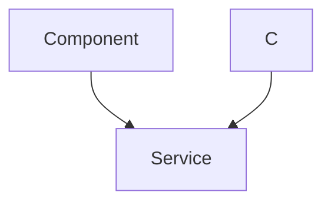
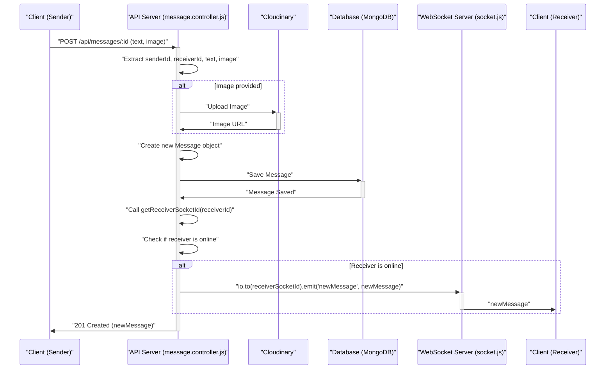

 # Real-time Messaging and Utilities

This section details the core components that enable real-time messaging capabilities and other essential backend utilities within the application. It covers the WebSocket implementation using Socket.IO for instant chat communication, integration with Cloudinary for image management, and utility functions for user authentication and token generation. These modules collectively ensure a dynamic and responsive user experience, particularly in the chat functionality.

## WebSocket and Real-time Communication

The `/backend/src/lib/socket.js` file is the cornerstone for establishing and managing WebSocket connections. It leverages `socket.io` to enable real-time, bidirectional communication between clients and the server. This setup is crucial for features like instant message delivery and displaying online user status.

```javascript
// backend/src/lib/socket.js
import { Server } from "socket.io";
import http from "http";
import express from "express";

const app = express();
const server = http.createServer(app);

const io = new Server(server, {
    cors: {
        origin: ["http://localhost:5173"] // Configured for frontend dev server
    }
})

export function getReceiverSocketId(userId) {
    return userSocketMap[userId];
}

// Stores userId:socketId mapping for online users
const userSocketMap = {};

io.on("connection", (socket) => {
    console.log("A user connected", socket.id);
    const userId = socket.handshake.query.userId;
    if(userId) userSocketMap[userId] = socket.id;

    // Emit online users to all connected clients
    io.emit("getOnlineUsers", Object.keys(userSocketMap));

    socket.on("disconnect", ()=>{
        console.log("A user disconnected", socket.id);
        delete userSocketMap[userId];
        io.emit("getOnlineUsers", Object.keys(userSocketMap));
    })
})

export { io, app, server };
```
[View on GitHub](https://github.com/shinymack/Chat-App-MERN/blob/main/backend/src/lib/socket.js)

The `userSocketMap` object is critical for tracking which socket ID belongs to which user, allowing messages to be directed to specific recipients. When a user connects, their `userId` is extracted from the handshake query, and their `socket.id` is stored. Upon disconnection, their entry is removed, and all clients are notified of the updated online user list.

Here's how a user connects and disconnects from the WebSocket server:





## Messaging Controller

The `/backend/src/controllers/message.controller.js` file handles all messaging-related API endpoints, including retrieving users for the sidebar, fetching message history, and sending new messages. This controller leverages the WebSocket `io` instance from `socket.js` to deliver real-time updates.

```javascript
// backend/src/controllers/message.controller.js
import User from "../models/user.model.js";
import Message from "../models/message.model.js";
import cloudinary from "../lib/cloudinary.js"; // Cloudinary for image uploads
import { getReceiverSocketId, io } from "../lib/socket.js"; // WebSocket server instance

export const getUsersForSidebar = async (req, res) => {
    try {
        const loggedInUserId = req.user._id;
        // Find all users except the logged-in user, and exclude their password
        const filteredUsers = await User.find({ _id: { $ne: loggedInUserId }}).select("-password");
        res.status(200).json(filteredUsers);
    } catch (error) {
        console.log("Error in getUsersForSidebar: ", error);
        res.status(500).json({ error: "Internal Server Error" });
    }
};
```
[View on GitHub](https://github.com/shinymack/Chat-App-MERN/blob/main/backend/src/controllers/message.controller.js#L5-L16)

The `getUsersForSidebar` function efficiently retrieves a list of all users available for chat, excluding the currently logged-in user. This ensures that the user interface can display a relevant list of contacts.

### Sending Messages with Real-time Updates

The `sendMessage` function is central to the chat application, handling both text and image messages, and ensuring that messages are delivered in real-time.

```javascript
// backend/src/controllers/message.controller.js
// ... (imports and other functions)

export const sendMessage = async (req, res) => {
    try {
        const { text, image } = req.body;
        const { id: receiverId } = req.params;
        const senderId = req.user._id;

        let imageUrl;
        if (image) {
            // Upload image to Cloudinary if provided
            const uploadResponse = await cloudinary.uploader.upload(image);
            imageUrl = uploadResponse.secure_url;
        }

        const newMessage = new Message({
            senderId,
            receiverId,
            text,
            image: imageUrl, // Store Cloudinary URL if available
        });

        await newMessage.save(); // Save message to database

        // Get receiver's socket ID for real-time delivery
        const receiverSocketId = getReceiverSocketId(receiverId);

        if(receiverSocketId) {
            // Emit "newMessage" event to the receiver
            io.to(receiverSocketId).emit("newMessage", newMessage);
        }

        res.status(201).json(newMessage);

    } catch (error) {
        console.log("Error in sendMessage controller:  ", error);
        res.status(500).json({ error: "Internal Server Error" });
    }
};
```
[View on GitHub](https://github.com/shinymack/Chat-App-MERN/blob/main/backend/src/controllers/message.controller.js#L41-L75)

This function first handles image uploads using Cloudinary if an image is part of the request. It then saves the message to the MongoDB database. Crucially, it attempts to get the receiver's `socketId` using `getReceiverSocketId`. If the receiver is online (i.e., has an active socket connection), the `io.to(receiverSocketId).emit("newMessage", newMessage)` line sends the new message directly to that client in real-time, bypassing the need for the client to poll for updates.

Here's the process flow for sending a message:





### Retrieving Messages

The `getMessages` function fetches the conversation history between two users:

```javascript
// backend/src/controllers/message.controller.js
// ... (imports and other functions)

export const getMessages = async (req, res) => {
    try {
        const {id : userToChatId } = req.params;
        const myId = req.user._id;

        // Find messages where senderId-receiverId match either way
        const messages = await Message.find({
            $or: [
                {senderId: myId, receiverId:userToChatId},
                {senderId: userToChatId, receiverId: myId}
            ]
        });
        res.status(200).json(messages);
    } catch (error) {
        console.log("Error in getMessages controller:  ", error);
        res.status(500).json({ error: "Internal Server Error" });
    }
};
```
[View on GitHub](https://github.com/shinymack/Chat-App-MERN/blob/main/backend/src/controllers/message.controller.js#L20-L38)

This function queries the database for all messages where the `senderId` and `receiverId` match the current user and the `userToChatId`, in either direction, ensuring that the entire conversation history is retrieved.

## Cloudinary for Image Management

The `/backend/src/lib/cloudinary.js` file configures and exports the Cloudinary SDK, enabling image upload capabilities. This is vital for a rich messaging experience that supports multimedia content.

```javascript
// backend/src/lib/cloudinary.js
import {v2 as cloudinary} from "cloudinary"
import { config } from 'dotenv'

config(); // Load environment variables

cloudinary.config(
    {
        cloud_name: process.env.CLOUDINARY_CLOUD_NAME,
        api_key: process.env.CLOUDINARY_API_KEY,
        api_secret: process.env.CLOUDINARY_API_SECRET,
    }
);

export default cloudinary;
```
[View on GitHub](https://github.com/shinymack/Chat-App-MERN/blob/main/backend/src/lib/cloudinary.js)

By centralizing the Cloudinary configuration, other modules can easily import and utilize the `cloudinary` object for image upload operations, as seen in `message.controller.js`.

## Utility Functions

The `/backend/src/lib/utils.js` file contains general utility functions. Currently, it includes `generateToken`, which is responsible for creating and setting JWT tokens for user authentication.

```javascript
// backend/src/lib/utils.js
import jwt from 'jsonwebtoken';

export const generateToken = (userId, res) => {
    const token = jwt.sign({userId}, process.env.JWT_SECRET,
        {expiresIn: "7d"});

    // Set JWT as an HTTP-only cookie
    res.cookie("jwt", token, {
        maxAge: 7 * 24 * 60 * 60 * 1000, // 7 days
        httpOnly: true, // Prevent client-side JS access
        sameSite: "strict", // CSRF protection
        secure: process.env.NODE_ENV !== "development", // Use secure cookies in production
    });
    return token;
};
```
[View on GitHub](https://github.com/shinymack/Chat-App-MERN/blob/main/backend/src/lib/utils.js)

This function signs a JWT with the user's ID and then sets it as an HTTP-only cookie, providing a secure method for maintaining user sessions. The `httpOnly` flag prevents client-side JavaScript from accessing the cookie, mitigating XSS attacks, while `sameSite: "strict"` helps protect against CSRF attacks.

## Key Integration Points

*   **Real-time Messaging Backbone**: The tight integration between `socket.js` and `message.controller.js` is paramount. `socket.js` provides the `io` instance and `getReceiverSocketId` function, which `message.controller.js` uses to broadcast new messages instantly. This architecture ensures that messages appear in the receiver's chat window without manual refreshing, offering a seamless user experience.
*   **Scalable Image Handling**: The use of Cloudinary (`cloudinary.js`) offloads image storage and delivery from the primary application server. This improves performance and scalability, as images are served from a dedicated content delivery network (CDN) and the application server is not burdened with large file operations.
*   **Secure Authentication**: The `generateToken` utility from `utils.js` ensures that user sessions are managed securely using JWTs stored in HTTP-only cookies. This separation of concerns means authentication logic is encapsulated and reusable across different parts of the application.
*   **Modular Design**: Each component (`socket.js`, `message.controller.js`, `cloudinary.js`, `utils.js`) is designed with a specific responsibility, promoting a modular and maintainable codebase. This allows for easier debugging, testing, and future feature expansion.

These backend utilities and real-time messaging capabilities collectively form a robust foundation for an interactive and responsive chat application.