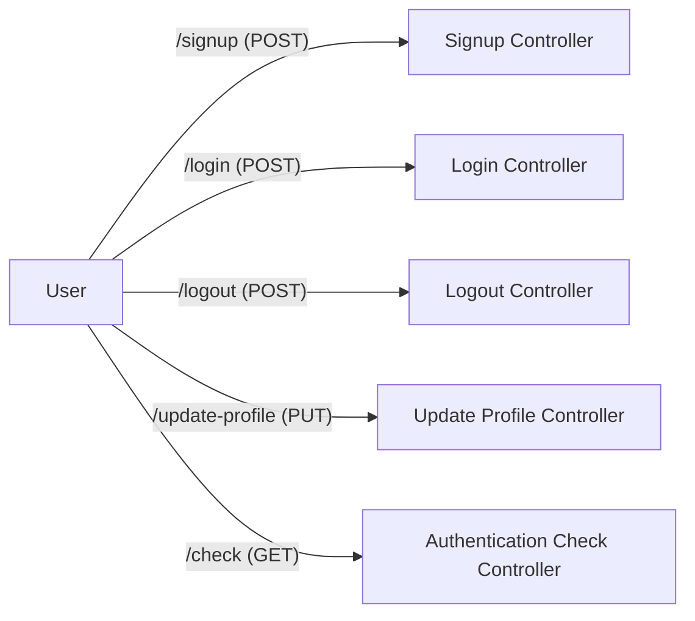
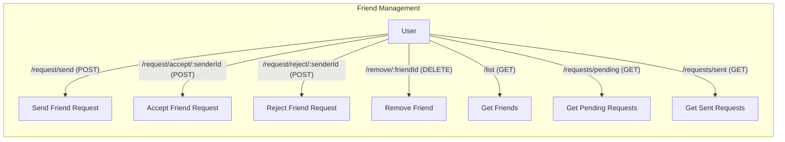
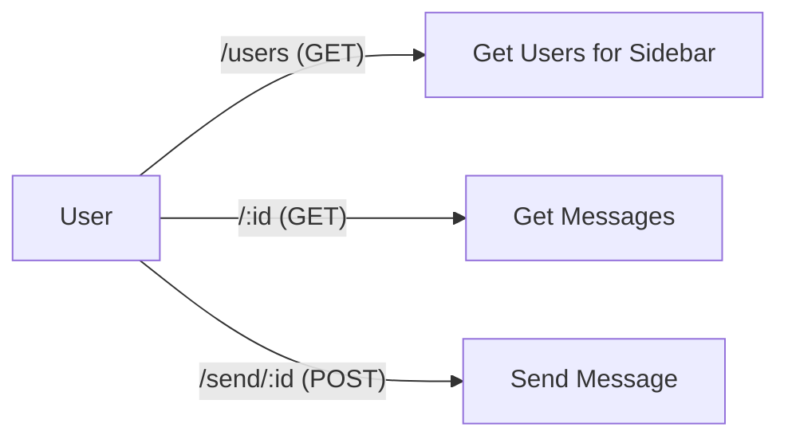

# Routes

This document describes the different routes available in the backend API of the Chat-App-MERN project. These routes are implemented using Express.js in the backend, providing endpoints for authentication, managing friends, and handling messages.

## Authentication Routes

The authentication routes, defined in `backend/src/routes/auth.route.js`, handle user registration, login, logout, profile updates, and authentication checks.

### Key Features:

*   **Signup:** Registers a new user.
*   **Login:** Authenticates an existing user.
*   **Logout:** Invalidates the user's session.
*   **Update Profile:** Allows authenticated users to modify their profile information.
*	**Username Availability:** Checks whether the username is already taken.
*   **Authentication Check:** Verifies if the user is currently authenticated.
*   **Google Authentication:** Supports authentication via Google.

```javascript title="backend/src/routes/auth.route.js - Signup Route"
router.post("/signup", signup);
```

This snippet shows the signup route.  It handles user registration by calling the `signup` controller function. [View on GitHub](https://github.com/shinymack/Chat-App-MERN/blob/main/backend/src/routes/auth.route.js)

```javascript title="backend/src/routes/auth.route.js - Login Route"
router.post("/login", login);
```

This snippet shows the login route.  It authenticates users by calling the `login` controller function. [View on GitHub](https://github.com/shinymack/Chat-App-MERN/blob/main/backend/src/routes/auth.route.js)

```javascript title="backend/src/routes/auth.route.js - Update Profile Route"
router.put("/update-profile", protectRoute ,updateProfile)
```

This snippet shows the update profile route.  It updates user profile by calling the `updateProfile` controller function, protected by `protectRoute` middleware. [View on GitHub](https://github.com/shinymack/Chat-App-MERN/blob/main/backend/src/routes/auth.route.js)





## Friend Routes

The friend routes, defined in `backend/src/routes/friend.route.js`, manage friend requests and friend lists. All routes are protected with the `protectRoute` middleware, ensuring only authenticated users can access them.

### Key Features:

*   **Send Friend Request:** Sends a friend request to another user.
*   **Accept Friend Request:** Accepts a friend request.
*   **Reject Friend Request:** Rejects a friend request.
*   **Remove Friend:** Removes a friend from the user's friend list.
*   **Get Friends:** Retrieves the user's friend list.
*   **Get Pending Requests:** Retrieves pending friend requests.
*   **Get Sent Requests:** Retrieves sent friend requests.

```javascript title="backend/src/routes/friend.route.js - Send Friend Request"
router.post("/request/send/", sendFriendRequest);
```

This snippet shows the route for sending a friend request. It calls the `sendFriendRequest` controller function. [View on GitHub](https://github.com/shinymack/Chat-App-MERN/blob/main/backend/src/routes/friend.route.js)

```javascript title="backend/src/routes/friend.route.js - Get Friends"
router.get("/list", getFriends);
```

This snippet shows the route for getting friend list. It calls the `getFriends` controller function. [View on GitHub](https://github.com/shinymack/Chat-App-MERN/blob/main/backend/src/routes/friend.route.js)





## Message Routes

The message routes, defined in `backend/src/routes/message.route.js`, handle fetching users for the sidebar, retrieving messages for a specific chat, and sending new messages. These routes are also protected by the `protectRoute` middleware.

### Key Features:

*   **Get Users for Sidebar:** Fetches a list of users to display in the sidebar (e.g., for selecting a chat).
*   **Get Messages:** Retrieves messages for a specific chat, identified by the recipient's ID.
*   **Send Message:** Sends a new message to a specific recipient.

```javascript title="backend/src/routes/message.route.js - Get Users for Sidebar"
router.get("/users", protectRoute, getUsersForSidebar);
```

This snippet shows the route for getting users for the sidebar.  It calls the `getUsersForSidebar` controller function. [View on GitHub](https://github.com/shinymack/Chat-App-MERN/blob/main/backend/src/routes/message.route.js)

```javascript title="backend/src/routes/message.route.js - Send Message"
router.post("/send/:id", protectRoute, sendMessage);
```

This snippet shows the route for sending a message.  It calls the `sendMessage` controller function. [View on GitHub](https://github.com/shinymack/Chat-App-MERN/blob/main/backend/src/routes/message.route.js)





## Key Integration Points

The routes are integrated with controller functions and middleware to handle the logic and security of the application.  The `protectRoute` middleware plays a crucial role in securing the API by verifying the user's authentication token before allowing access to protected routes. The controller functions then handle the specific actions requested by each route, such as creating a user, retrieving messages, or sending friend requests.
```