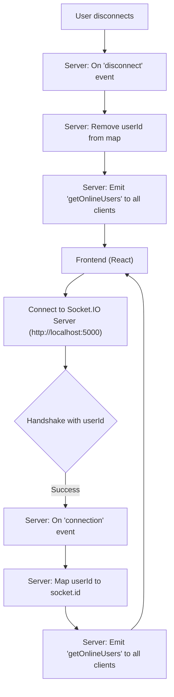

 # Utilities and External Services

This section provides comprehensive documentation for the core utility functions and external service integrations within the backend of the application. These components are essential for various functionalities, including secure data storage, real-time communication, database management, and user authentication.

## Cloudinary Integration

The `cloudinary.js` module is responsible for configuring and providing access to the Cloudinary cloud-based image and video management service. This integration is crucial for handling media uploads, ensuring that user-generated content like profile pictures or chat media can be stored and served efficiently.

The configuration leverages environment variables for sensitive credentials, promoting secure development practices. It initializes the Cloudinary SDK with the necessary `cloud_name`, `api_key`, and `api_secret`, making it ready for media management operations throughout the application.

```javascript
// backend/src/lib/cloudinary.js
import {v2 as cloudinary} from "cloudinary"
import { config } from 'dotenv'

config(); // Load environment variables

cloudinary.config(
    {cloud_name: process.env.CLOUDINARY_CLOUD_NAME,
    api_key: process.env.CLOUDINARY_API_KEY,
    api_secret: process.env.CLOUDINARY_API_SECRET,}
);

export default cloudinary; // Export the configured Cloudinary instance
```

**Explanation:**
This snippet demonstrates the initial setup for Cloudinary. It imports the `v2` namespace as `cloudinary` from the `cloudinary` package and loads environment variables using `dotenv`. The `cloudinary.config` method is then called with credentials retrieved from `process.env`. The configured `cloudinary` instance is exported as the default, allowing other modules to easily import and use it for file uploads, transformations, and management.

For example, a typical use case would involve uploading an image received from a client:

```javascript
// Example usage in an upload route
import cloudinary from '../lib/cloudinary.js';

// ... inside an async route handler ...
try {
    const uploadedResponse = await cloudinary.uploader.upload(file.path, {
        folder: "chat-app-media" // Optional: specify a folder
    });
    // Store uploadedResponse.secure_url in your database
    console.log("Image uploaded to Cloudinary:", uploadedResponse.secure_url);
    // ... further processing ...
} catch (error) {
    console.error("Cloudinary upload error:", error);
    // ... error handling ...
}
```

This integration allows the application to offload media storage and serving to a specialized external service, reducing server load and improving scalability.

[View `cloudinary.js` on GitHub](https://github.com/shinymack/Chat-App-MERN/blob/main/backend/src/lib/cloudinary.js)

## Database Connection

The `db.js` module is solely responsible for establishing a connection to the MongoDB database using Mongoose. This function, `connectDB`, is critical for ensuring that the application can interact with its persistence layer, storing and retrieving all necessary data, from user profiles to chat messages.

The connection string is retrieved from environment variables (`process.env.MONGODB_URI`), maintaining security and flexibility across different deployment environments. The `connectDB` function provides basic logging for successful connections and error handling for connection failures, which is vital for debugging and operational monitoring.

```javascript
// backend/src/lib/db.js
import mongoose from "mongoose"

export const connectDB = async () => {
  try {
    const conn = await mongoose.connect(process.env.MONGODB_URI);
    console.log(`MongoDB connected:  ${conn.connection.host}`);
  }
  catch(error){
    console.log("MongoDB connection error: ", error);
  }
}
```

**Explanation:**
The `connectDB` asynchronous function attempts to establish a connection to MongoDB using `mongoose.connect()`. Upon a successful connection, it logs the host of the connected database. In case of an error during the connection attempt, it logs a descriptive error message. This function is typically called once during the application's startup phase.

This centralized approach to database connection simplifies maintenance and ensures that all parts of the application utilize a consistent connection strategy.

[View `db.js` on GitHub](https://github.com/shinymack/Chat-App-MERN/blob/main/backend/src/lib/db.js)

## Socket.IO Real-time Communication

The `socket.js` module sets up and manages the Socket.IO server, enabling real-time, bidirectional event-based communication between the server and clients. This is fundamental for a chat application, allowing instant message delivery, online status updates, and other real-time features.

The module initializes a Socket.IO `Server` instance, leveraging an Express app and an HTTP server. It configures CORS to allow connections from specified origins, like the frontend application running on `http://localhost:5173`. A `userSocketMap` object maintains a mapping of `userId` to `socketId` for efficient targeting of specific users.

```javascript
// backend/src/lib/socket.js
import { Server } from "socket.io";
import http from "http";
import express from "express";

const app = express(); // Create an Express app instance
const server = http.createServer(app); // Create an HTTP server using the Express app

const io = new Server(server, {
    cors: {
        origin: ["http://localhost:5173"] // Allow connections from the frontend
    }
})

// Stores userId to socketId mapping for online users
const userSocketMap = {}; //{userId : socketId}

export function getReceiverSocketId(userId) {
    return userSocketMap[userId]; // Helper to get a user's socket ID
}

io.on("connection", (socket) => {
    console.log("A user connected", socket.id);

    const userId = socket.handshake.query.userId; // Get userId from handshake query
    if(userId) userSocketMap[userId] = socket.id; // Map userId to socketId if available

    io.emit("getOnlineUsers", Object.keys(userSocketMap)); // Emit updated online users list

    socket.on("disconnect", ()=>{
        console.log("A user disconnected", socket.id);
        delete userSocketMap[userId]; // Remove user from map on disconnect
        io.emit("getOnlineUsers", Object.keys(userSocketMap)); // Emit updated online users list
    })
})

export { io, app, server }; // Export for use in main application file
```

**Explanation:**
This extensive snippet configures Socket.IO. An Express `app` and `http` server are created to host the Socket.IO server. The `Server` is initialized with CORS options. The `userSocketMap` is a crucial data structure for tracking online users. On `connection`, the `userId` is extracted from the socket's handshake query, and the `userSocketMap` is updated. An `io.emit` sends the list of online users to all connected clients. On `disconnect`, the user is removed from the map, and the `getOnlineUsers` event is re-emitted. The `getReceiverSocketId` function provides a way to retrieve a specific user's socket ID, enabling targeted communication.

**Socket.IO Connection Flow:**





This setup enables various real-time functionalities:
*   **Sending/Receiving Messages:** When a user sends a message, the server can receive it and then emit it to the intended recipient's socket using `io.to(receiverSocketId).emit("newMessage", messageData)`.
*   **Online Status:** The `getOnlineUsers` event continuously updates the frontend about which users are currently online.
*   **Typing Indicators:** Clients can emit a "typing" event, which the server can then broadcast to relevant users.

[View `socket.js` on GitHub](https://github.com/shinymack/Chat-App-MERN/blob/main/backend/src/lib/socket.js)

## Authentication Utilities

The `utils.js` module provides utility functions primarily for user authentication, specifically token generation and management. This is a critical component for securing API routes and maintaining user sessions.

The `generateToken` function is responsible for creating a JSON Web Token (JWT) and setting it as an HTTP-only cookie in the response. This method enhances security by ensuring that the token is not accessible via client-side JavaScript, mitigating Cross-Site Scripting (XSS) attacks. The token includes the `userId` and is signed using a secret key from environment variables, with a defined expiration.

```javascript
// backend/src/lib/utils.js
import jwt from 'jsonwebtoken';

export const generateToken = (userId, res) => {
    // Sign a JWT with userId and a secret key, expiring in 7 days
    const token = jwt.sign({userId}, process.env.JWT_SECRET,
        {expiresIn: "7d"});

    // Set the JWT as an HTTP-only cookie
    res.cookie("jwt", token, {
        maxAge: 7 * 24 * 60 * 60 * 1000, // 7 days in milliseconds
        httpOnly: true, // Prevents client-side JS access
        sameSite: "strict", // Protects against Cross-Site Request Forgery (CSRF)
        secure: process.env.NODE_ENV !== "development", // Use HTTPS in production
    });
    return token;
};
```

**Explanation:**
The `generateToken` function takes a `userId` and the Express `response` object. It uses `jsonwebtoken.sign` to create a JWT, embedding the `userId` and signing it with `process.env.JWT_SECRET`. The token is configured to expire in 7 days. Subsequently, it sets an HTTP-only cookie named `jwt` on the response. The `maxAge` matches the token's expiration, `httpOnly` prevents JavaScript access, `sameSite: "strict"` offers CSRF protection, and `secure` ensures the cookie is only sent over HTTPS in production environments.

This function is typically called after a user successfully logs in or registers, ensuring they receive a valid session token.

```javascript
// Example usage in an authentication controller
import { generateToken } from '../lib/utils.js';

// ... inside an async login route handler ...
if (user && await bcrypt.compare(password, user.password)) {
    // User authenticated successfully
    generateToken(user._id, res); // Generate and set the JWT cookie
    res.status(200).json({
        _id: user._id,
        username: user.username,
        // ... other user details ...
    });
} else {
    // Authentication failed
    res.status(400).json({ error: "Invalid credentials" });
}
```

By abstracting token generation and cookie handling, this utility promotes consistency and security across all authentication-related features.

[View `utils.js` on GitHub](https://github.com/shinymack/Chat-App-MERN/blob/main/backend/src/lib/utils.js)

## Key Integration Points

These utility modules are cornerstones of the application's backend infrastructure, facilitating seamless operations and robust features.

*   **Application Startup:** The `connectDB` function from `db.js` is one of the first calls made when the application starts, ensuring that the database is accessible before any route handlers attempt to interact with it. Similarly, the `server` from `socket.js` is started, initiating the real-time communication layer.
*   **User Authentication Flow:** Post-authentication (login/signup), `generateToken` from `utils.js` is invoked to issue a secure JWT. This token is then implicitly used by subsequent requests for authorization, typically verified by middleware.
*   **Media Handling:** When users upload profile pictures or share media in chats, Cloudinary (`cloudinary.js`) is utilized to store and manage these assets. The URLs returned by Cloudinary are then saved in the MongoDB database, linking back to the user or message.
*   **Real-time Interactions:** The `io` instance from `socket.js` is used extensively in message controllers or services to emit new messages, online status updates, and typing indicators to relevant clients in real-time. The `getReceiverSocketId` function is crucial for targeting specific users with real-time events.

**Best Practices:**
*   **Environment Variables:** The consistent use of `process.env` for sensitive information (database URI, API keys, JWT secret) across all modules is a strong security practice. This keeps credentials out of source control.
*   **Modularity:** Each utility serves a distinct purpose, promoting a clean, maintainable, and scalable architecture. This modularity makes it easier to test, replace, or update individual components without affecting the entire system.
*   **Error Handling and Logging:** Basic error handling and logging are implemented for critical operations like database connection, which is essential for monitoring and debugging in production environments.
*   **HTTP-only Cookies:** Using HTTP-only cookies for JWTs significantly enhances security against XSS attacks, as client-side scripts cannot access the token.
*   **CORS Configuration:** Explicitly defining allowed origins for Socket.IO connections is important for security and preventing unauthorized access to the real-time communication layer.

This structured approach to utilities and external services ensures a robust, secure, and performant backend for the chat application.