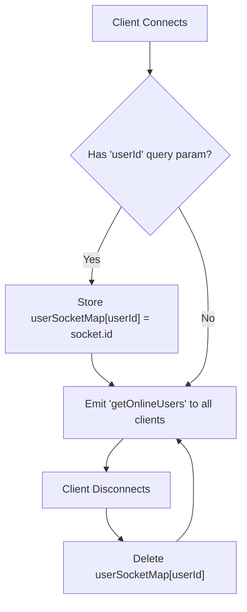
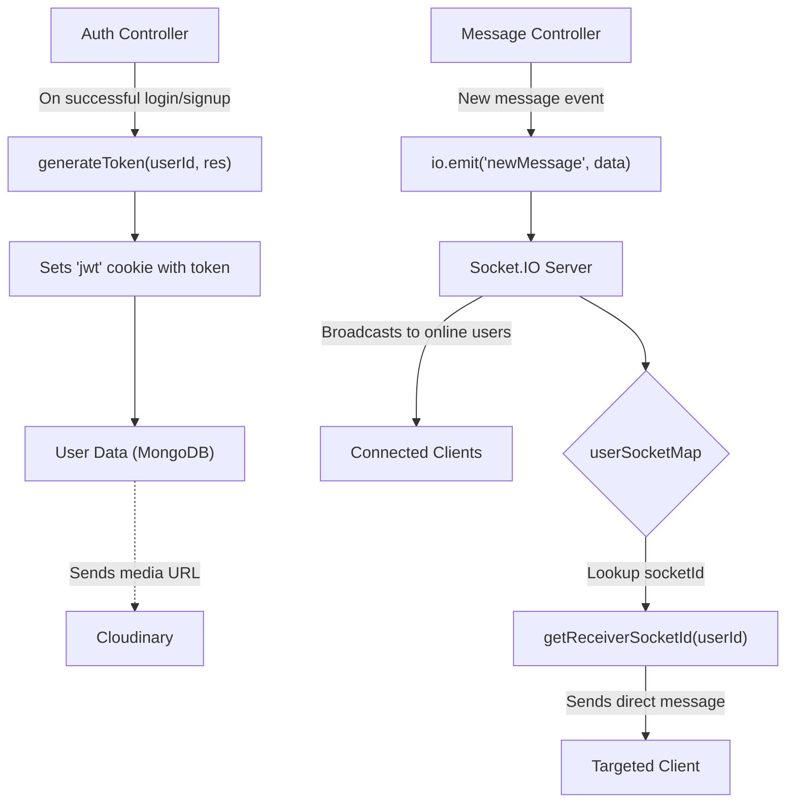

 ```
---
title: "Utilities and External Services"
description: "Helper functions and integrations with third-party services like Cloudinary and Socket.IO."
---

# Utilities and External Services

The backend service relies on a collection of utility functions and integrations with external third-party services to provide core functionalities like real-time communication, media management, and secure token generation. These components are encapsulated within the `lib` directory, ensuring modularity and reusability across the application. This section delves into the configuration and usage of these essential utilities and services.

## Dependency Management

The `backend/package.json` file outlines all the necessary dependencies for the server-side application. It provides a quick overview of the external libraries and frameworks being utilized, highlighting key integrations like Cloudinary for image uploads, Socket.IO for real-time features, and `jsonwebtoken` for authentication.

Here's a snippet of the core dependencies:

```json
// backend/package.json
{
  "name": "backend",
  "version": "1.0.0",
  "main": "src/index.js",
  // ... other fields
  "dependencies": {
    "bcryptjs": "^2.4.3",
    "cloudinary": "^2.5.1",
    "cookie-parser": "^1.4.7",
    "dotenv": "^16.4.7",
    "express": "^4.21.2",
    "express-session": "^1.18.1",
    "jsonwebtoken": "^9.0.2",
    "mongoose": "^8.9.5",
    "passport": "^0.7.0",
    "passport-google-oauth20": "^2.0.0",
    "socket.io": "^4.8.1"
  },
  "devDependencies": {
    "nodemon": "^3.1.9"
  }
}
```

[View on GitHub](https://github.com/shinymack/Chat-App-MERN/blob/main/backend/package.json)

The `dependencies` section shows libraries like `cloudinary`, `socket.io`, and `jsonwebtoken`, which are discussed in detail below. `nodemon` is listed as a `devDependencies` for development-time live reloading.

## Cloudinary Integration

Cloudinary is a cloud-based media management service used for storing and delivering images and videos. In this application, it's configured to handle user profile pictures or any other media uploads. The integration is managed through `backend/src/lib/cloudinary.js`. This file initializes the Cloudinary SDK with credentials loaded from environment variables, ensuring secure access and configuration.

```javascript
// backend/src/lib/cloudinary.js
import {v2 as cloudinary} from "cloudinary"
import { config } from 'dotenv'

config(); // Load environment variables

cloudinary.config(
    {cloud_name: process.env.CLOUDINARY_CLOUD_NAME,
    api_key: process.env.CLOUDINARY_API_KEY,
    api_secret: process.env.CLOUDINARY_API_SECRET,}
);

export default cloudinary;
```

[View on GitHub](https://github.com/shinymack/Chat-App-MERN/blob/main/backend/src/lib/cloudinary.js)

This setup allows other parts of the application to easily upload, manage, and retrieve assets without needing to handle the underlying storage infrastructure.

## Socket.IO for Real-time Communication

Socket.IO is a powerful library for real-time, bidirectional, event-based communication. It's crucial for features like instant messaging, online user status, and notifications. The core Socket.IO server setup resides in `backend/src/lib/socket.js`.

This file initializes the Socket.IO server, integrates it with an Express application, and manages the mapping of users to their active socket IDs. This mapping is vital for sending targeted real-time messages to specific users.

```javascript
// backend/src/lib/socket.js
import { Server } from "socket.io";
import http from "http";
import express from "express";

const app = express();
const server = http.createServer(app);
const io = new Server(server, {
    cors: {
        origin: ["http://localhost:5173"] // Frontend origin for CORS
    }
})

// Used to store online users: {userId : socketId}
const userSocketMap = {}; 

export function getReceiverSocketId(userId) {
    return userSocketMap[userId];
}

io.on("connection", (socket) => {
    console.log("A user connected", socket.id);

    const userId = socket.handshake.query.userId;
    if(userId) userSocketMap[userId] = socket.id;

    // Emit updated list of online users to all connected clients
    io.emit("getOnlineUsers", Object.keys(userSocketMap));

    socket.on("disconnect", ()=>{
        console.log("A user disconnected", socket.id);
        delete userSocketMap[userId]; 
        io.emit("getOnlineUsers", Object.keys(userSocketMap));
    })
})

export { io, app, server };
```

[View on GitHub](https://github.com/shinymack/Chat-App-MERN/blob/main/backend/src/lib/socket.js)

The `userSocketMap` object is central to tracking online users, mapping a `userId` to its corresponding `socketId`. The `io.on("connection")` event listener handles new client connections, associating their `userId` with their `socketId` and broadcasting updates to all clients about who is currently online. The `disconnect` event similarly updates the online user list when a user leaves.





This diagram illustrates the lifecycle of a user's connection with the Socket.IO server, from initial connection to disconnection, and how the online user map is maintained.

## Authentication Utilities

The `backend/src/lib/utils.js` file contains helper functions primarily for authentication-related tasks, specifically for generating JSON Web Tokens (JWTs). These tokens are crucial for maintaining user sessions and securing API endpoints.

```javascript
// backend/src/lib/utils.js
import jwt from 'jsonwebtoken';

export const generateToken = (userId, res) => {
    const token = jwt.sign({userId}, process.env.JWT_SECRET, 
        {expiresIn: "7d"}); // Token expires in 7 days

    res.cookie("jwt", token, {
        maxAge: 7 * 24 * 60 * 60 * 1000, // 7 days in milliseconds
        httpOnly: true, // Prevents client-side JS from accessing the cookie
        sameSite: "strict", // CSRF protection
        secure: process.env.NODE_ENV !== "development", // Use secure cookies in production
    });
    return token;
};
```

[View on GitHub](https://github.com/shinymack/Chat-App-MERN/blob/main/backend/src/lib/utils.js)

The `generateToken` function signs a JWT with the `userId` and a secret key from environment variables, setting it as an `httpOnly` cookie. This approach enhances security by making the token inaccessible to client-side JavaScript, mitigating Cross-Site Scripting (XSS) attacks. The `secure` flag ensures cookies are only sent over HTTPS in production environments, and `sameSite: "strict"` helps prevent Cross-Site Request Forgery (CSRF).

## Key Integration Points

The utility files in the `lib` directory are central to the backend's operation, acting as foundational services that other modules consume.

*   **Cloudinary**: Handles all media uploads. Any part of the application that needs to store images (e.g., user profiles, message attachments) will interact with the exported `cloudinary` instance.
*   **Socket.IO**: Provides the real-time backbone. Controllers or services that need to emit events (e.g., new messages, online status updates) or retrieve active user socket IDs will import `io` and `getReceiverSocketId`.
*   **Utilities (JWT)**: Ensures secure user sessions. After a successful user login or registration, the `generateToken` function is invoked to create and set an authentication cookie, allowing subsequent requests to be authenticated seamlessly.

These integrations abstract away complex external service interactions, providing clean, reusable interfaces for the rest of the application.





This diagram illustrates how various components interact with the utility services. The `Auth Controller` uses `generateToken` to manage user sessions. The `Message Controller` leverages `Socket.IO` to broadcast real-time updates and `getReceiverSocketId` to send direct messages, while media storage relies on `Cloudinary`.
```