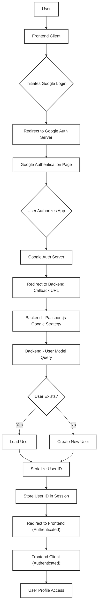
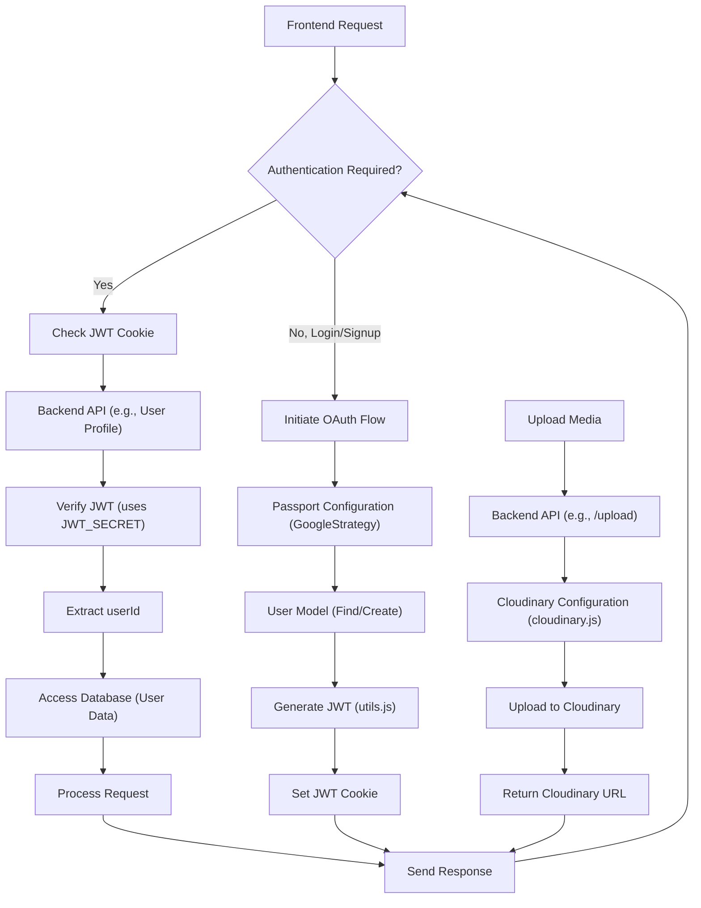

 # Utility Services and Integrations

This section provides an in-depth look into the backend utility services and third-party integrations crucial for the application's functionality. It covers aspects such as cloud storage for media, user authentication strategies, and general helper functions that streamline common tasks. These utilities are designed to be modular and robust, supporting various application features.

## Core Utility Modules

The backend leverages several dedicated modules for specific utility tasks:

*   **Cloudinary Integration (`cloudinary.js`):** Manages cloud-based image and video storage, transformation, and delivery.
*   **Passport Configuration (`passport.config.js`):** Sets up authentication middleware, specifically for Google OAuth, handling user login and session management.
*   **General Utilities (`utils.js`):** Contains helper functions, such as JWT token generation for authentication.

### Dependencies Overview

The `backend/package.json` file outlines the core dependencies used across these utility services:

```json
{
  "name": "backend",
  "version": "1.0.0",
  "main": "src/index.js",
  "scripts": {
    "dev": "nodemon src/index.js",
    "start": "node src/index.js"
  },
  "author": "",
  "type": "module",
  "license": "ISC",
  "description": "",
  "dependencies": {
    "bcryptjs": "^2.4.3",
    "cloudinary": "^2.5.1",
    "cookie-parser": "^1.4.7",
    "dotenv": "^16.4.7",
    "express": "^4.21.2",
    "express-session": "^1.18.1",
    "jsonwebtoken": "^9.0.2",
    "mongoose": "^8.9.5",
    "passport": "^0.7.0",
    "passport-google-oauth20": "^2.0.0",
    "socket.io": "^4.8.1"
  },
  "devDependencies": {
    "nodemon": "^3.1.9"
  }
}
```
[View `package.json` on GitHub](https://github.com/shinymack/Chat-App-MERN/blob/main/backend/package.json)

Key dependencies for utility services include `cloudinary`, `passport`, `passport-google-oauth20`, `jsonwebtoken`, `express-session`, and `dotenv`.

## Cloudinary Integration

The `backend/src/lib/cloudinary.js` module handles the configuration and export of the Cloudinary SDK, enabling easy interaction with the Cloudinary cloud media management service. It securely loads API credentials from environment variables to establish a connection.

```javascript
// backend/src/lib/cloudinary.js
import {v2 as cloudinary} from "cloudinary"
import { config } from 'dotenv'

config(); // Load environment variables

cloudinary.config(
    {cloud_name: process.env.CLOUDINARY_CLOUD_NAME,
    api_key: process.env.CLOUDINARY_API_KEY,
    api_secret: process.env.CLOUDINARY_API_SECRET,}
);

export default cloudinary;
```
[View `cloudinary.js` on GitHub](https://github.com/shinymack/Chat-App-MERN/blob/main/backend/src/lib/cloudinary.js)

This setup ensures that all media uploads, transformations, and retrievals are handled efficiently and securely through Cloudinary, offloading media storage from the application server.

## User Authentication with Passport (Google OAuth2.0)

The `backend/src/lib/passport.config.js` file is dedicated to configuring Passport.js for Google OAuth 2.0 authentication. It defines the strategy for users to log in or sign up using their Google accounts, manages user serialization and deserialization for session management, and handles the logic for creating new user profiles or linking existing ones.

### Google OAuth Strategy Configuration

The `GoogleStrategy` is initialized with credentials and a callback URL, which are crucial for the OAuth flow. The `scope` defines the user data requested from Google.

```javascript
// backend/src/lib/passport.config.js (excerpt)
import passport from 'passport';
import { Strategy as GoogleStrategy } from 'passport-google-oauth20';
import User from '../models/user.model.js'; 
import dotenv from 'dotenv';

dotenv.config(); 

export const configurePassport = () => {
    passport.use(new GoogleStrategy({
        clientID: process.env.GOOGLE_CLIENT_ID,
        clientSecret: process.env.GOOGLE_CLIENT_SECRET,
        callbackURL: process.env.GOOGLE_CALLBACK_URL,
        scope: ['profile', 'email'] // Request profile and email data
    },
    async (accessToken, refreshToken, profile, done) => {
        // ... (user lookup and creation logic)
    }));
    // ... (serializeUser, deserializeUser)
};
```
[View `passport.config.js` on GitHub](https://github.com/shinymack/Chat-App-MERN/blob/main/backend/src/lib/passport.config.js)

The strategy's callback function (`async (accessToken, refreshToken, profile, done) => { ... }`) is where the application receives user information from Google. It then checks if a user with the `googleId` already exists. If not, a new user account is created with details like `email`, `username`, and `authProvider`.

### User Session Management

Passport handles session management through `serializeUser` and `deserializeUser` functions.

```javascript
// backend/src/lib/passport.config.js (excerpt)
    passport.serializeUser((user, done) => {
        done(null, user.id); // Stores MongoDB _id in the session
    });

    passport.deserializeUser(async (id, done) => {
        try {
            const user = await User.findById(id); // Retrieves user from DB using ID
            done(null, user); // Attaches user object to req.user
        } catch (error) {
            done(error, null);
        }
    });
```
[View `passport.config.js` on GitHub](https://github.com/shinymack/Chat-App-MERN/blob/main/backend/src/lib/passport.config.js)

`serializeUser` determines what user data should be stored in the session (typically just the user ID), while `deserializeUser` retrieves the full user object from the database using that ID for subsequent requests, making the user information available via `req.user`.

### Google OAuth Flow

The following diagram illustrates the high-level flow of the Google OAuth 2.0 authentication process.





## General Utilities

The `backend/src/lib/utils.js` module contains common helper functions that can be reused across the application. Currently, it includes a function for generating JSON Web Tokens (JWTs) and setting them as HTTP-only cookies.

### JWT Token Generation

The `generateToken` function securely signs a JWT with the user's ID and sets it as a secure, HTTP-only cookie. This ensures that the token is not accessible via client-side JavaScript, mitigating certain types of cross-site scripting (XSS) attacks.

```javascript
// backend/src/lib/utils.js
import jwt from 'jsonwebtoken';

export const generateToken = (userId, res) => {
    const token = jwt.sign({userId}, process.env.JWT_SECRET, 
        {expiresIn: "7d"}); // Token expires in 7 days

    res.cookie("jwt", token, {
        maxAge: 7 * 24 * 60 * 60 * 1000, // 7 days in milliseconds
        httpOnly: true, // Prevents client-side JS access
        sameSite: "strict", // CSRF protection
        secure: process.env.NODE_ENV !== "development", // Use HTTPS in production
    });
    return token;
};
```
[View `utils.js` on GitHub](https://github.com/shinymack/Chat-App-MERN/blob/main/backend/src/lib/utils.js)

The `httpOnly` flag is crucial for security, and `sameSite: "strict"` helps prevent Cross-Site Request Forgery (CSRF) attacks. The `secure` flag ensures the cookie is only sent over HTTPS in production environments.

### Utility Service Interactions





## Key Integration Points

The utility services discussed above are fundamental to the backend's operation, providing crucial functionalities like secure authentication, media management, and token handling.

*   **Authentication Flow:** The `passport.config.js` module is at the heart of the authentication system, integrating with Google OAuth 2.0 to provide a seamless login experience. Once authenticated, `utils.js` takes over to generate and manage JWT tokens, ensuring secure session management.
*   **Media Handling:** `cloudinary.js` provides a centralized and efficient way to manage all user-generated content, such as profile pictures or chat media. By offloading media storage to a dedicated cloud service, the application reduces its server load and enhances scalability.
*   **Environment Variables:** All sensitive credentials, such as `CLOUDINARY_API_KEY`, `GOOGLE_CLIENT_ID`, and `JWT_SECRET`, are managed through environment variables (`.env` files) and loaded by `dotenv`. This practice is critical for security and ensures that sensitive information is not hardcoded into the application's source code.
*   **Modular Design:** Each utility is encapsulated within its own module, promoting a clean, maintainable, and scalable codebase. This modularity allows for easy updates, replacements, or additions of new services without impacting the entire application.

By understanding these core utility services and their interactions, developers can effectively extend and maintain the backend system, ensuring robust performance and security.