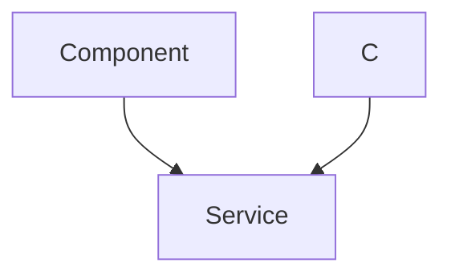

 # Utility and Integration Services

This section documents the essential utility functions, external service integrations, and shared libraries that underpin the backend services. These components provide crucial functionalities such as secure token generation, real-time communication, and external media management, ensuring the application's robustness and scalability. By centralizing these services, we maintain a clean separation of concerns and promote reusability across the backend.

## Cloudinary Integration

The `cloudinary.js` module facilitates seamless integration with Cloudinary, a powerful cloud-based media management service. This integration allows the application to efficiently upload, store, and deliver images and other media assets, offloading media handling from our servers and enhancing performance.

### Configuration

The Cloudinary configuration is loaded directly from environment variables, ensuring secure and flexible credentials management. The `v2` SDK is initialized with `cloud_name`, `api_key`, and `api_secret`.

```javascript
// backend/src/lib/cloudinary.js
import { v2 as cloudinary } from "cloudinary";
import { config } from 'dotenv';

config();

cloudinary.config(
    {
        cloud_name: process.env.CLOUDINARY_CLOUD_NAME,
        api_key: process.env.CLOUDINARY_API_KEY,
        api_secret: process.env.CLOUDINARY_API_SECRET,
    }
);

export default cloudinary;
```
[View on GitHub](https://github.com/shinymack/Chat-App-MERN/blob/main/backend/src/lib/cloudinary.js#L1-L12)

This setup makes the `cloudinary` object available for media upload and manipulation throughout the application. For instance, user profile pictures or chat media can be directly uploaded to Cloudinary, reducing server load and storage requirements.

## Socket.IO Real-time Communication

The `socket.js` module establishes and manages real-time bidirectional communication between the client and server using Socket.IO. This is critical for features requiring instant updates, such as chat messages, online user presence, and notifications.

### Server Initialization

The module initializes an Express application, an HTTP server, and a Socket.IO server. The Socket.IO server is configured with CORS to allow connections from the client-side application.

```javascript
// backend/src/lib/socket.js
import { Server } from "socket.io";
import http from "http";
import express from "express";

const app = express();
const server = http.createServer(app);
const io = new Server(server, {
    cors: {
        origin: ["http://localhost:5173"] // Client application origin
    }
});
```
[View on GitHub](https://github.com/shinymack/Chat-App-MERN/blob/main/backend/src/lib/socket.js#L1-L14)

### Online User Management

A `userSocketMap` object is maintained to track which `socketId` belongs to which `userId`, effectively managing the presence of online users.

```javascript
// backend/src/lib/socket.js
const userSocketMap = {}; //{userId : socketId}

export function getReceiverSocketId(userId) {
    return userSocketMap[userId];
}

io.on("connection", (socket) => {
    console.log("A user connected", socket.id);

    const userId = socket.handshake.query.userId;
    if(userId) userSocketMap[userId] = socket.id;

    io.emit("getOnlineUsers", Object.keys(userSocketMap));

    socket.on("disconnect", ()=>{
        console.log("A user disconnected", socket.id);
        delete userSocketMap[userId]; 
        io.emit("getOnlineUsers", Object.keys(userSocketMap));
    });
});

export { io, app, server };
```
[View on GitHub](https://github.com/shinymack/Chat-App-MERN/blob/main/backend/src/lib/socket.js#L17-L38)

When a user connects, their `userId` (obtained from the handshake query) is mapped to their `socketId`. Upon connection or disconnection, the `getOnlineUsers` event is emitted to all connected clients, broadcasting the updated list of online users. This mechanism ensures that the client-side UI can display current user statuses in real-time.

### Socket.IO Connection Flow

The following sequence diagram illustrates how a client connects to the Socket.IO server and how online user status is managed.





## Utility Functions

The `utils.js` module houses common utility functions, specifically focusing on authentication-related tasks like JSON Web Token (JWT) generation and cookie management.

### JWT Generation and Cookie Setting

The `generateToken` function creates a JWT for a given `userId`, signs it with a secret key, and sets it as an HTTP-only cookie on the response object. This method centralizes token generation and ensures consistent security practices for session management.

```javascript
// backend/src/lib/utils.js
import jwt from 'jsonwebtoken';

export const generateToken = (userId, res) => {
    const token = jwt.sign({userId}, process.env.JWT_SECRET,
        {expiresIn: "7d"});

    res.cookie("jwt", token, {
        maxAge: 7 * 24 * 60 * 60 * 1000, // 7 days
        httpOnly: true, // Prevent XSS attacks
        sameSite: "strict", // CSRF protection
        secure: process.env.NODE_ENV !== "development", // Use HTTPS in production
    });
    return token;
};
```
[View on GitHub](https://github.com/shinymack/Chat-App-MERN/blob/main/backend/src/lib/utils.js#L1-L17)

The cookie is configured with `httpOnly: true` to prevent client-side JavaScript access, `sameSite: "strict"` for CSRF protection, and `secure: true` in production environments to ensure the cookie is only sent over HTTPS. This multi-layered approach enhances the security of user sessions.

## Key Integration Points

These utility and integration services are foundational to the application's core functionalities:

1.  **Media Uploads**: Any feature requiring image or video uploads (e.g., user profiles, chat media) will utilize the `cloudinary` instance exported from `backend/src/lib/cloudinary.js`.
2.  **Authentication**: After a user successfully logs in or registers, the `generateToken` function from `backend/src/lib/utils.js` is called to create and set a JWT, establishing their authenticated session.
3.  **Real-time Messaging and Presence**: The `io` instance from `backend/src/lib/socket.js` is used extensively for sending and receiving chat messages, broadcasting online user status updates, and handling other real-time events. The `getReceiverSocketId` function allows direct messaging to specific users.
4.  **Environmental Configuration**: All these modules rely heavily on environment variables (`.env` files), which are loaded via `dotenv`, emphasizing the importance of proper environment setup for deployment and local development. This pattern ensures sensitive API keys and secrets are not hardcoded and can be managed securely.

By abstracting these services into dedicated modules, the application achieves a modular and maintainable architecture, allowing developers to focus on business logic while relying on robust, well-tested utilities for common tasks.