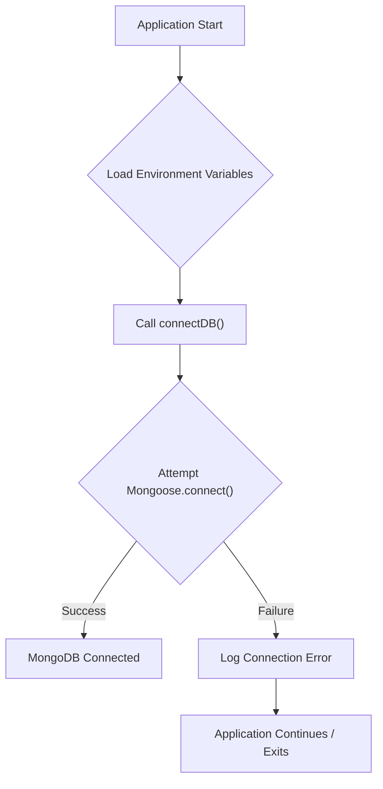
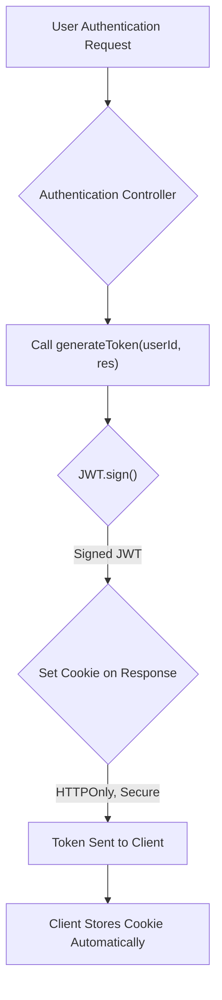

 # Utility Services and Libraries

This section provides comprehensive documentation for the backend's core utility services and libraries. These components are crucial for handling external integrations, managing database connections, facilitating real-time communication, and securing user sessions. Understanding these utilities is key to grasping the backend's operational backbone and how it interacts with external resources and client-side applications.

## Cloudinary Integration

The `cloudinary.js` file handles the configuration and export of the Cloudinary SDK, which is used for managing media assets. Cloudinary provides a robust platform for image and video upload, storage, and manipulation, offloading these resource-intensive tasks from the application server.

### Configuration

The configuration for Cloudinary is loaded directly from environment variables, ensuring sensitive API keys and cloud names are kept secure and separate from the codebase. This setup allows for easy deployment across different environments (development, staging, production) without code changes.

```javascript
// backend/src/lib/cloudinary.js
import {v2 as cloudinary} from "cloudinary"
import { config } from 'dotenv'

config(); // Loads environment variables

cloudinary.config(
    {
        cloud_name: process.env.CLOUDINARY_CLOUD_NAME,
        api_key: process.env.CLOUDINARY_API_KEY,
        api_secret: process.env.CLOUDINARY_API_SECRET,
    }
);

export default cloudinary;
```

[View on GitHub](https://github.com/shinymack/Chat-App-MERN/blob/main/backend/src/lib/cloudinary.js)

### Usage
Once configured, the `cloudinary` instance can be imported and used throughout the application to perform various media-related operations, such as uploading images for user profiles or chat attachments.

## Database Connection (MongoDB)

The `db.js` file is responsible for establishing and managing the connection to the MongoDB database using Mongoose. This utility ensures that the application can reliably connect to its data store, which is fundamental for any data-driven application.

### Connection Logic

The `connectDB` function attempts to establish a connection to MongoDB using the URI specified in the environment variables. It includes error handling to gracefully manage connection failures, logging messages to the console for monitoring and debugging.

```javascript
// backend/src/lib/db.js
import mongoose from "mongoose"

export const connectDB = async () => {
  try {
    const conn = await mongoose.connect(process.env.MONGODB_URI);
    console.log(`MongoDB connected:  ${conn.connection.host}`);
  }
  catch(error){
    console.log("MongoDB connection error: ", error);
    // In a production environment, you might want to exit the process
    // process.exit(1);
  }
}
```

[View on GitHub](https://github.com/shinymack/Chat-App-MERN/blob/main/backend/src/lib/db.js)

### Database Connection Flow
Here's a simplified view of the database connection process:





### Environment Variable
The `MONGODB_URI` environment variable typically contains the connection string, including credentials and the database host. For example: `mongodb+srv://<username>:<password>@<cluster-url>/<database-name>?retryWrites=true&w=majority`.

## Socket.io for Real-time Communication

The `socket.js` file sets up and manages the Socket.io server, enabling real-time, bidirectional event-based communication between the backend and client applications. This is critical for features like live chat messages, online user presence, and notifications.

### Server Setup and Initialization

The Socket.io server is initialized on top of an HTTP server created with `express` and `http`. CORS (Cross-Origin Resource Sharing) is configured to allow connections from specified origins, typically the client-side application.

```javascript
// backend/src/lib/socket.js
import { Server } from "socket.io";
import http from "http";
import express from "express";

const app = express();
const server = http.createServer(app);

const io = new Server(server, {
    cors: {
        origin: ["http://localhost:5173"] // Allows connection from frontend
    }
})
```

[View on GitHub](https://github.com/shinymack/Chat-App-MERN/blob/main/backend/src/lib/socket.js#L1-L12)

### Online User Tracking

A `userSocketMap` object is used to keep track of currently online users by mapping `userId` to their `socketId`. This map is essential for emitting messages to specific users. The `getReceiverSocketId` function provides an easy way to retrieve a user's socket ID.

```javascript
// backend/src/lib/socket.js
// ... (imports and server setup) ...

export function getReceiverSocketId(userId) {
    return userSocketMap[userId];
}

// Used to store online users
const userSocketMap = {}; //{userId : socketId}

// ... (io.on connection handler) ...
```

[View on GitHub](https://github.com/shinymack/Chat-App-MERN/blob/main/backend/src/lib/socket.js#L18-L26)

### Connection and Disconnection Handling

The `io.on("connection", ...)` event listener handles new client connections. When a user connects, their `userId` is extracted from the socket's handshake query, and they are added to the `userSocketMap`. The server then broadcasts an updated list of online users to all connected clients.
Similarly, `socket.on("disconnect", ...)` handles when a client disconnects, removing them from the `userSocketMap` and again broadcasting the updated online user list.

```javascript
// backend/src/lib/socket.js
// ... (previous code) ...

io.on("connection", (socket) => {
    console.log("A user connected", socket.id);

    const userId = socket.handshake.query.userId;
    if(userId) userSocketMap[userId] = socket.id;

    // Emit online users to all clients
    io.emit("getOnlineUsers", Object.keys(userSocketMap));

    socket.on("disconnect", ()=>{
        console.log("A user disconnected", socket.id);
        delete userSocketMap[userId];
        io.emit("getOnlineUsers", Object.keys(userSocketMap));
    })
})

export { io, app, server };
```

[View on GitHub](https://github.com/shinymack/Chat-App-MERN/blob/main/backend/src/lib/socket.js#L29-L44)

## Utility Functions

The `utils.js` file contains general-purpose utility functions that support various aspects of the application, such as user authentication and session management.

### JWT Token Generation

The `generateToken` function creates a JSON Web Token (JWT) for a given `userId`. This token is then set as an `httpOnly` cookie in the response, providing a secure way to manage user sessions. The token's expiration is set to 7 days, and its properties are configured for security best practices.

```javascript
// backend/src/lib/utils.js
import jwt from 'jsonwebtoken';

export const generateToken = (userId, res) => {
    const token = jwt.sign({userId}, process.env.JWT_SECRET,
        {expiresIn: "7d"});

    res.cookie("jwt", token, {
        maxAge: 7 * 24 * 60 * 60 * 1000, // 7 days in milliseconds
        httpOnly: true, // Prevents client-side JS from accessing
        sameSite: "strict", // Protects against CSRF attacks
        secure: process.env.NODE_ENV !== "development", // Use secure cookies in production
    });
    return token;
};
```

[View on GitHub](https://github.com/shinymack/Chat-App-MERN/blob/main/backend/src/lib/utils.js)

### Token Issuance Flow





## Key Integration Points

These utility services and libraries form the foundational layer for various backend operations. Their proper configuration and usage are paramount for the application's stability, security, and functionality.

*   **Environment Variables:** All critical configurations (Cloudinary keys, MongoDB URI, JWT secret) rely heavily on environment variables (`.env` file). This decoupling of configuration from code is essential for security and deployability.
*   **API Interactions:** Cloudinary directly interacts with an external cloud service, making robust error handling and network resilience important.
*   **Real-time Capabilities:** Socket.io is a separate, persistent connection that runs alongside the standard HTTP request/response cycle. Its efficient management of online users and message broadcasting is crucial for a responsive chat application.
*   **Security:** JWTs and `httpOnly` cookies are fundamental for maintaining secure user sessions and preventing common web vulnerabilities like Cross-Site Scripting (XSS).

Understanding how these components are set up and interact allows for better debugging, feature development, and performance optimization across the entire backend.

Next: [Frontend Implementation](./3_frontend-implementation.mdx)