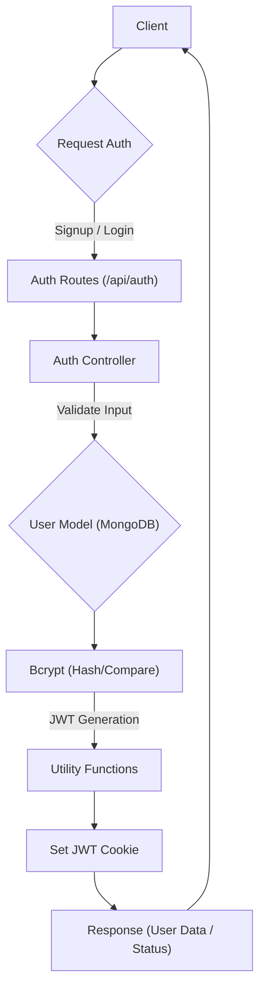
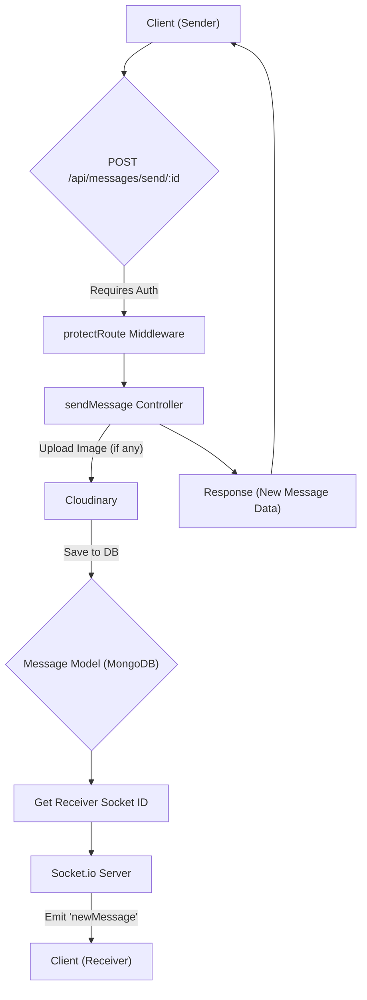

 # API Endpoints and Controllers

This section provides comprehensive documentation for the RESTful API endpoints, detailing their routes, expected inputs, and the core logic implemented within their respective controllers. The API is structured into two main modules: **Authentication** and **Messaging**. Each module leverages dedicated route and controller files to ensure clear separation of concerns and maintainability.

## Authentication Endpoints

The authentication module handles user registration, login, logout, session management, profile updates, and username availability checks. It integrates with JWT for secure session management and Passport.js for Google OAuth.

### Core Authentication Flow





### Authentication Routes and Controller Logic

The `backend/src/routes/auth.route.js` file defines the routes, while `backend/src/controllers/auth.controller.js` contains the logic for each endpoint.

-   **File:** `backend/src/routes/auth.route.js` [View on GitHub](https://github.com/shinymack/Chat-App-MERN/blob/main/backend/src/routes/auth.route.js)
-   **File:** `backend/src/controllers/auth.controller.js` [View on GitHub](https://github.com/shinymack/Chat-App-MERN/blob/main/backend/src/controllers/auth.controller.js)

#### 1. User Registration

-   **Endpoint:** `POST /api/auth/signup`
-   **Description:** Allows new users to register an account with a username, email, and password. Performs extensive input validation.
-   **Access:** Public
-   **Controller:** `signup`

```javascript
// backend/src/controllers/auth.controller.js
export const signup = async (req, res) => {
    const {username, email, password} = req.body;
    try {
        if(!username || !email || !password) {
            return res.status(400).json({message: "Please fill in all fields."});
        }
        if (username.length < 3 || username.length > 20) { /* ... */ }
        if (password.length < 6) { /* ... */ }
        const user = await User.findOne({email});
        if (user) return res.status(400).json({message: "Email already exists."});
        const existingUserByUsername = await User.findOne({ username });
        if (existingUserByUsername) {
            return res.status(400).json({ message: "Username already exists. Please choose another." });
        }
        const salt = await bcrypt.genSalt(10);
        const hashedPassword = await bcrypt.hash(password, salt);
        const newUser = new User({ username, email, password: hashedPassword, authProvider: 'email' });
        if(newUser){
            generateToken(newUser._id, res); // Generates and sets JWT cookie
            await newUser.save();
            res.status(201).json({ _id: newUser._id, username: newUser.username, email: newUser.email, /* ... */ });
        } else { res.status(400).json({message: "Invalid user data."}); }
    } catch (error) { /* ... */ }
};
```

#### 2. User Login

-   **Endpoint:** `POST /api/auth/login`
-   **Description:** Authenticates an existing user with their email and password. Generates a JWT upon successful login. Handles cases where users attempt to log in with an email/password after registering via Google.
-   **Access:** Public
-   **Controller:** `login`

```javascript
// backend/src/controllers/auth.controller.js
export const login = async (req, res) => {
    const {email, password} = req.body;
    try {
        const user = await User.findOne({email});
        if(!user) { return res.status(400).json({message: "Invalid credentials."}); }
        if(user.authProvider === 'google' && !user.password){
            return res.status(400).json({ message: "Please sign in with Google." });
        }
        const isPasswordCorrect = await bcrypt.compare(password, user.password);
        if(!isPasswordCorrect) { return res.status(400).json({message: "Invalid credentials."}); }
        generateToken(user._id, res); // Generates and sets JWT cookie
        res.status(200).json({ _id: user._id, username: user.username, email: user.email, /* ... */ });
    } catch (error) { /* ... */ }
};
```

#### 3. User Logout

-   **Endpoint:** `POST /api/auth/logout`
-   **Description:** Clears the JWT cookie, effectively logging the user out.
-   **Access:** Public (though typically accessed by authenticated users)
-   **Controller:** `logout`

```javascript
// backend/src/controllers/auth.controller.js
export const logout = (req, res) => {
    try {
        res.cookie("jwt", "", {maxAge: 0}); // Clears the JWT cookie
        res.status(200).json({message: "Logged out successfully."})
    } catch(error) { /* ... */ }
};
```

#### 4. Check Authentication Status

-   **Endpoint:** `GET /api/auth/check`
-   **Description:** Verifies the user's authentication status using the JWT cookie. Returns user details if authenticated. Protected by `protectRoute` middleware.
-   **Access:** Protected
-   **Controller:** `checkAuth`

#### 5. Google OAuth Integration

-   **Endpoints:**
    -   `GET /api/auth/google`: Initiates Google OAuth flow.
    -   `GET /api/auth/google/callback`: Callback URL for Google to redirect to after authentication.
-   **Description:** Utilizes Passport.js with the Google strategy for third-party authentication. Upon successful authentication, a JWT is generated, and the user is redirected to the frontend.
-   **Access:** Public
-   **Controller:** `googleAuthCallback`

```javascript
// backend/src/routes/auth.route.js
router.get(
    '/google',
    passport.authenticate('google', { scope: ['profile', 'email'] })
);
router.get(
    '/google/callback',
    passport.authenticate('google', {
        failureRedirect: 'http://localhost:5173/login',
        failureMessage: true
    }),
    googleAuthCallback
);
```

#### 6. Check Username Availability

-   **Endpoint:** `GET /api/auth/username/check/:username`
-   **Description:** Checks if a given username is available. Used during registration and profile updates.
-   **Access:** Protected
-   **Controller:** `checkUsernameAvailability`

#### 7. Update User Profile

-   **Endpoint:** `PUT /api/auth/update-profile`
-   **Description:** Allows an authenticated user to update their profile picture and/or username. Integrates with Cloudinary for image uploads.
-   **Access:** Protected
-   **Controller:** `updateProfile`

```javascript
// backend/src/controllers/auth.controller.js
export const updateProfile = async (req, res) => {
    try {
        const { profilePic, username } = req.body;
        const userId = req.user._id;
        let userToUpdate = await User.findById(userId);
        if (!userToUpdate) { return res.status(404).json({ message: "User not found." }); }

        const fieldsToUpdate = {};
        let newUsername = username ? username.trim() : null;

        if (newUsername && newUsername !== userToUpdate.username) {
            if (newUsername.length < 3 || newUsername.length > 20) { /* ... */ }
            const existingUserWithNewUsername = await User.findOne({ username: newUsername, _id: { $ne: userId } });
            if (existingUserWithNewUsername) { return res.status(400).json({ message: "This username is already taken by someone else." }); }
            fieldsToUpdate.username = newUsername;
        }

        if (profilePic) {
            const uploadResponse = await cloudinary.uploader.upload(profilePic);
            fieldsToUpdate.profilePic = uploadResponse.secure_url;
        }

        if (Object.keys(fieldsToUpdate).length === 0) {
            return res.status(400).json({ message: "No changes provided to update." });
        }

        const updatedUser = await User.findByIdAndUpdate(userId, { $set: fieldsToUpdate }, { new: true });
        generateToken(updatedUser._id, res); // Refresh JWT cookie with potentially new info
        res.status(200).json(updatedUser);

    } catch (error) { /* ... */ }
};
```

## Messaging Endpoints

The messaging module handles fetching users for the chat sidebar, retrieving conversation messages, and sending new messages, including image uploads.

### Message Flow Diagram





### Messaging Routes and Controller Logic

The `backend/src/routes/message.route.js` file defines the routes, while `backend/src/controllers/message.controller.js` contains the logic.

-   **File:** `backend/src/routes/message.route.js` [View on GitHub](https://github.com/shinymack/Chat-App-MERN/blob/main/backend/src/routes/message.route.js)
-   **File:** `backend/src/controllers/message.controller.js` [View on GitHub](https://github.com/shinymack/Chat-App-MERN/blob/main/backend/src/controllers/message.controller.js)

#### 1. Get Users for Sidebar

-   **Endpoint:** `GET /api/messages/users`
-   **Description:** Retrieves a list of all users in the system, excluding the currently logged-in user. This is used to populate the chat sidebar.
-   **Access:** Protected
-   **Controller:** `getUsersForSidebar`

```javascript
// backend/src/controllers/message.controller.js
export const getUsersForSidebar = async (req, res) => {
    try {
        const loggedInUserId = req.user._id;
        // Find all users except the logged-in user, and exclude their password field
        const filteredUsers = await User.find({ _id: { $ne: loggedInUserId }}).select("-password");
        res.status(200).json(filteredUsers);
    }
    catch (error) { /* ... */ }
};
```

#### 2. Get Conversation Messages

-   **Endpoint:** `GET /api/messages/:id`
-   **Description:** Fetches all messages exchanged between the logged-in user and a specified `userToChatId`.
-   **Access:** Protected
-   **Controller:** `getMessages`

#### 3. Send Message

-   **Endpoint:** `POST /api/messages/send/:id`
-   **Description:** Sends a new message (text and/or image) from the logged-in user to the specified `receiverId`. If an image is included, it's uploaded to Cloudinary. The new message is saved to the database, and real-time communication is facilitated via Socket.io to the receiver if they are online.
-   **Access:** Protected
-   **Controller:** `sendMessage`

```javascript
// backend/src/controllers/message.controller.js
export const sendMessage = async (req, res) => {
    try {
        const { text, image } = req.body;
        const { id: receiverId } = req.params;
        const senderId = req.user._id;

        let imageUrl;
        if (image) {
            const uploadResponse = await cloudinary.uploader.upload(image);
            imageUrl = uploadResponse.secure_url;
        }
        const newMessage = new Message({ senderId, receiverId, text, image: imageUrl });
        await newMessage.save();

        const receiverSocketId = getReceiverSocketId(receiverId);
        if(receiverSocketId) {
            io.to(receiverSocketId).emit("newMessage", newMessage); // Real-time message delivery
        }
        res.status(201).json(newMessage);
    } catch (error) { /* ... */ }
};
```

## Key Integration Points

This architecture ensures a robust and scalable backend for the chat application. Key integration points include:

-   **`protectRoute` Middleware**: Crucial for securing almost all API endpoints, ensuring that only authenticated users can access sensitive resources.
-   **JWT for Session Management**: Provides a stateless and secure way to manage user sessions across requests.
-   **Cloudinary Integration**: Handles efficient storage and retrieval of user profile pictures and message images.
-   **Socket.io for Real-time Communication**: Enables instant message delivery, crucial for a responsive chat application experience.
-   **Input Validation**: Implemented extensively in controllers to ensure data integrity and prevent common vulnerabilities.

Next: [Data Models and Authentication](./2.2_data-models-and-authentication.mdx)