 # Authentication and Authorization

This section details the robust authentication and authorization system implemented in the application. It covers user registration, login, session management using JWTs, access control via middleware, and external authentication with Google OAuth, as well as profile management functionalities.

## User Management and Data Model

The foundation of user management is the `User` model, which defines the schema for storing user information. It supports both traditional email/password authentication and Google OAuth.

### User Schema (`backend/src/models/user.model.js`)

The `User` schema includes essential fields such as email, username, password (for 'email' provider), profile picture, and fields to manage friends and friend requests. It also incorporates `authProvider` and `googleId` to differentiate between authentication methods.

```javascript
// backend/src/models/user.model.js
import mongoose from "mongoose"

const  userSchema = new mongoose.Schema(
    {
        email: { 
            type: String,
            required: true,
            unique: true
        },
        username: {
            type: String,
            required: [true, "Username is required"],
            unique: true,
            trim: true,
            minlength: [3, "Username must be at least 3 characters long"],
            maxlength: [20, "Username cannot be more than 20 characters long"]
        },
        password: {
            type: String,
            minlength: 6,
        },
        profilePic: {
            type: String,
            default: "",
        },
        authProvider: {
            type: String,
            enum: ['email', 'google'],
            default: 'email'
        },
        googleId: {
            type: String,
            unique: true,
            sparse: true
        },
    },
    { 
        timestamps: true
    } 
);

userSchema.pre('save', async function(next) {
    if (this.authProvider === 'google' && !this.isModified('password')) {
        this.password = undefined;
    }
    if (this.authProvider === 'email' && !this.password && this.isNew) {
        return next(new Error('Password is required for email signup.'));
    }
    next();
});

const User = mongoose.model("User", userSchema);

export default User;
```
[View on GitHub](https://github.com/shinymack/Chat-App-MERN/blob/main/backend/src/models/user.model.js)

The `pre('save')` hook ensures that a password is not set for Google-authenticated users and enforces password presence for new email-authenticated users.

## Authentication Flows

The `auth.controller.js` file handles all the core authentication logic, including signup, login, logout, and Google OAuth callbacks.

### User Registration (`signup`)

The `signup` function handles new user registration. It validates input fields, checks for existing users, hashes the password using `bcryptjs`, creates a new `User` document, and generates a JSON Web Token (JWT) for session management.

```javascript
// backend/src/controllers/auth.controller.js
export const signup = async (req, res) => {
    const {username, email, password} = req.body;
    try {
        if(!username || !email || !password) {
            return res.status(400).json({message: "Please fill in all fields."});
        }
        // ... (username/password length validations)
        
        const user = await User.findOne({email});
        if (user) return res.status(400).json({message: "Email already exists."});
        
        const existingUserByUsername = await User.findOne({ username });
        if (existingUserByUsername) {
            return res.status(400).json({ message: "Username already exists. Please choose another." });
        }

        const salt = await bcrypt.genSalt(10);
        const hashedPassword = await bcrypt.hash(password, salt);

        const newUser = new User({
            username,
            email,
            password: hashedPassword,
            authProvider: 'email'
        });
        if(newUser){
            generateToken(newUser._id, res); // Generates JWT
            await newUser.save();

            res.status(201).json({
                _id: newUser._id,
                username: newUser.username,
                email: newUser.email,   
                profilePic: newUser.profilePic,
                authProvider: newUser.authProvider
            });
        } else {
            res.status(400).json({message: "Invalid user data."});
        }
    } catch (error) {
        console.log("Error in signup controller", error.message)
        res.status(500).json({message: "Something went wrong."});
    }
};
```
[View on GitHub](https://github.com/shinymack/Chat-App-MERN/blob/main/backend/src/controllers/auth.controller.js#L7-L66)

### User Login (`login`)

The `login` function authenticates existing users. It verifies the provided email and password against the stored credentials. Upon successful authentication, a JWT is generated and sent as an HTTP-only cookie.

```javascript
// backend/src/controllers/auth.controller.js
export const login = async (req, res) => {
    const {email, password} = req.body;
    try {
        const user = await User.findOne({email});

        if(!user) {
            return res.status(400).json({message: "Invalid credentials."});
        }

        if(user.authProvider === 'google' && !user.password){
            return res.status(400).json({ message: "Please sign in with Google." });
        }

        const isPasswordCorrect = await bcrypt.compare(password, user.password);
        if(!isPasswordCorrect) {
            return res.status(400).json({message: "Invalid credentials."});
        }

        generateToken(user._id, res); // Generates JWT
        res.status(200).json({
            _id: user._id,
            username: user.username,
            email: user.email,
            profilePic: user.profilePic,
            authProvider: user.authProvider,
        });
    } catch (error) {
        console.log("Error in login controller", error.message);
        res.status(500).json({message: "Something went wrong."});
    }
};
```
[View on GitHub](https://github.com/shinymack/Chat-App-MERN/blob/main/backend/src/controllers/auth.controller.js#L68-L100)

### User Logout (`logout`)

The `logout` function simply clears the JWT cookie, effectively ending the user's session.

```javascript
// backend/src/controllers/auth.controller.js
export const logout = (req, res) => {
    try {
        res.cookie("jwt", "", {maxAge: 0}); // Clears JWT cookie
        res.status(200).json({message: "Logged out successfully."})
    } catch(error) {
        console.log("Error in logout controller", error.message);
        res.status(500).json({message:"Internal Server Error"}); 
    }
};
```
[View on GitHub](https://github.com/shinymack/Chat-App-MERN/blob/main/backend/src/controllers/auth.controller.js#L103-L111)

### Google OAuth Callback (`googleAuthCallback`)

This controller handles the redirect after a successful Google authentication. It generates a JWT for the user and redirects them to the frontend application.

```javascript
// backend/src/controllers/auth.controller.js
export const googleAuthCallback = async (req, res) => {
 const frontendUrl = process.env.FRONTEND_URL || 'http://localhost:5173';

    try {
        if (!req.user) {
            return res.redirect(`${frontendUrl}/login?error=google_auth_failed`);
        }

        generateToken(req.user._id, res); // Generates JWT for Google user

        res.redirect(frontendUrl);

    } catch (error) {
        console.error("Error in googleAuthCallback: ", error.message);
        res.redirect(`${frontendUrl}/login?error=google_auth_processing_error`);
    }
};
```
[View on GitHub](https://github.com/shinymack/Chat-App-MERN/blob/main/backend/src/controllers/auth.controller.js#L134-L153)

### Profile Management (`updateProfile`, `checkUsernameAvailability`)

Users can update their profile information, including their username and profile picture. The `updateProfile` controller handles the logic for updating user details, including interaction with Cloudinary for image uploads. A `checkUsernameAvailability` endpoint is provided to ensure unique usernames.

```javascript
// backend/src/controllers/auth.controller.js
export const updateProfile = async (req, res) => {
    try {
        const { profilePic, username } = req.body;
        const userId = req.user._id;
        let userToUpdate = await User.findById(userId);

        if (!userToUpdate) {
            return res.status(404).json({ message: "User not found." });
        }

        const fieldsToUpdate = {};
        let newUsername = username ? username.trim() : null;

        if (newUsername && newUsername !== userToUpdate.username) {
            if (newUsername.length < 3 || newUsername.length > 20) {
                return res.status(400).json({ message: "Username must be between 3 and 20 characters." });
            }
            const existingUserWithNewUsername = await User.findOne({ username: newUsername, _id: { $ne: userId } });
            if (existingUserWithNewUsername) {
                return res.status(400).json({ message: "This username is already taken by someone else." });
            }
            fieldsToUpdate.username = newUsername;
        }

        if (profilePic) {
            const uploadResponse = await cloudinary.uploader.upload(profilePic);
            fieldsToUpdate.profilePic = uploadResponse.secure_url;
        }

        if (Object.keys(fieldsToUpdate).length === 0) {
            return res.status(400).json({ message: "No changes provided to update." });
        }

        const updatedUser = await User.findByIdAndUpdate(userId, { $set: fieldsToUpdate }, { new: true });
        generateToken(updatedUser._id, res); // Refresh JWT
        res.status(200).json(updatedUser);

    } catch (error) {
        console.error("Error in updateProfile controller", error.message);
        if (error.code === 11000 && error.keyValue && error.keyValue.username) {
            return res.status(400).json({ message: "This username is already taken." });
        }
        res.status(500).json({ message: "Internal Server Error while updating profile." });
    }
};
```
[View on GitHub](https://github.com/shinymack/Chat-App-MERN/blob/main/backend/src/controllers/auth.controller.js#L201-L260)

```javascript
// backend/src/controllers/auth.controller.js
export const checkUsernameAvailability = async (req, res) => {
    try {
        const { username } = req.params;
        const currentUserId = req.user._id; 

        if (!username || username.trim().length < 3 || username.trim().length > 20) {
            return res.status(400).json({ available: false, message: "Username must be between 3 and 20 characters." });
        }
    
        if (req.user.username === username) {
            return res.status(200).json({ available: true, message: "This is your current username." });
        }

        const existingUser = await User.findOne({ username: username });

        if (existingUser) {
            return res.status(200).json({ available: false, message: "Username is already taken." });
        }

        res.status(200).json({ available: true, message: "Username is available." });

    } catch (error) {
        console.error("Error in checkUsernameAvailability:", error.message);
        res.status(500).json({ available: false, message: "Error checking username availability." });
    }
};
```
[View on GitHub](https://github.com/shinymack/Chat-App-MERN/blob/main/backend/src/controllers/auth.controller.js#L155-L199)

## Authorization Middleware

The `auth.middleware.js` file contains middleware responsible for protecting routes.

### `protectRoute` Middleware (`backend/src/middleware/auth.middleware.js`)

The `protectRoute` middleware is crucial for access control. It intercepts requests, extracts the JWT from the cookies, verifies its authenticity, and then fetches the corresponding user from the database, attaching the user object to the request (`req.user`) for subsequent controllers to use. If the token is invalid or missing, it prevents access to the route.

```javascript
// backend/src/middleware/auth.middleware.js
import jwt from "jsonwebtoken"
import User from "../models/user.model.js"

export const protectRoute = async (req, res, next) => {
    try {
        const token = req.cookies.jwt;
        if(!token){
            return res.status(401).json({message: "Unauthorized - No Token Provided"});
        }

        const decoded = jwt.verify(token, process.env.JWT_SECRET)

        if(!decoded) {
            return res.status(401).json({message: "Unauthorized - Invalid Token"});
        }
        const user = await User.findById(decoded.userId).select("-password");

        if(!user) {
            return res.status(404).json({message: "User not found"});
        }
        req.user = user; // Attach user to request

        next();
    } catch (error) {
        console.log("Error in protectRoute middleware", error.message);
        res.status(500).json({message: "Internal Server Error"});

    }

};
```
[View on GitHub](https://github.com/shinymack/Chat-App-MERN/blob/main/backend/src/middleware/auth.middleware.js)

## Authentication Routes

The `auth.route.js` file defines the API endpoints for authentication and authorization.

```javascript
// backend/src/routes/auth.route.js
import express from "express"
import passport from 'passport';
import { login, logout, signup, updateProfile, checkAuth, googleAuthCallback, checkUsernameAvailability} from  "../controllers/auth.controller.js"
import { protectRoute } from "../middleware/auth.middleware.js"
const router = express.Router();

router.post("/signup", signup);
router.post("/login", login);
router.post("/logout", logout);
router.put("/update-profile", protectRoute ,updateProfile);
router.get("/username/check/:username", protectRoute, checkUsernameAvailability);
router.get("/check", protectRoute, checkAuth);
router.get(
    '/google',
    passport.authenticate('google', { scope: ['profile', 'email'] })
);
router.get(
    '/google/callback',
    passport.authenticate('google', {
        failureRedirect: 'http://localhost:5173/login', 
        failureMessage: true
    }),
    googleAuthCallback 
);
export default router;
```
[View on GitHub](https://github.com/shinymack/Chat-App-MERN/blob/main/backend/src/routes/auth.route.js)

## Key Integration Points

### User Authentication Flow
The following diagram illustrates the typical user authentication flow for both traditional email/password and Google OAuth.

```mermaid
graph TD
    subgraph "Email/Password Authentication"
        A["User Inputs Credentials"] --> B["POST /api/auth/login or /signup"]
        B --> C{"Auth Controller (login/signup)"}
        C --> D["Validate & Hash Password (if signup)"]
        D --> E{"Find/Create User in DB"}
        E --> F["Generate JWT & Set Cookie"]
        F --> G["Respond with User Data & Cookie"]
    end

    subgraph "Google OAuth Authentication"
        H["User Clicks 'Sign in with Google'"] --> I["GET /api/auth/google"]
        I --> J["Redirect to Google Login"]
        J --> K["Google Authenticates User"]
        K --> L["Redirect to /api/auth/google/callback"]
        L --> M{"Google Auth Callback Controller"}
        M --> N["Generate JWT & Set Cookie"]
        N --> O["Redirect to Frontend Home"]
    end

    style A fill:#ECECFF,stroke:#9292D6,stroke-width:2px
    style B fill:#ECECFF,stroke:#9292D6,stroke-width:2px
    style C fill:#DDEBF7,stroke:#A1C9F4,stroke-width:2px
    style D fill:#ECECFF,stroke:#9292D6,stroke-width:2px
    style E fill:#FFF4DD,stroke:#F0C27B,stroke-width:2px
    style F fill:#E0E0E0,stroke:#B0B0B0,stroke-width:2px
    style G fill:#E0E0E0,stroke:#B0B0B0,stroke-width:2px

    style H fill:#ECECFF,stroke:#9292D6,stroke-width:2px
    style I fill:#ECECFF,stroke:#9292D6,stroke-width:2px
    style J fill:#DDEBF7,stroke:#A1C9F4,stroke-width:2px
    style K fill:#ECECFF,stroke:#9292D6,stroke-width:2px
    style L fill:#DDEBF7,stroke:#A1C9F4,stroke-width:2px
    style M fill:#E0E0E0,stroke:#B0B0B0,stroke-width:2px
    style N fill:#E0E0E0,stroke:#B0B0B0,stroke-width:2px
    style O fill:#ECECFF,stroke:#9292D6,stroke-width:2px
```





### Authorization Process

The `protectRoute` middleware plays a central role in securing API endpoints.


```mermaid
sequenceDiagram
    participant C as "Client (Frontend)"
    participant R as "Router (auth.route.js)"
    participant M as "Middleware (protectRoute)"
    participant Co as "Controller (e.g., checkAuth)"
    participant DB as "Database (user.model.js)"

    C->>R: "Request Protected Endpoint (e.g., GET /api/auth/check)"
    activate R
    R->>M: "Call protectRoute"
    activate M
    M->>M: "Read JWT from Request Cookies"
    alt "JWT Missing"
        M-->>C: "401 Unauthorized - No Token"
        deactivate M
        deactivate R
    else "JWT Present"
        M->>M: "Verify JWT (using JWT_SECRET)"
        alt "JWT Invalid"
            M-->>C: "401 Unauthorized - Invalid Token"
            deactivate M
            deactivate R
        else "JWT Valid"
            M->>DB: "Find User by ID from JWT Payload"
            activate DB
            DB-->>M: "User Object (excluding password)"
            deactivate DB
            alt "User Not Found"
                M-->>C: "404 User Not Found"
                deactivate M
                deactivate R
            else "User Found"
                M->>Co: "Attach User to req.user & Call Next"
                deactivate M
                activate Co
                Co->>Co: "Access req.user data"
                Co-->>C: "200 OK with User Profile"
                deactivate Co
                deactivate R
            end
        end
    end
```


### Best Practices

*   **HTTP-Only Cookies**: JWTs are stored in HTTP-only cookies to mitigate XSS attacks.
*   **Secure Password Hashing**: `bcryptjs` is used for robust password hashing.
*   **Input Validation**: Extensive validation is performed on user inputs during signup and profile updates to prevent common vulnerabilities.
*   **Clear Error Messages**: API responses provide clear and concise error messages to the client.
*   **Stateless Authentication**: JWTs enable stateless authentication, making the backend more scalable.

Next: [Chat and Messaging Core](./2.2_chat-messaging-core.mdx)