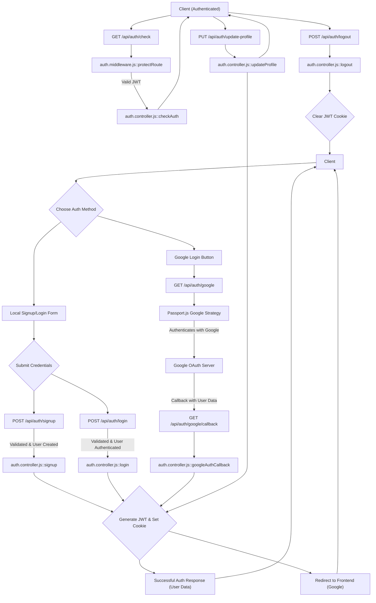
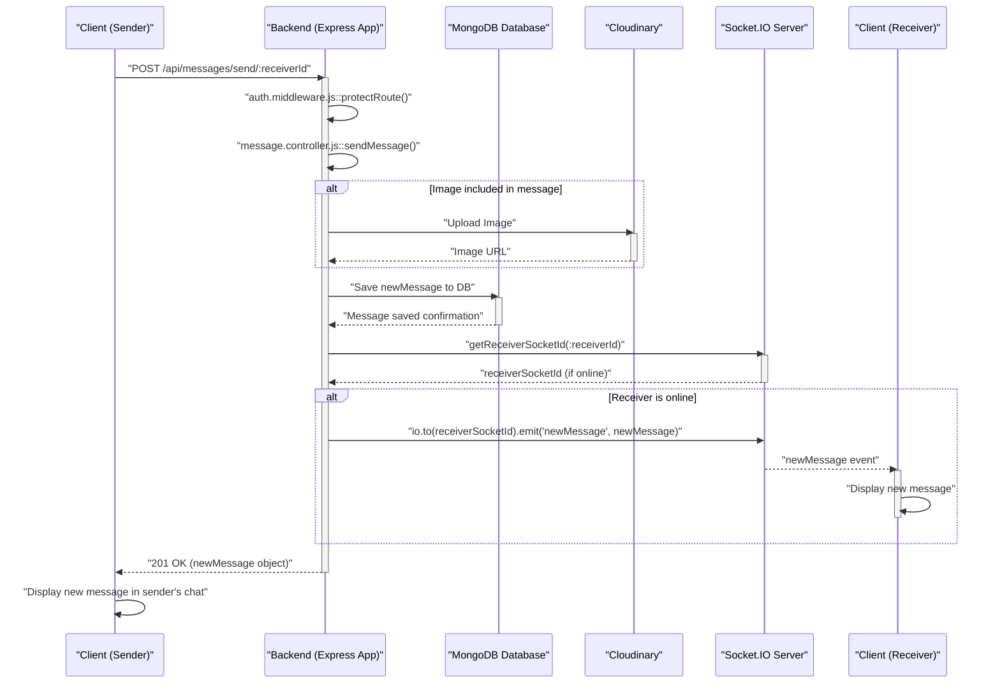

 # API Endpoints and Controllers

This section provides an in-depth look into the various API endpoints exposed by the backend, along with the corresponding controller logic that handles requests. We'll explore the authentication and messaging functionalities, detailing how routes are defined and how controllers process incoming data, interact with the database, and manage responses.

The primary files covered are:
- [`backend/src/routes/auth.route.js`](https://github.com/shinymack/Chat-App-MERN/blob/main/backend/src/routes/auth.route.js)
- [`backend/src/controllers/auth.controller.js`](https://github.com/shinymack/Chat-App-MERN/blob/main/backend/src/controllers/auth.controller.js)
- [`backend/src/routes/message.route.js`](https://github.com/shinymack/Chat-App-MERN/blob/main/backend/src/routes/message.route.js)
- [`backend/src/controllers/message.controller.js`](https://github.com/shinymack/Chat-App-MERN/blob/main/backend/src/controllers/message.controller.js)

## Authentication Endpoints and Controllers

The authentication module handles user registration, login, logout, session management, and profile updates. It integrates local email/password authentication with Google OAuth, ensuring secure user access and management.

### User Registration (`/api/auth/signup`)

- **Method**: `POST`
- **Controller**: `signup` in [`auth.controller.js`](https://github.com/shinymack/Chat-App-MERN/blob/main/backend/src/controllers/auth.controller.js#L6)
- **Description**: Allows new users to register an account with a username, email, and password. It performs validations for input fields, checks for existing users, hashes the password, creates a new user record, and generates a JWT for session management.

```javascript
export const signup = async (req, res) => {
    const {username, email, password} = req.body;
    try {
        if(!username || !email || !password) {
            return res.status(400).json({message: "Please fill in all fields."});
        }
        // ... (validation and user creation logic)
        const newUser = new User({
            username,
            email,
            password: hashedPassword,
            authProvider: 'email'
        });
        if(newUser){
            generateToken(newUser._id, res); // Generate JWT
            await newUser.save();
            res.status(201).json({ /* user data */ });
        } else {
            res.status(400).json({message: "Invalid user data."});
        }
    } catch (error) {
        console.log("Error in signup controller", error.message);
        res.status(500).json({message: "Something went wrong."});
    }
};
```
[View on GitHub](https://github.com/shinymack/Chat-App-MERN/blob/main/backend/src/controllers/auth.controller.js#L6-L56)

### User Login (`/api/auth/login`)

- **Method**: `POST`
- **Controller**: `login` in [`auth.controller.js`](https://github.com/shinymack/Chat-App-MERN/blob/main/backend/src/controllers/auth.controller.js#L58)
- **Description**: Authenticates existing users based on their email and password. It validates credentials, handles Google OAuth specific login scenarios (if a user tries to log in with email/password when they registered via Google), and issues a JWT upon successful login.

```javascript
export const login = async (req, res) => {
    const {email, password} = req.body;
    try {
        const user = await User.findOne({email});
        if(!user) {
            return res.status(400).json({message: "Invalid credentials."});
        }
        if(user.authProvider === 'google' && !user.password){
            return res.status(400).json({ message: "Please sign in with Google." });
        }
        const isPasswordCorrect = await bcrypt.compare(password, user.password);
        if(!isPasswordCorrect) {
            return res.status(400).json({message: "Invalid credentials."});
        }
        generateToken(user._id, res); // Generate JWT
        res.status(200).json({ /* user data */ });
    } catch (error) {
        console.log("Error in login controller", error.message);
        res.status(500).json({message: "Something went wrong."});
    }
};
```
[View on GitHub](https://github.com/shinymack/Chat-App-MERN/blob/main/backend/src/controllers/auth.controller.js#L58-L86)

### User Logout (`/api/auth/logout`)

- **Method**: `POST`
- **Controller**: `logout` in [`auth.controller.js`](https://github.com/shinymack/Chat-App-MERN/blob/main/backend/src/controllers/auth.controller.js#L88)
- **Description**: Invalidates the current user session by clearing the JWT cookie.

### Check Authentication Status (`/api/auth/check`)

- **Method**: `GET`
- **Middleware**: `protectRoute`
- **Controller**: `checkAuth` in [`auth.controller.js`](https://github.com/shinymack/Chat-App-MERN/blob/main/backend/src/controllers/auth.controller.js#L99)
- **Description**: Verifies if a user is currently authenticated using the `protectRoute` middleware. If authenticated, it returns the user's profile information.

### Google OAuth Flow (`/api/auth/google`, `/api/auth/google/callback`)

- **Method**: `GET`
- **Controllers**: Handled by Passport.js middleware, then `googleAuthCallback` in [`auth.controller.js`](https://github.com/shinymack/Chat-App-MERN/blob/main/backend/src/controllers/auth.controller.js#L115)
- **Description**: Initiates and completes the Google OAuth process. Upon successful authentication with Google, the `googleAuthCallback` generates a JWT for the user and redirects to the frontend.

### Profile Update (`/api/auth/update-profile`)

- **Method**: `PUT`
- **Middleware**: `protectRoute`
- **Controller**: `updateProfile` in [`auth.controller.js`](https://github.com/shinymack/Chat-App-MERN/blob/main/backend/src/controllers/auth.controller.js#L182)
- **Description**: Allows authenticated users to update their profile picture and/or username. It handles Cloudinary uploads for profile images and checks for username availability.

```javascript
export const updateProfile = async (req, res) => {
    try {
        const { profilePic, username } = req.body;
        const userId = req.user._id;
        let userToUpdate = await User.findById(userId);

        // ... (username and profile picture update logic)

        const updatedUser = await User.findByIdAndUpdate(userId, { $set: fieldsToUpdate }, { new: true });
        generateToken(updatedUser._id, res); // Refresh JWT with updated info
        res.status(200).json(updatedUser);

    } catch (error) {
        console.error("Error in updateProfile controller", error.message);
        res.status(500).json({ message: "Internal Server Error while updating profile." });
    }
};
```
[View on GitHub](https://github.com/shinymack/Chat-App-MERN/blob/main/backend/src/controllers/auth.controller.js#L182-L242)

### Username Availability Check (`/api/auth/username/check/:username`)

- **Method**: `GET`
- **Middleware**: `protectRoute`
- **Controller**: `checkUsernameAvailability` in [`auth.controller.js`](https://github.com/shinymack/Chat-App-MERN/blob/main/backend/src/controllers/auth.controller.js#L141)
- **Description**: Checks if a given username is available for an authenticated user, considering existing usernames and the user's current username.

```javascript
router.get("/username/check/:username", protectRoute, checkUsernameAvailability);
```
[View on GitHub](https://github.com/shinymack/Chat-App-MERN/blob/main/backend/src/routes/auth.route.js#L16)

This diagram illustrates the authentication flow, including both local and Google OAuth paths:





## Messaging Endpoints and Controllers

The messaging module facilitates real-time communication between users, allowing them to send text and image messages. It also provides endpoints for retrieving message history and lists of other users.

### Get Users for Sidebar (`/api/messages/users`)

- **Method**: `GET`
- **Middleware**: `protectRoute`
- **Controller**: `getUsersForSidebar` in [`message.controller.js`](https://github.com/shinymack/Chat-App-MERN/blob/main/backend/src/controllers/message.controller.js#L9)
- **Description**: Fetches a list of all users in the system, excluding the currently logged-in user. This is typically used to populate a chat sidebar with potential contacts.

```javascript
export const getUsersForSidebar = async (req, res) => {
    try {
        const loggedInUserId = req.user._id;
        const filteredUsers = await User.find({
            _id: { $ne: loggedInUserId }}).select("-password");  
        res.status(200).json(filteredUsers);
    }
    catch (error) {
        console.log("Error in getUsersForSidebar: ", error);
        res.status(500).json({ error: "Internal Server Error" });
    }
};
```
[View on GitHub](https://github.com/shinymack/Chat-App-MERN/blob/main/backend/src/controllers/message.controller.js#L9-L19)

### Get Messages (`/api/messages/:id`)

- **Method**: `GET`
- **Middleware**: `protectRoute`
- **Controller**: `getMessages` in [`message.controller.js`](https://github.com/shinymack/Chat-App-MERN/blob/main/backend/src/controllers/message.controller.js#L21)
- **Description**: Retrieves all messages exchanged between the logged-in user and a specific `userToChatId`. The messages are sorted to appear in chronological order, forming a conversation history.

```javascript
export const getMessages = async (req, res) => {
    try {
        const {id : userToChatId } = req.params;
        const myId = req.user._id;

        const messages = await Message.find({
            $or: [
                {senderId: myId, receiverId:userToChatId},
                {senderId: userToChatId, receiverId: myId}
            ]
        });
        res.status(200).json(messages);
    } catch (error) {
        console.log("Error in getMessages controller:  ", error);
        res.status(500).json({ error: "Internal Server Error" });
    }
};
```
[View on GitHub](https://github.com/shinymack/Chat-App-MERN/blob/main/backend/src/controllers/message.controller.js#L21-L39)

### Send Message (`/api/messages/send/:id`)

- **Method**: `POST`
- **Middleware**: `protectRoute`
- **Controller**: `sendMessage` in [`message.controller.js`](https://github.com/shinymack/Chat-App-MERN/blob/main/backend/src/controllers/message.controller.js#L41)
- **Description**: Sends a new message (text and/or image) from the authenticated user to a specified `receiverId`. If an image is included, it's uploaded to Cloudinary. After saving the message, it leverages Socket.IO to emit the new message in real-time to the receiver if they are online.

```javascript
export const sendMessage = async (req, res) => {
    try {
        const { text, image } = req.body;
        const { id: receiverId } = req.params;
        const senderId = req.user._id;

        let imageUrl;
        if (image) {
            const uploadResponse = await cloudinary.uploader.upload(image);
            imageUrl = uploadResponse.secure_url;
        }
        const newMessage = new Message({
            senderId,
            receiverId,
            text,
            image: imageUrl,
        });

        await newMessage.save();

        const receiverSocketId = getReceiverSocketId(receiverId);
        if(receiverSocketId) {
            io.to(receiverSocketId).emit("newMessage", newMessage); // Emit real-time message
        }

        res.status(201).json(newMessage);   
        
    } catch (error) {
        console.log("Error in sendMessage controller:  ", error);
        res.status(500).json({ error: "Internal Server Error" });
    }
};
```
[View on GitHub](https://github.com/shinymack/Chat-App-MERN/blob/main/backend/src/controllers/message.controller.js#L41-L71)

This diagram illustrates the message sending flow, highlighting the real-time aspect with Socket.IO:





## Key Integration Points

- **`protectRoute` Middleware**: This middleware is fundamental, securing almost all private API endpoints. It ensures that only authenticated users can access specific resources by validating the JWT present in the request cookie. If the token is invalid or missing, it blocks the request.
    - [View `protectRoute` on GitHub](https://github.com/shinymack/Chat-App-MERN/blob/main/backend/src/middleware/auth.middleware.js)
- **JWT Generation (`generateToken`)**: The `generateToken` utility is critical for establishing and maintaining user sessions. It creates a signed JWT and sets it as an HTTP-only cookie, providing a secure way to manage authenticated states across requests. This function is called during signup, login, Google OAuth callback, and profile updates.
    - [View `generateToken` on GitHub](https://github.com/shinymack/Chat-App-MERN/blob/main/backend/src/lib/utils.js#L3-L17)
- **Cloudinary Integration**: For features requiring image uploads (profile pictures, image messages), Cloudinary is used as a third-party service. The `cloudinary.uploader.upload` method handles the actual upload, returning a secure URL that is then stored in the database.
- **Socket.IO for Real-time Messaging**: The `sendMessage` controller demonstrates a key integration point with Socket.IO. After a message is saved to the database, `io.to(receiverSocketId).emit("newMessage", newMessage)` is called. This immediately sends the new message to the intended receiver if they are currently connected to the Socket.IO server, enabling real-time chat functionality without needing to poll the API.
    - [View Socket.IO initialization on GitHub](https://github.com/shinymack/Chat-App-MERN/blob/main/backend/src/lib/socket.js)

The architecture emphasizes a clear separation of concerns, with routes defining the API surface and controllers implementing the business logic, database interactions, and integration with external services. Middleware plays a crucial role in securing these endpoints and ensuring proper request handling.

Next: [Data Models and Database](./2.2_data-models-and-database.mdx)