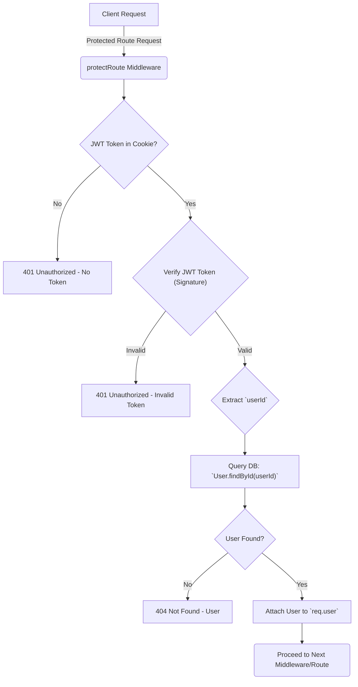

 # Data Models and Authentication

This section provides an in-depth look at the core data structures used in the application, specifically focusing on the `User` and `Message` models, and details the authentication and authorization mechanisms that secure the application, including Google OAuth integration and JWT-based session management.

## User Data Model

The `User` model is central to the application, storing information about each registered user. It supports both traditional email/password authentication and Google OAuth.

The schema includes fields for user identification, social features, and authentication provider details.

```javascript
// backend/src/models/user.model.js
import mongoose from "mongoose"

const  userSchema = new mongoose.Schema(
    {
        email: {
            type: String,
            required: true,
            unique: true
        },
        username: {
            type: String,
            required: [true, "Username is required"],
            unique: true,
            trim: true,
            minlength: [3, "Username must be at least 3 characters long"],
            maxlength: [20, "Username cannot be more than 20 characters long"]
        },
        password: {
            type: String,
            minlength: 6,
        },
        profilePic: {
            type: String,
            default: "",
        },
        friends: [{
            type: mongoose.Schema.Types.ObjectId,
            ref: "User",
            default: []
        }],
        friendRequests: [{ // Incoming friend requests
            type: mongoose.Schema.Types.ObjectId,
            ref: "User",
            default: []
        }],
        sentRequests: [{ // Outgoing friend requests
            type: mongoose.Schema.Types.ObjectId,
            ref: "User",
            default: []
        }],
        authProvider: {
            type: String,
            enum: ['email', 'google'],
            default: 'email'
        },
        googleId: {
            type: String,
            unique: true,
            sparse: true
        },
    },
    {
        timestamps: true
    }
);

userSchema.pre('save', async function(next) {
    if (this.authProvider === 'google' && !this.isModified('password')) {
        this.password = undefined;
    }
    if (this.authProvider === 'email' && !this.password && this.isNew) {
        return next(new Error('Password is required for email signup.'));
    }
    next();
});

const User = mongoose.model("User", userSchema);

export default User;
```

[[View on GitHub]](https://github.com/shinymack/Chat-App-MERN/blob/main/backend/src/models/user.model.js)

### Key Fields:

*   **`email`**: Unique email address for the user.
*   **`username`**: Unique identifier displayed to other users.
*   **`password`**: Hashed password for email-based authentication (optional for Google OAuth).
*   **`friends`, `friendRequests`, `sentRequests`**: Arrays of `ObjectId` references to other `User` documents, enabling social features.
*   **`authProvider`**: Indicates the authentication method used (`'email'` or `'google'`).
*   **`googleId`**: Stores the unique Google ID for users authenticated via Google OAuth.
*   **`timestamps`**: Automatically adds `createdAt` and `updatedAt` fields.

### Pre-save Hook for Google OAuth

A `pre('save')` hook ensures that the `password` field is not required or saved for users authenticating via Google, enhancing security and simplifying user creation for external providers.

```javascript
// backend/src/models/user.model.js (lines 62-68)
userSchema.pre('save', async function(next) {
    if (this.authProvider === 'google' && !this.isModified('password')) {
        this.password = undefined;
    }
    if (this.authProvider === 'email' && !this.password && this.isNew) {
        return next(new Error('Password is required for email signup.'));
    }
    next();
});
```

[[View on GitHub]](https://github.com/shinymack/Chat-App-MERN/blob/main/backend/src/models/user.model.js#L62-L68)

## Message Data Model

The `Message` model defines the structure for individual messages exchanged between users. It primarily links sender and receiver, and contains the message content, which can be text or an image.

```javascript
// backend/src/models/message.model.js
import express from "express";
import mongoose from "mongoose";

const messageSchema = new mongoose.Schema(
    {
     senderId: {
        type: mongoose.Schema.Types.ObjectId,
        ref: "User",
        required: true,
     },
     receiverId: {
        type: mongoose.Schema.Types.ObjectId,
        ref: "User",
        required: true,
     },
     text: {
        type: String,
     },
     image: {
        type: String,
     },
    },
    {timestamps: true}
);

export default mongoose.model("Message", messageSchema);
```

[[View on GitHub]](https://github.com/shinymack/Chat-App-MERN/blob/main/backend/src/models/message.model.js)

### Key Fields:

*   **`senderId`**: A reference to the `User` who sent the message.
*   **`receiverId`**: A reference to the `User` who is intended to receive the message.
*   **`text`**: The textual content of the message.
*   **`image`**: A URL or path to an image attachment (optional).
*   **`timestamps`**: Automatically adds `createdAt` and `updatedAt` fields.

## Authentication Mechanisms

The application employs Passport.js for flexible authentication, specifically integrating Google OAuth for user sign-up and login. Sessions are managed using JSON Web Tokens (JWTs) stored in HTTP-only cookies.

### Google OAuth with Passport.js

The `passport.config.js` file sets up the Google OAuth 2.0 strategy. It handles the callback from Google, either finding an existing user or creating a new one based on the Google profile data.

```javascript
// backend/src/lib/passport.config.js (lines 14-61)
export const configurePassport = () => {
    passport.use(new GoogleStrategy({
        clientID: process.env.GOOGLE_CLIENT_ID,
        clientSecret: process.env.GOOGLE_CLIENT_SECRET,
        callbackURL: process.env.GOOGLE_CALLBACK_URL,
        scope: ['profile', 'email']
    },
    async (accessToken, refreshToken, profile, done) => {
        try {
            let user = await User.findOne({ googleId: profile.id });

            if (user) {
                return done(null, user);
            } else {
                let username = profile.displayName.replace(/\s+/g, '').toLowerCase() || `user${Date.now()}`;

                const existingUserByUsername = await User.findOne({ username });
                if (existingUserByUsername) {
                    username = `${username}${Date.now().toString().slice(-4)}`; // Make it more unique
                }
                if (username.length > 20) username = username.substring(0,20);

                const newUser = new User({
                    googleId: profile.id,
                    email: profile.emails && profile.emails[0] ? profile.emails[0].value : null,
                    username: username,
                    authProvider: 'google',
                });

                if (!newUser.email) {
                    return done(new Error("Email not provided by Google. Cannot create account."), null);
                }

                const existingUserByEmail = await User.findOne({ email: newUser.email });
                if (existingUserByEmail && existingUserByEmail.authProvider !== 'google') {
                    return done(null, false, { message: `An account with email ${newUser.email} already exists. Please sign in using your original method.` });
                }

                await newUser.save();
                return done(null, newUser);
            }
        } catch (error) {
            return done(error, null);
        }
    }));
    // ... serialization and deserialization ...
};
```

[[View on GitHub]](https://github.com/shinymack/Chat-App-MERN/blob/main/backend/src/lib/passport.config.js#L14-L61)

### User Serialization and Deserialization

Passport.js uses serialization and deserialization to manage user sessions. Upon successful authentication, `serializeUser` stores a minimal identifier (the user's MongoDB `_id`) in the session. For subsequent requests, `deserializeUser` uses this ID to retrieve the full user object from the database, attaching it to `req.user`.

```javascript
// backend/src/lib/passport.config.js (lines 63-75)
    // Serialize user to store in session (just the user ID)
    passport.serializeUser((user, done) => {
        done(null, user.id); // user.id is the _id from MongoDB
    });

    // Deserialize user from session (fetch user from DB using the ID)
    passport.deserializeUser(async (id, done) => {
        try {
            const user = await User.findById(id);
            done(null, user); // This user object is attached to req.user
        } catch (error) {
            done(error, null);
        }
    });
};
```

[[View on GitHub]](https://github.com/shinymack/Chat-App-MERN/blob/main/backend/src/lib/passport.config.js#L63-L75)

### Google OAuth Flow


```mermaid
graph TD
    A["Client"] -->|"Initiates Google Login"| B("Google Auth Route")
    B -->|"Redirects to Google"| C("Google Authentication Service")
    C -->|"User Authenticates"| D("Google Grants Access Token and Profile")
    D -->|"Redirects to Callback URL"| E("Callback Route")
    E -->|"Passport Google Strategy"| F{"User Exists?"}
    F -->|"No"| G["Create New User"]
    G --> H["Save User to DB"]
    F -->|"Yes"| I["Retrieve User from DB"]
    H --> J["`done(null, user)`"]
    I --> J
    J --> K("Passport Session Serialization")
    K --> L["Stores User ID in Session (JWT Cookie)"]
    L -->|"Sends JWT Cookie"| A
    A -->|"Subsequent Requests with JWT"| M("Protected Route")
    M -->|"Deserializes User"| N["`req.user` Populated"]
```


## Authorization Middleware

The `protectRoute` middleware ensures that only authenticated users can access specific routes. It validates the JWT stored in the `jwt` cookie.

```javascript
// backend/src/middleware/auth.middleware.js
import jwt from "jsonwebtoken"
import User from "../models/user.model.js"

export const protectRoute = async (req, res, next) => {
    try {
        const token = req.cookies.jwt;
        if(!token){
            return res.status(401).json({message: "Unauthorized - No Token Provided"});
        }

        const decoded = jwt.verify(token, process.env.JWT_SECRET)

        if(!decoded) {
            return res.status(401).json({message: "Unauthorized - Invalid Token"});
        }
        const user = await User.findById(decoded.userId).select("-password");

        if(!user) {
            return res.status(404).json({message: "User not found"});
        }
        req.user = user;

        next();
    } catch (error) {
        console.log("Error in protectRoute middleware", error.message);
        res.status(500).json({message: "Internal Server Error"});

    }

};
```

[[View on GitHub]](https://github.com/shinymack/Chat-App-MERN/blob/main/backend/src/middleware/auth.middleware.js)

### `protectRoute` Logic:

1.  **Check for Token**: It attempts to retrieve the `jwt` token from the request cookies. If no token is found, it responds with a 401 Unauthorized error.
2.  **Verify Token**: The token is then verified using `jwt.verify` with the `JWT_SECRET` from environment variables. An invalid token also results in a 401 Unauthorized.
3.  **Find User**: The `userId` extracted from the decoded token is used to find the corresponding user in the database, excluding the password field for security.
4.  **Attach User**: If a user is found, their data is attached to the `req.user` object, making user information available to subsequent middleware and route handlers.
5.  **Proceed**: If all checks pass, `next()` is called, allowing the request to proceed to the intended route handler.

### Authorization Middleware Flow





## Key Integration Points

*   **User Provisioning**: The `passport.config.js` script dynamically creates new user accounts upon successful Google OAuth authentication if a user with the given Google ID does not already exist. It also handles potential conflicts where an email address might already be registered via a different provider.
*   **Session Management**: The combination of Passport.js's serialization/deserialization and JWTs stored as HTTP-only cookies provides a robust and secure way to manage user sessions without relying on traditional server-side session stores, making the backend stateless and scalable.
*   **Access Control**: The `protectRoute` middleware is a critical security layer, ensuring that sensitive API endpoints are only accessible by authenticated and authorized users, preventing unauthorized data access or manipulation.
*   **Schema References**: The `Message` schema's `senderId` and `receiverId` fields, along with the `User` schema's `friends`, `friendRequests`, and `sentRequests` fields, demonstrate effective use of `mongoose.Schema.Types.ObjectId` to create relationships between documents, allowing for efficient population of related data.

Next: [Backend Utilities and Services](./2.3_backend-utilities-and-services.mdx)