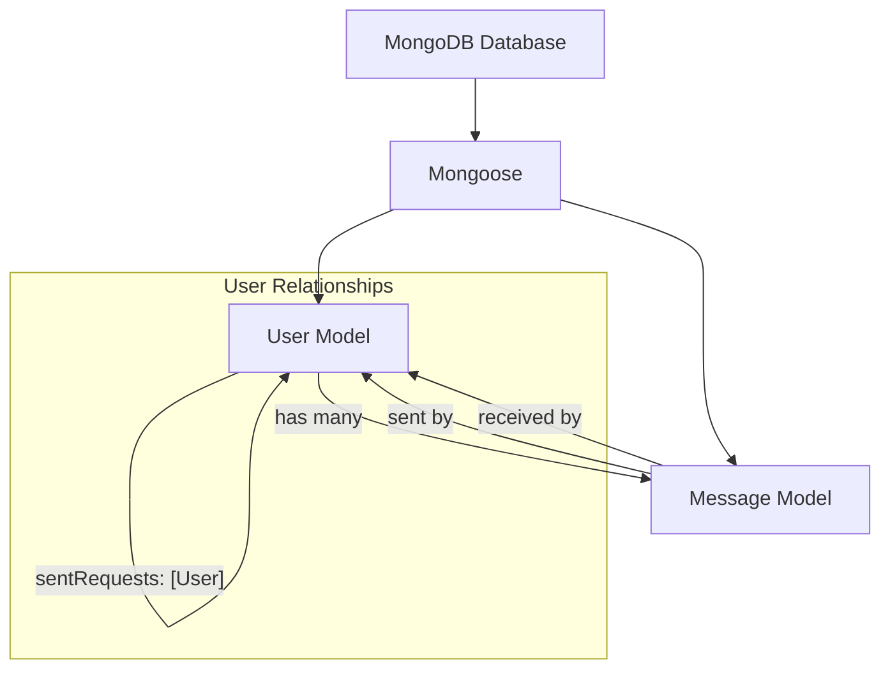

 # Data Models and Database

This section provides an in-depth look into the Mongoose data models that define the structure of data within the application and how they interact with the MongoDB database. It covers the core schemas for `User` and `Message` and the database connection mechanism.

## Database Connection

The application establishes a connection to the MongoDB database using Mongoose. The `connectDB` function in `backend/src/lib/db.js` is responsible for initiating this connection, ensuring that the application can interact with the database. It utilizes the `MONGODB_URI` environment variable to connect to the specified database instance.

```javascript filename="backend/src/lib/db.js"
import mongoose from "mongoose"

export const connectDB = async () => {
  try {
    const conn = await mongoose.connect(process.env.MONGODB_URI);
    console.log(`MongoDB connected:  ${conn.connection.host}`);
  }
  catch(error){
    console.log("MongoDB connection error: ", error);
  }
}
```

This snippet demonstrates the robust connection logic, including error handling, to ensure the application gracefully manages database connectivity.

[View on GitHub](https://github.com/shinymack/Chat-App-MERN/blob/main/backend/src/lib/db.js)

## User Data Model

The `User` model (`backend/src/models/user.model.js`) is central to the application, storing information about each user. It defines fields such as `email`, `username`, `password`, `profilePic`, and complex relationship fields like `friends`, `friendRequests`, and `sentRequests`. This model also supports authentication via email and Google, with specific handling for password requirements based on the `authProvider`.

### User Schema Definition

The `userSchema` captures a wide range of user attributes:

-   **`email`**: String, required, unique.
-   **`username`**: String, required, unique, trimmed, with min/max length constraints.
-   **`password`**: String, required for email authentication, minimum length of 6.
-   **`profilePic`**: String, optional, defaults to an empty string.
-   **`friends`**: Array of `ObjectId` references to other `User` documents, representing established friendships.
-   **`friendRequests`**: Array of `ObjectId` references to `User` documents, for incoming friend requests.
-   **`sentRequests`**: Array of `ObjectId` references to `User` documents, for outgoing friend requests.
-   **`authProvider`**: String, enum (`'email'`, `'google'`), defaults to `'email'`.
-   **`googleId`**: String, unique, sparse, used for Google authentication.
-   **`timestamps`**: Mongoose option to automatically add `createdAt` and `updatedAt` fields.

```javascript filename="backend/src/models/user.model.js"
import mongoose from "mongoose"

const  userSchema = new mongoose.Schema(
    {
        email: { 
            type: String,
            required: true,
            unique: true
        },
        username: {
            type: String,
            required: [true, "Username is required"],
            unique: true,
            trim: true,
            minlength: [3, "Username must be at least 3 characters long"],
            maxlength: [20, "Username cannot be more than 20 characters long"]
        }
        ,
        password: {
            type: String,
            minlength: 6,
        },
        profilePic: {
            type: String,
            default: "",
        },
        friends: [{
            type: mongoose.Schema.Types.ObjectId,
            ref: "User",
            default: [] 
        }],
        friendRequests: [{ // Incoming friend requests
            type: mongoose.Schema.Types.ObjectId,
            ref: "User",
            default: []
        }],
        sentRequests: [{ // Outgoing friend requests
            type: mongoose.Schema.Types.ObjectId,
            ref: "User",
            default: []
        }],
        authProvider: {
            type: String,
            enum: ['email', 'google'],
            default: 'email'
        },
        googleId: {
            type: String,
            unique: true,
            sparse: true
        },
    },
    { 
        timestamps: true
    } 
);
```

[View on GitHub](https://github.com/shinymack/Chat-App-MERN/blob/main/backend/src/models/user.model.js#L3-L64)

### Pre-save Hook for User Authentication

A `pre('save')` hook is implemented to handle logic before a user document is saved. This hook ensures that passwords are not required for Google-authenticated users and explicitly checks for password presence for email-based sign-ups.

```javascript filename="backend/src/models/user.model.js"
userSchema.pre('save', async function(next) {
    if (this.authProvider === 'google' && !this.isModified('password')) {
        this.password = undefined;
    }
    if (this.authProvider === 'email' && !this.password && this.isNew) {
        return next(new Error('Password is required for email signup.'));
    }
    next();
});
```

This demonstrates an important security and data integrity measure, making the authentication flow more robust.

[View on GitHub](https://github.com/shinymack/Chat-App-MERN/blob/main/backend/src/models/user.model.js#L66-L74)

## Message Data Model

The `Message` model (`backend/src/models/message.model.js`) defines the structure for individual chat messages exchanged between users. Each message includes references to the sender and receiver, the message content (text or image), and timestamps.

### Message Schema Definition

The `messageSchema` includes the following fields:

-   **`senderId`**: `ObjectId` reference to the `User` who sent the message, required.
-   **`receiverId`**: `ObjectId` reference to the `User` who is the recipient of the message, required.
-   **`text`**: String, optional, for textual message content.
-   **`image`**: String, optional, for image message content (e.g., URL to an uploaded image).
-   **`timestamps`**: Mongoose option to automatically add `createdAt` and `updatedAt` fields.

```javascript filename="backend/src/models/message.model.js"
import express from "express";
import mongoose from "mongoose";

const messageSchema = new mongoose.Schema(
    {
     senderId: {
        type: mongoose.Schema.Types.ObjectId,
        ref: "User",
        required: true,
     },
     receiverId: {
        type: mongoose.Schema.Types.ObjectId,
        ref: "User",
        required: true,
     },
     text: {
        type: String,
     },
     image: {
        type: String,
     },
    },
    {timestamps: true}
);

export default mongoose.model("Message", messageSchema);
```

[View on GitHub](https://github.com/shinymack/Chat-App-MERN/blob/main/backend/src/models/message.model.js)

## Data Model Relationships

The application features a clear relationship between the `User` and `Message` models, primarily through `ObjectId` references. This enables efficient querying and population of related data.





This diagram illustrates how Mongoose acts as the ODM (Object Data Mapper) connecting the application models to the MongoDB database. It also highlights the relationships within the `User` model itself (friends, requests) and the `User`-`Message` relationship (sender/receiver).

## Key Integration Points

-   **Database Initialization**: The `connectDB` function is crucial for starting the server, ensuring the database is accessible before any operations requiring data persistence. This is typically called once during application startup.
-   **User Management**: The `User` model forms the backbone of user authentication, profile management, and social features (friends, friend requests). Its detailed schema with validation rules ensures data integrity.
-   **Messaging Functionality**: The `Message` model facilitates the core chat functionality. The `senderId` and `receiverId` fields are critical for linking messages to specific users, allowing for conversation retrieval and display.
-   **Referential Integrity**: Although MongoDB is a NoSQL database, Mongoose's `ref` property in schemas enforces a form of referential integrity at the application level, allowing for powerful `.populate()` operations to fetch related documents. This is evident in `senderId`, `receiverId`, `friends`, `friendRequests`, and `sentRequests` fields.
-   **Pre-save Hooks**: The `userSchema.pre('save')` hook showcases how Mongoose middleware can be leveraged for business logic, such as conditionally handling password requirements based on the authentication provider, improving security and flexibility.

Next: [Authentication and Security](./2.3_authentication-and-security.mdx)