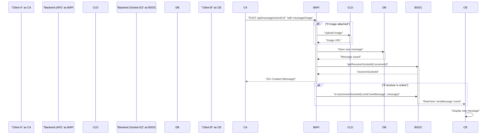

 
---
title: "Chat and Messaging Core"
description: "Covers the implementation of real-time messaging, message storage, and friend management."
---

# Chat and Messaging Core

The Chat and Messaging Core is the heart of the application's interactive functionality, enabling real-time communication, persistent message storage, and efficient user management for chat purposes. This section details the backend components responsible for handling message transmission, user presence, and retrieval of chat histories.

## Core Components and Responsibilities

The chat system is built upon several interconnected components, each playing a vital role in delivering a seamless messaging experience.

### Message Controller (`backend/src/controllers/message.controller.js`)

This controller manages all HTTP requests related to messages and chat user interactions. It orchestrates data retrieval, persistence, and real-time notifications.

#### User Management for Sidebar

The `getUsersForSidebar` function provides a list of all users excluding the currently logged-in user. This is primarily used to populate a chat sidebar, allowing users to initiate new conversations.

```javascript
// backend/src/controllers/message.controller.js
export const getUsersForSidebar = async (req, res) => {
    try {
        const loggedInUserId = req.user._id;
        const filteredUsers = await User.find({
            _id: { $ne: loggedInUserId }}).select("-password");  
        res.status(200).json(filteredUsers);
    }
    catch (error) {
        console.log("Error in getUsersForSidebar: ", error);
        res.status(500).json({ error: "Internal Server Error" });
    }
};
```
This snippet demonstrates how users are filtered to exclude the active user, ensuring that the sidebar only displays potential chat partners. The `-password` selection ensures sensitive data is not exposed.
[View on GitHub](https://github.com/shinymack/Chat-App-MERN/blob/main/backend/src/controllers/message.controller.js#L9-L21)

#### Message Retrieval

The `getMessages` function fetches all messages exchanged between two specific users, regardless of who sent or received them.

```javascript
// backend/src/controllers/message.controller.js
export const getMessages = async (req, res) => {
    try {
        const {id : userToChatId } = req.params;
        const myId = req.user._id;

        const messages = await Message.find({
            $or: [
                {senderId: myId, receiverId:userToChatId},
                {senderId: userToChatId, receiverId: myId}
            ]
        });
        res.status(200).json(messages);
    } catch (error) {
        console.log("Error in getMessages controller:  ", error);
        res.status(500).json({ error: "Internal Server Error" });
    }
};
```
The `$or` operator in the Mongoose query is crucial here, allowing the system to retrieve messages where the `senderId` and `receiverId` match either direction of the conversation.
[View on GitHub](https://github.com/shinymack/Chat-App-MERN/blob/main/backend/src/controllers/message.controller.js#L23-L39)

#### Sending Messages and Real-time Updates

The `sendMessage` function handles the creation of new messages, including optional image uploads via Cloudinary, and triggers a real-time event to the recipient using Socket.IO.

```javascript
// backend/src/controllers/message.controller.js
export const sendMessage = async (req, res) => {
    try {
        const { text, image } = req.body;
        const { id: receiverId } = req.params;
        const senderId = req.user._id;

        let imageUrl;
        if (image) {
            const uploadResponse = await cloudinary.uploader.upload(image);
            imageUrl = uploadResponse.secure_url;
        }
        const newMessage = new Message({
            senderId,
            receiverId,
            text,
            image: imageUrl,
        });
        await newMessage.save();

        const receiverSocketId = getReceiverSocketId(receiverId);
        if(receiverSocketId) {
            io.to(receiverSocketId).emit("newMessage", newMessage);
        }
        res.status(201).json(newMessage);   
        
    } catch (error) {
        console.log("Error in sendMessage controller:  ", error);
        res.status(500).json({ error: "Internal Server Error" });
    }
};
```
This is a critical function demonstrating the integration of message storage, external services (Cloudinary), and real-time communication (Socket.IO).
[View on GitHub](https://github.com/shinymack/Chat-App-MERN/blob/main/backend/src/controllers/message.controller.js#L41-L71)

### Message Model (`backend/src/models/message.model.js`)

Defines the structure and schema for messages stored in MongoDB. Each message links to sender and receiver user IDs and can contain text or an image URL.

```javascript
// backend/src/models/message.model.js
import mongoose from "mongoose";

const messageSchema = new mongoose.Schema(
    {
     senderId: {
        type: mongoose.Schema.Types.ObjectId,
        ref: "User",
        required: true,
     },
     receiverId: {
        type: mongoose.Schema.Types.ObjectId,
        ref: "User",
        required: true,
     },
     text: {
        type: String,
     },
     image: {
        type: String,
     },
    },
    {timestamps: true}
);

export default mongoose.model("Message", messageSchema);
```
The `ref: "User"` property establishes a relationship with the `User` model, making it easy to populate sender and receiver information when querying messages.
[View on GitHub](https://github.com/shinymack/Chat-App-MERN/blob/main/backend/src/models/message.model.js#L4-L26)

### Message Routes (`backend/src/routes/message.route.js`)

Defines the API endpoints for chat functionality, mapping HTTP requests to controller functions and enforcing authentication.

```javascript
// backend/src/routes/message.route.js
import express from "express"
import { protectRoute } from "../middleware/auth.middleware.js";
import { getUsersForSidebar, getMessages, sendMessage } from "../controllers/message.controller.js";
const router = express.Router();

router.get("/users", protectRoute, getUsersForSidebar);
router.get("/:id", protectRoute, getMessages);
router.post("/send/:id", protectRoute, sendMessage);

export default router;
```
All routes are protected by the `protectRoute` middleware, ensuring that only authenticated users can access messaging features.
[View on GitHub](https://github.com/shinymack/Chat-App-MERN/blob/main/backend/src/routes/message.route.js)

### Socket.IO Setup (`backend/src/lib/socket.js`)

Initializes the Socket.IO server, manages active user connections (online status), and provides utilities to emit real-time events.

```javascript
// backend/src/lib/socket.js
import { Server } from "socket.io";
import http from "http";
import express from "express";

const app = express();
const server = http.createServer(app);
const io = new Server(server, {
    cors: {
        origin: ["http://localhost:5173"]
    }
})

export function getReceiverSocketId(userId) {
    return userSocketMap[userId];
}

const userSocketMap = {}; //{userId : socketId}

io.on("connection", (socket) => {
    console.log("A user connected", socket.id);

    const userId = socket.handshake.query.userId;
    if(userId) userSocketMap[userId] = socket.id;

    io.emit("getOnlineUsers", Object.keys(userSocketMap));

    socket.on("disconnect", ()=>{
        console.log("A user disconnected", socket.id);
        delete userSocketMap[userId]; 
        io.emit("getOnlineUsers", Object.keys(userSocketMap));
    })
})

export { io, app, server };
```
The `userSocketMap` is critical for tracking which `socketId` belongs to which `userId`, enabling targeted real-time communication. `io.emit("getOnlineUsers", ...)` broadcasts online status updates to all connected clients.
[View on GitHub](https://github.com/shinymack/Chat-App-MERN/blob/main/backend/src/lib/socket.js)

## Real-time Messaging Flow

The following diagram illustrates the typical flow for sending a message, from the client's action to the recipient's real-time notification.





## User Online Status Management

The Socket.IO server continuously tracks connected users to maintain an accurate list of online participants.


```mermaid
graph TD
    subgraph "Backend"
        BSOC("Socket.IO Server")
        USM{"userSocketMap"}<br/>"userId: socketId"
    end
    CA("Client A")
    CB("Client B")
    CC("Client C")

    CA-- "Connects with userId" -->BSOC
    CB-- "Connects with userId" -->BSOC
    CC-- "Connects with userId" -->BSOC
    BSOC-- "Maps userId to socketId" -->USM
    BSOC-.->|"Emit 'getOnlineUsers'"| CA
    BSOC-.->|"Emit 'getOnlineUsers'"| CB
    BSOC-.->|"Emit 'getOnlineUsers'"| CC
    CA-- "Disconnects" -->BSOC
    BSOC-- "Removes userId from map" -->USM
    BSOC-.->|"Emit updated 'getOnlineUsers'"| CB
    BSOC-.->|"Emit updated 'getOnlineUsers'"| CC
```


## Key Integration Points

The Chat and Messaging Core demonstrates robust integration across several layers and services:

*   **Authentication Middleware:** The `protectRoute` middleware ensures that all messaging functionalities are restricted to authenticated users, maintaining security and data integrity.
*   **Database (MongoDB):** The `Message` model and Mongoose queries facilitate efficient storage and retrieval of chat histories, including complex queries to fetch messages between two specific users.
*   **External Services (Cloudinary):** For rich media messaging, Cloudinary is integrated to handle image uploads, providing a scalable and reliable solution for media storage.
*   **Real-time Communication (Socket.IO):** Socket.IO is fundamental for providing instant message delivery and managing user online presence. The `userSocketMap` and `getReceiverSocketId` function enable precise targeting of real-time events.
*   **Modular Architecture:** The clear separation of concerns between controllers, models, routes, and utility functions (socket.js) promotes maintainability and scalability. The `message.controller.js` file serves as a central orchestrator, bringing together database operations, external service calls, and real-time events.

This core system is designed for extensibility, allowing for future enhancements such as group chats, message reactions, or read receipts by building upon the established real-time and persistence mechanisms.

Next: [Utility and External Services](./2.3_utility-external-services.mdx)
```