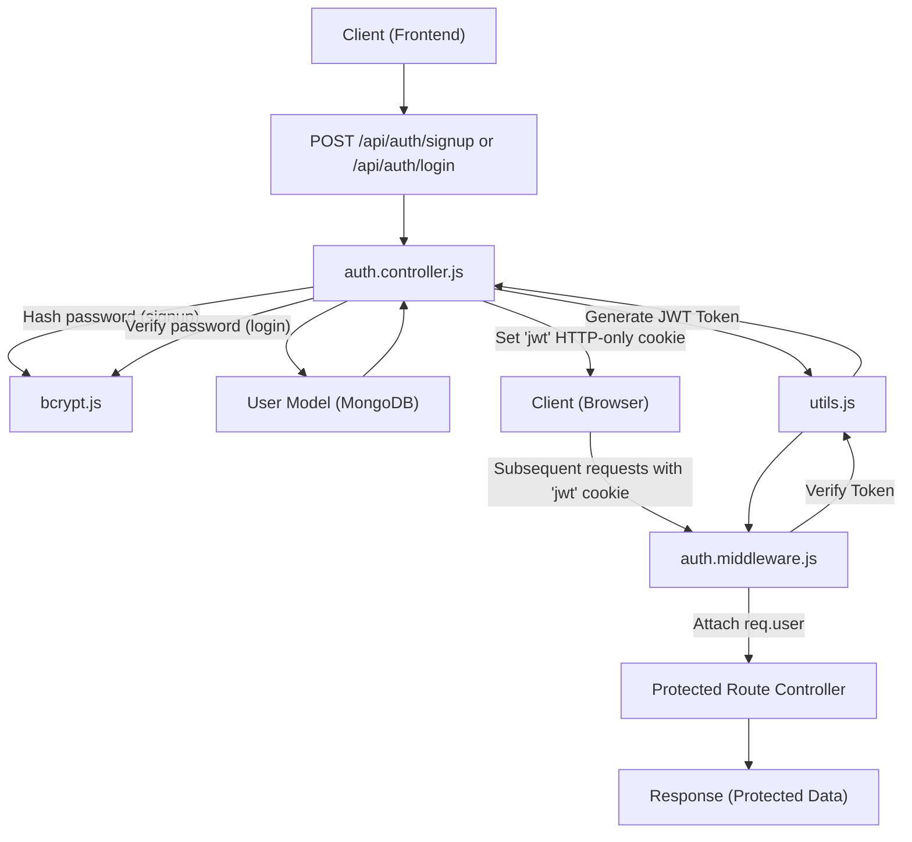
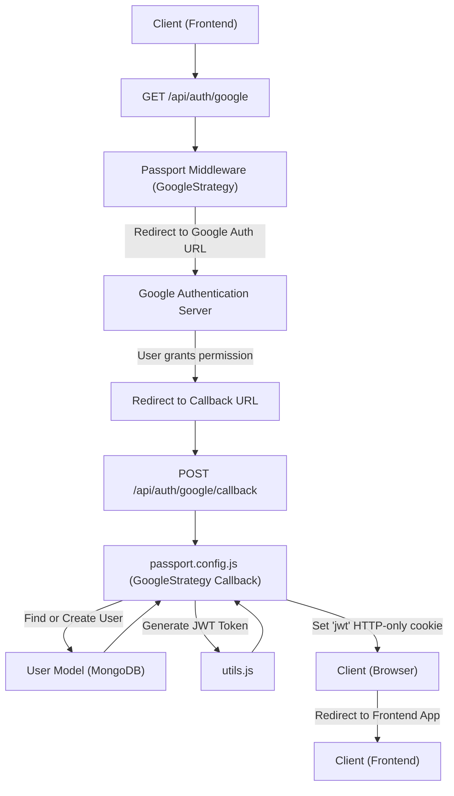

 # Authentication and Security

The application's security hinges on a robust authentication system, ensuring that user data is protected and access to resources is controlled. This section details the core components responsible for user authentication, session management, and authorization. The system supports both traditional email/password logins and Google OAuth for enhanced flexibility and user experience.

## Core Authentication Mechanisms

The backend implements several key components to manage user authentication and security:

*   **User Registration & Login (`auth.controller.js`):** Handles new user sign-ups, existing user logins, password hashing, and JWT (JSON Web Token) generation.
*   **Google OAuth Integration (`passport.config.js`, `auth.controller.js`):** Utilizes `passport.js` with `passport-google-oauth20` strategy for seamless sign-in via Google accounts.
*   **Token Generation (`utils.js`):** Manages the creation and secure storage of JWTs in HTTP-only cookies.
*   **Route Protection (`auth.middleware.js`):** A middleware layer that verifies JWTs for protected routes, ensuring only authenticated users can access specific resources.
*   **Profile Management (`auth.controller.js`):** Includes endpoints for checking username availability and updating user profiles, which can involve changing the username and profile picture.

### Authentication Flow (Email/Password)

Users can register with an email and password, which are securely hashed before storage. Upon successful login, a JWT is issued and stored as an HTTP-only cookie. This token is then used to authenticate subsequent requests to protected routes.





<br/>

#### Signup and Login Controller

The `auth.controller.js` file contains the primary logic for user registration and authentication using email and password. It performs essential validations and interacts with the `User` model and `bcrypt` for secure password handling.

**File:** `backend/src/controllers/auth.controller.js`

```javascript
export const signup = async (req, res) => {
    const {username, email, password} = req.body;
    try {
        // ... input validation (length, existence) ...
        const salt = await bcrypt.genSalt(10);
        const hashedPassword = await bcrypt.hash(password, salt);

        const newUser = new User({
            username,
            email,
            password: hashedPassword,
            authProvider: 'email'
        });
        if(newUser){
            generateToken(newUser._id, res); // Generate JWT
            await newUser.save();
            res.status(201).json({ /* user data */ });
        } else {
            res.status(400).json({message: "Invalid user data."});
        }
    } catch (error) { /* error handling */ }
};

export const login = async (req, res) => {
    const {email, password} = req.body;
    try {
        const user = await User.findOne({email});
        if(!user) {
            return res.status(400).json({message: "Invalid credentials."});
        }
        const isPasswordCorrect = await bcrypt.compare(password, user.password);
        if(!isPasswordCorrect) {
            return res.status(400).json({message: "Invalid credentials."});
        }
        generateToken(user._id, res); // Generate JWT
        res.status(200).json({ /* user data */ });
    } catch (error) { /* error handling */ }
};
```

This snippet from [`backend/src/controllers/auth.controller.js`](https://github.com/shinymack/Chat-App-MERN/blob/main/backend/src/controllers/auth.controller.js#L5-L77) demonstrates the `signup` and `login` functions. Key aspects include:
*   **Password Hashing:** `bcrypt.genSalt(10)` and `bcrypt.hash()` are used to securely hash passwords before storing them in the database.
*   **JWT Generation:** The `generateToken` utility is called to create and set the JWT upon successful signup or login.
*   **User Validation:** Checks for existing users by email or username, and validates password strength.

#### Logout Functionality

The `logout` function simply clears the `jwt` cookie, effectively logging the user out.

**File:** `backend/src/controllers/auth.controller.js`

```javascript
export const logout = (req, res) => {
    try {
        res.cookie("jwt", "", {maxAge: 0}); // Clear the JWT cookie
        res.status(200).json({message: "Logged out successfully."})
    } catch(error) { /* error handling */ }
};
```

You can find the `logout` function in [`backend/src/controllers/auth.controller.js`](https://github.com/shinymack/Chat-App-MERN/blob/main/backend/src/controllers/auth.controller.js#L79-L87).

#### Check Authentication Status

The `checkAuth` controller allows a client to verify if they are currently authenticated. It relies on `req.user` being populated by the `protectRoute` middleware.

**File:** `backend/src/controllers/auth.controller.js`

```javascript
export const checkAuth = (req, res) => {
    try {
        // req.user is populated by the protectRoute middleware
        res.status(200).json({
            _id: req.user._id,
            username: req.user.username,
            email: req.user.email,
            profilePic: req.user.profilePic,
            authProvider: req.user.authProvider,
            createdAt: req.user.createdAt
        });
    } catch (error) { /* error handling */ }
};
```

The `checkAuth` endpoint is defined in [`backend/src/controllers/auth.controller.js`](https://github.com/shinymack/Chat-App-MERN/blob/main/backend/src/controllers/auth.controller.js#L90-L103).

### Google OAuth Authentication Flow

The application integrates with Google for third-party authentication using `passport.js`. This provides users with a convenient way to sign in without creating a new password.





<br/>

#### Passport Configuration for Google OAuth

The `passport.config.js` file sets up the `passport-google-oauth20` strategy. It defines how user profiles received from Google are processed and mapped to the application's `User` model.

**File:** `backend/src/lib/passport.config.js`

```javascript
export const configurePassport = () => {
    passport.use(new GoogleStrategy({
        clientID: process.env.GOOGLE_CLIENT_ID,
        clientSecret: process.env.GOOGLE_CLIENT_SECRET,
        callbackURL: process.env.GOOGLE_CALLBACK_URL,
        scope: ['profile', 'email']
    },
    async (accessToken, refreshToken, profile, done) => {
        try {
            let user = await User.findOne({ googleId: profile.id });
            if (user) {
                return done(null, user);
            } else {
                // Logic to create new user or handle existing email conflicts
                const newUser = new User({
                    googleId: profile.id,
                    email: profile.emails && profile.emails[0] ? profile.emails[0].value : null,
                    username: /* generated username */,
                    authProvider: 'google',
                });
                await newUser.save();
                return done(null, newUser);
            }
        } catch (error) {
            return done(error, null);
        }
    }));

    passport.serializeUser((user, done) => { done(null, user.id); });
    passport.deserializeUser(async (id, done) => {
        try {
            const user = await User.findById(id);
            done(null, user);
        } catch (error) { done(error, null); }
    });
};
```

This configuration is available in [`backend/src/lib/passport.config.js`](https://github.com/shinymack/Chat-App-MERN/blob/main/backend/src/lib/passport.config.js#L9-L74). The strategy callback handles finding existing Google users or creating new ones, generating a unique username if necessary, and linking the account.

#### Google OAuth Callback

After successful authentication with Google, the `googleAuthCallback` in `auth.controller.js` handles the redirect. It issues a JWT and redirects the user back to the frontend application.

**File:** `backend/src/controllers/auth.controller.js`

```javascript
export const googleAuthCallback = async (req, res) => {
    const frontendUrl = process.env.FRONTEND_URL || 'http://localhost:5173';
    try {
        if (!req.user) { // req.user is populated by Passport
            return res.redirect(`${frontendUrl}/login?error=google_auth_failed`);
        }
        generateToken(req.user._id, res); // Generate JWT
        res.redirect(frontendUrl);
    } catch (error) { /* error handling */ }
};
```

The `googleAuthCallback` can be found in [`backend/src/controllers/auth.controller.js`](https://github.com/shinymack/Chat-App-MERN/blob/main/backend/src/controllers/auth.controller.js#L106-L122).

### JWT Token Management

The `utils.js` file provides a utility function `generateToken` for creating JWTs and setting them as HTTP-only cookies.

**File:** `backend/src/lib/utils.js`

```javascript
import jwt from 'jsonwebtoken';

export const generateToken = (userId, res) => {
    const token = jwt.sign({userId}, process.env.JWT_SECRET,
        {expiresIn: "7d"});

    res.cookie("jwt", token, {
        maxAge: 7 * 24 * 60 * 60 * 1000,
        httpOnly: true, // Prevent client-side JS from accessing the cookie
        sameSite: "strict", // Protect against CSRF attacks
        secure: process.env.NODE_ENV !== "development", // Use HTTPS in production
    });
    return token;
};
```

This utility ensures that tokens are signed with a secret, expire after a set period, and are securely stored as `httpOnly` and `sameSite: "strict"` cookies. View the full code in [`backend/src/lib/utils.js`](https://github.com/shinymack/Chat-App-MERN/blob/main/backend/src/lib/utils.js#L4-L14).

### Route Protection Middleware

The `auth.middleware.js` defines the `protectRoute` middleware, which is crucial for securing endpoints that require user authentication.

**File:** `backend/src/middleware/auth.middleware.js`

```javascript
import jwt from "jsonwebtoken"
import User from "../models/user.model.js"

export const protectRoute = async (req, res, next) => {
    try {
        const token = req.cookies.jwt;
        if(!token){
            return res.status(401).json({message: "Unauthorized - No Token Provided"});
        }

        const decoded = jwt.verify(token, process.env.JWT_SECRET)

        if(!decoded) {
            return res.status(401).json({message: "Unauthorized - Invalid Token"});
        }
        const user = await User.findById(decoded.userId).select("-password");

        if(!user) {
            return res.status(404).json({message: "User not found"});
        }
        req.user = user; // Attach user to request object

        next(); // Proceed to the next middleware/controller
    } catch (error) { /* error handling */ }
};
```

The `protectRoute` middleware extracts the JWT from the cookies, verifies it, and then retrieves the associated user from the database. If successful, the user object is attached to `req.user`, making it available to subsequent route handlers. If verification fails, an unauthorized response is sent. This middleware is vital for securing API endpoints.

View the full middleware implementation in [`backend/src/middleware/auth.middleware.js`](https://github.com/shinymack/Chat-App-MERN/blob/main/backend/src/middleware/auth.middleware.js#L4-L29).

### Profile Management and Security

Beyond authentication, the `auth.controller.js` also handles user profile updates and username availability checks, incorporating security validations.

#### Check Username Availability

This endpoint allows clients to check if a desired username is already taken, preventing duplicate usernames. It also validates username length.

**File:** `backend/src/controllers/auth.controller.js`

```javascript
export const checkUsernameAvailability = async (req, res) => {
    try {
        const { username } = req.params;
        // ... validation for username length ...
        if (req.user.username === username) { // Current user's username is always available to them
            return res.status(200).json({ available: true, message: "This is your current username." });
        }
        const existingUser = await User.findOne({ username: username });
        if (existingUser) {
            return res.status(200).json({ available: false, message: "Username is already taken." });
        }
        res.status(200).json({ available: true, message: "Username is available." });
    } catch (error) { /* error handling */ }
};
```

This function can be found in [`backend/src/controllers/auth.controller.js`](https://github.com/shinymack/Chat-App-MERN/blob/main/backend/src/controllers/auth.controller.js#L124-L162).

#### Update Profile

The `updateProfile` function allows users to change their username and/or update their profile picture. It includes validation for usernames and integrates with Cloudinary for image uploads. A new JWT is issued if changes affect the user's display information.

**File:** `backend/src/controllers/auth.controller.js`

```javascript
export const updateProfile = async (req, res) => {
    try {
        const { profilePic, username } = req.body;
        const userId = req.user._id;
        let userToUpdate = await User.findById(userId);

        // ... username validation and check for uniqueness ...
        if (profilePic) {
            const uploadResponse = await cloudinary.uploader.upload(profilePic);
            fieldsToUpdate.profilePic = uploadResponse.secure_url;
        }

        const updatedUser = await User.findByIdAndUpdate(userId, { $set: fieldsToUpdate }, { new: true });
        generateToken(updatedUser._id, res); // Refresh JWT with potentially new info
        res.status(200).json(updatedUser);
    } catch (error) { /* error handling */ }
};
```

The `updateProfile` functionality is implemented in [`backend/src/controllers/auth.controller.js`](https://github.com/shinymack/Chat-App-MERN/blob/main/backend/src/controllers/auth.controller.js#L165-L226).

## Key Integration Points

*   **Secure Cookie Handling:** All JWTs are stored in HTTP-only, `SameSite=Strict`, and `Secure` (in production) cookies to mitigate common web vulnerabilities like XSS and CSRF.
*   **Password Hashing:** `bcrypt.js` is consistently used for hashing and comparing passwords, adding a strong layer of defense against credential theft.
*   **Environment Variables:** Sensitive information like `JWT_SECRET`, `GOOGLE_CLIENT_ID`, and `GOOGLE_CLIENT_SECRET` are loaded from environment variables, ensuring they are not hardcoded and can be managed securely across different environments.
*   **Error Handling:** Robust `try-catch` blocks are implemented in all controllers and middleware to gracefully handle errors and prevent sensitive information leakage.
*   **User Object Attachment:** The `protectRoute` middleware attaches the authenticated `user` object to `req.user`, providing a convenient and secure way for subsequent route handlers to access user-specific data.

Next: [Frontend Implementation](./3_frontend-implementation.mdx)