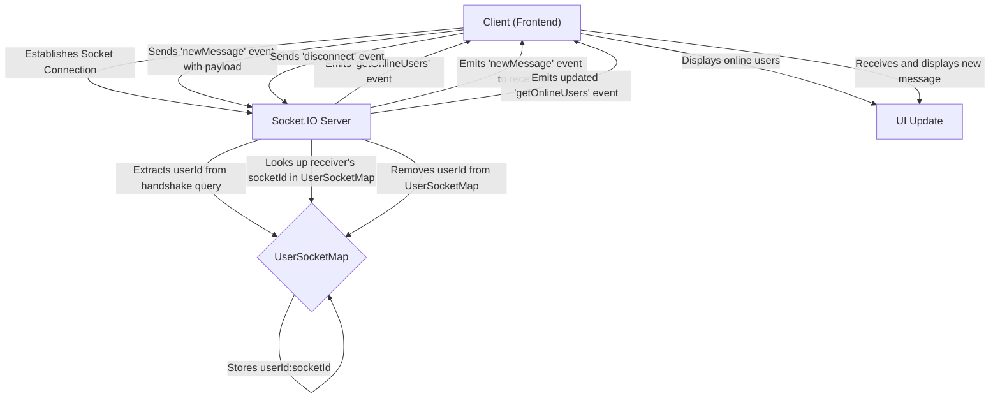
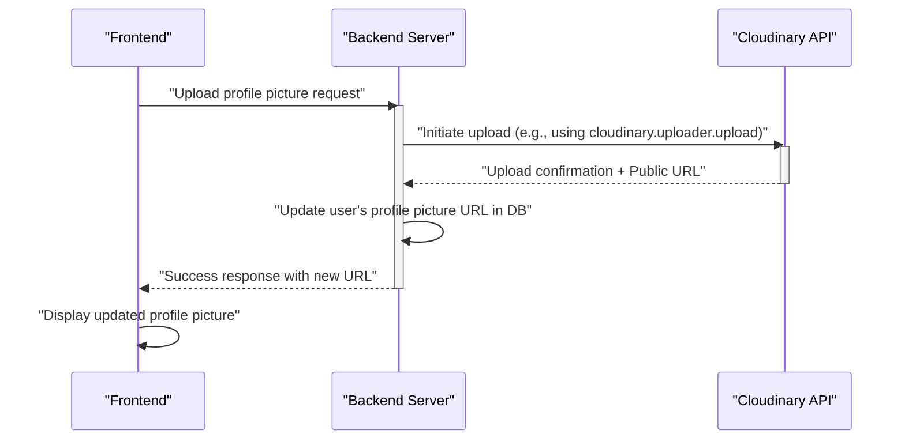

 # Backend Utilities and Services

The backend architecture leverages several utility functions and integrates with external services to provide core functionalities such as secure authentication, real-time communication, and media management. This document explores the key modules responsible for these operations, providing insights into their implementation and roles within the application.

## Authentication Utilities

Secure user authentication is paramount for any modern application. The backend employs JSON Web Tokens (JWTs) for managing user sessions and ensuring that authenticated requests are properly authorized.

### JWT Generation

The `generateToken` utility function is responsible for creating and setting a JWT upon successful user login or registration. This token is then stored as an `httpOnly` cookie, enhancing security by preventing client-side script access.

<br />

```javascript
// backend/src/lib/utils.js
export const generateToken = (userId, res) => {
    const token = jwt.sign({ userId }, process.env.JWT_SECRET, {
        expiresIn: "7d"
    });

    res.cookie("jwt", token, {
        maxAge: 7 * 24 * 60 * 60 * 1000,
        httpOnly: true,
        sameSite: "strict",
        secure: process.env.NODE_ENV !== "development",
    });
    return token;
};
```
<br />
This function takes a `userId` and the `response` object (`res`) as arguments. It signs the `userId` into a new JWT using the `JWT_SECRET` from environment variables, setting an expiration of 7 days. The token is then attached to the response as a cookie with specific security flags:
*   `maxAge`: The cookie's expiration time, matching the token's `expiresIn`.
*   `httpOnly`: Prevents client-side JavaScript from accessing the cookie, mitigating XSS attacks.
*   `sameSite: "strict"`: Provides protection against CSRF attacks.
*   `secure`: Ensures the cookie is only sent over HTTPS in production environments.

[View on GitHub](https://github.com/shinymack/Chat-App-MERN/blob/main/backend/src/lib/utils.js#L4-L16)

<br />

## Real-time Communication with Socket.IO

The application utilizes Socket.IO to enable real-time, bidirectional event-based communication between the server and clients. This is crucial for features like instant messaging, online user presence, and real-time updates.

### Socket.IO Server Setup

The `socket.js` module initializes the Socket.IO server, integrates it with the Express application, and handles user connections and disconnections.

<br />

```javascript
// backend/src/lib/socket.js
import { Server } from "socket.io";
import http from "http";
import express from "express";

const app = express();
const server = http.createServer(app);
const io = new Server(server, {
    cors: {
        origin: ["http://localhost:5173"] // Allow frontend origin
    }
})

// Stores mapping of userId to socketId for online users
const userSocketMap = {}; //{userId : socketId}

export function getReceiverSocketId(userId) {
    return userSocketMap[userId];
}

io.on("connection", (socket) => {
    console.log("A user connected", socket.id);

    const userId = socket.handshake.query.userId;
    if(userId) userSocketMap[userId] = socket.id;

    // Emit updated online users list to all connected clients
    io.emit("getOnlineUsers", Object.keys(userSocketMap));

    socket.on("disconnect", ()=>{
        console.log("A user disconnected", socket.id);
        delete userSocketMap[userId];
        io.emit("getOnlineUsers", Object.keys(userSocketMap));
    })
})

export { io, app, server };
```
<br />
This setup snippet illustrates the core components of the Socket.IO integration:
1.  **Express and HTTP Server**: An Express `app` is created, and an `http` server is built on top of it.
2.  **Socket.IO Server Initialization**: The `Server` class from `socket.io` is instantiated with the `http` server. `CORS` settings are configured to allow connections from the frontend development server (`http://localhost:5173`).
3.  **`userSocketMap`**: An object `userSocketMap` is maintained to keep track of online users, mapping their `userId` to their respective `socket.id`. This allows targeted messaging to specific users. The `getReceiverSocketId` function provides an interface to query this map.
4.  **Connection Handling**:
    *   Upon a new `connection`, the `userId` is extracted from the handshake query parameters and stored in `userSocketMap`.
    *   The `getOnlineUsers` event is emitted to all connected clients, broadcasting the current list of online user IDs.
    *   On `disconnect`, the user is removed from `userSocketMap`, and the updated `getOnlineUsers` list is broadcast again.

[View on GitHub](https://github.com/shinymack/Chat-App-MERN/blob/main/backend/src/lib/socket.js#L1-L40)

### Real-time Communication Flow

The interaction between the client and server for real-time features like sending messages and updating online status follows a specific flow:





## Cloudinary Integration for Media Management

Cloudinary is an external cloud-based media management service used for storing and delivering images and other media assets. The backend integrates with Cloudinary to handle file uploads, typically for user profile pictures or chat media.

### Cloudinary Configuration

The `cloudinary.js` module handles the initialization of the Cloudinary SDK using API credentials.

<br />

```javascript
// backend/src/lib/cloudinary.js
import {v2 as cloudinary} from "cloudinary"

import { config } from 'dotenv'

config(); // Load environment variables

cloudinary.config(
    {cloud_name: process.env.CLOUDINARY_CLOUD_NAME,
    api_key: process.env.CLOUDINARY_API_KEY,
    api_secret: process.env.CLOUDINARY_API_SECRET,}
);

export default cloudinary;
```
<br />
This snippet demonstrates:
1.  **Import**: The `v2` version of the Cloudinary SDK is imported.
2.  **Environment Variables**: `dotenv` is used to load environment variables, which include the Cloudinary `cloud_name`, `api_key`, and `api_secret`. These credentials are essential for authenticating requests to the Cloudinary API.
3.  **Configuration**: The `cloudinary.config()` method is called to set up the SDK with the loaded credentials, making the `cloudinary` object ready for use in other parts of the backend for upload and media management tasks.

[View on GitHub](https://github.com/shinymack/Chat-App-MERN/blob/main/backend/src/lib/cloudinary.js#L1-L12)

### User Profile Picture Upload Flow

When a user updates their profile picture, the backend orchestrates the upload process with Cloudinary.





## Key Integration Points

The utility functions and service integrations are critical for the backend's functionality, acting as foundational components for various modules.

*   **Authentication Flow**: The `generateToken` utility is invoked directly after a user successfully logs in or registers, integrating tightly with authentication routes to manage user sessions.
*   **Real-time Messaging**: The `socket.js` module is a standalone service that runs alongside the main Express application. It receives connection requests, manages the `userSocketMap`, and facilitates real-time message exchange and online status updates through its `io` instance. Other backend services can use `io` or `getReceiverSocketId` to send targeted messages.
*   **Media Handling**: The `cloudinary.js` configuration is imported into any service that needs to upload or manage media. For example, a user profile service would use the configured Cloudinary instance to handle profile picture uploads.

These modules encapsulate specific functionalities, promoting a clean architecture where core features are well-defined and easily maintainable. By centralizing these utilities, the backend ensures consistent behavior and reduces code duplication across different features.

Next: [Frontend Implementation](./3_frontend-implementation.mdx)