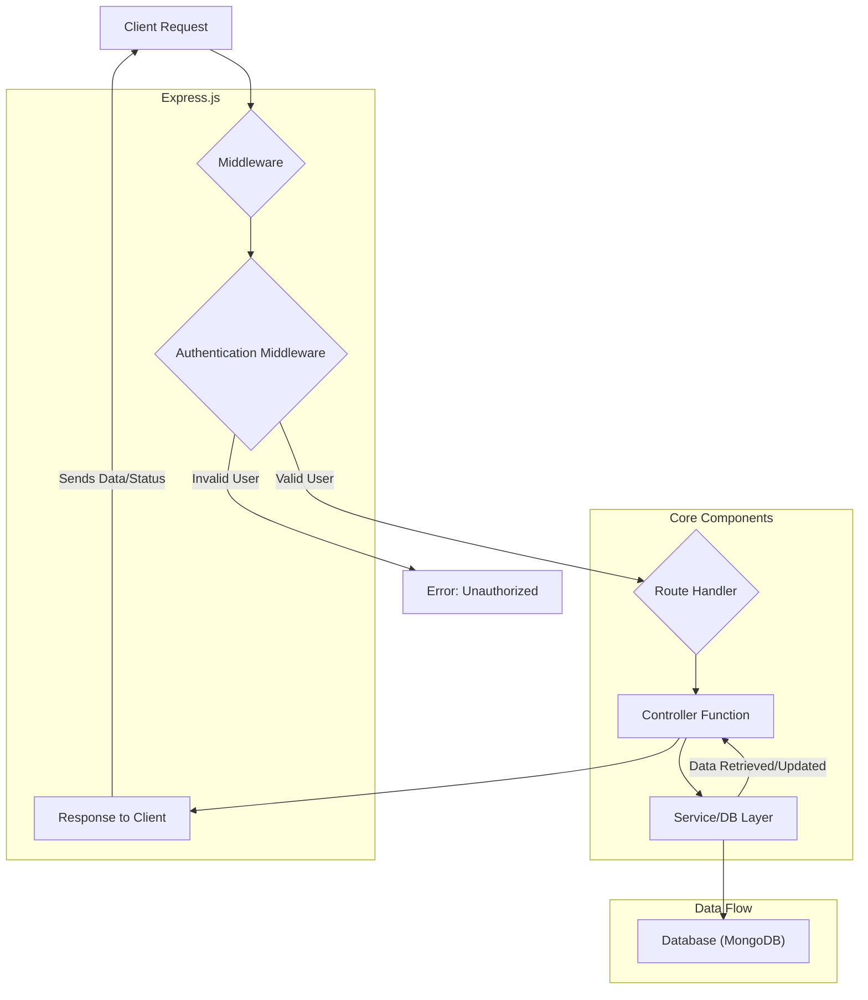
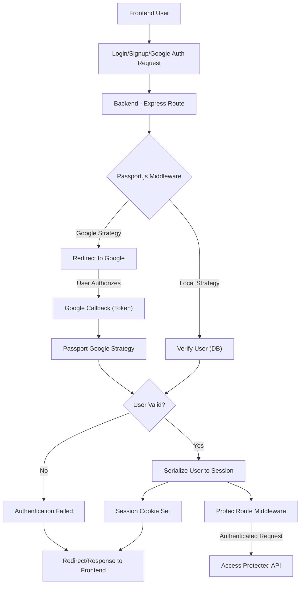

 
---
title: "Backend Architecture and API"
description: "Details the server-side structure, technology stack, and the exposed API endpoints."
---

# Backend Architecture and API

This document outlines the server-side architecture, the core technology stack, and the API endpoints exposed by the backend service. The backend is built to provide robust and scalable services for a real-time chat application, handling user authentication, message exchange, friend management, and more.

## Technology Stack

The backend leverages a modern JavaScript ecosystem, primarily centered around Node.js and Express.js, with MongoDB as the primary database. Real-time communication is facilitated by Socket.IO.

### Core Technologies

| Technology    | Description                                                     | Relevant Files                                                                |
| :------------ | :-------------------------------------------------------------- | :---------------------------------------------------------------------------- |
| **Node.js**   | JavaScript runtime for server-side execution.                   | `backend/package.json` (scripts)                                              |
| **Express.js**| Web application framework for routing and middleware management.| `backend/src/index.js`, `backend/src/routes/*.js`                             |
| **MongoDB**   | NoSQL database for flexible data storage.                       | `backend/package.json` (mongoose), `backend/src/lib/db.js`                    |
| **Mongoose**  | ODM (Object Data Modeling) library for MongoDB.                 | `backend/package.json` (mongoose), `backend/src/lib/db.js`                    |
| **Socket.IO** | Library for real-time, bidirectional, event-based communication.| `backend/package.json` (socket.io), `backend/src/lib/socket.js`               |
| **Passport.js**| Authentication middleware for Node.js.                        | `backend/package.json` (passport), `backend/src/lib/passport.config.js`       |
| **bcryptjs**  | Library for hashing passwords.                                  | `backend/package.json` (bcryptjs)                                             |
| **jsonwebtoken**| Implementation of JSON Web Tokens for secure authentication.| `backend/package.json` (jsonwebtoken)                                         |
| **Cloudinary**| Cloud-based image and video management.                         | `backend/package.json` (cloudinary)                                           |

### Dependencies Overview

The `backend/package.json` file lists all the dependencies required for the project. These include core frameworks, database connectors, authentication libraries, and utilities.

```json
// backend/package.json
{
  "name": "backend",
  "version": "1.0.0",
  "main": "src/index.js",
  "scripts": {
    "dev": "nodemon src/index.js",
    "start": "node src/index.js"
  },
  "dependencies": {
    "bcryptjs": "^2.4.3",
    "cloudinary": "^2.5.1",
    "cookie-parser": "^1.4.7",
    "dotenv": "^16.4.7",
    "express": "^4.21.2",
    "express-session": "^1.18.1",
    "jsonwebtoken": "^9.0.2",
    "mongoose": "^8.9.5",
    "passport": "^0.7.0",
    "passport-google-oauth20": "^2.0.0",
    "socket.io": "^4.8.1"
  },
  "devDependencies": {
    "nodemon": "^3.1.9"
  }
}
```
[View on GitHub](https://github.com/shinymack/Chat-App-MERN/blob/main/backend/package.json)

## Application Entry Point and Configuration

The `backend/src/index.js` file serves as the main entry point for the backend application. It's responsible for setting up the Express server, configuring middleware, connecting to the database, initializing Passport.js for authentication, and starting the server to listen for incoming requests.

```javascript
// backend/src/index.js
import express from "express";
import cors from "cors";
import authRoutes from "./routes/auth.route.js";
import messageRoutes from "./routes/message.route.js";
import friendRoutes from "./routes/friend.route.js";
// ... other imports ...
import { connectDB } from "./lib/db.js";
import { app, server } from "./lib/socket.js"; // Socket.IO setup

// ... environment configuration ...

app.use(cookieParser());
app.use(express.json({limit : '2mb'}));
app.use(express.urlencoded({ limit: '2mb', extended: true }));
app.use(cors({
    origin: "http://localhost:5173", // Frontend origin
    credentials: true,
}));

// Session and Passport.js setup
app.use(session({
    secret: process.env.SESSION_SECRET,
    resave: false,
    saveUninitialized: false,
    cookie: { /* ... cookie settings ... */ }
}));
app.use(passport.initialize());
app.use(passport.session());

// API route definitions
app.use("/api/auth", authRoutes );
app.use("/api/messages", messageRoutes );
app.use("/api/friends", friendRoutes);

// ... production setup for serving frontend ...

server.listen(PORT, () => {
    console.log("server is running on PORT: " + String(PORT));
    connectDB(); // Connect to MongoDB
});
```
[View on GitHub](https://github.com/shinymack/Chat-App-MERN/blob/main/backend/src/index.js)

### Middleware Configuration

The `index.js` file configures essential middleware to handle various aspects of incoming requests:

*   **`cookieParser`**: Parses incoming cookies from the request.
*   **`express.json`** & **`express.urlencoded`**: Parses JSON and URL-encoded request bodies, respectively. `limit: '2mb'` is applied to prevent excessively large payloads.
*   **`cors`**: Enables Cross-Origin Resource Sharing, allowing the frontend application (e.g., `http://localhost:5173`) to make requests to the backend. `credentials: true` ensures cookies are sent with requests.
*   **`express-session`**: Manages user sessions, essential for stateful authentication. The `secret` is an environment variable, and cookie settings are configured for security.
*   **`passport.initialize()`** & **`passport.session()`**: Initializes Passport.js and enables session support for persistent login sessions.

## Database Connection

The `backend/src/lib/db.js` file provides the `connectDB` function, which establishes a connection to the MongoDB database using Mongoose. The MongoDB URI is securely loaded from environment variables (`process.env.MONGODB_URI`).

```javascript
// backend/src/lib/db.js
import mongoose from "mongoose"

export const connectDB = async () => {
  try {
    const conn = await mongoose.connect(process.env.MONGODB_URI);
    console.log(`MongoDB connected:  ${conn.connection.host}`);
  }
  catch(error){
    console.log("MongoDB connection error: ", error);
  }
}
```
[View on GitHub](https://github.com/shinymack/Chat-App-MERN/blob/main/backend/src/lib/db.js)

This modular approach ensures that database connection logic is centralized and easily manageable.

## API Endpoints

The backend exposes a set of RESTful API endpoints, categorized by their domain (authentication, messages, friends). Each category has its own route file, which defines specific endpoints and links them to corresponding controller functions.

### Authentication API (`/api/auth`)

The `backend/src/routes/auth.route.js` file handles all authentication-related operations, including user registration, login, logout, profile updates, and Google OAuth integration.

```javascript
// backend/src/routes/auth.route.js
import express from "express"
import passport from 'passport';
import { login, logout, signup, updateProfile, checkAuth, googleAuthCallback, checkUsernameAvailability} from  "../controllers/auth.controller.js"
import { protectRoute } from "../middleware/auth.middleware.js"
const router = express.Router();

router.post("/signup", signup);
router.post("/login", login);
router.post("/logout", logout);
router.put("/update-profile", protectRoute ,updateProfile)
router.get("/username/check/:username", protectRoute, checkUsernameAvailability);
router.get("/check", protectRoute, checkAuth)

// Google OAuth routes
router.get('/google', passport.authenticate('google', { scope: ['profile', 'email'] }));
router.get('/google/callback',
    passport.authenticate('google', {
        failureRedirect: 'http://localhost:5173/login',
        failureMessage: true
    }),
    googleAuthCallback
);
export default router;
```
[View on GitHub](https://github.com/shinymack/Chat-App-MERN/blob/main/backend/src/routes/auth.route.js)

| Method | Endpoint                            | Description                                      | Authentication |
| :----- | :---------------------------------- | :----------------------------------------------- | :------------- |
| `POST` | `/api/auth/signup`                  | Registers a new user.                            | None           |
| `POST` | `/api/auth/login`                   | Authenticates a user and establishes a session.  | None           |
| `POST` | `/api/auth/logout`                  | Logs out the current user.                       | Session        |
| `PUT`  | `/api/auth/update-profile`          | Updates the authenticated user's profile.        | `protectRoute` |
| `GET`  | `/api/auth/username/check/:username`| Checks if a username is available.               | `protectRoute` |
| `GET`  | `/api/auth/check`                   | Checks if the user is authenticated.             | `protectRoute` |
| `GET`  | `/api/auth/google`                  | Initiates Google OAuth authentication.           | None           |
| `GET`  | `/api/auth/google/callback`         | Callback URL for Google OAuth, handles success/failure.| None (handled by Passport) |

The `protectRoute` middleware is used to ensure that only authenticated users can access certain endpoints. This middleware typically checks for a valid session or JWT.

### Backend Routing Flow





## Key Integration Points

### Real-time Communication with Socket.IO

The backend integrates Socket.IO for real-time messaging capabilities. The `backend/src/lib/socket.js` file exports the Express `app` and the `server` instance, allowing Socket.IO to attach to the same HTTP server. This enables seamless integration of RESTful API endpoints with WebSocket-based real-time features.
When a user logs in, their `userId` is associated with their Socket.IO connection, allowing for targeted real-time message delivery. This setup supports features like instant message updates, online status indicators, and typing notifications.

### Passport.js for Authentication Strategies

Passport.js is central to managing user authentication, supporting both local (username/password) and third-party (Google OAuth) strategies. The `configurePassport` function (defined in `backend/src/lib/passport.config.js`) sets up these strategies and defines how user information is serialized and deserialized for session management.





This diagram illustrates how user authentication flows through Passport.js, handling different strategies and integrating with the session management.

### Production Deployment

For production, the `backend/src/index.js` also serves the static files of the compiled frontend application. This simplifies deployment by allowing a single server to handle both API requests and frontend asset delivery.

```javascript
// backend/src/index.js
// ...
if(process.env.NODE_ENV === "production"){
    app.use(express.static(path.join(__dirname, "../frontend/dist")));

    app.get("*" , (req, res) => {
        res.sendFile(path.join(__dirname,"../frontend", "dist","index.html"));
    })
}
// ...
```
[View on GitHub (lines 60-64)](https://github.com/shinymack/Chat-App-MERN/blob/main/backend/src/index.js#L60-L64)

This setup ensures that all frontend routes are handled by the `index.html` file, allowing client-side routing to take over.

Next: [Authentication and Authorization](./2.1_authentication-authorization.mdx)
```