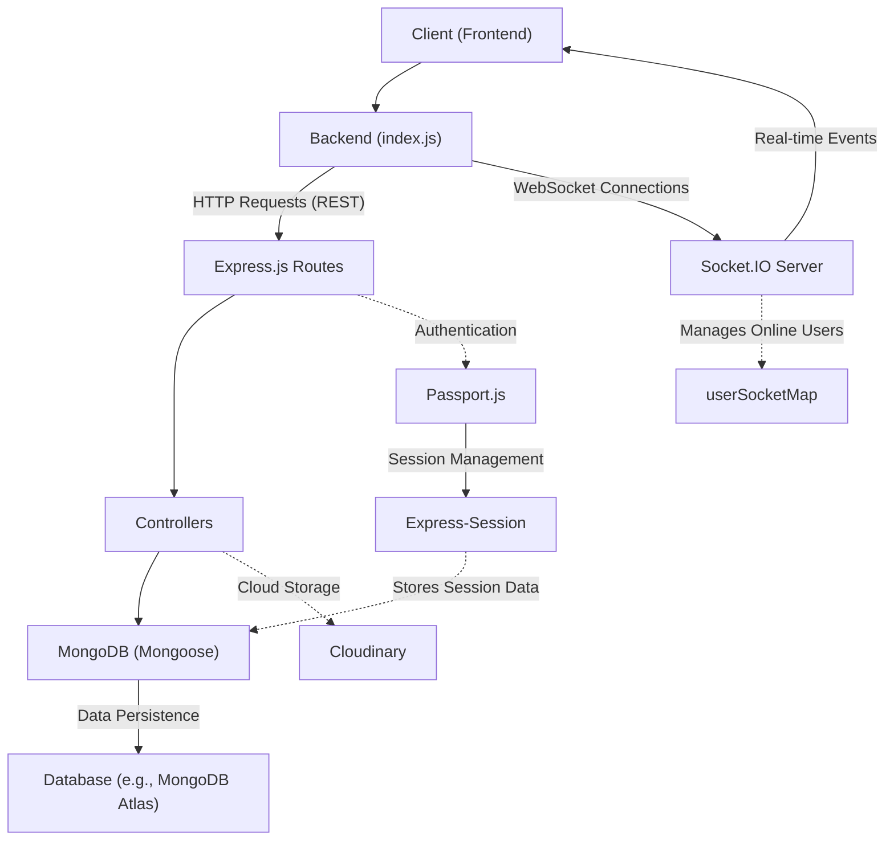
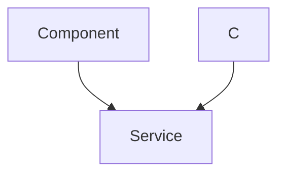

 ```
---
title: "Backend Architecture"
description: "Overview of the server-side structure, dependencies, and core services powering the chat application."
---

# Backend Architecture

The backend of the chat application is built on a robust Node.js and Express.js framework, designed to handle user authentication, message exchange, friend management, and real-time communication. It integrates several key technologies to provide a scalable and responsive service.

## Core Technologies and Dependencies

The `package.json` file outlines the primary dependencies that form the backbone of the backend services. These packages facilitate various functionalities, from database interaction to secure authentication and real-time messaging.

```json
// backend/package.json
{
  "name": "backend",
  "version": "1.0.0",
  "description": "Backend services for the chat application.",
  "dependencies": {
    "bcryptjs": "^2.4.3",
    "cloudinary": "^2.5.1",
    "cookie-parser": "^1.4.7",
    "dotenv": "^16.4.7",
    "express": "^4.21.2",
    "express-session": "^1.18.1",
    "jsonwebtoken": "^9.0.2",
    "mongoose": "^8.9.5",
    "passport": "^0.7.0",
    "passport-google-oauth20": "^2.0.0",
    "socket.io": "^4.8.1"
  },
  "devDependencies": {
    "nodemon": "^3.1.9"
  }
}
```
[View on GitHub](https://github.com/shinymack/Chat-App-MERN/blob/main/backend/package.json)

**Key Dependencies:**

*   **`express`**: The primary web framework for building RESTful APIs.
*   **`mongoose`**: An ODM (Object Data Modeling) library for MongoDB, simplifying database interactions.
*   **`socket.io`**: Enables real-time, bidirectional event-based communication between the server and clients, crucial for chat functionality.
*   **`bcryptjs`**: Used for hashing passwords to ensure user security.
*   **`jsonwebtoken`**: For creating and verifying JSON Web Tokens, often used for session management or API authentication.
*   **`passport` & `passport-google-oauth20`**: Authentication middleware, supporting various strategies, including Google OAuth for third-party logins.
*   **`express-session`**: Middleware for managing user sessions.
*   **`dotenv`**: Loads environment variables from a `.env` file, keeping sensitive configurations out of the codebase.
*   **`cloudinary`**: Integration for cloud-based image and video management, likely used for user avatars or media sharing.
*   **`cookie-parser`**: Parses Cookie headers and populates `req.cookies`.

## Server Entry Point and Configuration

The `backend/src/index.js` file serves as the main entry point for the backend application. It initializes the Express app, configures middleware, defines API routes, and starts the server, integrating both standard HTTP services and Socket.IO for real-time features.

```javascript
// backend/src/index.js
import express from "express";
import cors from "cors";
// ... other imports ...
import { app, server } from "./lib/socket.js"; // Import 'app' and 'server' from socket.js

// ... environment variable loading and passport config ...

app.use(cookieParser());
app.use(express.json({limit : '2mb'}));
app.use(express.urlencoded({ limit: '2mb', extended: true }));
app.use(cors({
    origin: "http://localhost:5173", // Frontend origin
    credentials: true,
}));

// ... session and passport middleware ...

app.use("/api/auth", authRoutes );
app.use("/api/messages", messageRoutes );
app.use("/api/friends", friendRoutes);

// ... production static file serving ...

server.listen(PORT, () => { // Using 'server' from socket.js
    console.log("server is running on PORT: " + String(PORT));
    connectDB();
});
```
[View on GitHub](https://github.com/shinymack/Chat-App-MERN/blob/main/backend/src/index.js)

This file sets up:
*   **Middleware:** `cors` for cross-origin requests, `express.json` and `express.urlencoded` for parsing request bodies, `cookieParser` for handling cookies, and `express-session` along with `passport` for authentication.
*   **API Routes:** Delegates specific API endpoints (`/api/auth`, `/api/messages`, `/api/friends`) to dedicated route handlers.
*   **Database Connection:** Initiates the MongoDB connection via `connectDB()`.
*   **Real-time Integration:** Crucially, it imports `app` and `server` from `socket.js`, ensuring that the same HTTP server instance is used by both Express and Socket.IO, allowing them to coexist on the same port.

### Backend Application Flow





## Database Integration

The `backend/src/lib/db.js` file handles the connection to the MongoDB database using Mongoose. This modular approach ensures that database connection logic is centralized and easily maintainable.

```javascript
// backend/src/lib/db.js
import mongoose from "mongoose"

export const connectDB = async () => {
  try {
    const conn = await mongoose.connect(process.env.MONGODB_URI);
    console.log(`MongoDB connected:  ${conn.connection.host}`);
  }
  catch(error){
    console.log("MongoDB connection error: ", error);
  }
}
```
[View on GitHub](https://github.com/shinymack/Chat-App-MERN/blob/main/backend/src/lib/db.js)

The `connectDB` function asynchronously establishes a connection to MongoDB, using the connection string specified in the `MONGODB_URI` environment variable. This ensures sensitive database credentials are not hardcoded.

## Real-time Communication (Socket.IO)

The `backend/src/lib/socket.js` file is dedicated to setting up and managing real-time communication using Socket.IO. It creates an HTTP server that Express also uses, allowing real-time features to run alongside standard API routes.

```javascript
// backend/src/lib/socket.js
import { Server } from "socket.io";
import http from "http";
import express from "express";

const app = express(); // Express app instance
const server = http.createServer(app); // HTTP server created with Express app

const io = new Server(server, {
    cors: {
        origin: ["http://localhost:5173"] // Frontend origin for Socket.IO
    }
})

// used to store online users
const userSocketMap = {}; //{userId : socketId}

io.on("connection", (socket) => {
    console.log("A user connected", socket.id);

    const userId = socket.handshake.query.userId;
    if(userId) userSocketMap[userId] = socket.id;

    io.emit("getOnlineUsers", Object.keys(userSocketMap));

    socket.on("disconnect", ()=>{
        console.log("A user disconnected", socket.id);
        delete userSocketMap[userId]; 
        io.emit("getOnlineUsers", Object.keys(userSocketMap));
    })
})

export { io, app, server };
```
[View on GitHub](https://github.com/shinymack/Chat-App-MERN/blob/main/backend/src/lib/socket.js)

**Key Responsibilities:**

*   **Server Creation:** Creates an `http` server using the `express` `app` instance, and then initializes `socket.io` on this `server`. This ensures that both Express HTTP requests and Socket.IO WebSocket connections can share the same port and server process.
*   **CORS Configuration:** Specifies allowed origins for WebSocket connections.
*   **Online User Tracking:** Maintains a `userSocketMap` to store the `socket.id` for each `userId` that is currently connected.
*   **Connection/Disconnection Handling:**
    *   On `connection`, it extracts the `userId` from the handshake query, maps it to the `socket.id`, and emits an `getOnlineUsers` event to all connected clients.
    *   On `disconnect`, it removes the user from the map and again emits an updated `getOnlineUsers` list.
*   **`getReceiverSocketId`:** A utility function (not fully shown in snippet but conceptually present) to retrieve the socket ID of a specific user, enabling direct messaging.

### Real-time Communication Flow





## Key Integration Points

The backend architecture is designed for modularity and efficient integration of various services:

*   **Shared HTTP Server:** The most critical integration is the shared `http` server between Express (`app`) and Socket.IO (`io`). By importing `app` and `server` from `socket.js` into `index.js`, both RESTful API endpoints and real-time WebSocket communication operate seamlessly on the same port, simplifying deployment and client-side connectivity.
*   **Authentication Flow:** `index.js` orchestrates user authentication by using `express-session` for session management and `passport.js` (configured in `lib/passport.config.js`) for various authentication strategies (e.g., local login, Google OAuth). These integrate directly with user models and `jsonwebtoken` for secure session handling.
*   **API Routing:** All incoming HTTP requests are routed through `index.js`, which then delegates to specific route files (`auth.route.js`, `message.route.js`, `friend.route.js`). Each route file further directs requests to appropriate controller functions.
*   **Database Access:** Mongoose models are used within controllers to interact with the MongoDB database. The `connectDB` function from `lib/db.js` ensures a single, consistent database connection.
*   **Real-time Messaging:** When a message is sent via an API endpoint (HTTP POST), the server saves it to the database, and then uses `socket.io` to immediately notify the recipient (if online) via `io.to(receiverSocketId).emit("newMessage", message)`. This provides an instant user experience.
*   **Environment Variables:** `dotenv` is used across the application to manage configuration variables (like `MONGODB_URI`, `PORT`, `SESSION_SECRET`), promoting security and flexibility for different deployment environments.

This structure allows for a clear separation of concerns, making the codebase easier to understand, test, and maintain, while providing both standard RESTful interactions and dynamic real-time features essential for a modern chat application.

---

Next: [API Endpoints and Controllers](./2.1_api-endpoints-and-controllers.mdx)
```