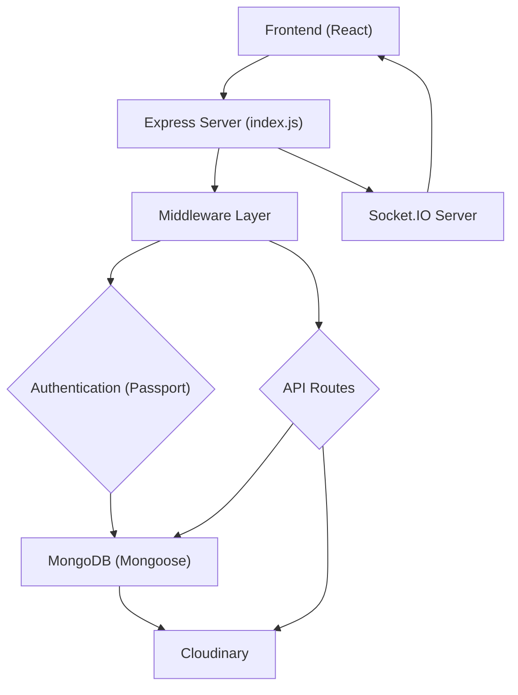
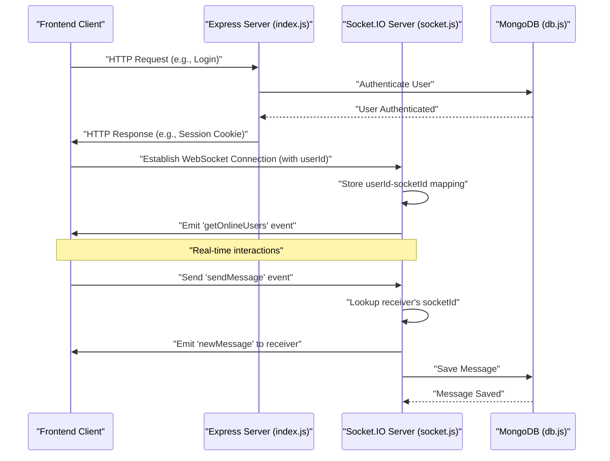

 # Backend Architecture

This document provides a comprehensive overview of the backend architecture, outlining its structure, design principles, and core components. The backend serves as the primary data and business logic layer, handling API requests, user authentication, database interactions, and real-time communication.

## Core Technologies and Dependencies

The backend is built upon a robust set of technologies, primarily leveraging the Node.js ecosystem. Below are the key dependencies identified from `backend/package.json`:

*   **Web Framework:**
    *   `express`: The fast, unopinionated, minimalist web framework for Node.js, forming the backbone of the API.
*   **Database & ORM:**
    *   `mongoose`: An elegant MongoDB object modeling tool, designed to work in an asynchronous environment. It simplifies data interaction with MongoDB.
*   **Authentication & Security:**
    *   `bcryptjs`: A library to hash passwords, ensuring secure storage of user credentials.
    *   `jsonwebtoken`: Used for creating, signing, and verifying JSON Web Tokens (JWTs) for stateless authentication.
    *   `cookie-parser`: Parses `Cookie` header and populates `req.cookies` with an object keyed by the cookie names.
    *   `express-session`: Middleware for managing user sessions, essential for Passport.js.
    *   `passport`: Authentication middleware for Node.js.
    *   `passport-google-oauth20`: A Passport strategy for authenticating with Google using the OAuth 2.0 API.
*   **Real-time Communication:**
    *   `socket.io`: A library that enables real-time, bidirectional, event-based communication between the browser and the server.
*   **Cloud Storage:**
    *   `cloudinary`: A cloud service that offers a complete solution for image and video management, from upload to delivery.
*   **Environment Variables:**
    *   `dotenv`: Loads environment variables from a `.env` file into `process.env`.
*   **Development Tools:**
    *   `nodemon`: A tool that helps develop Node.js based applications by automatically restarting the node application when file changes in the directory are detected.

## Application Entry Point (`backend/src/index.js`)

The `backend/src/index.js` file is the heart of the backend application, responsible for initializing the Express server, configuring middleware, setting up authentication, defining API routes, and establishing connections to the database and real-time socket server.

It brings together various modules to create a fully functional server.

```javascript
import express from "express";
import cors from "cors";
import authRoutes from "./routes/auth.route.js";
import messageRoutes from "./routes/message.route.js";
import friendRoutes from "./routes/friend.route.js";

import path from "path";

import dotenv from "dotenv";
import cookieParser from "cookie-parser";

import { connectDB } from "./lib/db.js";
import { app, server } from "./lib/socket.js"; // Importing app and server from socket.js

import session from "express-session";
import passport from "passport";
import { configurePassport } from "./lib/passport.config.js";

const __dirname = path.resolve();
dotenv.config();

configurePassport(); // Initialize Passport strategies
```
[View on GitHub](https://github.com/shinymack/Chat-App-MERN/blob/main/backend/src/index.js#L1-L22)

### Middleware Configuration

The application configures several Express middleware to handle various aspects of incoming requests, including parsing JSON and URL-encoded bodies, enabling Cross-Origin Resource Sharing (CORS), and managing cookies and sessions.

```javascript
app.use(cookieParser());
app.use(express.json({limit : '2mb'})); // Parses JSON request bodies
app.use(express.urlencoded({ limit: '2mb', extended: true })); // Parses URL-encoded request bodies
app.use(cors({
    origin: "http://localhost:5173", // Allows requests from the frontend
    credentials: true, // Allows sending cookies with cross-origin requests
}));
```
[View on GitHub](https://github.com/shinymack/Chat-App-MERN/blob/main/backend/src/index.js#L24-L30)

### Session and Authentication Setup

`express-session` and `passport` are configured to manage user sessions and implement authentication strategies (e.g., Google OAuth 2.0). Sessions are used to maintain user state across requests, while Passport handles the complex authentication flows.

```javascript
app.use(session({
    secret: process.env.SESSION_SECRET,
    resave: false,
    saveUninitialized: false,
    cookie: {
        secure: process.env.NODE_ENV === "production", // `true` in production for HTTPS
        httpOnly: true, // Prevents client-side JavaScript from accessing cookies
        maxAge: 7 * 24 * 60 * 60 * 1000 // 7 days expiration
    }
}));

app.use(passport.initialize()); // Initializes Passport
app.use(passport.session()); // Enables Passport to use sessions
```
[View on GitHub](https://github.com/shinymack/Chat-App-MERN/blob/main/backend/src/index.js#L32-L46)

### API Routes

The backend defines distinct route modules for authentication, messages, and friend management, promoting modularity and maintainability.

```javascript
app.use("/api/auth", authRoutes ); // Authentication routes (login, register, logout, Google OAuth)
app.use("/api/messages", messageRoutes ); // Message-related routes
app.use("/api/friends", friendRoutes); // Friend management routes
```
[View on GitHub](https://github.com/shinymack/Chat-App-MERN/blob/main/backend/src/index.js#L48-L51)

### Server Initialization

The server listens on a specified port, and upon successful startup, it initiates the database connection. In a production environment, it also serves the static frontend assets.

```javascript
const PORT = process.env.PORT;
if(process.env.NODE_ENV === "production"){
    app.use(express.static(path.join(__dirname, "../frontend/dist")));

    app.get("*" , (req, res) => {
        res.sendFile(path.join(__dirname,"../frontend", "dist","index.html"));
    })
}

server.listen(PORT, () => {
    console.log("server is running on PORT: " + String(PORT));
    connectDB(); // Connects to MongoDB
});
```
[View on GitHub](https://github.com/shinymack/Chat-App-MERN/blob/main/backend/src/index.js#L54-L65)

## Database Management (`backend/src/lib/db.js`)

The `backend/src/lib/db.js` file encapsulates the logic for connecting to the MongoDB database using Mongoose. This modular approach ensures that database connection concerns are isolated and easily manageable.

```javascript
import mongoose from "mongoose"

export const connectDB = async () => {
  try {
    const conn = await mongoose.connect(process.env.MONGODB_URI);
    console.log(`MongoDB connected:  ${conn.connection.host}`);
  }
  catch(error){
    console.log("MongoDB connection error: ", error);
  }
}
```
[View on GitHub](https://github.com/shinymack/Chat-App-MERN/blob/main/backend/src/lib/db.js)

The `connectDB` function attempts to establish a connection to MongoDB using the URI provided in environment variables. It logs success or error messages, aiding in quick diagnosis of database connectivity issues.

## Real-time Communication (`backend/src/lib/socket.js`)

The `backend/src/lib/socket.js` module sets up the Socket.IO server, enabling real-time, bidirectional communication. It integrates with the main Express application to share the HTTP server instance. This setup is crucial for features like instant messaging, online user status, and notifications.

```javascript
import { Server } from "socket.io";
import http from "http";
import express from "express";

const app = express(); // An Express app instance

const server = http.createServer(app); // HTTP server wrapped around Express app

const io = new Server(server, {
    cors: {
        origin: ["http://localhost:5173"] // CORS configuration for Socket.IO
    }
})

// Stores online users: {userId : socketId}
const userSocketMap = {};

export function getReceiverSocketId(userId) {
    return userSocketMap[userId];
}

io.on("connection", (socket) => {
    console.log("A user connected", socket.id);

    const userId = socket.handshake.query.userId;
    if(userId) userSocketMap[userId] = socket.id;

    io.emit("getOnlineUsers", Object.keys(userSocketMap)); // Emit online users to all clients

    socket.on("disconnect", ()=>{
        console.log("A user disconnected", socket.id);
        delete userSocketMap[userId];
        io.emit("getOnlineUsers", Object.keys(userSocketMap)); // Update and emit online users
    })
})

export { io, app, server }; // Exporting io, app, and server
```
[View on GitHub](https://github.com/shinymack/Chat-App-MERN/blob/main/backend/src/lib/socket.js)

This module initializes `socket.io` and handles connection/disconnection events. It maintains a `userSocketMap` to keep track of online users and their corresponding socket IDs, allowing for targeted real-time communication.

## Backend Architecture Overview

Here's a high-level diagram illustrating the backend's core components and their interactions:





## Key Integration Points

### Express Application Flow

The backend operates as a central hub for all incoming requests. The `index.js` file orchestrates the request lifecycle:

1.  **Request Reception:** The Express server (`app`) receives HTTP requests from the frontend.
2.  **Middleware Processing:** Requests first pass through a series of middleware (`cookieParser`, `express.json`, `cors`, `express-session`, `passport`). These prepare the request object, parse payloads, handle CORS, and manage session/authentication state.
3.  **Route Handling:** Based on the request URL, the appropriate route handler (e.g., `authRoutes`, `messageRoutes`) is invoked.
4.  **Business Logic & Data Access:** Route handlers execute business logic, interact with services, and perform CRUD operations on the MongoDB database via Mongoose models.
5.  **Response Generation:** The server constructs an HTTP response and sends it back to the frontend.

### Real-time Communication Flow

The Socket.IO server runs alongside the Express HTTP server, providing a separate, persistent connection for real-time interactions:





1.  **WebSocket Connection:** After a user logs in (via HTTP), the frontend client establishes a WebSocket connection with the `Socket.IO Server`. The `userId` is passed during this handshake.
2.  **Online User Tracking:** The `Socket.IO Server` stores a mapping of `userId` to `socketId` (in `userSocketMap`) to track online users.
3.  **Real-time Events:**
    *   When a user connects or disconnects, the server emits `getOnlineUsers` to all connected clients, updating their online status displays.
    *   For messaging, a client sends a `sendMessage` event. The server uses `getReceiverSocketId` to find the recipient's active socket and emits a `newMessage` event directly to them, ensuring instant delivery. Messages are also persisted in the MongoDB database.

### Database Interaction

The `connectDB` function from `backend/src/lib/db.js` is crucial for establishing the database connection at server startup. All Mongoose models and queries within the API routes depend on this connection to interact with MongoDB.

### Error Handling

While not explicitly detailed in the provided snippets, a robust backend would include comprehensive error handling middleware in `index.js` to catch unhandled exceptions, log errors, and send appropriate HTTP error responses to the client, preventing application crashes and providing meaningful feedback.

Next: [API Endpoints and Controllers](./2.1_api-endpoints-and-controllers.mdx)