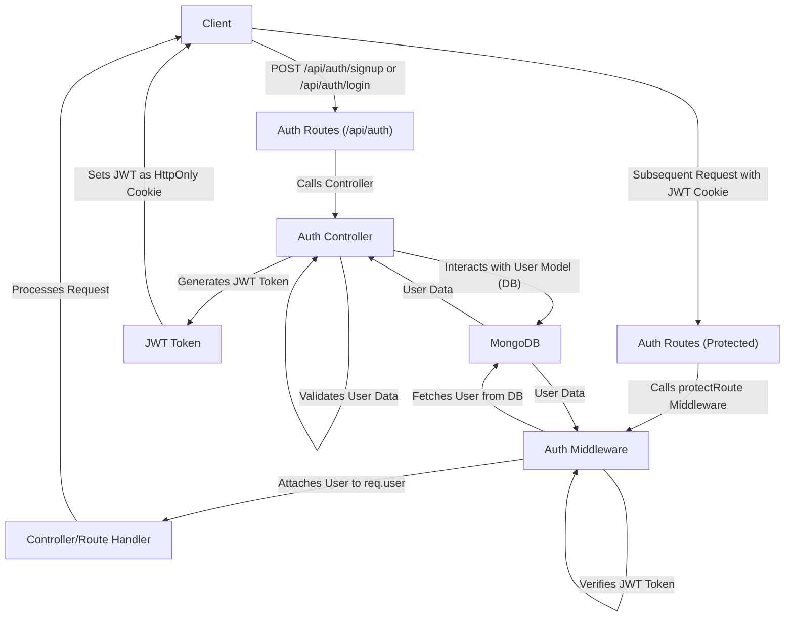
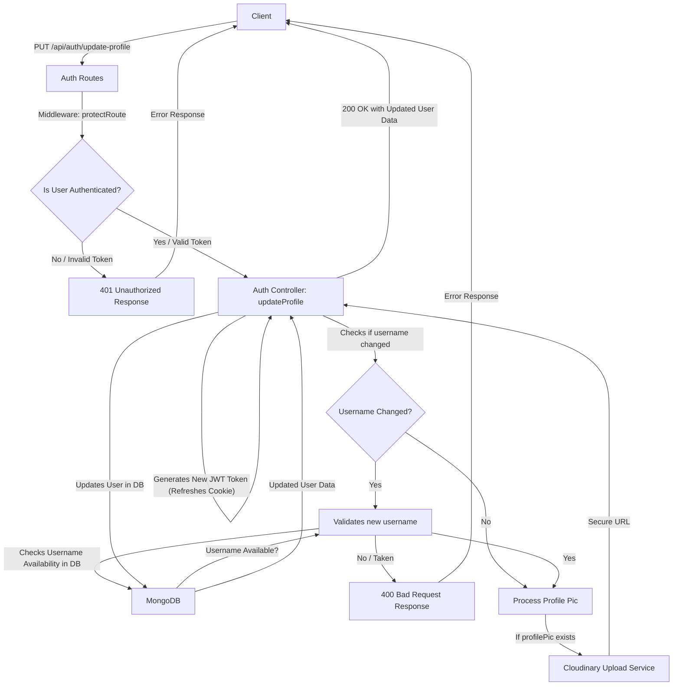

 ```md
---
title: "Backend Architecture and APIs"
description: "Details the server-side structure, API endpoints, and data flow of the application."
---

# Backend Architecture and APIs

This section provides an in-depth look into the server-side architecture, outlining the core components, API endpoints, and data flow within the application. The backend is built using Node.js with Express, handling user authentication, message processing, and friend management.

## Core Components

The backend architecture is structured around several key components that work together to provide robust API services.

### Server Setup and Middleware

The `backend/src/index.js` file is the entry point for the server, responsible for setting up Express, connecting to the database, and configuring essential middleware. It integrates `cors`, `cookie-parser`, `express.json`, `express-session`, and `passport` for handling cross-origin requests, cookies, JSON body parsing, session management, and authentication strategies, respectively.

```javascript filename="backend/src/index.js"
import express from "express";
import cors from "cors";
import authRoutes from "./routes/auth.route.js";
// ... other imports

const __dirname = path.resolve();
dotenv.config();

configurePassport(); // Setup Google OAuth strategy

app.use(cookieParser());
app.use(express.json({limit : '2mb'})); // Parse JSON request bodies
app.use(cors({
    origin: "http://localhost:5173", // Frontend origin
    credentials: true,
}));

app.use(session({
    secret: process.env.SESSION_SECRET, 
    resave: false,
    saveUninitialized: false, 
    cookie: {
        secure: process.env.NODE_ENV === "production",
        httpOnly: true,
        maxAge: 7 * 24 * 60 * 60 * 1000 
    }
}));

app.use(passport.initialize());
app.use(passport.session());  

app.use("/api/auth", authRoutes ); // Mount authentication routes
// ... other route mounts
```
[View on GitHub](https://github.com/shinymack/Chat-App-MERN/blob/main/backend/src/index.js#L1-L50)

### Authentication Logic

The `backend/src/controllers/auth.controller.js` file centralizes all authentication-related business logic. This includes user registration (`signup`), login (`login`), logout (`logout`), checking user authentication status (`checkAuth`), handling Google OAuth callbacks (`googleAuthCallback`), checking username availability, and updating user profiles.

Each function within the controller is responsible for validating input, interacting with the `User` model, hashing passwords (for email-based authentication), generating JWT tokens, and sending appropriate HTTP responses.

```javascript filename="backend/src/controllers/auth.controller.js"
import bcrypt from "bcryptjs";
import { generateToken } from "../lib/utils.js";
import User from "../models/user.model.js";

export const signup = async (req, res) => {
    const {username, email, password} = req.body;
    try {
        if(!username || !email || !password) {
            return res.status(400).json({message: "Please fill in all fields."});
        }
        // ... validation logic
        const salt = await bcrypt.genSalt(10);
        const hashedPassword = await bcrypt.hash(password, salt);

        const newUser = new User({
            username,
            email,
            password: hashedPassword,
            authProvider: 'email'
        });
        if(newUser){
            generateToken(newUser._id, res); // Generate JWT and set cookie
            await newUser.save();
            res.status(201).json({
                _id: newUser._id,
                username: newUser.username,
                email: newUser.email,   
                profilePic: newUser.profilePic,
                authProvider: newUser.authProvider
            });
        } // ... error handling
    } catch (error) {
        console.log("Error in signup controller", error.message)
        res.status(500).json({message: "Something went wrong."});
    }
};

// ... other authentication functions
```
[View on GitHub](https://github.com/shinymack/Chat-App-MERN/blob/main/backend/src/controllers/auth.controller.js#L6-L51)

### Authentication Middleware

The `backend/src/middleware/auth.middleware.js` defines the `protectRoute` middleware, which is crucial for securing API endpoints. This middleware verifies the JWT token present in the request cookies. If a valid token is found, it decodes it, fetches the corresponding user from the database, attaches the user object to the request (`req.user`), and allows the request to proceed to the next handler.

```javascript filename="backend/src/middleware/auth.middleware.js"
import jwt from "jsonwebtoken"
import User from "../models/user.model.js"

export const protectRoute = async (req, res, next) => {
    try {
        const token = req.cookies.jwt; // Retrieve JWT from cookies
        if(!token){
            return res.status(401).json({message: "Unauthorized - No Token Provided"});
        }

        const decoded = jwt.verify(token, process.env.JWT_SECRET) // Verify token signature

        if(!decoded) {
            return res.status(401).json({message: "Unauthorized - Invalid Token"});
        }
        const user = await User.findById(decoded.userId).select("-password"); // Find user by ID

        if(!user) {
            return res.status(404).json({message: "User not found"});
        }
        req.user = user; // Attach user object to request

        next(); // Proceed to the next middleware/route handler
    } catch (error) {
        console.log("Error in protectRoute middleware", error.message);
        res.status(500).json({message: "Internal Server Error"});
    }
};
```
[View on GitHub](https://github.com/shinymack/Chat-App-MERN/blob/main/backend/src/middleware/auth.middleware.js#L3-L29)

### Authentication Routes

The `backend/src/routes/auth.route.js` file defines all API endpoints related to user authentication and profile management. It maps specific HTTP methods and paths to the controller functions, applying the `protectRoute` middleware where necessary to ensure authenticated access.

```javascript filename="backend/src/routes/auth.route.js"
import express from "express"
import passport from 'passport';
import { login, logout, signup, updateProfile, checkAuth, googleAuthCallback, checkUsernameAvailability} from  "../controllers/auth.controller.js"
import { protectRoute } from "../middleware/auth.middleware.js"

const router = express.Router();

router.post("/signup", signup); // Public endpoint for user registration

router.post("/login", login); // Public endpoint for user login

router.post("/logout", logout); // Protected endpoint for user logout

router.put("/update-profile", protectRoute ,updateProfile); // Protected endpoint for profile updates

router.get("/username/check/:username", protectRoute, checkUsernameAvailability); // Protected endpoint for username availability check

router.get("/check", protectRoute, checkAuth); // Protected endpoint to check auth status

router.get(
    '/google',
    passport.authenticate('google', { scope: ['profile', 'email'] }) // Initiates Google OAuth flow
);
router.get(
    '/google/callback',
    passport.authenticate('google', {
        failureRedirect: 'http://localhost:5173/login', 
        failureMessage: true 
    }),
    googleAuthCallback // Handles Google OAuth callback
);

export default router;
```
[View on GitHub](https://github.com/shinymack/Chat-App-MERN/blob/main/backend/src/routes/auth.route.js#L4-L35)

## API Endpoints

The following table summarizes the key API endpoints exposed by the backend for authentication and user management.

| Method | Endpoint                          | Description                                         | Authentication Required | Controller Function          |
| :----- | :-------------------------------- | :-------------------------------------------------- | :---------------------- | :--------------------------- |
| `POST` | `/api/auth/signup`                | Registers a new user.                               | No                      | `signup`                     |
| `POST` | `/api/auth/login`                 | Authenticates a user and issues a JWT.              | No                      | `login`                      |
| `POST` | `/api/auth/logout`                | Clears the JWT cookie to log out a user.            | Yes                     | `logout`                     |
| `PUT`  | `/api/auth/update-profile`        | Updates user profile information (username, picture). | Yes                     | `updateProfile`              |
| `GET`  | `/api/auth/username/check/:username` | Checks if a username is available.                  | Yes                     | `checkUsernameAvailability`  |
| `GET`  | `/api/auth/check`                 | Verifies current user's authentication status.      | Yes                     | `checkAuth`                  |
| `GET`  | `/api/auth/google`                | Initiates Google OAuth authentication flow.         | No                      | `passport.authenticate`      |
| `GET`  | `/api/auth/google/callback`       | Handles Google OAuth callback and user login/signup. | No                      | `googleAuthCallback`         |

## Authentication Flow

The application supports both email/password-based authentication and Google OAuth. The `protectRoute` middleware ensures that sensitive endpoints are only accessible by authenticated users.





## User Profile Management

Users can update their profile information, including their username and profile picture. The `updateProfile` controller handles these operations, performing validation and interacting with Cloudinary for image uploads.

```javascript filename="backend/src/controllers/auth.controller.js"
import cloudinary from "../lib/cloudinary.js"; // Cloudinary for image uploads
import User from "../models/user.model.js";

export const updateProfile = async (req, res) => {
    try {
        const { profilePic, username } = req.body; 
        const userId = req.user._id;
        let userToUpdate = await User.findById(userId);

        if (!userToUpdate) {
            return res.status(404).json({ message: "User not found." });
        }

        const fieldsToUpdate = {};
        let newUsername = username ? username.trim() : null;

        // Handle username update
        if (newUsername && newUsername !== userToUpdate.username) {
            // ... username validation
            const existingUserWithNewUsername = await User.findOne({ username: newUsername, _id: { $ne: userId } });
            if (existingUserWithNewUsername) {
                return res.status(400).json({ message: "This username is already taken by someone else." });
            }
            fieldsToUpdate.username = newUsername;
        }

        // Handle profile picture update
        if (profilePic) {
            const uploadResponse = await cloudinary.uploader.upload(profilePic);
            fieldsToUpdate.profilePic = uploadResponse.secure_url;
        }

        if (Object.keys(fieldsToUpdate).length === 0) {
            return res.status(400).json({ message: "No changes provided to update." });
        }

        const updatedUser = await User.findByIdAndUpdate(userId, { $set: fieldsToUpdate }, { new: true });
        generateToken(updatedUser._id, res); // Refresh JWT cookie
        res.status(200).json(updatedUser);

    } catch (error) {
        console.error("Error in updateProfile controller", error.message);
        res.status(500).json({ message: "Internal Server Error while updating profile." });
    }
};
```
[View on GitHub](https://github.com/shinymack/Chat-App-MERN/blob/main/backend/src/controllers/auth.controller.js#L182-L248)





## Key Integration Points

*   **Express and Middleware:** `index.js` orchestrates all incoming requests, applying middleware globally or to specific routes. This ensures consistent handling of CORS, session, and authentication across the application.
*   **Database Interaction:** The `User` model (and other models) interact directly with MongoDB, primarily via Mongoose. Controllers encapsulate the logic for creating, reading, updating, and deleting data.
*   **Authentication Flow (JWT & Passport):** JWTs are used for stateless authentication for most API calls. `passport.js` is integrated for Google OAuth, handling the redirection, consent, and callback process. The `generateToken` utility ensures that authenticated users receive a `jwt` cookie.
*   **Client-Side Redirection:** After Google OAuth, the `googleAuthCallback` redirects the client back to the frontend URL, potentially with error parameters, allowing the frontend to manage post-authentication experience.
*   **Cloudinary Integration:** For file uploads (specifically profile pictures), `cloudinary` is used to handle storage and retrieval, offloading media management from the backend server.
```