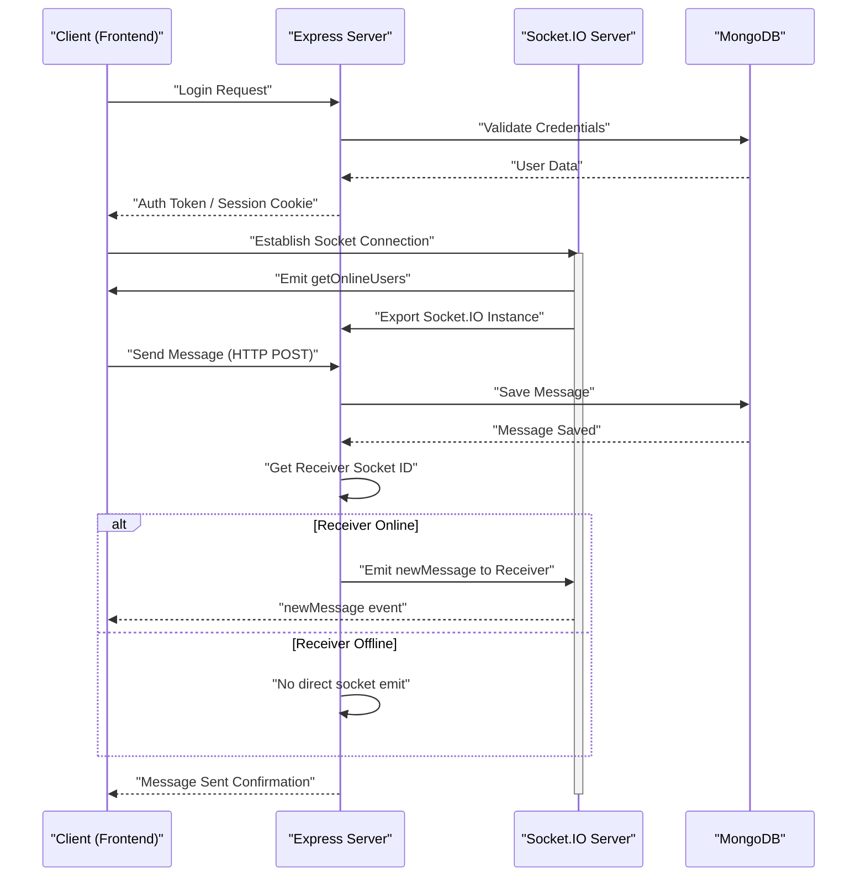

 # Backend Architecture and APIs

This document provides a comprehensive overview of the backend architecture, outlining its core components, the technologies used, and the API endpoints that facilitate communication with the frontend. The backend is built using Node.js with Express, leveraging MongoDB for data persistence and Socket.IO for real-time communication.

## Core Technologies and Dependencies

The `package.json` file reveals the foundational technologies and essential libraries powering the backend:

```json
// backend/package.json
{
  "name": "backend",
  "version": "1.0.0",
  "main": "src/index.js",
  "scripts": {
    "dev": "nodemon src/index.js",
    "start": "node src/index.js"
  },
  "dependencies": {
    "bcryptjs": "^2.4.3",
    "cloudinary": "^2.5.1",
    "cookie-parser": "^1.4.7",
    "dotenv": "^16.4.7",
    "express": "^4.21.2",
    "express-session": "^1.18.1",
    "jsonwebtoken": "^9.0.2",
    "mongoose": "^8.9.5",
    "passport": "^0.7.0",
    "passport-google-oauth20": "^2.0.0",
    "socket.io": "^4.8.1"
  },
  "devDependencies": {
    "nodemon": "^3.1.9"
  }
}
```

This configuration highlights key aspects of the stack:

*   **Express**: The primary web framework for handling HTTP requests and routing.
*   **Mongoose**: An ODM (Object Data Modeling) library for MongoDB, simplifying database interactions.
*   **Socket.IO**: Enables real-time, bidirectional, event-based communication, crucial for chat applications.
*   **Authentication**: `bcryptjs` for password hashing, `jsonwebtoken` for token-based authentication, `passport` and `passport-google-oauth20` for OAuth 2.0 integration (Google).
*   **Session Management**: `express-session` and `cookie-parser` for managing user sessions.
*   **Cloudinary**: For cloud-based image and video management, likely used for user avatars or media sharing.
*   **dotenv**: Manages environment variables for secure configuration.
*   **nodemon**: A development dependency for automatic server restarts on file changes.

[View `package.json` on GitHub](https://github.com/shinymack/Chat-App-MERN/blob/main/backend/package.json)

## Server Initialization and Configuration

The `backend/src/index.js` file serves as the entry point for the backend application, orchestrating middleware, routing, and database connections.

```javascript
// backend/src/index.js (snippet)
import express from "express";
import cors from "cors";
import authRoutes from "./routes/auth.route.js";
import messageRoutes from "./routes/message.route.js";
import friendRoutes from "./routes/friend.route.js";

// ... other imports ...

import { connectDB } from "./lib/db.js";
import { app, server } from "./lib/socket.js"; // Importing app and server from socket setup

// ... other configurations ...

app.use(cookieParser());
app.use(express.json({limit : '2mb'}));
app.use(express.urlencoded({ limit: '2mb', extended: true }));
app.use(cors({
    origin: "http://localhost:5173",
    credentials: true,
}));

// ... session and passport setup ...

app.use("/api/auth", authRoutes );
app.use("/api/messages", messageRoutes );
app.use("/api/friends", friendRoutes);

// ... production serving logic ...

server.listen(PORT, () => {
    console.log("server is running on PORT: " + String(PORT));
    connectDB();
});
```

This file performs several critical functions:

*   **Middleware Setup**:
    *   `cors`: Configured to allow requests from `http://localhost:5173`, enabling cross-origin communication with the frontend. `credentials: true` ensures cookies are sent.
    *   `express.json` and `express.urlencoded`: Parse incoming request bodies, with a `2mb` limit.
    *   `cookieParser`: Parses cookies attached to the client request object.
    *   `express-session` and `passport`: Initialize session management and authentication strategies (e.g., Google OAuth).
*   **Route Handling**: Defines base paths for different API concerns:
    *   `/api/auth`: Handles user authentication, registration, and session management.
    *   `/api/messages`: Manages message-related operations.
    *   `/api/friends`: Deals with friend requests and contact management.
*   **Database Connection**: Calls `connectDB()` to establish a connection to MongoDB when the server starts.
*   **Server Initialization**: The `server` (an HTTP server created within `socket.js`) listens on the configured `PORT`.

[View `backend/src/index.js` on GitHub](https://github.com/shinymack/Chat-App-MERN/blob/main/backend/src/index.js)

### Express Application Flow

Here's a simplified view of the Express application's lifecycle, from request reception to response generation:


```mermaid
graph TD
    A["Client Request"] --> B("Express App");
    B --> C("cookieParser Middleware")|"Parse Cookies"|;
    C --> D("express.json/urlencoded")|"Parse Body"|;
    D --> E("cors Middleware")|"Handle CORS"|;
    E --> F("express-session")|"Manage Session"|;
    F --> G("Passport Middleware")|"Authenticate User"|;
    G --> H{"API Route Matched?"};
    H -- "Yes" --> I("Route Handlers");
    H -- "No" --> J("Static File Server")|"Serve Frontend"|;
    I --> K["Database Interaction"];
    I --> L["Response to Client"];
    J --> L;
```


## Database Connection

The `backend/src/lib/db.js` file encapsulates the logic for connecting to the MongoDB database using Mongoose.

```javascript
// backend/src/lib/db.js
import mongoose from "mongoose"

export const connectDB = async () => {
  try {
    const conn = await mongoose.connect(process.env.MONGODB_URI);
    console.log(`MongoDB connected:  ${conn.connection.host}`);
  }
  catch(error){
    console.log("MongoDB connection error: ", error);
  }
}
```

This function:

*   Utilizes `mongoose.connect()` to establish a connection, relying on the `MONGODB_URI` environment variable for the connection string.
*   Logs successful connections, indicating the host.
*   Includes error handling to log any issues during the connection process.

[View `backend/src/lib/db.js` on GitHub](https://github.com/shinymack/Chat-App-MERN/blob/main/backend/src/lib/db.js)

## Real-time Communication with Socket.IO

The `backend/src/lib/socket.js` file is crucial for enabling real-time features like chat messaging and online user presence. It sets up a Socket.IO server alongside the HTTP server.

```javascript
// backend/src/lib/socket.js (snippet)
import { Server } from "socket.io";
import http from "http";
import express from "express";

const app = express();
const server = http.createServer(app); // HTTP server wrapped around Express app

const io = new Server(server, {
    cors: {
        origin: ["http://localhost:5173"] // CORS configuration for Socket.IO
    }
})

// used to store online users
const userSocketMap = {}; //{userId : socketId}

export function getReceiverSocketId(userId) {
    return userSocketMap[userId];
}

io.on("connection", (socket) => {
    console.log("A user connected", socket.id);

    const userId = socket.handshake.query.userId;
    if(userId) userSocketMap[userId] = socket.id;

    io.emit("getOnlineUsers", Object.keys(userSocketMap));

    socket.on("disconnect", ()=>{
        console.log("A user disconnected", socket.id);
        delete userSocketMap[userId]; 
        io.emit("getOnlineUsers", Object.keys(userSocketMap));
    })
})

export { io, app, server };
```

Key features of the Socket.IO setup:

*   **Server Creation**: An `http` server is created using the Express `app`, and then `Socket.IO` is initialized on this `http` server. This allows both HTTP requests (handled by Express) and WebSocket connections (handled by Socket.IO) to share the same port.
*   **CORS Configuration**: Socket.IO also requires its own CORS configuration, ensuring that the frontend client can connect.
*   **Online User Tracking**: `userSocketMap` stores a mapping of `userId` to `socketId`, allowing the server to quickly determine if a user is online and to send messages directly to them.
*   **Connection/Disconnection Events**:
    *   On `"connection"`, the `userId` is extracted from the handshake query, added to `userSocketMap`, and all connected clients are informed of the updated list of online users via the `"getOnlineUsers"` event.
    *   On `"disconnect"`, the user is removed from `userSocketMap`, and the updated online user list is broadcast again.
*   **`getReceiverSocketId`**: A utility function to retrieve the `socketId` of a specific user, enabling targeted message delivery.

[View `backend/src/lib/socket.js` on GitHub](https://github.com/shinymack/Chat-App-MERN/blob/main/backend/src/lib/socket.js)

### Real-time Messaging Flow





## Key Integration Points

The backend architecture is designed for modularity and scalability, with clear integration points:

*   **HTTP and WebSocket Coexistence**: The `http` server created in `socket.js` wraps the Express `app`, allowing the same port to handle both traditional RESTful API calls and real-time WebSocket communication. This simplifies deployment and port management.
*   **Authentication Flow**: User authentication is handled by a combination of `passport` (for Google OAuth), `express-session`, `cookieParser`, and `jsonwebtoken`. This robust setup ensures secure user identification and session management across both stateless (JWT for API access) and stateful (session cookies for Passport) scenarios. The authenticated user context is then available to route handlers for authorization.
*   **Database Interaction Layer**: All data persistence is managed through Mongoose, providing an object-oriented way to interact with MongoDB. This abstraction helps keep the business logic clean and separates concerns.
*   **Real-time Event Broadcasting**: The `io` instance from `socket.js` is imported into message route handlers. This allows the server to instantly notify relevant clients about new messages or user status changes after database operations are complete, ensuring a live chat experience. For example, after saving a message to the database via an HTTP POST request, the server uses `io.to(receiverSocketId).emit('newMessage', message)` to deliver it in real-time.
*   **Environment Variable Management**: `dotenv` is central to managing sensitive information like `MONGODB_URI`, `SESSION_SECRET`, and API keys. This practice enhances security and portability across different environments (development, production).
*   **Frontend Serving in Production**: During production, the backend serves the static frontend assets, making it a self-contained unit. This is configured in `index.js` using `express.static` and a catch-all route for `index.html`. This setup simplifies deployment as only one server needs to be managed for both frontend and backend.