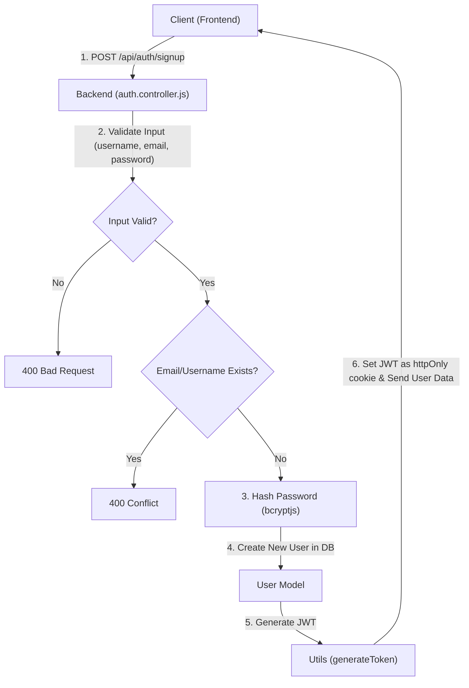
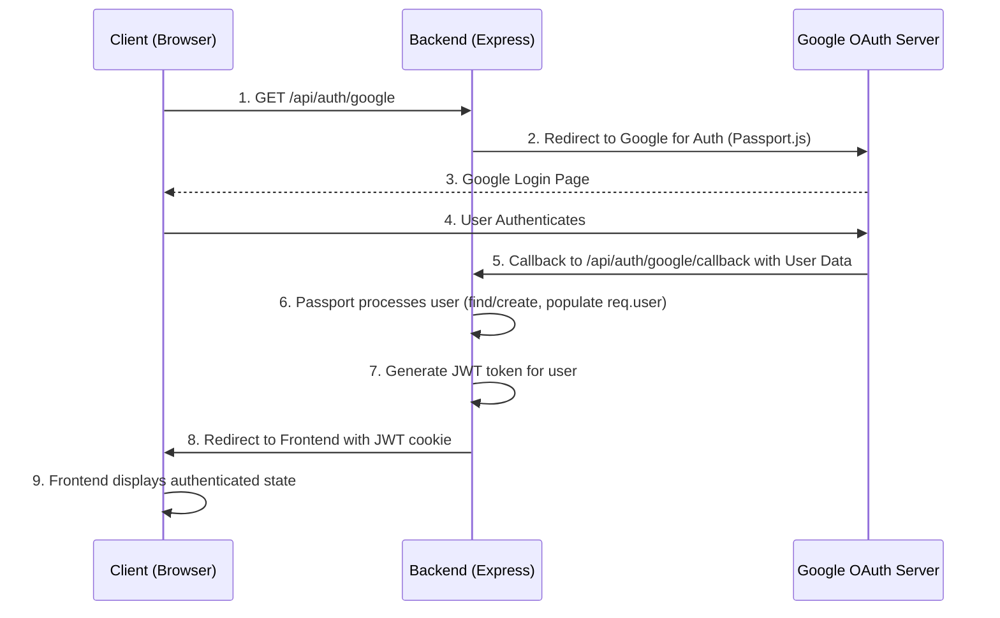

 # Backend Architecture and APIs

This document provides a comprehensive overview of the backend architecture, focusing on the core server-side logic, API endpoints, and key components. The backend is built using Node.js and Express.js, leveraging MongoDB as its primary database. It handles user authentication (email/password and Google OAuth), user profile management, messaging, and friend management.

## Core Backend Setup

The `backend/src/index.js` file serves as the entry point for the backend application. It initializes the Express server, sets up middleware, configures routing, establishes a database connection, and integrates with a WebSocket server for real-time communication.

### Server Initialization and Middleware

The server is configured with several essential middleware components to handle various aspects of incoming requests, including parsing JSON and URL-encoded data, managing cookies, and enabling cross-origin resource sharing (CORS).

```javascript filename="backend/src/index.js"
import express from "express";
import cors from "cors";
import dotenv from "dotenv";
import cookieParser from "cookie-parser";
import session from "express-session";
import passport from "passport";
// ... other imports

const __dirname = path.resolve();
dotenv.config();

configurePassport(); // Initializes Passport.js strategies

app.use(cookieParser());
app.use(express.json({limit : '2mb'})); // Parses JSON request bodies
app.use(express.urlencoded({ limit: '2mb', extended: true })); // Parses URL-encoded request bodies
app.use(cors({
    origin: "http://localhost:5173", // Allows requests from the frontend
    credentials: true,
}));

app.use(session({
    secret: process.env.SESSION_SECRET,
    resave: false,
    saveUninitialized: false,
    cookie: {
        secure: process.env.NODE_ENV === "production",
        httpOnly: true,
        maxAge: 7 * 24 * 60 * 60 * 1000
    }
}));

app.use(passport.initialize()); // Initializes Passport.js for authentication
app.use(passport.session());    // Enables Passport.js session support
```
This snippet demonstrates the setup of fundamental middleware:
-   **`cookieParser`**: Parses incoming cookies from the request.
-   **`express.json` / `express.urlencoded`**: Parses request bodies, with a limit of 2MB to prevent large payloads.
-   **`cors`**: Configures Cross-Origin Resource Sharing, allowing the frontend to interact with the backend securely.
-   **`express-session`**: Manages user sessions, essential for stateful authentication methods like OAuth.
-   **`passport.initialize()` / `passport.session()`**: Integrates Passport.js for authentication. Passport strategies are defined in `backend/src/lib/passport.config.js`.

[View on GitHub](https://github.com/shinymack/Chat-App-MERN/blob/main/backend/src/index.js#L20-L46)

### Routing and API Endpoints

The application organizes its API endpoints into distinct modules, enhancing maintainability and clarity.
-   `/api/auth`: Handles all authentication-related operations.
-   `/api/messages`: Manages message exchange functionalities.
-   `/api/friends`: Deals with friend requests and connections.

```javascript filename="backend/src/index.js"
// ...
import authRoutes from "./routes/auth.route.js";
import messageRoutes from "./routes/message.route.js";
import friendRoutes from "./routes/friend.route.js";

// ...
app.use("/api/auth", authRoutes );
app.use("/api/messages", messageRoutes );
app.use("/api/friends", friendRoutes);
// ...
```
This routing structure ensures that related API endpoints are grouped together, making the backend easier to navigate and extend.

[View on GitHub](https://github.com/shinymack/Chat-App-MERN/blob/main/backend/src/index.js#L6-L8)

## Authentication Module

The authentication module is a critical part of the backend, managing user registration, login, logout, session verification, and profile updates. It leverages JSON Web Tokens (JWT) for session management and `bcryptjs` for secure password hashing.

### User Authentication Flow (Email/Password)

User registration and login follow a standard secure authentication pattern.





1.  **Signup (`/api/auth/signup`)**:
    *   Validates `username`, `email`, and `password` for length and format.
    *   Checks for existing users with the same email or username.
    *   Hashes the password using `bcryptjs` with a salt round of 10.
    *   Creates a new user record in the database.
    *   Generates a JWT and sets it as an `httpOnly` cookie in the response.
    *   Returns the new user's public profile data.

    ```javascript filename="backend/src/controllers/auth.controller.js"
    export const signup = async (req, res) => {
        const {username, email, password} = req.body;
        try {
            // ... input validation and existing user checks ...
            const salt = await bcrypt.genSalt(10);
            const hashedPassword = await bcrypt.hash(password, salt);

            const newUser = new User({
                username,
                email,
                password: hashedPassword,
                authProvider: 'email'
            });
            if(newUser){
                generateToken(newUser._id, res); // Generates JWT and sets httpOnly cookie
                await newUser.save();

                res.status(201).json({
                    _id: newUser._id,
                    username: newUser.username,
                    email: newUser.email,
                    profilePic: newUser.profilePic,
                    authProvider: newUser.authProvider
                });
            } else {
                res.status(400).json({message: "Invalid user data."});
            }
        } catch (error) {
            console.log("Error in signup controller", error.message)
            res.status(500).json({message: "Something went wrong."});
        }
    };
    ```
    [View on GitHub](https://github.com/shinymack/Chat-App-MERN/blob/main/backend/src/controllers/auth.controller.js#L7-L51)

2.  **Login (`/api/auth/login`)**:
    *   Finds the user by email.
    *   Compares the provided password with the stored hashed password using `bcrypt.compare()`.
    *   If credentials are valid, generates a new JWT and sets it as an `httpOnly` cookie.
    *   Returns the user's public profile data.

    ```javascript filename="backend/src/controllers/auth.controller.js"
    export const login = async (req, res) => {
        const {email, password} = req.body;
        try {
            const user = await User.findOne({email});

            if(!user) {
                return res.status(400).json({message: "Invalid credentials."});
            }
            // Check for Google Auth users attempting email/password login
            if(user.authProvider === 'google' && !user.password){
                return res.status(400).json({ message: "Please sign in with Google." });
            }

            const isPasswordCorrect = await bcrypt.compare(password, user.password);
            if(!isPasswordCorrect) {
                return res.status(400).json({message: "Invalid credentials."});
            }

            generateToken(user._id, res); // Generates JWT and sets httpOnly cookie
            res.status(200).json({
                _id: user._id,
                username: user.username,
                email: user.email,
                profilePic: user.profilePic,
                authProvider: user.authProvider,
            });
        } catch (error) {
            console.log("Error in login controller", error.message);
            res.status(500).json({message: "Something went wrong."});
        }
    };
    ```
    [View on GitHub](https://github.com/shinymack/Chat-App-MERN/blob/main/backend/src/controllers/auth.controller.js#L53-L82)

### Google OAuth Integration

The application supports Google authentication through Passport.js, providing a seamless login experience for users.





1.  **Initiate Google OAuth (`/api/auth/google`)**:
    *   The client initiates the Google OAuth flow by navigating to `/api/auth/google`.
    *   Passport.js intercepts this request and redirects the user to Google's authentication page.
2.  **Google Callback (`/api/auth/google/callback`)**:
    *   After successful authentication with Google, Google redirects back to this endpoint with user information.
    *   Passport.js processes this callback, either finding an existing user or creating a new one based on the Google profile.
    *   A JWT is generated for the user and set as an `httpOnly` cookie.
    *   The user is then redirected to the frontend application.

    ```javascript filename="backend/src/controllers/auth.controller.js"
    export const googleAuthCallback = async (req, res) => {
     const frontendUrl = process.env.FRONTEND_URL || 'http://localhost:5173';

        try {
            if (!req.user) { // Passport.js sets req.user upon successful authentication
                return res.redirect(`${frontendUrl}/login?error=google_auth_failed`);
            }
            generateToken(req.user._id, res); // Generate JWT for the Google authenticated user
            res.redirect(frontendUrl); // Redirect to the frontend homepage
        } catch (error) {
            console.error("Error in googleAuthCallback: ", error.message);
            res.redirect(`${frontendUrl}/login?error=google_auth_processing_error`);
        }
    };
    ```
    [View on GitHub](https://github.com/shinymack/Chat-App-MERN/blob/main/backend/src/controllers/auth.controller.js#L143-L162)

### Route Protection

The `protectRoute` middleware ensures that only authenticated users can access certain API endpoints.

```javascript filename="backend/src/middleware/auth.middleware.js"
import jwt from "jsonwebtoken"
import User from "../models/user.model.js"

export const protectRoute = async (req, res, next) => {
    try {
        const token = req.cookies.jwt; // Extracts JWT from cookie
        if(!token){
            return res.status(401).json({message: "Unauthorized - No Token Provided"});
        }

        const decoded = jwt.verify(token, process.env.JWT_SECRET) // Verifies JWT

        if(!decoded) {
            return res.status(401).json({message: "Unauthorized - Invalid Token"});
        }
        const user = await User.findById(decoded.userId).select("-password"); // Finds user without password

        if(!user) {
            return res.status(404).json({message: "User not found"});
        }
        req.user = user; // Attaches user object to request
        next(); // Proceeds to the next middleware/controller
    } catch (error) {
        console.log("Error in protectRoute middleware", error.message);
        res.status(500).json({message: "Internal Server Error"});
    }
};
```
[View on GitHub](https://github.com/shinymack/Chat-App-MERN/blob/main/backend/src/middleware/auth.middleware.js#L4-L29)

### User Logout and Session Check

-   **Logout (`/api/auth/logout`)**: Clears the JWT cookie, effectively logging out the user.
-   **Check Authentication (`/api/auth/check`)**: Uses `protectRoute` to verify if a user is currently authenticated and returns their profile information.

## User Profile Management

The backend provides endpoints for users to manage their profiles, including updating their username and profile picture.

### Username Availability Check

This endpoint allows users to check if a desired username is available before updating their profile.

```javascript filename="backend/src/controllers/auth.controller.js"
export const checkUsernameAvailability = async (req, res) => {
    try {
        const { username } = req.params;
        const currentUserId = req.user._id;

        // ... validation for username length ...

        // Check if the username is the current user's existing username
        if (req.user.username === username) {
            return res.status(200).json({ available: true, message: "This is your current username." });
        }

        const existingUser = await User.findOne({ username: username });

        if (existingUser) {
            return res.status(200).json({ available: false, message: "Username is already taken." });
        }

        res.status(200).json({ available: true, message: "Username is available." });

    } catch (error) {
        console.error("Error in checkUsernameAvailability:", error.message);
        res.status(500).json({ available: false, message: "Error checking username availability." });
    }
};
```
This controller first checks for basic username validity (length) and then verifies if the username is already taken by another user. It also handles the case where the user is checking their current username.

[View on GitHub](https://github.com/shinymack/Chat-App-MERN/blob/main/backend/src/controllers/auth.controller.js#L164-L198)

### Profile Update

Users can update their profile picture and username. Profile pictures are managed through Cloudinary, a cloud-based image and video management service.

```javascript filename="backend/src/controllers/auth.controller.js"
export const updateProfile = async (req, res) => {
    try {
        const { profilePic, username } = req.body;
        const userId = req.user._id;
        let userToUpdate = await User.findById(userId);

        if (!userToUpdate) { return res.status(404).json({ message: "User not found." }); }

        const fieldsToUpdate = {};
        let newUsername = username ? username.trim() : null;

        // Handle username update logic
        if (newUsername && newUsername !== userToUpdate.username) {
            // ... username validation and check for existing user with new username ...
            fieldsToUpdate.username = newUsername;
        }

        // Handle profile picture update using Cloudinary
        if (profilePic) {
            const uploadResponse = await cloudinary.uploader.upload(profilePic);
            fieldsToUpdate.profilePic = uploadResponse.secure_url;
        }

        if (Object.keys(fieldsToUpdate).length === 0) {
            return res.status(400).json({ message: "No changes provided to update." });
        }

        const updatedUser = await User.findByIdAndUpdate(userId, { $set: fieldsToUpdate }, { new: true });
        generateToken(updatedUser._id, res); // Refresh JWT cookie after update
        res.status(200).json(updatedUser);

    } catch (error) {
        console.error("Error in updateProfile controller", error.message);
        if (error.code === 11000 && error.keyValue && error.keyValue.username) {
            return res.status(400).json({ message: "This username is already taken." });
        }
        res.status(500).json({ message: "Internal Server Error while updating profile." });
    }
};
```
[View on GitHub](https://github.com/shinymack/Chat-App-MERN/blob/main/backend/src/controllers/auth.controller.js#L201-L264)

## Key Integration Points

-   **Database Connection (`connectDB`)**: The MongoDB connection is established when the server starts, ensuring that the application can interact with the database.
-   **Socket.io**: The backend integrates with Socket.io for real-time features (e.g., messaging), using the same HTTP server instance (`server`) to ensure seamless integration.
-   **Environment Variables**: Sensitive information and configuration settings (e.g., `PORT`, `JWT_SECRET`, `SESSION_SECRET`, `FRONTEND_URL`) are loaded from `.env` files using `dotenv`.
-   **Production Deployment**: The `index.js` file includes logic to serve static files from the `frontend/dist` directory when `NODE_ENV` is set to `production`, allowing the frontend and backend to be deployed from the same server.

The modular design, separation of concerns (controllers, routes, middleware), and robust authentication mechanisms contribute to a scalable and secure backend architecture.