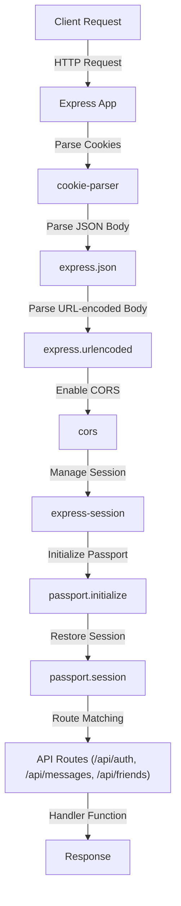
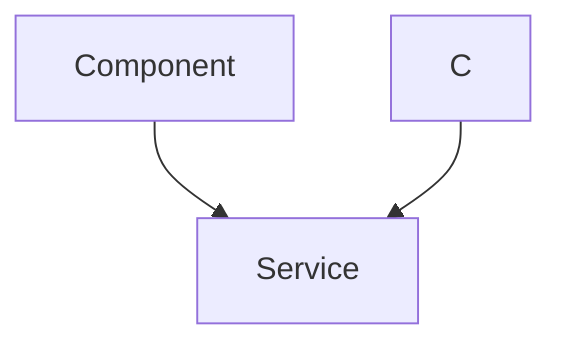

 # Backend Architecture and APIs

This document provides a comprehensive overview of the backend services, their architecture, and the API endpoints they expose. The backend is built using Node.js with the Express.js framework, leveraging MongoDB as its primary database. It handles user authentication, messaging, and friend management, integrating real-time communication capabilities via Socket.io.

## Core Technologies and Setup

The backend application utilizes a robust set of technologies to deliver its features. The `package.json` file defines all necessary dependencies and development tools.

### Key Dependencies

The following table outlines the main dependencies and their roles in the backend:

| Dependency        | Role                                                                |
| :---------------- | :------------------------------------------------------------------ |
| `express`         | Web application framework for routing and middleware.               |
| `mongoose`        | MongoDB object data modeling (ODM) for Node.js.                     |
| `bcryptjs`        | Library for hashing passwords securely.                             |
| `jsonwebtoken`    | Used for creating and verifying JSON Web Tokens (JWT) for authentication. |
| `cookie-parser`   | Parses cookies attached to the client request object.               |
| `dotenv`          | Loads environment variables from a `.env` file.                     |
| `cloudinary`      | Cloud-based image and video management (for profile pictures).      |
| `socket.io`       | Enables real-time, bidirectional, event-based communication.        |
| `passport`        | Authentication middleware for Node.js (used for Google OAuth).      |
| `express-session` | Session management middleware.                                      |
| `cors`            | Provides a Connect/Express middleware that can be used to enable Cross-Origin Resource Sharing. |
| `nodemon`         | Development tool for automatically restarting the server on file changes. |

You can view the full list of dependencies in the [backend/package.json](https://github.com/shinymack/Chat-App-MERN/blob/main/backend/package.json) file.

### Application Entry Point (`backend/src/index.js`)

The `index.js` file serves as the main entry point for the backend application. It initializes the Express server, configures middleware, registers API routes, sets up database connection, and integrates Socket.io for real-time features. It also handles static file serving for production deployments.

```javascript
// backend/src/index.js (snippet)
import express from "express";
import cors from "cors";
import authRoutes from "./routes/auth.route.js";
import messageRoutes from "./routes/message.route.js";
import friendRoutes from "./routes/friend.route.js";

import path from "path";
import dotenv from "dotenv";
import cookieParser from "cookie-parser";

import { connectDB } from "./lib/db.js";
import { app, server } from "./lib/socket.js"; // Socket.io server instance

import session from "express-session";
import passport from "passport";
import { configurePassport } from "./lib/passport.config.js";

const __dirname = path.resolve();
dotenv.config();

configurePassport(); // Setup Passport.js strategies

app.use(cookieParser());
app.use(express.json({limit : '2mb'}));
app.use(express.urlencoded({ limit: '2mb', extended: true }));
app.use(cors({
    origin: "http://localhost:5173", // Frontend URL
    credentials: true,
}));

app.use(session({
    secret: process.env.SESSION_SECRET, 
    resave: false,
    saveUninitialized: false, 
    cookie: {
        secure: process.env.NODE_ENV === "production",
        httpOnly: true,
        maxAge: 7 * 24 * 60 * 60 * 1000 
    }
}));

app.use(passport.initialize());
app.use(passport.session());  

// Register API Routes
app.use("/api/auth", authRoutes );
app.use("/api/messages", messageRoutes );
app.use("/api/friends", friendRoutes);

const PORT = process.env.PORT;
server.listen(PORT, () => {
    console.log("server is running on PORT: " + String(PORT));
    connectDB(); // Connect to MongoDB
});
```
[View on GitHub](https://github.com/shinymack/Chat-App-MERN/blob/main/backend/src/index.js)

### Middleware Flow

The backend employs several middleware components to process incoming requests before they reach the route handlers. This sequence ensures proper request parsing, session management, and authentication.





## Authentication Module

The authentication module is central to securing user access and managing user identities. It provides functionalities for user registration, login, logout, Google OAuth integration, profile updates, and username availability checks.

### API Endpoints for Authentication

All authentication-related endpoints are prefixed with `/api/auth`.

| HTTP Method | Endpoint                       | Description                                            | Controller Function           | Middleware      |
| :---------- | :----------------------------- | :----------------------------------------------------- | :---------------------------- | :-------------- |
| `POST`      | `/api/auth/signup`             | Registers a new user with username, email, and password. | `signup`                      | None            |
| `POST`      | `/api/auth/login`              | Authenticates a user with email and password.          | `login`                       | None            |
| `POST`      | `/api/auth/logout`             | Logs out the current user by clearing the JWT cookie.  | `logout`                      | None            |
| `PUT`       | `/api/auth/update-profile`     | Updates user's profile picture and/or username.        | `updateProfile`               | `protectRoute`  |
| `GET`       | `/api/auth/username/check/:username` | Checks if a username is available.                     | `checkUsernameAvailability`   | `protectRoute`  |
| `GET`       | `/api/auth/check`              | Checks if the user is authenticated and returns user data. | `checkAuth`                   | `protectRoute`  |
| `GET`       | `/api/auth/google`             | Initiates Google OAuth flow.                           | `passport.authenticate` (Google) | None            |
| `GET`       | `/api/auth/google/callback`    | Callback URL for Google OAuth, handles user creation/login. | `passport.authenticate` (Google), `googleAuthCallback` | None |

These routes are defined in [backend/src/routes/auth.route.js](https://github.com/shinymack/Chat-App-MERN/blob/main/backend/src/routes/auth.route.js).

### User Registration (`signup` controller)

The `signup` controller handles new user registrations. It performs input validation (username and password length, email uniqueness), hashes the password using `bcryptjs`, and saves the new user to the database. Upon successful registration, a JSON Web Token (JWT) is generated and set as an HTTP-only cookie, and the new user's basic information is returned.

```javascript
// backend/src/controllers/auth.controller.js (snippet)
export const signup = async (req, res) => {
    const {username, email, password} = req.body;
    try {
        if(!username || !email || !password) {
            return res.status(400).json({message: "Please fill in all fields."});
        }
        // ... (other validations) ...

        const user = await User.findOne({email});
        if (user) return res.status(400).json({message: "Email already exists."});
        
        const existingUserByUsername = await User.findOne({ username });
        if (existingUserByUsername) {
            return res.status(400).json({ message: "Username already exists. Please choose another." });
        }

        const salt = await bcrypt.genSalt(10);
        const hashedPassword = await bcrypt.hash(password, salt);

        const newUser = new User({
            username,
            email,
            password: hashedPassword,
            authProvider: 'email'
        });
        if(newUser){
            generateToken(newUser._id, res); // Generate and set JWT cookie
            await newUser.save();

            res.status(201).json({
                _id: newUser._id,
                username: newUser.username,
                email: newUser.email,   
                profilePic: newUser.profilePic,
                authProvider: newUser.authProvider
            });
        } else {
            res.status(400).json({message: "Invalid user data."});
        }
    } catch (error) {
        console.log("Error in signup controller", error.message)
        res.status(500).json({message: "Something went wrong."});
    }
};
```
[View on GitHub](https://github.com/shinymack/Chat-App-MERN/blob/main/backend/src/controllers/auth.controller.js)

### Profile Update (`updateProfile` controller)

The `updateProfile` controller allows authenticated users to change their profile picture and/or username. It includes validation for the new username and integrates with Cloudinary for secure image uploads. If a profile picture is provided, it's uploaded to Cloudinary, and its secure URL is stored. If the username is changed, it checks for uniqueness before updating. A new JWT is issued upon successful update to reflect any changes.

```javascript
// backend/src/controllers/auth.controller.js (snippet)
export const updateProfile = async (req, res) => {
    try {
        const { profilePic, username } = req.body;
        const userId = req.user._id;
        let userToUpdate = await User.findById(userId);

        if (!userToUpdate) {
            return res.status(404).json({ message: "User not found." });
        }

        const fieldsToUpdate = {};
        let newUsername = username ? username.trim() : null;

        // Handle username update
        if (newUsername && newUsername !== userToUpdate.username) {
            if (newUsername.length < 3 || newUsername.length > 20) {
                return res.status(400).json({ message: "Username must be between 3 and 20 characters." });
            }
            const existingUserWithNewUsername = await User.findOne({ username: newUsername, _id: { $ne: userId } });
            if (existingUserWithNewUsername) {
                return res.status(400).json({ message: "This username is already taken by someone else." });
            }
            fieldsToUpdate.username = newUsername;
        }

        // Handle profile picture update
        if (profilePic) {
            const uploadResponse = await cloudinary.uploader.upload(profilePic);
            fieldsToUpdate.profilePic = uploadResponse.secure_url;
        }

        if (Object.keys(fieldsToUpdate).length === 0) {
            return res.status(400).json({ message: "No changes provided to update." });
        }

        const updatedUser = await User.findByIdAndUpdate(userId, { $set: fieldsToUpdate }, { new: true });
        generateToken(updatedUser._id, res); // Refresh JWT cookie
        res.status(200).json(updatedUser);

    } catch (error) {
        console.error("Error in updateProfile controller", error.message);
        res.status(500).json({ message: "Internal Server Error while updating profile." });
    }
};
```
[View on GitHub](https://github.com/shinymack/Chat-App-MERN/blob/main/backend/src/controllers/auth.controller.js)

### Authentication Flow (Email/Password)

This sequence diagram illustrates the typical authentication flow for users signing up or logging in with email and password.





## Key Integration Points

### Real-time Communication with Socket.io

The backend integrates Socket.io to enable real-time messaging between users. When the Express server starts, it also initializes a Socket.io server. User IDs are mapped to their corresponding socket IDs, allowing targeted message delivery.

```javascript
// backend/src/lib/socket.js (conceptual snippet)
import { Server } from "socket.io";
import http from "http";
import express from "express";

const app = express();
const server = http.createServer(app);
const io = new Server(server, {
    cors: {
        origin: ["http://localhost:5173"],
        methods: ["GET", "POST"]
    }
});

const userSocketMap = {}; // userId -> socketId

io.on("connection", (socket) => {
    console.log("a user connected", socket.id);

    const userId = socket.handshake.query.userId;
    if (userId !== "undefined") userSocketMap["userId"] = socket.id;

    // Listen for incoming messages, friend requests, etc.
    socket.on("message", (data) => {
        // Handle message and potentially emit to recipient
        const recipientSocketId = userSocketMap["data.recipientId"];
        if (recipientSocketId) {
            io.to(recipientSocketId).emit("newMessage", data);
        }
    });

    socket.on("disconnect", () => {
        console.log("user disconnected", socket.id);
        delete userSocketMap["userId"];
    });
});

export { app, io, server };
```

This setup ensures that when a user sends a message, it can be instantly relayed to the recipient's connected client via their socket, creating a seamless chat experience.

### Cloudinary for Media Management

Cloudinary is used for handling profile picture uploads. When a user updates their profile with a new picture, the image data (typically a base64 string) is sent to the backend. The backend then uploads this data to Cloudinary, which provides a secure URL for the hosted image. This URL is then stored in the database, reducing the backend's storage burden and offloading image processing tasks.

### Passport.js for Google OAuth

Passport.js is used to implement Google OAuth, allowing users to sign in using their Google accounts. The `passport.config.js` file defines the Google strategy, handling the verification of user profiles returned by Google. The `auth.route.js` defines the `/google` and `/google/callback` endpoints, which trigger the OAuth flow and handle the redirection and user data processing, respectively. This streamlines the authentication process and offers an alternative to traditional email/password registration.