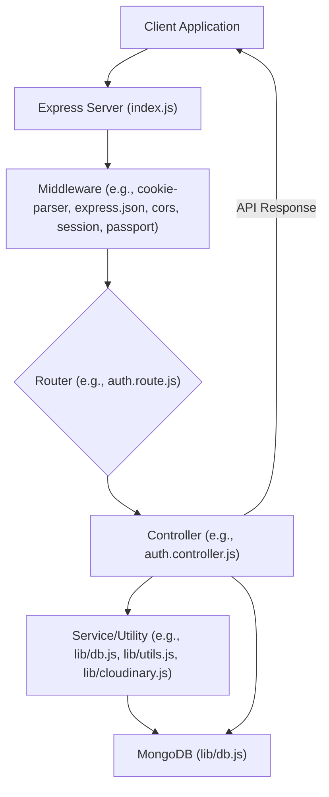
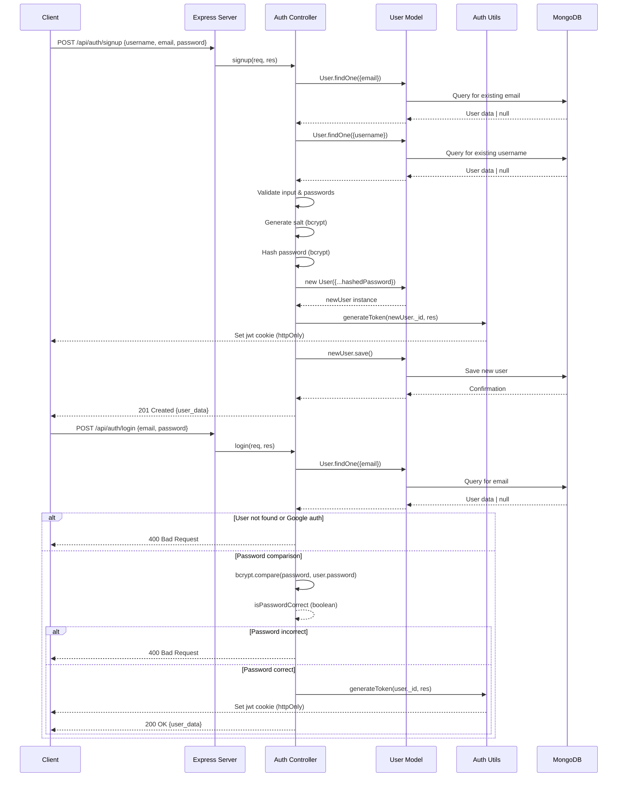

 # Backend Architecture and APIs

This document provides a detailed overview of the backend architecture, focusing on the server-side structure, API endpoints, and data flow. The backend is built on Node.js with Express, utilizes MongoDB for data persistence, and integrates real-time communication via Socket.io. Authentication is handled using JSON Web Tokens (JWTs) and Passport.js for OAuth.

## Overall Backend Structure

The backend acts as the core application server, responsible for handling client requests, processing business logic, interacting with the database, and managing real-time communication.

The entry point for the backend application is `backend/src/index.js`. This file sets up the Express server, middleware, route handlers, and initiates the database connection and Socket.io server.

<br/>





<br/>

### Key Technologies & Libraries:

*   **Express.js**: Web application framework for Node.js.
*   **MongoDB**: NoSQL database for data storage, managed via Mongoose.
*   **Socket.io**: Enables real-time, bidirectional, event-based communication.
*   **Passport.js**: Authentication middleware for Node.js, used for Google OAuth.
*   **Bcrypt.js**: Library for hashing passwords.
*   **Cloudinary**: Cloud-based image and video management (for profile pictures).
*   **JWT (JSON Web Tokens)**: For session management and authentication.

## Database Connection (`backend/src/lib/db.js`)

The `backend/src/lib/db.js` file establishes the connection to the MongoDB database. It uses Mongoose, an ODM (Object Data Modeling) library, to interact with MongoDB.

```javascript
// backend/src/lib/db.js
import mongoose from "mongoose"

export const connectDB = async () => {
  try {
    const conn = await mongoose.connect(process.env.MONGODB_URI);
    console.log(`MongoDB connected:  ${conn.connection.host}`);
  }
  catch(error){
    console.log("MongoDB connection error: ", error);
  }
}
```
This module exports a single asynchronous function `connectDB` that attempts to connect to the MongoDB instance specified by `process.env.MONGODB_URI`. Upon successful connection, it logs the host; otherwise, it logs the error. [View on GitHub](https://github.com/shinymack/Chat-App-MERN/blob/main/backend/src/lib/db.js)

## Server Setup and Middleware (`backend/src/index.js`)

The `backend/src/index.js` file is the heart of the server, orchestrating all major components. It initializes Express, configures middleware, defines API routes, and starts the server.

```javascript
// backend/src/index.js - Excerpt for middleware setup
import express from "express";
import cors from "cors";
// ... other imports ...
import cookieParser from "cookie-parser";
import { connectDB } from "./lib/db.js";
import { app, server } from "./lib/socket.js";
import session from "express-session";
import passport from "passport";
import { configurePassport } from "./lib/passport.config.js";

// ... __dirname and dotenv.config() ...

configurePassport(); // Setup Passport strategies

app.use(cookieParser());
app.use(express.json({limit : '2mb'})); // Parses JSON request bodies
app.use(express.urlencoded({ limit: '2mb', extended: true })); // Parses URL-encoded request bodies
app.use(cors({
    origin: "http://localhost:5173", // Allow requests from this frontend origin
    credentials: true, // Allow cookies to be sent with requests
}));

app.use(session({
    secret: process.env.SESSION_SECRET, 
    resave: false,
    saveUninitialized: false, 
    cookie: {
        secure: process.env.NODE_ENV === "production", // Set to true in production for HTTPS
        httpOnly: true, // Prevent client-side JavaScript from accessing cookies
        maxAge: 7 * 24 * 60 * 60 * 1000 // Session expiration: 7 days
    }
}));

app.use(passport.initialize()); // Initialize Passport
app.use(passport.session());  // Enable Passport session support

app.use("/api/auth", authRoutes ); // Mount authentication routes
app.use("/api/messages", messageRoutes ); // Mount message routes
app.use("/api/friends", friendRoutes); // Mount friend routes

// ... production static file serving and server.listen call ...
```
This snippet from `backend/src/index.js` illustrates the setup of various middleware:
*   **`cookieParser`**: Parses incoming cookies from client requests.
*   **`express.json`** and **`express.urlencoded`**: Parse JSON and URL-encoded data from request bodies.
*   **`cors`**: Configures Cross-Origin Resource Sharing, allowing the frontend to make requests.
*   **`express-session`**: Manages user sessions, essential for Passport.js.
*   **`passport.initialize()`** and **`passport.session()`**: Initialize and enable Passport.js for authentication.
After middleware, it mounts various route modules (`authRoutes`, `messageRoutes`, `friendRoutes`) under specific API paths. [View on GitHub](https://github.com/shinymack/Chat-App-MERN/blob/main/backend/src/index.js)

## Authentication Module

The authentication module handles user registration, login, logout, profile updates, and authentication checks. It integrates with `bcryptjs` for secure password handling and `passport` for Google OAuth.

### Authentication Routes (`backend/src/routes/auth.route.js`)

This file defines all API endpoints related to user authentication. Each route is mapped to a corresponding controller function. The `protectRoute` middleware is used to ensure that certain routes are only accessible by authenticated users.

```javascript
// backend/src/routes/auth.route.js
import express from "express"
import passport from 'passport';
import { login, logout, signup, updateProfile, checkAuth, googleAuthCallback, checkUsernameAvailability} from  "../controllers/auth.controller.js"
import { protectRoute } from "../middleware/auth.middleware.js" // Middleware for JWT protection
const router = express.Router();

router.post("/signup", signup);
router.post("/login", login);
router.post("/logout", logout);

router.put("/update-profile", protectRoute ,updateProfile)
router.get("/username/check/:username", protectRoute, checkUsernameAvailability);
router.get("/check", protectRoute, checkAuth)

router.get(
    '/google',
    passport.authenticate('google', { scope: ['profile', 'email'] }) // Initiates Google OAuth flow
);
router.get(
    '/google/callback',
    passport.authenticate('google', {
        // successRedirect: 'http://localhost:5173/', // This is overridden by the controller logic
        failureRedirect: 'http://localhost:5173/login', 
        failureMessage: true 
    }),
    googleAuthCallback // Custom callback controller for post-authentication logic
);
export default router;
```
This snippet from `backend/src/routes/auth.route.js` shows how different HTTP methods and paths are associated with specific controller functions. Key points include:
*   `signup` and `login` are POST requests.
*   `logout` is a POST request to clear the JWT cookie.
*   `updateProfile`, `checkUsernameAvailability`, and `checkAuth` use the `protectRoute` middleware to ensure the user is authenticated via JWT.
*   `/google` initiates the Passport.js Google OAuth flow, requesting `profile` and `email` scopes.
*   `/google/callback` handles the redirect from Google, authenticating the user and then passing control to `googleAuthCallback` for custom post-authentication logic (e.g., generating a JWT and redirecting to the frontend).
[View on GitHub](https://github.com/shinymack/Chat-App-MERN/blob/main/backend/src/routes/auth.route.js)

### Authentication Controllers (`backend/src/controllers/auth.controller.js`)

This file contains the core logic for all authentication-related operations.

#### User Registration (`signup`)

The `signup` controller handles the creation of new user accounts. It performs validation, hashes passwords, saves new users to the database, and generates a JWT for the new session.

```javascript
// backend/src/controllers/auth.controller.js - signup function
import bcrypt from "bcryptjs"; // For password hashing
import { generateToken } from "../lib/utils.js"; // Utility to generate JWT

export const signup = async (req, res) => {
    const {username, email, password} = req.body;
    try {
        // Input validation
        if(!username || !email || !password) { /* ... error handling ... */ }
        if (username.length < 3 || username.length > 20) { /* ... error handling ... */ }
        if (password.length < 6) { /* ... error handling ... */ }

        // Check if email or username already exists
        const user = await User.findOne({email});
        if (user) return res.status(400).json({message: "Email already exists."});
        const existingUserByUsername = await User.findOne({ username });
        if (existingUserByUsername) { /* ... error handling ... */ }

        // Hash password
        const salt = await bcrypt.genSalt(10);
        const hashedPassword = await bcrypt.hash(password, salt);

        // Create new user
        const newUser = new User({
            username, email, password: hashedPassword, authProvider: 'email'
        });

        if(newUser){
            generateToken(newUser._id, res); // Generate JWT and set as HTTP-only cookie
            await newUser.save(); // Save user to DB

            res.status(201).json({ // Respond with user data (excluding password)
                _id: newUser._id, username: newUser.username, email: newUser.email,   
                profilePic: newUser.profilePic, authProvider: newUser.authProvider
            });
        } else {
            res.status(400).json({message: "Invalid user data."});
        }
    } catch (error) {
        console.log("Error in signup controller", error.message)
        res.status(500).json({message: "Something went wrong."});
    }
};
```
This `signup` controller demonstrates essential security practices:
1.  **Input Validation**: Checks for missing fields and enforces length constraints for username and password.
2.  **Uniqueness Checks**: Ensures both email and username are not already registered.
3.  **Password Hashing**: Uses `bcryptjs` to securely hash the user's password with a salt, never storing plain-text passwords.
4.  **JWT Generation**: Calls `generateToken` (from `../lib/utils.js`) to create a JSON Web Token and set it as an HTTP-only cookie, securing the user's session.
5.  **User Creation and Response**: Saves the new user to the database and responds with selected user details (excluding the hashed password).
[View on GitHub](https://github.com/shinymack/Chat-App-MERN/blob/main/backend/src/controllers/auth.controller.js#L6-L56)

#### User Login (`login`)

The `login` controller authenticates existing users by verifying their credentials and establishing a new session.

```javascript
// backend/src/controllers/auth.controller.js - login function
export const login = async (req, res) => {
    const {email, password} = req.body;
    try {
        const user = await User.findOne({email}); // Find user by email

        if(!user) { // Check if user exists
            return res.status(400).json({message: "Invalid credentials."});
        }
        
        // Handle Google Auth users trying to log in with password
        if(user.authProvider === 'google' && !user.password){
            return res.status(400).json({ message: "Please sign in with Google." });
        }

        // Compare provided password with hashed password
        const isPasswordCorrect = await bcrypt.compare(password, user.password);
        if(!isPasswordCorrect) {
            return res.status(400).json({message: "Invalid credentials."});
        }

        generateToken(user._id, res); // Generate JWT for the authenticated user
        res.status(200).json({ // Respond with user data
            _id: user._id, username: user.username, email: user.email,
            profilePic: user.profilePic, authProvider: user.authProvider,
        });
    } catch (error) {
        console.log("Error in login controller", error.message);
        res.status(500).json({message: "Something went wrong."});
    }
};
```
The `login` controller's logic:
1.  **User Lookup**: Attempts to find a user by the provided email.
2.  **Credential Verification**: If the user exists, it compares the provided password with the stored hashed password using `bcrypt.compare`.
3.  **Google Auth Fallback**: Prevents users who signed up via Google from logging in with a password.
4.  **JWT Generation**: Upon successful authentication, a new JWT is generated and set as a cookie.
5.  **Successful Response**: Returns user details, similar to the `signup` response.
[View on GitHub](https://github.com/shinymack/Chat-App-MERN/blob/main/backend/src/controllers/auth.controller.js#L58-L88)

#### User Logout (`logout`)

The `logout` controller handles terminating a user's session by clearing the JWT cookie.

```javascript
// backend/src/controllers/auth.controller.js - logout function
export const logout = (req, res) => {
    try {
        // Clear the 'jwt' cookie by setting its maxAge to 0
        res.cookie("jwt", "", {maxAge: 0});
        res.status(200).json({message: "Logged out successfully."})
    } catch(error) {
        console.log("Error in logout controller", error.message);
        res.status(500).json({message:"Internal Server Error"}); 
    }
};
```
The `logout` function simply sets the `jwt` cookie value to an empty string and its `maxAge` to `0`, effectively expiring and deleting the cookie from the client's browser. [View on GitHub](https://github.com/shinymack/Chat-App-MERN/blob/main/backend/src/controllers/auth.controller.js#L90-L98)

#### Check Authentication Status (`checkAuth`)

This endpoint allows the client to verify if a user is currently authenticated and retrieve their basic profile information. It relies on the `protectRoute` middleware to populate `req.user`.

```javascript
// backend/src/controllers/auth.controller.js - checkAuth function
export const checkAuth = (req, res) => {
    try {
        // `req.user` is populated by the `protectRoute` middleware
        res.status(200).json({
            _id: req.user._id,
            username: req.user.username,
            email: req.user.email,
            profilePic: req.user.profilePic,
            authProvider: req.user.authProvider,
            createdAt: req.user.createdAt
        });
    } catch (error) {
        console.log("Error in checkAuth controller", error.message);
        res.status(500).json({message: "Internal Server Error"});
    }
};
```
This controller simply responds with the user information that was attached to the `req` object by the `protectRoute` middleware, indicating a successful authentication check. [View on GitHub](https://github.com/shinymack/Chat-App-MERN/blob/main/backend/src/controllers/auth.controller.js#L101-L115)

#### Google OAuth Callback (`googleAuthCallback`)

This controller is invoked after Passport.js successfully authenticates a user via Google. It generates a JWT and redirects the user to the frontend application.

```javascript
// backend/src/controllers/auth.controller.js - googleAuthCallback function
export const googleAuthCallback = async (req, res) => {
    const frontendUrl = process.env.FRONTEND_URL || 'http://localhost:5173';

    try {
        if (!req.user) { // If Passport.js failed to authenticate
            return res.redirect(`${frontendUrl}/login?error=google_auth_failed`);
        }

        generateToken(req.user._id, res); // Generate JWT for the Google-authenticated user

        res.redirect(frontendUrl); // Redirect to the frontend homepage
    } catch (error) {
        console.error("Error in googleAuthCallback: ", error.message);
        res.redirect(`${frontendUrl}/login?error=google_auth_processing_error`);
    }
};
```
The `googleAuthCallback` retrieves the user object populated by Passport.js, generates a JWT for them, and then redirects them to the frontend application's homepage. In case of failure, it redirects to the login page with an error parameter. [View on GitHub](https://github.com/shinymack/Chat-App-MERN/blob/main/backend/src/controllers/auth.controller.js#L118-L137)

#### Check Username Availability (`checkUsernameAvailability`)

This endpoint allows the frontend to check if a desired username is available before a user attempts to sign up or update their profile.

```javascript
// backend/src/controllers/auth.controller.js - checkUsernameAvailability function
export const checkUsernameAvailability = async (req, res) => {
    try {
        const { username } = req.params;
        // const currentUserId = req.user._id; // `req.user` from protectRoute middleware

        if (!username || username.trim().length < 3 || username.trim().length > 20) {
            return res.status(400).json({ available: false, message: "Username must be between 3 and 20 characters." });
        }
    
        // Check if the username is the current user's existing username
        if (req.user.username === username) {
            return res.status(200).json({ available: true, message: "This is your current username." });
        }

        const existingUser = await User.findOne({ username: username });

        if (existingUser) {
            return res.status(200).json({ available: false, message: "Username is already taken." });
        }

        res.status(200).json({ available: true, message: "Username is available." });

    } catch (error) {
        console.error("Error in checkUsernameAvailability:", error.message);
        res.status(500).json({ available: false, message: "Error checking username availability." });
    }
};
```
This controller performs the following checks:
1.  **Validation**: Ensures the `username` adheres to length constraints.
2.  **Self-Check**: Allows a user to submit their *current* username without it being marked as "taken."
3.  **Database Lookup**: Queries the `User` model to see if any other user already has the specified username.
4.  **Response**: Returns `available: true` or `false` along with a message.
[View on GitHub](https://github.com/shinymack/Chat-App-MERN/blob/main/backend/src/controllers/auth.controller.js#L140-L177)

#### Update User Profile (`updateProfile`)

This controller allows authenticated users to update their profile information, such as their username and profile picture. It integrates with Cloudinary for image uploads.

```javascript
// backend/src/controllers/auth.controller.js - updateProfile function
import cloudinary from "../lib/cloudinary.js"; // For image uploads

export const updateProfile = async (req, res) => {
    try {
        const { profilePic, username } = req.body; 
        const userId = req.user._id;
        let userToUpdate = await User.findById(userId);

        if (!userToUpdate) { /* ... error handling ... */ }

        const fieldsToUpdate = {};
        let newUsername = username ? username.trim() : null;

        // Handle username update logic
        if (newUsername && newUsername !== userToUpdate.username) {
            if (newUsername.length < 3 || newUsername.length > 20) { /* ... error handling ... */ }
            const existingUserWithNewUsername = await User.findOne({ username: newUsername, _id: { $ne: userId } });
            if (existingUserWithNewUsername) { /* ... error handling ... */ }
            fieldsToUpdate.username = newUsername;
        }

        // Handle profile picture update logic (Cloudinary integration)
        if (profilePic) {
            const uploadResponse = await cloudinary.uploader.upload(profilePic); // Upload to Cloudinary
            fieldsToUpdate.profilePic = uploadResponse.secure_url;
        }

        if (Object.keys(fieldsToUpdate).length === 0) { /* ... error handling ... */ }

        // Update user in DB
        const updatedUser = await User.findByIdAndUpdate(userId, { $set: fieldsToUpdate }, { new: true });

        if (!updatedUser) { /* ... error handling ... */ }

        generateToken(updatedUser._id, res); // Re-generate JWT to reflect potential profile changes
        res.status(200).json(updatedUser); // Respond with the updated user object

    } catch (error) {
        console.error("Error in updateProfile controller", error.message);
        if (error.code === 11000 && error.keyValue && error.keyValue.username) { // Duplicate key error
            return res.status(400).json({ message: "This username is already taken." });
        }
        res.status(500).json({ message: "Internal Server Error while updating profile." });
    }
};
```
The `updateProfile` controller:
1.  **Retrieves User**: Fetches the user document based on the authenticated `userId`.
2.  **Username Update**: Validates the new username, checks for uniqueness (excluding the current user), and stages it for update.
3.  **Profile Picture Update**: If a `profilePic` is provided (assumed to be a base64 string or similar), it's uploaded to Cloudinary, and the `secure_url` is stored.
4.  **Database Update**: Uses `findByIdAndUpdate` to apply the changes to the user document.
5.  **JWT Refresh**: Calls `generateToken` again to refresh the JWT cookie. This is important if user details (like username) are part of the token payload or if the client relies on the latest user data for display.
6.  **Response**: Returns the `updatedUser` object.
[View on GitHub](https://github.com/shinymack/Chat-App-MERN/blob/main/backend/src/controllers/auth.controller.js#L183-L245)

## Key Integration Points

### Authentication Flow: Email/Password

<br/>





<br/>

The diagram illustrates the sequential flow for user registration and login with email and password. The client initiates the request, which passes through the Express server to the authentication controller. The controller interacts with the User model and MongoDB for data persistence, bcrypt for password security, and an authentication utility for JWT generation.

### Best Practices & Considerations:

*   **Security**: Use HTTP-only cookies for JWTs to mitigate XSS attacks. Ensure robust password hashing (bcrypt) and input validation.
*   **Error Handling**: Centralized error handling can improve consistency. The current controllers log errors and return generic 500 responses, which is a good start. Specific client-facing messages for validation errors are also well-implemented.
*   **Scalability**: For larger applications, consider caching, rate limiting, and database indexing.
*   **Code Organization**: The current structure with routes, controllers, models, and utility files promotes maintainability and separation of concerns.
*   **Environment Variables**: Sensitive information (database URI, JWT secret, session secret, Cloudinary credentials) is correctly stored in environment variables (`.env`) and accessed via `process.env`.
*   **Frontend Integration**: The `generateToken` utility is critical as it handles setting the `jwt` cookie. The `cors` configuration ensures the frontend can communicate with the backend and receive these cookies. The Google OAuth `googleAuthCallback` redirect logic ensures a seamless user experience after authentication.